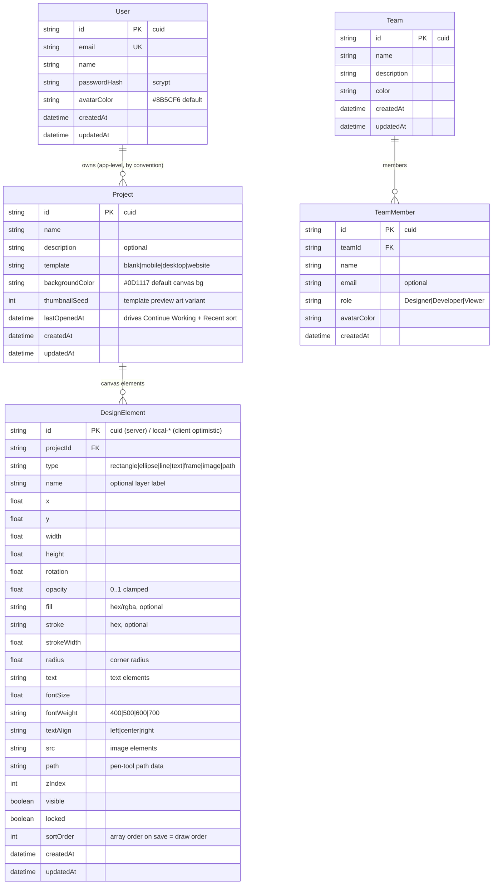

# Digma — Master Project Architecture Document (PAD) v1.53.0

**Classification:** Internal Engineering Reference
**Status:** DEFINITIVE, PRODUCTION-LOCKED BLUEPRINT
**Companion Document:** `README.md` (user-facing), `AGENTS.md` (operator quick-reference), `CLAUDE.md` (agent instructions)
**Last Updated:** 2026-10-04 (v1.53.0 — the family-completion/date-guard-sibling/refusal-sibling/neutral-pin/verify-otp-totality pass: S74-A the elementToStyle fourth-surface justifyContent line, S74-B the panel Set siblings, S74-C the date-guard siblings, S74-D the db.ts mechanism comment, S74-E the check-db-contract refusal sibling, S74-F the honesty batch, S74-G the neutral-900 pin, S74-H the verify-otp terminal return, and the rotated-resize question CLOSED by the reference probe — the reference has NO resize interaction at all, so the clone's world-axis rotated growth becomes the documented known limitation; see the v1.53.0 revision block; the prior summary — the render-surface-text-alignment/duplicate-guard/transaction-timeouts/name-cap-symmetry/list-bound/upload-downscale pass: the S73-A textAlignToJustify seam heals the PresentOverlay and CanvasThumbnail's missing justifyContent mapping — centered text rendered LEFT-ALIGNED in presentation mode and in every card thumbnail while the canvas and both export formats rendered it centered; the S73-B..S73-H riders close the duplicate post-commit null guard, the row-heavy transaction 30s timeouts, the smoke-gate parent-env refusal mechanism, the check-db-contract fifth count, the PATCH/POST name-cap symmetry, the list GET's take: PROJECT_LIMIT bound, the upload seam's <=1200px client-side downscale, and the honesty batch (the db-path schema-anchoring mechanism correction, the verify-otp half-dead disjunct, the POST projection include, the openedLabel NaN guard, the canvas Set membership, the forgot/resend timing-oracle deviation note; the rotated-resize semantics DEFERRED with the design space closed — see the v1.52.0 revision block)*Audience:** Senior Engineers, Tech Leads, DevOps, and Onboarding Engineers
**Rule:** Every architectural decision in this document traces to a specific rationale. Nothing is here "because it's popular."

This PAD documents the Digma clone codebase — a collaborative design workspace replicating the reference app at `https://digma-371dfd0d.base44.app/` on the Next.js 16 / React 19 / Tailwind 4 / Prisma-SQLite stack. It is the single source of truth for system structure; when code and this document disagree, the code wins and this document must be updated in the same commit.

Every change is tagged with its source: `[RES]` = validated by web research, `[SR]` = self-review, `[CA]` = critical analysis, `[SYN]` = synthesis, `[SAN]` = sanitization pass, `[AUTH]` = auth alignment.

#### Revision Block — v1.53.0 (Tracked Changes)

- `[SR]` **The family-completion/date-guard-sibling/refusal-sibling/neutral-pin/verify-otp-totality pass (session 74, S74-A..S74-H — the twenty-second Mode C audit's chosen work):**
  1. **S74-A (A74-L1 — the S73-A family completion): `elementToStyle`'s text branch gains `style.justifyContent = textAlignToJustify(el.textAlign)`.** The TEST-ONLY style seam's doc says it "exists so the unit suite pins the geometry the canvas must reproduce" — post-S73-A that claim was false for the text-alignment half (the seam pinned display:flex + alignItems + textAlign with NO justification, 23 lines below `textAlignToJustify` itself). The session-73 headline defect class (one model field, N render surfaces, the fix reaches N−1) surviving INSIDE the parity fix. Pinned by `tests/text-align-parity-s74.test.ts` (4).
  2. **S74-B (A74-L2 — the A-F5 family completion): the Set membership reaches the two panel siblings.** The properties panel's `selected` filter and the layers panel's Select-All flip still ran the O(n·m) `includes()` scans on EVERY drag tick (both panels subscribe to `elements`; the canvas's S73-H fix closed only its own surface). Both join the Set form — behavior identical, the per-tick scans closed. Pinned by `tests/client-lows-s74.test.ts` (7, shared with S74-C).
  3. **S74-C (A74-L3 — the A-F4 family completion): the corrupt-date guard reaches the two formatting siblings.** recent-view's `openedLabel` ("Sep 30, 2026" — RA-48) and dashboard-view's list-row date still rendered "Invalid Date" on a corrupt `lastOpenedAt` while project-card carried the S73-H NaN guard. All three sites now guard (each keeping its own measured format — the GUARD is the shared part).
  4. **S74-D (B74-F1): db.ts's header joins the schema-anchoring mechanism correction.** The S73-H correction fixed db-path.ts + AGENTS + the skill but missed the second code site — db.ts still asserted the retired "the engine against the CWD" theory. Both code sites now carry the corrected mechanism (the runtime anchors against the schema directory the client was generated against; the standalone trap is the traced schema copy).
  5. **S74-E (B74-F2): `scripts/check-db-contract.ts` gains the refusal mechanism.** The sibling script resolved the parent-exported `DATABASE_URL` verbatim (the false-green foreign-checkout family the smoke script's S73-D guard killed). The guard COMPARES the live value against the repo's own `.env` value — `bun run` auto-loads `.env` into `process.env` (the relative `file:../db/custom.db` form is the repo's own config, not the trap), so a presence-only guard would refuse EVERY run; a real shell export WINS over `.env`, and a differing value is exactly the foreign-export signature. Two-way proven (exit 1 with the foreign export; the pristine OK without).
  6. **S74-F (the honesty batch):** the `THUMBNAIL_ELEMENT_SELECT` doc counts the FOUR list-family routes (S73-H made the POST the fourth consumer); the historical S58-E bullet's phantom-seam citation retired (the living doc kept the name that masked the session-73 headline — the retirement pin scanned only src/tests; the history note REWORDED per the F58 comment-literal discipline); the §10 known-gaps table gains the rotated-resize known-limitation row (below), the name-cap-scope row (the reject doctrine is project-scoped; teams/elements truncate-at-80 — the documented product posture), and the auth-user-update P2025 posture row (unreachable via the API — no user-delete endpoint).
  7. **S74-G (A74-I2): `--color-neutral-900: #171717` joins the @theme reference-palette pins block.** The one consumed-but-unpinned scale (four view-toggle sites) — the block's own rule ("every consumed scale pinned") is honored; a future neutral-500/700 use can never silently take the v4 oklch default. Live-verified in the capture: the toggle chip computes rgb(23, 23, 23).
  8. **S74-H (B74-F6): verify-otp gains the terminal `return fail("NOT_FOUND", "User not found", 404)`.** A unique-id `updateMany` answers exactly 0 or 1 and both counts returned above — but `noImplicitReturns` is off, so nothing but a source pin held the function's totality; the impossible-count fall-through previously returned `undefined` (an empty 200). The vanished-user race family's own form.
  9. **The rotated-resize question CLOSED (the S73-G deferral's mandated reference probe, performed live):** the reference app has NO resize interaction AT ALL — a selected element renders `ring-2 ring-blue-500 ring-offset-1` and NOTHING else (zero handle elements in the DOM, zero resize cursors in the whole document, `cursor: move` on every part including edges and corners — pixel-verified: 0.0% light at all four corners, ring-line-level 2.8–5.5% at the edge midpoints); edge/corner drags MOVE the element (+75px drag → translate +75px, width unchanged; the W/H number inputs are the only size controls); and the reference's canvas hit-test IGNORES ROTATION (a click on visually-empty canvas 15px east of a 90°-rotated element's AABB SELECTS it; a click on its visual AABB hits nothing — the hit-test resolves against the unrotated footprint while the paint applies the full transform chain: a reference BUG joining its dead-chrome family). With no reference semantics to copy, the clone's 8-handle resize + rotation-aware hit-test stays the documented working superset, and the world-axis growth on rotated elements becomes the KNOWN LIMITATION row in §10 (both candidate semantics having failed hard requirements in the session-73 analysis).
  10. **The 50th reference audit: no drift** (all standing datums byte-identical — nav 124/96/92×36, the greeting, Quick Stats, the Recent sort, kbd 0, the dead Create-Team chrome, the class-A mobile nav, Share L385–R458/Present L466–R551); the clone's mobile nav 9/9 the 51st consecutive session. Unit 746 = 724 + 22 across 116 files (zero standing pins re-anchored — the fixes are additive); e2e unchanged at 243 (the full suite re-ran green in chunks); smoke unchanged at 58. **Docs aligned:** this revision block + the §7.1 table + the §10 rows + the §11 line counts.

#### Revision Block — v1.52.0 (Tracked Changes)

- `[SR]` **The render-surface-text-alignment/duplicate-guard/transaction-timeouts/name-cap-symmetry/list-bound/upload-downscale pass (session 73, S73-A..S73-H — the twenty-first Mode C audit's chosen work):**
  1. **S73-A (A-F1/A-F2/A-F3 — the headline): the pure `textAlignToJustify(align)` seam (src/lib/editor.ts) + the three consumption sites.** The canvas always mapped the text element's textAlign onto justify-content (the measured reference contract — its Text Align buttons flip the computed justify-content so the alignment is VISIBLE on the flex row); the PresentOverlay and the CanvasThumbnail set `display: flex` + `textAlign` with NO justifyContent — a content-sized flex text node ignores text-align, so a CENTERED text element rendered left-aligned in presentation mode and in every 320×200 card thumbnail while the canvas, the PNG export, and the SVG export rendered it centered: one model field, three render surfaces, two of them wrong, masked for 15 sessions by the S58-E fix's phantom "canvasStyleFor" citation (four comment citations, zero exports — the citation now names the real seam). Pinned by `tests/text-align-parity-s73.test.ts` (8) + the two new e2e checks (the Present overlay's computed `justify-content: center` through the REAL Align-center button; the Recent card thumbnail's same).
  2. **S73-B (B-F1): the duplicate's post-commit re-read gains the null guard** — a concurrent DELETE of the copy between the commit and the re-read previously answered `ok({ project: null }, 201)` (a success-status envelope with a null payload — the one unguarded post-commit read in the repo; every sibling answers 404).
  3. **S73-C (B-F2): the row-heavy interactive transactions carry `{ timeout: 30_000 }`** — the elements PUT's deleteMany+createMany (up to 2000 rows / ~30 MB under the body cap) and the duplicate's copy transaction no longer abort at Prisma's default 5s on a slow self-hosted disk (the P2028-family escape that would have rethrown as an unstructured 500).
  4. **S73-D (B-F3 + B-F9): the smoke gate's parent-env trap becomes a MECHANISM** — `scripts/smoke-test.sh` REFUSES (exit 1) any exported `DATABASE_URL` before a check runs (the operator discipline `unset DATABASE_URL && …` is now enforced; the false-green second-checkout case dies), and `scripts/check-db-contract.ts` validates the pristine contract's FIFTH count (members === 3 of 1/2/6/1/3).
  5. **S73-E (the deferred DQ-1): the name-cap symmetry closed — explicit-over-silent.** The projects PATCH's name field carries the POST's EXACT validation shape (`trim → empty 400 → >120 the SAME "Project name is too long (max 120)" 400`); the description fields stay truncate-at-500 (the documented product semantics: names are identity — reject; descriptions are prose — truncate). Unreachable from the app (both rename surfaces carry maxLength=120).
  6. **S73-F (the deferred DQ-2 + DQ-3): the list aggregate bounded by construction + the upload seam's client-side downscale.** The list GET's findMany carries `take: PROJECT_LIMIT` (500 rows — the views render all; the reference has no pagination either; the honest bound replaces the unbounded scan); the upload seam's new `downscaleDataUrl()` (the DOM half in properties-panel.tsx + the pure `FILL_IMAGE_MAX_DIM`/`shouldDownscale`/`downscaledDimensions` helpers in src/lib/editor.ts) fits any image whose longest side exceeds 1200px before storing, re-encoding JPEG sources as JPEG and everything else as PNG, and keeps whichever encoding is actually SHORTER (the min-length guard — the stored bytes never get worse). The stored data URL rides every autosave PUT / detail GET / list GET; the bound shrinks all three families for future uploads. Pinned by `tests/upload-downscale-s73.test.ts` (9) + the e2e round-trip (a browser-generated 2400×2400 PNG decodes at ≤1200 through the real file input).
  7. **S73-G — the rotated-resize semantics decision: DEFERRED with the design space closed.** The lead's post-audit analysis: the handles render on the rotation-aware AABB whose world-east face is pinned at the element's origin at 90° — NO local-axis growth can move it; the local-axis projection design is r=0-clean but collapses the element on perpendicular drags at 90° (a worse UX than the current wrong-axis growth), and the proportional-world design follows the pointer but changes the r=0 semantics (edge drags would grow both dimensions, violating the "resizing never rescales" contract). The choice is a product decision, not a derivation — the next cycle's reference audit probes the reference app's OWN rotated-resize behavior first (the parity answer), and the implementing session starts from the decision, not the discovery.
  8. **S73-H (the honesty batch):** the db-path header's mechanism corrected to schema-anchoring (the Prisma 6 runtime anchors relative `file:` URLs against the schema directory the client was generated against — NOT the process CWD; the standalone trap is REAL (the traced schema copy into `.next/standalone/prisma/`) but the chdir was causally irrelevant — AGENTS.md's bullet corrected with it); the verify-otp line-107 half-dead disjunct simplified to the live `verifiedResult.count === 0` condition; the projects POST's include flipped onto the S70-C bounded projection (the one list-family outlier — byte-identical today, honest if template-seeding lands) with the client comment corrected; the openedLabel's dead `|| toLocaleDateString()` fallback replaced by the `Number.isNaN` guard; the canvas's selection membership moved to a Set (the O(n·m) scans on every drag tick); the `?template=`/`?search=` honest API-surface note; the forgot-password/resend-otp residual timing oracles recorded in the deviation ledger (the accepted posture — register's explicit 409 enumerates anyway; the known-email write latency is the residue the S72-C login equalizer closed on login only).

#### Revision Block — v1.51.0 (Tracked Changes)

- `[SR]` **The rename-unwrap-regression/toaster-z-order/server-race-hygiene/TOCTOU-ceilings pass (session 72, S72-A..S72-E — the twentieth Mode C audit's chosen work):** the S71-A migration's lost unwrap restored (the headline HIGH — surfaced by the baseline e2e gate, the standing session-58 rename pin deterministically RED with the trace evidence; the fix types the call honestly and unwraps before the callback; the two DELETE sites' dishonest annotations corrected beside it); the Toaster above the presentation; the elements POST P2003 envelope + the login timing equalizer; the honesty batch (the ninth clampText site + the comment riders + the §4 corrections); the five TOCTOU ceilings transactional. Unit 692 = 666 + 26 across 110 files; e2e 240 (no new spec files — the standing rename pin IS the honest RED → GREEN evidence; the full suite the regression net); smoke unchanged at 58; six standing pins legitimately re-anchored onto the restructured contracts (each with the contract-change comment).

#### Revision Block — v1.50.0 (Tracked Changes)

- `[SR]` **The call-consolidation/exit-single-put/server-envelope/lint-ladder pass (session 71, S71-A..S71-D — the nineteenth Mode C audit's chosen work):** the call() options surface + the six-site migration + the list-row PATCH + the teams load seam; the exit() double-PUT closed through the in-flight same-reference indicator; the resend-otp uniform 400 + the login 403 envelope fold + the redundant index drop + the sortOrder clamp; the lint ladder's first rung + the rangeFillPercent five-site seam + the clampText fold + the elementSummary posture pin. Unit 666 = 625 + 41 across 107 files; e2e 240 = 236 + 4; smoke unchanged at 58; the ten standing pins legitimately re-anchored onto the restructured contracts (each with the contract-change comment).

#### Revision Block — v1.49.0 (Tracked Changes)

- `[SR]` **The a11y-restructure/one-schema-push/list-payload-projection/
  server-client-low pass — four slices (S70-A through S70-D) — the
  EIGHTEENTH Mode C audit's chosen work:**
  1. **S70-A (M-A1 + M-A2 — the documented deferred #5): the two
     WAI-ARIA button-pattern violations closed.** The ProjectCard root
     was a `role="button"` div with NESTED interactive descendants (the
     rename Input, the Check/X Buttons, the ellipsis trigger) and the
     layers row the same violation (the rename input + the eye/lock/
     trash trio) — AT flattens or misannounces the inner controls, and
     the S31-3/S58-B/S59-A stopPropagation/exemption wrappers existed
     BECAUSE of the nesting. The canonical restructures: the card
     becomes the stretched-button form (a real `absolute inset-0 z-0`
     button carrying the open + the `Open ${name}` aria-label — the
     40-locator family survives byte-identically; the content blocks
     carry `relative z-10 pointer-events-none` with the interactive
     children opting back in — BOTH content blocks must be positioned,
     a non-positioned sibling paints below the z-0 button and the hit
     test lands on the button even over the auto'd ellipsis) and the
     row becomes the button-region form (the icon+name region is a real
     `<button>` with aria-pressed + the Layer accessible name; the
     rename input and the action trio are its siblings; the row
     container keeps the drag-reorder handlers + the REFINED S61-D
     dblclick guard — `closest("[data-layer-action], input")`, the
     select button exempt so dblclick-on-name still renames; the
     23 getByRole locators survive). The e2e migration: the
     `[role=button][aria-label...]` attribute selectors become
     `button[aria-label...]` (40 sites), the action scoping goes through
     the row's data-layer-row marker, and the card-open clicks target
     the stretched button (the getByText card clicks hung — Playwright
     refuses an intercepted click).
  2. **S70-B (L-A1 + L-A2 — the documented #3/#4, the one-schema-push
     batch): the dead columns + the row-builder dedup.** The schema
     loses `thumbnailSeed` (zero code references), `src`/`path`/
     `zIndex` (written by the row-builders, zero read sites), and the
     sortOrder-only index (served no query, amplified every 2000-row
     replace) — replaced by `@@index([projectId, sortOrder])` (the
     filter+order every element query runs). The THREE row-builders
     (POST synthesizes fill/stroke defaults for omitted fields, PUT
     nulls them, the client is type-aware) collapse into the ONE shared
     `buildElementRow(raw, index, mode)` in src/lib/editor.ts —
     `clampFillImage` + `FILL_IMAGE_MAX_CHARS` moved with it; the
     DesignElementDTO + defaultElementFor + the store's field lists
     lose the dead fields; the seven test fixture literals follow; the
     e2e global-setup's db push gains `--accept-data-loss` (the
     throwaway e2e db re-seeds immediately after — a destructive push
     must not stall on the piped confirmation).
  3. **S70-C (L-A3 — the documented #2): the bounded list-payload
     projection.** The list-family routes (GET /api/projects, the PATCH
     response, the duplicate response) shipped FULL element rows —
     every column including the ≤700 KB data-URL fillImage — to feed
     320x200 card thumbnails; the response side was never bounded by
     the 32 MB request cap. The shared `THUMBNAIL_ELEMENT_SELECT`
     (src/lib/editor.ts) ships exactly the fields CanvasThumbnail +
     boundsOf consume; the detail GET (the editor's surface) KEEPS the
     full include; `ThumbnailElementDTO = Omit<DesignElementDTO, "name"
     | "locked" | "sortOrder">` + `ProjectSummaryDTO` type the
     projection; the card family + both list views consume the summary
     shape. (The fillImageThumb bounded-image variant — client-side
     downscale at upload — stays deferred: the real weight bound.)
  4. **S70-D (L-A4 + L-A5 + L-A6 + L-A7 + L-A8 + the doc riders): the
     server/client low batch.** The verify-otp success path becomes
     the conditional `updateMany` carrying BOTH the code match AND the
     attempts bound in the where-clause (the stale-read race that
     opened a session past a ceiling a concurrent request tripped is
     closed at the database — the S62-E increment's sibling fix the
     success path never received; count===0 falls to the wrong-code
     family); the wrong-code display derives from a post-increment
     read; the pure `src/lib/password.ts` seam (node:crypto only —
     hashPassword/verifyPassword/generateVerifyCode) kills the seed's
     duplicated scrypt parameter set (auth.ts re-exports, the routes'
     import surface unchanged); the `?` shortcut relocates below the
     modifier bail (Ctrl+?/Cmd+? no longer open the shortcuts dialog);
     the line-width clamp symmetrized at all four sites (the resize
     write-back, scaleElements, the panel W field — line → 0 floor,
     non-line → 1, both dimensions, matching the draw commit); the
     SliderRow fill percentage clamps (no NaN at max===min, no >100%
     out-of-range fills); the ADR-014 enumeration-tradeoff sentence
     (the field-level nullness of resetUrl/verificationCode
     re-introduces account enumeration — the no-enumeration 200 covers
     the message body, not the payload shape); the me-route sentence
     corrected (200 {user: null}, not 401).
  5. **TDD:** unit RED 43 defect pins + 8 preservation pins across five
     new spec files -> GREEN **625 = 574 + 51** (a11y-restructure-s70
     10, schema-hygiene-s70 15, list-projection-s70 9, server-lows-s70
     10, client-lows-s70 7 — ten standing pins legitimately re-anchored
     onto the restructured contracts, each with the contract-change
     comment: layers-honesty's refined guard selector, layers-a11y's
     native-activation form, layers-keyboard's sibling-structure pins,
     ellipsis-keyboard's stretched-button form, image-whitelist's seam
     path, client-lows-s67's summary typing, server-low-s62's
     re-export seam). E2E RED 4/6 at exactly the defect assertions (the
     card tagName, the sweep violations, the row tagName, the
     projection's shipped name) -> GREEN **236 = 231 + 5**; smoke
     unchanged at **58**.
  6. **The live verification:** the 46th reference audit (no drift, no
     new gaps — evidence docs/screenshots/ref-audit-s80/); the mobile
     nav **9/9 the 47th consecutive session**, re-verified on the final
     build; the standard 32 re-captured + the ref-audit-s80 evidence
     set with clone-21/clone-22 captured BY the e2e pins at the
     verified-assertion moments (the honest-moment discipline) +
     THREE NEW inline checks (the stretched-button card form, the
     button-region row form, the projected list payload) + the standing
     XFF rotation-bypass closure re-verified live in both directions —
     dimension-checked **233/233** (the checker extended with the S80
     mapping), VLM content-verified **21/21**; the DB re-seeded to the
     pristine 1/2/6/1/3 contract.
  7. **Docs aligned:** this revision block + the 7.1 table to the
     102-file/625-unit + 29-file/236-e2e reality; AGENTS.md (the
     session-70 seam bullet + the counts); CLAUDE.md (the counts + the
     seam rows); README.md (the counts + the a11y/projection feature
     rows); the remediation plan's execution status; session_99.md; the
     worklog entry. `.env.example` verified unchanged — the four slices
     add no env vars (the source's seven reads all covered).

#### Revision Block — v1.48.0 (Tracked Changes)

- `[SR]` **The XFF-trust-topology-knob/dependency-hygiene/route-race/
  OTP-knob-recovery pass — four slices (S69-A through S69-D) — the
  SEVENTEENTH Mode C audit's chosen work:**
  1. **S69-A (M-A — the promoted M-class carry-over, backlog #1): the
     XFF trust model becomes deploy-DECLARED.** `clientIpOf` keyed on
     the last `x-forwarded-for` hop verbatim — correct only behind
     EXACTLY ONE appending proxy. A direct-exposure deploy was fully
     bypassable (a client rotating the header per request keyed a
     fresh bucket every call — both limiter families evaporated);
     two-or-more hops self-DoSed (the last hop there is the innermost
     PROXY's IP — everyone collapses into one bucket). The knob:
     `DIGMA_PROXY_HOPS` (default 1, the standing behavior — every
     existing single-value XFF pin survives byte-identically); 0
     ignores XFF and x-real-ip entirely (one honest shared bucket
     over the bypassable rotation); N keys on `hops[len - N]` (the
     client IP the Nth trusted proxy preserved); a list shorter than
     the declared depth fails closed onto "unknown" (single-value
     rotation under depth 2 cannot rotate buckets). The unparsable
     and negative forms clamp to 1 (a bad env var never widens
     trust). Documented in `.env.example` + `docs/DEPLOYMENT.md` §2
     (the declared-topology sentence) + §3 (the knob rows + the
     public-deploy mandatory-knob posture — with the two ADR-014
     delivery knobs unset, email knowledge plus a mis-declared
     topology is an account-takeover primitive).
  2. **S69-B (M-B + L-A — the dependency/bootstrap hygiene batch).**
     Eight zero-import radix dependencies removed from `package.json`
     (+ `bun.lock`): alert-dialog, avatar, popover, radio-group,
     scroll-area, separator, switch, tooltip (the S68-D react-toast
     precedent × 8 — the six live ones stay). The stale
     `scripts/install_packages.sh` regenerated from package.json: it
     had missed `@radix-ui/react-dropdown-menu` and
     `@radix-ui/react-tabs` (both imported by vendored ui components
     — a fresh sandbox bootstrapped by it failed to compile) and
     installed `tailwindcss-animate` (not in package.json). The
     BOTH-direction parity pin (every package.json entry in the
     script; nothing in the script absent from package.json) keeps
     the drift from silently returning.
  3. **S69-C (L-B + L-C — the route-race + OTP-knob client batch).**
     The project/team DELETE handlers wrap their `db.*.delete` in
     the sibling PATCH's S62-G form (P2025 under a double-delete race
     answers `fail("NOT_FOUND", …, 404)` through the envelope — the
     pre-fix loser threw an unstructured 500 past it); the members
     POST wraps its create (P2003 when the team vanishes mid-invite
     → 404). The login screen's VERIFY_EMAIL recovery guard opens
     the verify card on the 403 envelope WITHOUT requiring a truthy
     code — under `DIGMA_DISABLE_IN_APP_OTP=1` the route answers
     `verificationCode: null` and the pre-fix guard dead-ended an
     unverified user on the generic inline error with NO path to the
     six-digit inputs (an S67-C aftershock — the knob posture locked
     them out of the recovery flow). Register's `?? ""` degrade form
     is the exact sibling; the e2e pin drives the knob-posture
     response shape through a route-fulfilled mock and pins the card
     opening.
  4. **S69-D (L-D + L-E + L-F + L-G + the riders — the docs/comment/
     typing low batch).** The AGENTS.md session-68 seam bullet
     deduplicated (it shipped TRIPLECTATED — three byte-identical
     lines from the session-68 doc-update script); the layers-panel
     lock comment rewritten to the REAL mechanism (the hit-test wall
     + cursor-not-allowed chrome — the stale comment described the
     FORBIDDEN pointer-suppression approach, the exact S23-1 window
     bug AGENTS.md warns against, in the direction a maintainer
     might "restore"); the layers row's keyboard-activation
     double-cast removed (`onRowClick`'s parameter typed structurally
     as `{ shiftKey: boolean }`); `docs/DEPLOYMENT.md` refreshed (the
     real counts — 18 API route files / 23 routes / 58 smoke / 230
     e2e; §5's one-time-cookie-eviction note for the session-67
     boundary; §3's four `DIGMA_*` knob rows; the single-tenant
     posture note); the smoke script's shared-bucket arithmetic
     comment corrected (register2 carries no XFF — 8 calls, not 7);
     the `AssistantUpdatePatch` dead x/y fields deleted (the type
     describes exactly what the sanitizer builds and the client
     applies).
- `[SR]` **Counts:** unit 574 = 537 + 37 across 97 files (four new
  spec files: proxy-hops-s69 12, dependency-hygiene-s69 6,
  route-race-s69 7, doc-lows-s69 12); e2e 231 = 230 + 1
  (`tests/e2e/session69-fixes.spec.ts`: the knob-posture login
  round-trip — the route-fulfilled 403 with the null code opens the
  verify card); smoke unchanged at 58 (the default depth is
  behavior-identical; the catches are transparent to the suite's
  non-racing calls). One legitimate contract re-anchor: the S62-D
  source pin in `tests/verify-atomic.test.ts` re-anchored onto the
  depth-aware index form (the BEHAVIORAL last-hop contract is pinned
  unchanged in `src/lib/rate-limit.test.ts` +
  `tests/proxy-hops-s69.test.ts`).
- `[SR]` **Docs aligned:** this revision block + the §7.1 table to
  the 97-file/574-unit + 28-file/231-e2e reality; AGENTS.md (the
  counts + the session-69 seam bullet + the triplication fix);
  CLAUDE.md (the counts + the session-69 seam rows); README.md (the
  counts + the proxy-topology knob row); digma_SKILL v1.47.0
  (lesson F56); `docs/DEPLOYMENT.md` (the refresh above); the
  remediation plan's execution status; `docs/session_97.md`; the
  worklog entry. `.env.example` gained the `DIGMA_PROXY_HOPS`
  paragraph (the source's eight env reads all covered).

#### Revision Block — v1.47.0 (Tracked Changes)

- `[SR]` **The parse-guard-family-completion/rotation-aware-marquee/
  sanitizer-hardening/client-terminal pass — four slices (S68-A
  through S68-D) — the SIXTEENTH Mode C audit's chosen work:**
  1. **S68-A (M-A — the Medium, "the M-4 family is only half-closed"):
     the body-size guard reaches every parse site.** Session 67's
     S67-B landed the pure `bodySizeRejected(contentLength)` cap at
     the two element routes; twelve other `request.json()` sites
     still buffered unbounded bodies into memory before their
     per-field caps rejected — six of them unauthenticated
     (`login`, `register`, `verify-otp`, `resend-otp`,
     `forgot-password`, `reset-password`) and six authenticated
     (`projects`, `projects/[id]`, `teams`, `teams/[id]`,
     `teams/[id]/members`, `ai-assistant`). App Router handlers ship
     no default body-size cap (the repo's own S66-C/S67-B
     empirically-established fact), so a credential-less attacker
     could push a multi-GB body to `/api/auth/login` and OOM the
     Node process before the 200-char cap answered 400. The fix: the
     same 3-line guard at every site, answering
     `fail("VALIDATION", "Request body too large (max 32 MB)", 400)`
     — the elements routes keep their pinned S67-B message; the
     ordering discipline keeps the guard AFTER the rate-limit/session
     gates (no parse work burns a slot) and BEFORE the parse. Pinned
     by `tests/request-surface-s68.test.ts` (27 checks: per-site
     presence + ordering + envelope, the auth family's
     after-rate-limit discipline, the closure sweep — a future route
     added without the guard fails the sweep).
  2. **S68-B (M-1 — the Medium, the S64-C contract drift): the
     marquee containment becomes rotation-aware.** The canvas's
     filter tested the UNROTATED footprint (`el.x >= drag.x && el.x +
     el.width * s <= …`) while this document and AGENTS.md state the
     marquee runs on the VISUAL footprint — the selection outline
     and resize handles already consumed the rotation-aware
     `boundsOf`, so a rotated element's marquee disagreed with its
     own outline exactly where S64-C claims they agree. The fix: the
     filter consumes `boundsOf([el])` (the four-corner
     corner-anchored rotated AABB); the rotation-0 fast path returns
     the historical math exactly, so every standing unrotated
     marquee pin is behavior-identical. Pinned by
     `tests/marquee-rotation-s68.test.ts` (4 checks) + the two
     discriminating e2e bands in `tests/e2e/session68-fixes.spec.ts`
     (a band containing the VISUAL footprint but not the unrotated
     one selects; a band containing only the unrotated footprint
     selects nothing).
  3. **S68-C (L-A + L-3 — the sanitizer hardening batch).** The
     `sanitizeLlmOperations` ids gain the route's own 100 cap
     (`.slice(0, 100)` — a hallucinated ids array can no longer
     drive an O(ids × elements) membership filter at the client
     seam); the update variant's inline patch type becomes the
     exported `AssistantUpdatePatch` and the sanitizer builds a
     TYPED patch (the broken conditional cast that resolved to
     `never` — the "inert sanitizer cast" the session-67 plan
     deferred — is deleted); the client builds its patch as a typed
     `Partial<DesignElementDTO>` and calls
     `store.updateElements(targets, patch)` directly. Zero
     never-casts repo-wide; the clamped field set and every patch
     VALUE are unchanged. Pinned by
     `tests/sanitizer-ids-s68.test.ts` (7 checks).
  4. **S68-D (L-2 + L-4 + L-5 + L-6 — the client/test-infra low
     batch):** the autosave machine's 401 TERMINAL (a `sessionDead`
     flag in the effect closure — the PUT's failure branch checks
     `response.status === 401` FIRST: one distinct "Session expired"
     toast, the badge honestly re-set to "Unsaved", and every later
     flush early-returns; the Untitled-mode `ensureProject` POST
     obeys the same terminal; network errors and 5xx keep the
     S56-B retry family); the playwright `webServer` pre-kills
     stale standalone servers before booting (the ANCHORED
     `^bun .next/standalone` pattern — the naive unanchored form's
     own shell carried the pattern text in its cmdline and killed
     itself) with `reuseExistingServer: false` (a leftover :3100
     server carrying old code and surviving in-memory rate-limit
     buckets is never silently reused); the dead
     `@radix-ui/react-toast` dependency removed from `package.json`
     + `bun.lock` + the install script (grep-verified zero imports —
     the custom globalThis toast store owns the surface); and
     `fitToBounds`/`normalizeRect` carry the honest TEST-ONLY doc
     status (the session-63 `elementToStyle` precedent — both are
     unit-pinned geometry contracts with zero production consumers).
     Pinned by `tests/editor-lows-s68.test.ts` (11 checks) + the
     401-round-trip e2e pin (clearCookies → edit → the distinct
     toast → a second edit → exactly ONE elements PUT ever fired).
- `[SR]` **Counts:** unit 537 = 488 + 49 across 93 files (four new
  spec files: request-surface-s68 27, marquee-rotation-s68 4,
  sanitizer-ids-s68 7, editor-lows-s68 11); e2e 230 = 227 + 3
  (`tests/e2e/session68-fixes.spec.ts`: the two discriminating
  marquee bands + the session-expired terminal round-trip); smoke
  unchanged at 58 (the guards are transparent to the suite's small
  bodies).
- `[SR]` **Docs aligned:** this revision block + the §7.1 table to
  the 93-file/537-unit + 27-file/230-e2e reality (+ the smoke row
  corrected to the standing 58); AGENTS.md (the counts — including
  the gate-order paragraph's stale 56/224 — and the session-68 seam
  bullet); CLAUDE.md (the counts + the session-68 seam rows);
  README.md (the counts + the hardening/autosave feature rows);
  digma_SKILL v1.46.0 (lesson F55); the remediation plan's execution
  status; `docs/session_95.md`; the worklog entry. `.env.example`
  verified unchanged — the four slices add no env vars (the source's
  six digma env reads all covered).

#### Revision Block — v1.46.0 (Tracked Changes)

- `[SR]` **The tokenVersion-revocation/request-surface-hardening/AI-limiter/
  OTP-knob/client-low pass — four slices (S67-A through S67-D) — the
  FIFTEENTH Mode C audit's chosen work:**
  1. **S67-A (M-1, the documented B-5 — the Medium): the stateless
     session's revocation dimension.** The token format gains a version:
     `createSessionToken(userId, tokenVersion)` embeds it in the payload
     (`userId.version.expiry`, the HMAC covering the whole span) and
     `parseSessionToken` validates the 4-part form returning
     `{ userId, tokenVersion } | null` (a non-integer or negative version
     rejects). `getSessionUser` selects `tokenVersion` and rejects on
     mismatch — a pre-revocation cookie still parses and still carries a
     valid signature, but dies at the database seam. The reset route's
     update gains `tokenVersion: { increment: 1 }` — the eviction; the
     two mint sites (login, verify-otp) pass the holder's live version
     (verify-otp's select carries it; the response body strips it — the
     version rides the cookie, not the payload). The re-pinning: the
     smoke suite's own pre-reset jar became the revocation EVIDENCE (a
     new check — the jar minted before the round-trip must 401 after
     it) with a post-restore re-login under a dedicated XFF bucket
     re-minting the suite's jar; the e2e reset round-trip moved onto a
     DEDICATED scratch account (a demo-account reset would now evict
     the shared storageState's cookie and fail every spec running after
     reset-password.spec.ts alphabetically); the new revocation e2e pin
     captures the pre-reset cookie, resets, and asserts the browser
     context's own session is dead (the /login redirect + /api/stats
     401). Pinned by `tests/revocation-s67.test.ts` (9 checks).
  2. **S67-B (M-4 + L-1 — the NEW Medium + Low): the request-surface
     hardening.** `validation.ts` gains `REQUEST_BODY_LIMIT_BYTES`
     (32 MB) and the pure `bodySizeRejected(contentLength)` seam (null/
     non-numeric passes — chunked uploads carry no content-length and
     the per-field caps still bound those bodies); the elements PUT and
     POST check it BEFORE `request.json()` answering the VALIDATION 400
     envelope ("Elements payload too large (max 32 MB)") — the
     pre-fix aggregate was unbounded at ~2000 x ~722 KB with no App
     Router body-size default, OOMing small self-hosted boxes inside
     the interactive transaction. The creation ceilings:
     `PROJECT_LIMIT` 500 (the projects POST + the duplicate route —
     each duplicate copies up to 2000 element rows per call),
     `TEAM_LIMIT` 100, `MEMBER_LIMIT` 100 (per team), each answering
     the VALIDATION envelope in the ELEMENT_LIMIT style. Pinned by
     `tests/request-surface-s67.test.ts` (12 checks).
  3. **S67-C (M-2 + the M-3 knob half — the Medium set): the
     assistant's dedicated limiter + the OTP suppression knob.**
     `rate-limit.ts` gains `aiRateLimit(ip)` — the `ai:` prefix bucket
     at 20 requests / 5 min per IP, NEVER the shared `auth:` key (the
     documented deferral reason: the e2e/smoke suites drive both routes
     from one localhost IP); the route calls it right after
     `requireSession()` and BEFORE the body parse, answering the 429
     envelope family with Retry-After ("Too many assistant requests.
     Try again in a moment."). The `DIGMA_DISABLE_IN_APP_OTP` env knob
     mirrors `DIGMA_DISABLE_IN_APP_RESET`'s exact form: the three
     verification-code delivery sites (register, login's unverified
     branch, resend-otp) answer `verificationCode: null` under the knob
     — both halves of the ADR-014 family now close in one deploy step;
     `.env.example` documents it beside its sibling. Pinned by
     `tests/ai-limit-otp-s67.test.ts` (10 checks) + the AI-429 e2e pin
     (21 rapid sends under a dedicated XFF bucket).
  4. **S67-D (A-L-1 + A-L-2 + the Info-1 gap — the client Low batch):**
     the Dashboard's list container gates on `filtered.length > 0` (the
     pre-fix unconditional render painted a stray 2px bordered hairline
     above the empty-state message — the Recent view always gated both
     branches; the grid branch stays ungated, an empty grid renders
     nothing visible); the duplicated `Promise.all([projects, stats])`
     fetch body collapses into ONE shared `load()` seam consumed by
     both `refresh` and the guarded initial effect (the ignore-guard
     stays — the docs-approved effect pattern, its local async runner
     keeping the lint gate's set-state-in-effect analysis honest); the
     missing Dashboard list-view/empty-state e2e coverage lands WITH
     the fix (the test and the fix together, auditor A's Info-1). Pinned
     by `tests/client-lows-s67.test.ts` (4 checks) + the e2e empty-state
     pin.
- `[SR]` **Counts:** unit 488 = 453 + 35 across 89 files (four new spec
  files: revocation-s67 9, request-surface-s67 12, ai-limit-otp-s67 10,
  client-lows-s67 4); e2e 227 = 224 + 3 (`tests/e2e/session67-fixes.spec.ts`
  — the revocation round-trip, the AI 429, the Dashboard list empty
  state); smoke 58 = 56 + 2 (the pre-reset revocation check + the
  post-restore re-login); build 23 routes (unchanged). The reset-password
  e2e round-trip legitimately re-anchored onto a scratch account (the
  tokenVersion contract change — a demo reset now evicts the shared
  storageState).
- `[SR]` **The en-route work (lesson F54):** (1) the revocation pin's
  first draft asserted `/api/auth/me` answers 401 for a dead session —
  the route's CONTRACT is the user probe, not the gate: it answers 200
  `{ user: null }` when signed out (always has), so the pin's honest
  form asserts the session-GUARDED route (`/api/stats` → 401, the same
  form the smoke suite's logout check uses) — an API route's 200 can
  carry a null payload, so "unauthenticated" must be pinned on a route
  that actually GATES; (2) the re-pinned reset round-trip initially
  timed out clicking "Forgot password?" — the scratch session landed
  LIVE in the spec's context and `/login` bounces authenticated visits
  back to the workspace (the reference's own behavior), so the forgot
  flow needs the signed-out card: a logout fetch before it (the old
  demo form never hit this because the spec's storageState opt-out left
  it unauthenticated); (3) the lint gate caught the shared-load seam's
  first form — a direct `load(() => ignore)` call inside the effect
  trips react-hooks/set-state-in-effect's interprocedural analysis (it
  traces into the useCallback's setState body), while the ORIGINAL
  local-async-runner shape passes: the local runner keeps the analysis
  honest, the seam keeps the dedup.
- `[SR]` **Docs aligned:** this revision block + the §7.1 table to the
  89-file/488-unit + 26-file/227-e2e reality; AGENTS.md (the counts +
  the session-67 seam bullet); CLAUDE.md (the counts + the seam rows +
  the OTP-knob env row); README.md (the counts + the
  revocation/limiter feature rows); digma_SKILL.md v1.45.0 (lesson F54
  — the 200-with-null-payload probe contract, the authenticated /login
  bounce trap, the interprocedural lint rule); remediation-plan-
  session67 execution status; session_93.md; the worklog entry.

#### Revision Block — v1.45.0 (Tracked Changes)

- `[SR]` **The gesture-arm-interleaving/color-picker-coalescing/low-batch
  pass — three slices (S66-A through S66-C) — the fourteenth Mode C
  audit's chosen work:**
  1. **S66-A (A-1 + A-2 + A-4 — the Medium set): the gesture seam's
     ownership doctrine reaches the ARM path and the canvas's own
     begin.** (a) The canvas flush-foreign-first: `resetSliderGesture()`
     runs BEFORE `beginGesture()` at both canvas arm sites (the move
     branch and the resize handle branch) — the closure's CHANGED
     typing burst flushes its one entry (the typed change keeps its
     undo step), an unchanged one cancels, and a canvas-foreign
     gesture passes untouched; the store's arm then lands fresh with
     BOTH entries in history (pre-typing AND pre-drag). Pre-fix the
     canvas's unconditional store overwrite silently dropped a burst
     alive inside its 150ms idle window (the field's blur terminal
     no-ops on the ownership check). (b) The begin foreign-ride guard:
     `begin(surface)` re-reads the LIVE store state (after any flush —
     the captured snapshot predates it) and RIDES UNDER a foreign
     gesture instead of arming over it — textTick's `:401-405` doctrine
     reaching the arm path it missed. Pre-fix a second finger's
     field-focus mid-canvas-drag clobbered the live canvas gesture:
     the drag's end pushed a MID-DRAG state, or the field's blur then
     OWNED the mid-drag snapshot, cancelled it, and the canvas's own
     pointerup pushed nothing. (c) The focus-begin retirement:
     `NumberField`, `GuardedNumberInput`, and the Content input lose
     their `onFocus` arms — textTick's begin-on-demand covers burst
     starts and a read-only focus arms NOTHING (the pre-fix bare focus
     looped the autosave's saved-marking at ~1 PUT/s while the field
     held focus, the badge oscillating Saving…/Unsaved). The blur
     terminals stay (the early end of a live burst; a no-op when
     nothing is armed). Pinned by `tests/gesture-arm-s66.test.ts` +
     the two e2e pins in `tests/e2e/session66-fixes.spec.ts`.
  2. **S66-B (A-3 — the Medium): the color-picker surfaces ride the
     idle-coalesced burst.** `HexColorRow`'s `type="color"` swatch (the
     Fill, Stroke, Text Color, and Background rows) and the gradient
     stop-color swatches commit through `sliderGesture.textTick()`
     FIRST + a blur `finish` — Chrome's picker fires continuous input
     events while dragging in the popup, and the pre-fix path pushed a
     full 60-deep snapshot per intermediate color (one picker drag
     flooded the history stack and evicted earlier work). The hex TEXT
     input stays a discrete keyboard commit (the S62-A doctrine —
     keyboard-only changes are discrete intent). `setBackgroundColor`
     gains the gesture-aware conditional history push, matching
     `updateElements`' commit form (the swatch's armed burst commits
     history-free; the terminal endGesture pushes the ONE pre-picker
     snapshot). Pinned by `tests/color-coalesce-s66.test.ts` + the
     picker one-undo e2e pin.
  3. **S66-C (B-4 + B-7 + B-8 + A-5 + A-6 — the Low batch):** the five
     uncapped auth routes gain the register-family length caps (login
     email/password 200/200, verify-otp email 200 + code 32,
     resend-otp email 200, forgot-password email 200, reset-password
     token 200 — App Router handlers ship no default body-size cap, so
     unbounded strings reached scryptSync and the SQLite lookups
     verbatim; register capped since S62-G while its siblings did
     not); `redactDatabaseUrl` fails closed (a raw path/query/hash
     delimiter inside the password truncated the strict authority
     parse before the separator — `postgres://user:pa/ss@host/db`
     printed its credential verbatim; the span from the scheme to the
     LAST separator now collapses to `***`, over-redaction the
     documented safe direction); the `AUTH_SECRET` insecure fallback
     fires a ONE-TIME `console.warn` per process (a production deploy
     that forgot the variable previously minted forgeable tokens in
     complete silence); the editor mounts a window-level
     dragover+drop preventDefault pair with cleanup (a file dropped
     outside the dashed dropzone previously navigated the tab to the
     blob and lost the session); the image upload's label becomes
     keyboard-reachable (`tabIndex={0}` + `role="button"` + an
     Enter/Space keydown that clicks it — the label's activation
     behavior forwards to the display:none input via htmlFor — plus a
     visible focus ring). Pinned by `tests/low-batch-s66.test.ts`.
- `[SR]` **Counts:** unit 453 = 426 + 27 across 85 files (three new
  spec files: gesture-arm-s66 7, color-coalesce-s66 6, low-batch-s66
  14); e2e 224 = 221 + 3 (`tests/e2e/session66-fixes.spec.ts`); smoke
  56 (unchanged); build 23 routes (unchanged). Four standing pins
  legitimately re-anchored onto the retired-focus-arm contract forms
  (the number-coalesce pair, the slider-gesture Content-input pin, and
  the slider-surface consumer pin — each with the contract-change
  comment).
- `[SR]` **The en-route work (lesson F53):** (1) the session-65
  number-field e2e pin failed POST-fix — the S65-C `textTick`
  HARDCODED its arm under the text surface label while the field's
  blur terminal says `finish("field")`; the mismatch was masked in
  session 65 (the focus-begin had already armed the field surface and
  the tick rode under it), but with the focus arm retired the field
  bursts armed under the wrong label, the field's blur no-opped, and
  the gesture outlived the blur by the full 150ms idle — a Ctrl+Z in
  that window hit the still-armed snapshot and no-opped. The tick's
  surface became a PARAMETER (text default; the fields pass "field"),
  exactly what the S65-C documentation SAID but the implementation
  never did; (2) the capture script's picker check initially used a
  synthetic canvas click (pointerdown + pointerup in ONE eval) — React
  only flushes the pointerdown's setDrag between macrotasks, so the
  same-eval pointerup saw `drag === null`, skipped the plain-click
  CANCEL path, and left the canvas gesture armed; the check moved onto
  the Background Color row (no canvas click, no drag state machine);
  (3) the login route initially missed the `fail` import — the
  typecheck gate caught it before any push (the piped-tail gate chain
  still ran the later gates, a discipline note for future sessions).
- `[SR]` **Docs aligned:** this revision block + the §7.1 table to the
  85-file/453-unit + 25-file/224-e2e reality; AGENTS.md (the counts +
  the session-66 seam bullet); CLAUDE.md (the counts); README.md (the
  counts + the gesture-seam feature row); digma_SKILL.md v1.44.0
  (lesson F53 — the synthetic-event state-flush trap, the
  hardcoded-arm-label/blur-terminal mismatch family, the piped-tail
  gate-chain hazard, the color-input lowercase normalization);
  remediation-plan-session66 execution status; session_91.md; the
  worklog entry.
- `[D]` The audit's deferred set documented with rationale in
  `docs/remediation-plan-session66.md` (B-5 the stateless-session
  revocation gap — sharpened: password reset does not evict live
  tokens; B-15 the AI route rate limit; the enumeration oracles; the
  single-tenant ownership posture; the elements POST/PUT row-builder
  drift; the dead schema columns; the list-payload perf; the
  informational batch); the 42nd reference audit's evidence at
  `docs/screenshots/ref-audit-s76/` (ref-00/01/02/03/04 +
  clone-01/04/05/06/07/08/14 + clone-15 the bare-focus convergence
  evidence captured BY the e2e pin at the verified-assertion moment +
  clone-16 the picker one-undo evidence + clone-17 the upload
  keyboard-path evidence); dimension-checked 167/167 (the checker
  extended with the S76 mapping); VLM content-verified 19/19.

#### Revision Block — v1.44.0 (Tracked Changes)

- `[SR]` **The thumbnail-parent-fit/gesture-ownership/number-coalescing
  pass — five slices (S65-A through S65-E) — the thirteenth Mode C
  audit's chosen work:**
  1. **S65-A (A-1 — the HIGH): the card thumbnail's painted space
     scales to its rendered slot.** A pure `thumbnailFit(parentW,
     parentH, boxW, boxH)` seam in `src/lib/editor.ts` computes the
     min-fit scale + the centering translate (a parent sharing the
     box's 16:10 aspect fills exactly — the wide grid path is
     pixel-identical to the historical full-box paint; degenerate
     non-positive parent dimensions return the identity), and
     `CanvasThumbnail` applies it to the existing absolute wrapper
     through a `useLayoutEffect` + `ResizeObserver` measured transform
     (`translate(tx, ty) scale(scale)`, transformOrigin `left top`).
     Pre-fix the fixed 320x200 box anchored at the parent's top-left
     and the overflow crop did the "sizing" — the files-list's 40x40
     slot showed a corner sliver (the seeded demo elements measured
     ZERO visible area) and the grid's ratio-locked slot cropped
     ~28% of the fitted content at laptop widths. The reference's own
     decoded contract (the session-39 RA-48 measurement) scales the
     mini-canvas INSIDE the slot. Pinned by `tests/thumbnail-fit.test.ts`
     + the e2e containment pin in `tests/e2e/session65-fixes.spec.ts`.
  2. **S65-B (B-1 — the HIGH): the `sliderGesture` closure gains the
     unmount reset terminal + ownership verification.** `reset()`
     clears the idle timer, ENDS a changed leaked gesture (its partial
     drag keeps the one undo entry), CANCELS an unchanged one, and
     cleans the closure state — the same convention as `finish`. It is
     consumed at the SHARED section bodies' unmount
     (`PropertiesSections` — the one component BOTH the desktop panel
     and the mobile element Sheet render; the Sheet's CONTENT unmounts
     on every close path — scrim tap, Escape, the dismiss control, the
     lg crossing, navigation — while the HOST stays mounted, so a
     host-level cleanup covers none of them), plus the `loadProject`
     heal (the store's load resets the SNAPSHOT but not the CLOSURE —
     a stale owner made the next same-surface begin skip arming,
     regressing the one-entry-per-gesture contract). Every terminal
     now verifies OWNERSHIP: the closure captures the snapshot
     reference it armed (`armed`), and a store whose current
     `gestureSnapshot` differs (a canvas gesture replaced it
     mid-flight — the canvas arms its own gestures through the store
     directly, never through this closure) passes through untouched
     with only the bookkeeping cleared. The en-route defect this
     closed: a field-burst idle pending when a canvas drag began fired
     MID-DRAG, pushed the mid-drag state into history, and left the
     canvas gesture's cancel path a no-op (the standing canceled-drag
     undo pin caught it). Pinned by `tests/slider-reset.test.ts` + the
     mid-drag-close convergence e2e pin.
  3. **S65-C (B-2 — the MEDIUM): the number-input family carries the
     idle-coalesced field gesture.** `NumberField` and
     `GuardedNumberInput` wire `begin("field")` on focus, the
     `textTick` BEFORE the value commit on the finite branch (it arms
     the burst gesture on demand, then the commit lands WITH the
     gesture aware — one history entry per typing burst instead of one
     full snapshot per DIGIT; typing a three-digit value into a
     position field previously produced three undo entries), and
     `finish("field")` on blur. The `textTick` idle now ends WHICHEVER
     surface owns the gesture (the surface captured at ARM time — a
     hardcoded text label made the idle a no-op for the field surface,
     leaving the gesture open forever and the autosave's saved-marking
     deferred behind the armed snapshot). The S21-2 empty-draft guard
     and the abandoned-draft blur restore are untouched. Pinned by
     `tests/number-coalesce.test.ts` + the one-undo-per-burst e2e pin.
  4. **S65-D (the Low batch — A-2 + A-3 + B-3 + B-4 + B-5):** the
     greeting h1 carries `suppressHydrationWarning` (the bucket
     computes once on the server at request time and once in the
     browser at hydration — across the boundaries with divergent
     clocks React logged a text-content hydration error on every such
     visit; the suppression keeps exactly the self-correcting
     behavior minus the error, pixel-identical); the notifications
     trigger's glyph is gray-500 (the S61-B AA family — the lightest
     gray measured 2.54:1 against the 3:1 non-text floor; not a
     parity-pinned site); `redactDatabaseUrl` parses the AUTHORITY
     segment and splits userinfo at the LAST @ within it (the pre-fix
     first-@ split leaked the tail of a password containing the
     separator — a redaction seam's contract is that the secret never
     prints; over-redaction is safe); the dashed image dropzone wires
     real `onDragOver`/`onDrop` (preventDefault + the image/* filter
     mirroring the hidden input's accept + the same reader — a real
     drop previously fell through to the browser default and
     navigated the editor tab to the file blob); and the six
     `DialogContent` sites (teams x2, recent, the shortcuts dialog,
     project-card x2) carry the S60-F `[&>button]:h-11
     [&>button]:w-11` form so the Close X reaches the 44px touch
     floor like the Sheets' closes. Pinned by
     `tests/low-batch-s65.test.ts`.
  5. **S65-E (A-5): the ONE shared client `call()` seam.**
     `src/lib/call.ts` carries the init-aware superset form (the
     Content-Type merge only when a body exists); the three views
     import it and carry no local copy — the files view's GET-only
     variant had ALREADY LOST the init parameter (the drift the
     isTypingTarget lesson predicted). Its GET-only call sites are
     behavior-identical through the shared form (a body-less init
     passes through unchanged). Pinned by `tests/call-seam.test.ts`.
- `[SR]` **The 41st reference audit — no drift, no new gaps.** All
  standing datums re-verified exactly (the desktop nav 124/96/92 x 36;
  the greeting with the populated name; Quick Stats 1/0/Pro; the Recent
  sort + "1 file found"; zero kbd; the Create-Team dead chrome the
  41st; R3 mobile nav failure class A the 41st — evidence
  `ref-audit-s75/ref-01`; the mobile editor header clipping
  re-measured byte-identically — Share L385-R458 / Present L466-R551;
  the board at 9 layers, opened through the project-card ANCHOR — the
  generic card probe missed again, the anchor's own text is
  "Type here...", the project name lives in the sibling h3). Evidence
  set: `docs/screenshots/ref-audit-s75/` (ref-00 through ref-05). The
  reference's own 40x40 list thumbnail re-confirmed against the RA-48
  decode ("the SAME mini-canvas scaled inside").
- `[SR]` **The clone's mobile nav verified the 42nd consecutive
  session** (9/9 via `scripts/verify-nav-s65.sh`) AND re-verified on
  the S65 build after the code changes (the properties panel and the
  editor shell were both touched).
- `[SR]` **The thirteenth Mode C audit — 0 Critical / 2 High / 1
  Medium / 8 Low / 11 Informational**, every chosen finding
  individually re-verified by the lead in source; the two fresh-eyes
  passes covered the least-recently-reviewed surfaces (the client view
  layer and the lib/ui/config/infra side — both last independently
  reviewed session 63). Auditor A verified the A-1 High empirically
  with a headless-Chromium repro of the exact seeded coordinates; the
  deferred batch documented in
  `docs/remediation-plan-session65.md`.
- `[SR]` **Counts:** unit 426 = 396 + 30 across 82 files (five new
  spec files: thumbnail-fit 7, slider-reset 6, number-coalesce 6,
  low-batch-s65 8, call-seam 3); e2e 221 = 218 + 3
  (`tests/e2e/session65-fixes.spec.ts`); smoke 56 (unchanged); build
  23 routes (unchanged). Three standing pins legitimately re-anchored
  onto the surface-capturing idle forms (the slider-surface textTick
  pin + the slider-gesture Content-input pin — each with the
  contract-change comment; the ownership guard's form asserted in the
  re-anchored pin).
- `[SR]` **Docs aligned:** this revision block + the §7.1 table to the
  82-file/426-unit + 24-file/221-e2e reality; AGENTS.md (the counts +
  the session-65 seam bullet); CLAUDE.md (the counts + the session-65
  seam rows); README.md (the counts + the project-card thumbnail row +
  the shared-call architecture note + the e2e suite row); digma_SKILL
  v1.43.0 (lesson F52); the remediation plan's execution status;
  `docs/session_89.md`; the worklog entry. `.env.example` verified
  unchanged (no new env vars — the five slices add none; the source's
  five process.env reads all covered).

#### Revision Block — v1.43.0 (Tracked Changes)

- `[SR]` **The gesture-surface/rotation-bounds/reset-gate pass — seven
  slices (S64-A through S64-G) — the twelfth Mode C audit's chosen work:**
  1. **S64-A (A-1 — the HIGH): the mobile properties Sheet's `update`
     helper passes the gesture-aware commit argument.** The desktop
     panel's helper has carried `gestureSnapshot === null` as the third
     `updateElements` argument since session 62 (S62-A); the mobile
     Sheet's helper omitted it — every slider tick and every Content
     keystroke inside the mobile Sheet pushed a full history snapshot
     (a single 0→100 opacity drag flooded the 60-deep `past` stack).
     Pinned by `tests/mobile-update-gesture.test.ts` + the e2e pin in
     `tests/e2e/session64-fixes.spec.ts` (the second undo after a mobile
     Sheet drag — the one the per-tick stack betrays).
  2. **S64-B (A-2): the `sliderGesture` helper gains a SURFACE token.**
     `begin(surface)` FLUSHES a changed foreign gesture first (the
     superseded typing burst keeps its one undo entry) before beginning
     the new one; `finish(surface)` is a NO-OP for a foreign surface
     (the stale Content blur arriving after the slider's pointerdown
     must not cancel the slider's fresh gesture — the pre-fix shared
     flag wiped BOTH gestures in one interleave). The wiring carries
     `begin("slider")`/`finish("slider")` on the range inputs and
     `begin("text")`/`finish("text")` on the Content input. Pinned by
     `tests/slider-surface.test.ts`.
  3. **S64-C (A-3): `boundsOf` is rotation-aware.** The AABB folds the
     four corner-anchored rotated corners (the render chain's
     transform-origin is 0 0 — the hit-test already inverse-maps through
     it); the `rotation === 0` path returns the historical math exactly.
     The selection outline, resize handles, and marquee containment run
     on the VISUAL footprint of rotated elements. (Session 72, S72-D —
     the scope note: the RESIZE DRAG MATH itself remains axis-aligned —
     world-axis deltas applied to the local width/height, scale-aware on
     write-back but not rotation-mapped; rotated resize is documented
     out of scope, and AGENTS.md's outline/handles/marquee wording is
     the accurate contract.) Pinned by `tests/bounds-rotation.test.ts`
     (the 90° axis swap, the 45° enlarged AABB, the scale composition,
     the fitToBounds consumer).
  4. **S64-D (B-1): the forgot-password route's in-app reset link is
     env-gated.** `DIGMA_DISABLE_IN_APP_RESET=1` suppresses `resetUrl`
     (the documented ADR-014 production swap becomes a mechanism — the
     live single-use token never rides an API payload when a real email
     service owns the delivery); the no-enumeration 200 and its message
     are unchanged; the client's sent card degrades gracefully (it
     renders the link only when the field is a string). `.env.example`
     gains the knob. Pinned by `tests/reset-url-gate.test.ts`.
  5. **S64-E (B-4 + B-12): the register create is guarded for the
     unique-constraint code (P2002 → the same 409 CONFLICT envelope the
     findUnique path answers — the bare-throw family closed on this
     route) and the reset-password route gains register's 200-char
     password cap.** Pinned by `tests/server-low-s64.test.ts`.
  6. **S64-F (B-6 + B-7): `redactDatabaseUrl` (the pure seam in
     db-path.ts) feeds the startup log line — a credentialed non-SQLite
     connection string collapses its password to `***` (the `file:`
     family passes through verbatim); the create-team member path
     derives `avatarColor` through the shared `memberColorFor` the
     invite path uses (the two dialogs could render the same email two
     different colors).** Pinned by `tests/db-redaction.test.ts`.
  7. **S64-G (the editor Low batch — A-4 + A-5 + A-6 + A-8): the
     `isTypingTarget` predicate is single-sourced in `src/lib/editor.ts`
     (the shell's copy carried the S62-A range carve-out; the canvas
     copy predated it — two copies of one domain predicate, already
     drifted); the canvas's draw/move/marquee branches capture the
     pointer on the container (the pan/resize branches' own pattern —
     drags survive the pointer crossing into the chrome instead of
     committing mid-flight at the leave handler); the dead
     selection-ring classes are deleted (the inline box-shadow owns the
     cascade — the utilities never painted); the TEXT Color row commits
     the null clear like its sibling fill/stroke rows (the canvas
     renders a null text color as the default white).** Pinned by
     `tests/editor-low-s64.test.ts`.
- `[T]` Unit +33 checks across seven new spec files
  (`tests/mobile-update-gesture.test.ts` 3, `tests/slider-surface.test.ts`
  6, `tests/bounds-rotation.test.ts` 6, `tests/reset-url-gate.test.ts` 3,
  `tests/server-low-s64.test.ts` 3, `tests/db-redaction.test.ts` 6,
  `tests/editor-low-s64.test.ts` 6) → **396 = 363 + 33**. E2E +1
  (`tests/e2e/session64-fixes.spec.ts` — the mobile Sheet's slider
  one-undo-per-gesture pin, RED pre-fix at received 13 / expected 100) →
  **218 = 217 + 1**. Three standing pins legitimately re-anchored onto
  the surface-token wiring (`tests/slider-gesture.test.ts` × 4 + the
  theme window 600 → 800 + the gesture-undo move-branch ordering — each
  with the contract-change comment).
- `[SR]` **Lesson F51 (the digma_SKILL v1.42.0 addition):** (1) a
  behavioral pin behind a Radix dialog must account for the SHORTCUT
  STAND-DOWN guard — Ctrl+Z is dead while the Sheet is open, so the pin
  closes the dialog first; (2) when the fix's own gesture-entry
  duplicates the defect's last entry, the FIRST undo cannot discriminate
  — pin the SECOND undo, the one the per-tick stack betrays; (3) an
  autosave remap between the interaction and the undo legitimately
  empties the selection (markSaved remaps the LIVE ids while the
  restored snapshot carries the pre-save ids) — a value-contract pin
  re-selects before re-opening the surface instead of pinning the
  selection; (4) a small readout at screenshot resolution can defeat a
  VLM's first pass — the zoom probe (or the programmatic ground truth)
  adjudicates.

#### Revision Block — v1.42.0 (Tracked Changes)

- `[SR]` **The v4-opacity/contrast/dead-code pass — seven slices (S63-A through S63-G) — the eleventh Mode C audit's chosen work:**
  1. **S63-A (A-H1 — the thumbnail-overlay fix):** the v3 opacity utilities
     (`bg-black bg-opacity-0 … group-hover:bg-opacity-10`) are REMOVED in
     Tailwind v4 — the utilities shipped as dead classes while `.bg-black`
     painted a fully opaque overlay over every grid card's CanvasThumbnail
     (the Dashboard "Continue Working"/"All Projects" and the Recent grid,
     since the first commit). The v4 modifier form (`bg-black/0 …
     group-hover:bg-black/10`) restores the intended transparent-at-rest,
     10%-on-hover overlay. Pinned by `tests/thumbnail-overlay.test.ts`
     (the repo-wide v3-opacity sweep + the overlay form) + the painted-pixel
     e2e pins in `tests/e2e/session63-fixes.spec.ts` (a screenshot of the
     thumbnail region decoded in-page and probed for near-black pixels —
     pre-fix 0.9995 solid black, post-fix ~0).
  2. **S63-B (A-M1):** the Teams member-role and "+N more" micro-labels
     flip gray-400 (2.54:1) -> gray-500 (4.83:1) — the S61-B AA family's
     two missed sites. `tests/teams-contrast-s63.test.ts`.
  3. **S63-C (A-L2):** the avatar stack's first chip renders the
     REAL-USER initial (the `userInitial` prop derived at both call sites
     from the signed-in name, the "D"/Designer fallback) instead of the
     hardcoded "Y" — the RA-53 documented contract; the parity pin's
     legitimate contract update ("Y" -> "D"). `tests/user-initial.test.ts`.
  4. **S63-D (B-L3):** the layers rename input gains `maxLength={80}`
     matching the server's `clampOptionalText(raw?.name, 80)` — the local
     edit and the persisted row can no longer diverge past the cap.
     `tests/layers-rename-cap.test.ts`.
  5. **S63-E (A-L4):** the in-app reset link's href routes through
     `safeFromUrl` (the S58-C defense-in-depth family).
     `tests/reset-url-guard.test.ts`.
  6. **S63-F (A-L3 partial):** the Recent mount effect adopts the
     documented `ignore` unmount guard (the sibling views' pattern).
     `tests/recent-mount-guard.test.ts`.
  7. **S63-G (the dead-code Low batch — A-L1 + A-L5 + B-L1-partial +
     B-L2 + B-L4):** the dead HeaderUser avatar-color field, the Recent
     no-op nested container classes (only the load-bearing py-8 stays —
     layout pixel-identical), the zero-consumer ELEMENT_TOOLS export, the
     broken db:reset script (prisma migrate reset without migrations),
     and the dead supabase remotePatterns grant are each deleted
     (grep-verified before every deletion); the elementToStyle doc
     comment gains the honest TEST-ONLY status (the canvas re-implements
     the chain inline; the export pins the reference geometry through the
     unit suite — the consumption refactor is the deferred Mode D change).
     `tests/dead-code-s63.test.ts`.
- `[T]` Unit +20 pins across seven new spec files (`tests/thumbnail-overlay.test.ts` 3 (the repo-wide v3-opacity sweep + the v4 overlay form + the positioning preservation), `tests/teams-contrast-s63.test.ts` 3, `tests/user-initial.test.ts` 4 (including the title="You" preservation pin), `tests/layers-rename-cap.test.ts` 1, `tests/reset-url-guard.test.ts` 2 (including the import precondition pin), `tests/recent-mount-guard.test.ts` 1, `tests/dead-code-s63.test.ts` 6) → **363 = 343 + 20**. E2E +2 (`tests/e2e/session63-fixes.spec.ts` — the painted-thumbnail pixel probes on the Dashboard AND the Recent grid, RED pre-fix at 0.9995 solid black) plus the parity avatar pin's legitimate contract update ("Y" → "D") → **217 = 215 + 2**.
- `[SR]` **Lesson F50 (the digma_SKILL v1.41.0 addition):** (1) a
  source-contract pin asserting a literal's ABSENCE is tripped by the fix's
  own explanatory comment quoting that literal — word the comment around
  the concept, not the literal (three self-trips caught by the GREEN run
  this session); (2) a VLM prompt pre-committed to "a light colored
  gradient background" mis-adjudicates a dark-canvas project's thumbnail —
  the programmatic pixel probe is the ground truth (the F44b class).

#### Revision Block — v1.41.0 (Tracked Changes)

- `[SR]` **The gesture-seam + soft-leave + atomic-counter pass — seven slices (S62-A through S62-G) — the tenth Mode C audit's chosen work:**
  1. **S62-A (A-M2 — the slider/text gesture seam + the en-route isTypingTarget carve-out):** the S56-A one-history-entry-per-gesture doctrine reaches the properties panel. A module-level `sliderGesture` helper in `properties-panel.tsx` (single-pointer-safe) wires `beginGesture()` on the range input's `pointerdown`, `endGesture()`/`cancelGesture()` on the terminal signals (a gesture that changed nothing cancels — the canvas moved/cancel convention); the shared `SliderRow` component and the four inline sliders (Opacity, Rotation, Scale, Gradient angle) carry the handlers; the `update` helper's default commit becomes gesture-aware (`commit = useEditorStore.getState().gestureSnapshot === null` — mid-gesture ticks commit without history, the single snapshot lands at `endGesture`; keyboard-only use commits per-press: discrete intent). The TextSection Content input gains the **idle-coalesced** variant (the en-route lesson from the mobile-properties pins): pure focus/blur left the gesture open when focus is held (`fill()`, the mobile Sheet) — the machine's gesture deferral kept the badge unsaved and the PUT cycle looping; each keystroke re-arms a 150ms idle timer that ends the gesture (one history entry per typing burst, the badge converging to Saved without waiting for a blur that may never come; begin-on-demand starts a fresh gesture for a burst separated by >150ms). **En-route:** `isTypingTarget`'s blanket input exemption left Ctrl+Z dead with focus resting on a slider — the drag's own undo entry existed but was unreachable from the keyboard (observed live: 20 Ctrl+Z presses, the value never moved); a range input accepts no text, so the carve-out (`type !== "range"`) lets the shortcuts through while text inputs keep the exemption.
  2. **S62-B (A-M3 — the shell's boolean undo selectors):** `canUndo`/`canRedo` (`s.past.length > 0` / `s.future.length > 0`) replace the array subscriptions in `EditorView`; the buttons' `disabled` props read the booleans. The pre-fix array subscriptions re-rendered the entire shell subtree (none of Toolbar/LayersPanel/Canvas/PropertiesPanel/AiAssistant memoized) on EVERY committed mutation — each keystroke, each slider tick; the booleans flip only on the empty↔non-empty boundary.
  3. **S62-C (A-M1 + A-L2/I4 — the soft-leave flush + the stale-saving normalization):** the autosave effect's cleanup fires the captured-current-state PUT BEFORE `disposed = true` — a direct fire-and-forget full-replace (a regular fetch SURVIVES unmount: the document persists through App Router soft navigation; no `keepalive` and no body cap — those exist for real teardown only; the machine's own `flush()` is not used: its response handling is disposed-gated — the stuck-"saving" trap). The Untitled skip mirrors S61-I. AND the load effect's adoption-guard skip branch normalizes any non-"saved" state to "unsaved" — a disposed flush's terminal "saving" (the response handlers skip both `markSaved` and `setUnsaved` when disposed) otherwise survived re-entry THROUGH the skip with the badge reading "Saving…" indefinitely and nothing in flight; an already-"unsaved" re-entry never re-armed (the subscriber fires on changes only — this mount's subscriber is already attached: the autosave effect declares before the load effect). The F48 in-flight case is safe (the in-flight response's `markSaved` converges to "saved"; the armed timer's flush early-returns on "saved" — no spurious PUT).
  4. **S62-D (B-M1 — the XFF last-hop keying):** `clientIpOf` parses the LAST `x-forwarded-for` entry — the proxy-appended real IP. The pre-fix first-hop keying trusted a client-suppliable value (a spoofing client PREPENDS a fake IP; the proxy appends the real one after it), making the 10/IP/15min auth brute-force defense evadable by rotating the header. A single-value header (the e2e/smoke suites' dedicated-bucket form) is both first and last — unaffected. The unit pin at `src/lib/rate-limit.test.ts` carries the legitimate contract update (the pre-fix pin encoded the spoofable behavior).
  5. **S62-E (B-M2 — the atomic verify-otp counter):** `db.user.updateMany({ where: { id, verifyAttempts: { lt: MAX_VERIFY_ATTEMPTS } }, data: { verifyAttempts: { increment: 1 } } })` replaces the read-modify-write; `result.count === 0` answers the exhausted 429. The pre-fix form (the `findUnique` read then the `update` write as separate awaits) UNDERCOUNTED under concurrency — N simultaneous wrong codes all read the same `verifyAttempts` and wrote the same increment, so the 5-attempt ceiling let a concurrent guess loop through. The sequential behavior (every e2e pin) is unchanged.
  6. **S62-F (A-L1 + A-L3 + A-L4 + A-L5 — the editor Low batch):** the keepalive body guard measures BYTES (`new Blob([payload]).size > 60_000`) — the pre-fix `payload.length` counted UTF-16 code units, so a CJK/emoji-heavy body under 60,000 units could still exceed Chromium's 64KB keepalive byte cap, pass the guard, and be silently rejected. The two canvas cap toasts interpolate `ELEMENT_LIMIT` (the S61-F single-seam doctrine — the honest message no longer duplicates the literal). The AI apply seam annotates the reply ("…— the board is at its element limit") when a partial application co-occurs with a full board — the footer honestly read "2 action(s) performed" while the reply asserted "Added 3 circles." The dead `setName` store action is deleted — zero callers (grep-verified) and the PUT body never carries the name: any future caller would have flipped unsaved, saved, and silently never persisted (the S60-A bug shape).
  7. **S62-G (B-L1 + B-L3 + B-L5 + B-L7 — the server Low batch):** one `generateVerifyCode()` helper in `src/lib/auth.ts` built on `node:crypto`'s `randomInt(100000, 1000000)` — the pre-fix `Math.random()` generator's own comment claimed "crypto-random" (a doc-integrity defect on the only email-ownership proof), triplicated across register/login/resend-otp; all three routes import the helper. The register route caps `name` ≤ 80 / `email` ≤ 200 / `password` ≤ 200 (400 VALIDATION on overflow — every other stored string was already capped; scrypt cost is length-independent). The duplicate route clamps the "(Copy)" name to 120 (a 120-char source yielded 127 chars — violating the route family's own cap) and wraps `create` + `createMany` in one `db.$transaction` (the pre-fix pair could leave a half-populated copy). The elements PUT and both PATCH routes catch `PrismaClientKnownRequestError` (P2025/P2003) → `fail("NOT_FOUND", …, 404)` — a concurrent DELETE racing the long-running autosave PUT threw an unstructured 500 outside the S56-H no-bare-throw discipline (the failure toast then claimed "Autosave failed" with a null message).
- `[SR]` **The deferred set (documented rationale):** A-L6 (the bfcache `persisted` flush guard — Reasoned-only confidence, no reproduction); B-L2 (the resend-otp enumeration + login timing oracle — needs a reference-parity UX decision); B-L4 (the PATCH/POST reject-vs-truncate drift — same); B-L6 (the dead `thumbnailSeed` schema column — a prisma schema change + re-push); B-L8 (the list-endpoint full element payload — perf-at-scale); B-L9 (the POST/PUT row-builder dedup — a Mode D refactor); the informational batch (the canvas React-state deltas, `deltaMode`, `touch-action`, the second-pointerdown mid-gesture, the PresentOverlay board constants, the ADR-014 in-response delivery, the single-role data model, the AI summary hygiene note, the unused server-side search params).
- `[T]` Unit +27 pins across six new spec files (`tests/slider-gesture.test.ts` 7 (including the isTypingTarget en-route pin + the store gesture-seam preservation pin), `tests/undo-selectors.test.ts` 2, `tests/soft-leave-flush.test.ts` 4 (including the S61-I preservation pins), `tests/verify-atomic.test.ts` 4, `tests/editor-low-s62.test.ts` 4, `tests/server-low-s62.test.ts` 5) plus the XFF contract update inside `src/lib/rate-limit.test.ts` (+1 net) → **343 = 316 + 27**; three existing pins' legitimate contract updates (the XFF last-hop pin; the theme slider-window widening 400→600 — the gesture handlers sit between `type` and `className` on every range input; the unload-flush Blob-form re-anchor). E2E +2 (`tests/e2e/session62-fixes.spec.ts` — the slider one-undo-restores-pre-drag contract with the REAL Playwright mouse (RED pre-fix at per-tick granularity: received 6, expected 100); the REAL `goBack()` soft-leave flush (RED pre-fix with the edit lost: received 0, expected 1)) → **215 = 213 + 2**.
- `[D]` The audit's deferred set documented with rationale in `docs/remediation-plan-session62.md`; the 38th reference audit's evidence at `docs/screenshots/ref-audit-s72/` (ref-00/01/02/03/04 + clone-01/04/05/06 + the standing clone-07 44px-bell and clone-08 AA-destructive evidence + clone-09 the slider one-undo evidence and clone-10 the soft-leave persistence evidence — both captured BY the e2e pins at the verified-assertion moment, the honest-moment discipline); dimension-checked 114/114 (the checker extended with the S72 mapping); VLM content-verified 17/17.

#### Revision Block — v1.40.0 (Tracked Changes)

- `[SR]` **The a11y-contrast + navigation-integrity + unload-flush pass — nine slices (S61-A through S61-I) — the ninth Mode C audit's chosen work:**
  1. **S61-A (M-1 — the destructive-token AA contrast):** `@theme` `--color-destructive` becomes `#dc2626` (red-600). The shadcn-default `#ef4444` paired with the white foreground at 3.76:1 — below the 4.5:1 WCAG AA floor for normal text — failing every "Yes, Delete" confirm (project delete, team delete) and every destructive toast description. Red-600 computes to 4.83:1 and is already a pinned `@theme` token (no palette drift). The a11y working-superset doctrine (the MobileNav family); no e2e pin touches the destructive background (the `rgb(239, 68, 68)` pin at mobile-properties.spec.ts:219 is ELEMENT FILL data typed into the hex input, not the token).
  2. **S61-B (M-2 — the gray-400 micro-label contrast):** three 12px `text-gray-400` labels (2.54:1 on white) flip to `text-gray-500` (#6b7280, 4.83:1): the project-card opened-date row, the MobileNav drawer footer, the Dashboard list-row dates. The parity-pinned gray-400 sites (the editor avatar counter at parity.spec.ts:495/543, the Teams member counter) are untouched — preservation pins guard them.
  3. **S61-C (A-L-2 — the loadProject viewport/tool reset):** the load boundary's reset object gains `zoom: 1, panX: 0, panY: 0, tool: "select"`. The store is a module singleton surviving App Router soft navigation; the pre-fix project B opened at project A's zoom (content possibly offscreen) with project A's armed tool — a left-armed Line tool DREW on the first click instead of selecting.
  4. **S61-D (A-L-1 + A-L-4 — the layers-panel honesty batch):** the row's `onDoubleClick` gains the S59-A nested-control guard (`closest("button, input")` → return) — a rapid double-toggle on eye/lock (click-only stopPropagation) no longer steals focus into rename mode. The Select All control disables when `elements.length > 0 && visible.length === 0` (the click could select nothing — a dead control that lied); the 0-element "Deselect All" quirk is deliberately preserved (reference parity, pinned).
  5. **S61-E (A-L-3 — the AI apply live-state re-read):** `applyOperations` re-reads `useEditorStore.getState().elements` inside each update/delete branch for the id-membership and locked filters — the pre-fix single pre-loop capture was stale after the batch's own mutations, so a multi-op LLM reply that removed id X then referenced X again passed the check, pushed a junk undo entry, flipped a spurious unsaved PUT, and inflated the honest `applied` count. The action calls stay on the captured handle (Zustand actions are stable and bound to the live store; only the elements READ was stale).
  6. **S61-F (A-L-5 — the client-side element cap):** `src/lib/editor.ts` exports `ELEMENT_LIMIT = 2000` (the single seam; the elements route's three literals import it). `addElements` clamps — `room = ELEMENT_LIMIT - elements.length`, a non-positive room returns `[]`, the batch slices to the room; the `addElement` wrapper widens to `string | null`; both canvas draw sites (the text tool's immediate-add and the pointerup draw commit) toast "Element limit reached" when refused; the AI add branch counts `applied` only when ids came back. The server PUT cap remains the backstop. Closes the residual half of S60-D's B-L-2 (the client add paths were the remaining uncapped feeders of the over-limit board).
  7. **S61-G (B-L-1 — the dashboard phantom-scroll fix):** the gradient classes move onto the `main` element (`min-h-[calc(100vh-4rem)] bg-gradient-to-br …`); the inner div drops `min-h-screen` — the pre-fix inner 100vh defeated the outer calc, keeping the page ~64px taller than the viewport (a permanent phantom scroll). The gradient still paints the full viewport through main's own min-height.
  8. **S61-H (B-L-4 + B-L-5 + B-L-2 — the open-navigation batch):** the Continue-Working "View all" link becomes a `next/link` `Link` (the raw `<a>` performed a full document reload — client state lost, prefetch gone). Both `openProject` variants (grid card + list row) drop the `await` — the lastOpened PATCH fires in flight, the navigation is immediate (the pre-fix click blocked on the round-trip; a slow network made it look dead). The bell trigger becomes a 44px flex-centered target carrying `aria-haspopup="dialog"` (the pre-fix `p-2` + h-5 icon = 36px, below the project's own touch floor for mobile header controls; the popover's role/Escape pins at workspace.spec.ts:94 are untouched).
  9. **S61-I (A-3, session-60's deferred item — the unload keepalive flush, designed and implemented):** a `pagehide` listener beside the autosave machine fires the captured-body PUT with `keepalive: true` when unsaved state + a real `projectId` exist — the browser completes it through the refresh/tab-close/Back teardown. The honest limits are coded: the 64KB Chromium keepalive body cap is guarded at 60_000 (the PUT sends the FULL element list — large boards are skipped, documented); Untitled mode is skipped (the creation POST's adoption contract is out of unload scope); the listener is cleaned up on unmount. **En-route root-cause work (the session's deepest find):** (a) the `if (flushing) return` guard was REMOVED — a regular in-flight fetch does NOT survive page teardown, so declining behind it lost exactly the edits the listener exists to save (observed live: the machine's PUT canceled mid-flight at reload); (b) **the adoption-clobber guard** — Next 14.1+ integrates `window.history.replaceState` into the App Router, so the Untitled adoption's `replaceState` (inside `ensureProject`) re-runs the load effect mid-autosave; the re-run's GET raced the machine's own first PUT, returned the project WITHOUT the just-drawn elements, and the unconditional `loadProject` clobbered the live store with the stale server list; the machine's mid-flight reference guard then flipped the store unsaved — and the keepalive faithfully persisted the CLOBBERED EMPTY state through the unload, wiping the just-saved element (observed live via instrumented server-side PUT logging: `PUT listLen=1` then `PUT ?dbgEls=0&dbgSave=unsaved listLen=0` — the untitled-editor persistence pin caught the regression). The loader now skips the re-load when `useEditorStore.getState().projectId === projectId` (the adoption case — the editor is live, the URL is just catching up); a refresh (fresh store) and a soft navigation to another project both still load. The pre-fix code carried the SAME clobber race — masked only by the reload beating the 800ms re-flush timer.
- `[SR]` **The deferred set (documented rationale):** A-6 (a transient 5xx on a valid projectId lands in Untitled and the next autosave duplicates the project — needs a UX decision: retry vs error state vs Untitled; deliberately deferred again — the session already carried nine slices plus the en-route root-cause work); the informational batch (A-8 the PresentOverlay aria-label's device-incoherent "press Escape", A-9 the dead toast import, A-10 the inert sr-only span, A-11 the invisibly-mounted left panels below md, A-12 the ShortcutsDialog's missing DialogDescription, B-I-1 the VERIFY_EMAIL 403's data fields outside the envelope, B-I-2 the 429 raw-envelope copy-pasted six times, B-I-3 the dead defs return, B-I-4 the verify-code generator in three copies, B-I-5 the PUT's ~1.4 GB multiplicative caps; NEW this audit: the canvas move/pan deltas accumulating through React state (a ref would be immune to render jank — latent, not observed), the plain-wheel pan ignoring deltaMode (Firefox line-mode feels sluggish), no touch-action: none on the canvas container, the shift+marquee preserve-then-replace incoherence, the double selection chrome on CanvasElement, the Toaster's 24px dismiss X (meets WCAG 2.5.8, below the 44px convention — a secondary affordance), the missing autoComplete hints on auth inputs, the header sharing z-50 with the portal layer).
- `[T]` Unit +28 pins across eight new spec files (`tests/contrast-tokens.test.ts` 6, `tests/load-reset.test.ts` 3, `tests/layers-honesty.test.ts` 3, `tests/ai-live-state.test.ts` 2, `tests/elements-client-cap.test.ts` 4, `tests/dashboard-scroll.test.ts` 2, `tests/open-nav.test.ts` 4, `tests/unload-flush.test.ts` 4 — including the adoption-guard pin and the flushing-guard-absence pin from the en-route work) → **316 = 288 + 28**; two existing pins' legitimate contract updates (the S60-D elements-cap pins re-anchored on the ELEMENT_LIMIT seam; the S57-F select-all pin re-anchored on the hoisted visible computation). E2E +6 (`tests/e2e/session61-fixes.spec.ts` — the destructive computed color, the cross-project zoom/tool reset, the soft View-all navigation, the immediate open + landed PATCH, the cap-refused draw, the pagehide keepalive flush) → **213 = 207 + 6**.
- `[D]` The audit's deferred set documented with rationale in `docs/remediation-plan-session61.md`; the 37th reference audit's evidence at `docs/screenshots/ref-audit-s71/` (ref-00/01/02/03 + clone-01/04/05/06 + clone-07 the 44px-bell fix evidence + clone-08 the AA-destructive confirm evidence — the F42 inline DOM checks: found:true,w:44,h:44,haspopup:dialog and dialog:true,bg:rgb(220, 38, 38)).

#### Revision Block — v1.39.0 (Tracked Changes)

- `[SR]` **The autosave/mobile-surface integrity pass — eight slices (S60-A through S60-H) — the eighth Mode C audit's chosen work:**
  1. **S60-A (A-1, the Medium — the autosave background-color mid-flight guard):** the flush machine's response-time guard gains the background compare beside the elements compare — `if (now.backgroundColor !== capturedBackgroundColor) { now.setUnsaved(); return; }`. setBackgroundColor flips saveState to "unsaved" WITHOUT touching the elements array reference, so a Background Color change landing while the PUT is in flight passed the elements guard, markSaved stamped "saved", and the armed retry timer early-returned on the saved state — the new color was silently never PUT and reverted on reload while the badge read "Saved". The PUT body has carried `backgroundColor: capturedBackgroundColor` since S57-B; the response-time compare was simply missing. The same keep-the-newer-state doctrine as the S56-B elements guard, closing the body's other half.
  2. **S60-B (A-2 — the tool-shortcut modifier bail):** the keydown handler bails with `if (event.ctrlKey || event.metaKey || event.altKey) return;` BEFORE the tool dispatch — the meta branches above intercept the editor's own chord actions (z/y/=/-/0) and return; every OTHER chord reaching the dispatch is a browser/OS action (Ctrl+F find, Ctrl+P print, Ctrl+O open, Cmd+V paste) the editor must leave alone. Tool keys are single-key shortcuts by contract (the toolbar's "(V)" titles).
  3. **S60-C (B-L-1 — the Create-Team inline member email validation):** the create path normalizes `memberEmail` via clampOptionalText and validates the SAME regex the members route enforces before creating the member — an invalid email returns the same `fail("VALIDATION", "Enter a valid email address", 400)`; the two invite paths answer identically. A valid or absent email creates exactly as before.
  4. **S60-D (B-L-2 — the elements POST cap):** after the existing count query, `if (count >= 2000) return fail("VALIDATION", "Too many elements (max 2000)", 400);` — the same message and contract the PUT carries, enforced at the only other write path. The design can no longer be pushed past the autosave ceiling through the single-element route (pre-fix every subsequent autosave PUT failed once past 2000).
  5. **S60-E (B-L-3 — the zero-op LLM reply passthrough):** the sanitizer's guard splits — `if (!reply) return null; return { reply, operations };` — a well-formed non-empty reply with zero operations flows through (the client already renders `applied = 0` safely); only an empty/missing reply still rejects to the fallback. The LLM's conversational answers reach the user instead of the canned "I can add shapes…" reply.
  6. **S60-F (A-4 — the mobile Sheet close-X 44px targets):** both editor SheetContents (MobilePropertiesEditor, MobileCanvasProperties) carry `[&>button]:h-11 [&>button]:w-11` — the MobileNav's own fix for the SAME vendored Sheet component. The built-in Close X meets the project's 44px touch floor at every Radix Sheet in the app.
  7. **S60-G (A-5 — the Share clipboard fallback branch):** onShare branches on `navigator.clipboard` presence — present → the existing writeText().then(success).catch(fallback) chain; absent → the fallback toast fires DIRECTLY ("Share this project" + the URL). The optional chain's silent short-circuit (insecure-context deployments) is gone: the button always answers.
  8. **S60-H (A-7 — the mobile multi-selection properties surface):** the desktop panel's multi-selection section exports as `MultiSelectionSection({ first, update })` (the shared-section architecture) and the mobile chip's condition widens from `selectedIds.length === 1` to ANY non-empty selection: the selector returns the first selected element (stable identity), the Sheet body renders PropertiesSections for a single element OR MultiSelectionSection for several, and the update callback applies to ALL selected ids (the desktop panel's own `updateElements(selectedIds, patch)` contract). A marquee multi-selection on a phone now surfaces the Fill/Stroke rows exactly like the desktop.
- `[SR]` **The deferred set (documented rationale):** A-3 (no flush on refresh/tab close/Back — a keepalive/sendBeacon persistence surface, a design item not a seam fix); A-6 (a transient 5xx on a valid projectId lands in Untitled and the next autosave duplicates the project — needs a UX decision: retry vs error state vs Untitled); the informational batch (A-8 the PresentOverlay aria-label's device-incoherent "press Escape", A-9 the dead toast import, A-10 the inert sr-only span, A-11 the invisibly-mounted left panels below md, A-12 the ShortcutsDialog's missing DialogDescription, B-I-1 the VERIFY_EMAIL 403's data fields outside the envelope, B-I-2 the 429 raw-envelope copy-pasted six times, B-I-3 the dead defs return, B-I-4 the verify-code generator in three copies, B-I-5 the PUT's ~1.4 GB multiplicative caps).
- `[T]` Unit +19 pins across six new spec files (`tests/autosave-background.test.ts` 3, `tests/tool-modifiers.test.ts` 2, `tests/teams-email.test.ts` 3, `tests/elements-cap.test.ts` 2, `tests/ai-zero-op.test.ts` 3, `tests/mobile-surface-s60.test.ts` 6 — the Sheet close-X + the Share fallback + the multi-selection surface) → **288 = 269 + 19**; the session-52 sanitizer pin's legitimate contract update (the zero-op reply now passes through). E2E +3 (`tests/e2e/session60-fixes.spec.ts` — the background mid-flight survival via the route-delayed PUT, the Ctrl+F no-tool-switch, the mobile multi-selection Sheet via the marquee drag) → **207 = 204 + 3**; the session-52 mobile-properties marquee pin flipped to the any-selection contract (the S60-H change, equally RED pre-fix).
- `[D]` The audit's deferred set documented with rationale in `docs/remediation-plan-session60.md`; the 36th reference audit's evidence at `docs/screenshots/ref-audit-s70/` (ref-00/01/02/03 + clone-01/04/05/06 + clone-07 the S60-H fix evidence — the marquee multi-selection Sheet at 390, the F42 inline DOM checks: chip:true/selected:true/dialog:true/multiRegion:true).

#### Revision Block — v1.38.0 (Tracked Changes)

- `[SR]` **The editor keyboard/AI seams integrity pass — eight slices (S59-A through S59-H) — the seventh Mode C audit's chosen work:**
  1. **S59-A (B-M-1 — the layers-row keyboard exemption):** the row's `onKeyDown` guards nested interactive targets FIRST (`(event.target as HTMLElement).closest("button, input")` → return) — a Space typed in the rename input inserts the character (multi-word layer names typeable by keyboard; the existing e2e rename pin's `fill()` sets the value directly and masked the defect), and Enter/Space on the eye/lock/trash buttons activate them natively (the S57-F keyboard-reachable buttons become keyboard-OPERABLE). The row's own activation contract (Enter/Space on the row proper) is preserved.
  2. **S59-B (B-L-1 — the colorFor word boundary):** the color matcher uses `new RegExp(`\\b${word}\\b`).test(lowered)` — the SHAPES matcher's own convention two branches below. "Add 3 colored circles" now resolves to NO color → the `?? "#3B82F6"` default (pre-fix the substring accident painted them RED — "colored" ends with "red"). The reply strings are untouched (the pinned contracts).
  3. **S59-C (B-L-2 — the sanitizer hex seam):** both inline fill regexes tighten from `{3,6}` to the exactly-3-or-6 alternation (validation.ts's HEX_COLOR shape, the clampColor doctrine). A 4/5-digit LLM hex now degrades to null (the add branch) / is omitted (the update patch) — the deterministic answer instead of the silent post-save blue rewrite.
  4. **S59-D (B-L-3 — the add-branch undefined-key omission):** the AI add partial includes a key ONLY when its value is defined — `defaultElementFor`'s type defaults survive the `{...draft, ...partial}` spread (the "Type here..." text contract, the #FFFFFF text fill; pre-fix an LLM text-add without text rendered invisible).
  5. **S59-E (A-L-3 — the multi-selection fill clear):** the Fill row commits the value as-is (`onChange={(fill) => update({ fill })}`) — null CLEARS the fill across the selection, exactly the sibling Stroke row's contract. The old truthiness guard silently dropped the clear.
  6. **S59-F (A-L-2 — the spaceDown blur reset):** the space-to-pan effect registers a window `blur` listener that resets `setSpaceDown(false)` — a window blur mid-hold (the keyup that never arrives) can no longer strand the canvas in pan mode.
  7. **S59-G (A-L-1 — the handle move/up stopPropagation):** the resize handles' `onPointerMove`/`onPointerUp` wrappers stop propagation (mirroring the handle's own pointerDown seam) — one dispatch per pointer event during a handle drag (the double dispatch was benign but a latent trap for future non-idempotent drag logic).
  8. **S59-H (B-L-4 — the AI fetch abort timeout):** the assistant fetch carries `signal: AbortSignal.timeout(30_000)` — a hung SDK call rejects at 30s, the existing catch degrades to the toast family, and `sending` returns to false (the panel never wedges; the route's maxDuration is a serverless hint the self-hosted standalone server doesn't enforce).
- `[SR]` **The deferred set (documented rationale):** B-L-5 (the AI batch adds' one-snapshot-per-element undo granularity — folds into the standing M-5 coalescing backlog); I-1..I-11 (the gradient stop `key={index}`, the line-width min-clamp asymmetry, the panel's missing client-side caps, the stale CanvasElement doc-comment, the pan branch's non-primary buttons, the line Fill row — reference behavior unmeasured, I-6 flagged for the next parity measurement, the undo/redo selection drop across a save boundary, the reorderElements identity rewrite, the TOOL_META completeness pin, the dead x/y patch fields, the type-unsafe casts at the LLM→store seam).
- `[T]` Unit +16 pins across four new spec files (`tests/layers-keyboard.test.ts` 3, `tests/ai-seams-s59.test.ts` 8, `tests/canvas-blur.test.ts` 3, `tests/multi-select-fill.test.ts` 2) → **269 = 253 + 16**; e2e +3 (`tests/e2e/session59-fixes.spec.ts` — the rename-input Space typing via pressSequentially, the eye-button Space activation, the multi-selection fill clear through the lock-immune layer-row selection) → **204 = 201 + 3**.
- `[D]` The audit's deferred set documented with rationale in `docs/remediation-plan-session59.md`; the 35th reference audit's evidence at `docs/screenshots/ref-audit-s69/` (ref-00/01/02/03 + clone-01/04/05/06/07/08 — clone-08 the S59-B fix evidence: "Add 3 colored circles" → three DEFAULT-blue circles, zero red, the color check inlined in the capture script per F42).

#### Revision Block — v1.37.0 (Tracked Changes)

- `[SR]` **The view/redirect integrity pass — six slices (S58-A through S58-F) — the sixth Mode C audit's chosen work:**
  1. **S58-A (A-M-1 — the Recent grid rename staleness):** the grid branch's `onRenamed` adopts the updated DTO (`p.id === updated.id ? updated : p`), matching the list branch exactly — the card title renders the NEW name immediately after the inline rename (the stale closure re-inserted the pre-rename object; the list branch and the Dashboard were already correct; the parity rename pin only exercised `/`, so the DEFAULT view's defect was latent).
  2. **S58-B (A-M-2 — the ellipsis keyboard stand-down):** the ellipsis wrapper stops keydown as well as click — the file's own convention (the rename row + the delete dialog). Pre-fix, Enter/Space on the Radix `DropdownMenuTrigger` (whose handlers never `stopPropagation`) bubbled to the card root's `onKeyDown` → `openProject()` → a navigation to `/Editor` unmounting the just-opened menu; the portaled menu items bubbled the same way (the S31-3 mechanism). Keyboard users could not Rename/Delete from any grid card.
  3. **S58-C (A-M-3 + A-L-2 — the login redirect integrity):** `safeFromUrl` in `src/lib/validation.ts` — the `?from_url` target must be site-local (a leading `/` that is not protocol-relative `//`; backslash forms rejected; everything else falls back to `/`). Pre-fix the raw param was pushed verbatim into `router.push` after sign-in/verify and Next 16's router HARD-navigates external URLs (`isExternalURL → location.assign`) — a crafted `/login?from_url=https://attacker.example` sent the victim off-site immediately after authentication (CWE-601). The Editor page's session-expiry bounce now preserves the `?projectId` (the Next 16 `searchParams` Promise prop) — after re-login the user returns to their project, not an Untitled editor.
  4. **S58-D (A-M-4 — the header-search same-route sync):** `RecentView` re-derives its search state from the URL param through the render-time compare-and-adjust pattern (the S53-A GuardedNumberInput family — no effect). Pre-fix the `useState` initializer seeded once: a header search while already on `/Recent` updated the URL but never the filter (a visible no-op). The SORT deliberately stays fresh-load-only — the RA-45 contract; a param change is not a fresh load.
  5. **S58-E (B-M-1 — the PresentOverlay text fidelity):** the present-mode text branch adopts the canvas seam's EXACT contract — `whiteSpace: "pre-wrap"` + `overflow: "hidden"` + `fontSize ?? 16` + `fontWeight ?? "500"` (session 74 retired the historical citation of a style-seam export that never existed in `src/lib/editor.ts`; the living contract is the S73-A `textAlignToJustify` seam consumed at all three DOM render sites — see the v1.52.0 revision block). Pre-fix multi-line text collapsed to one overflowing line; the seeded Headline's own two-line text was the live datum (evidence `ref-audit-s68/clone-07`).
  6. **S58-F (the Low batch):** the team card's "Yes, Delete" gains the `disabled={deleting}` in-flight guard (the project-card convention); the Dashboard's `onDeleted` refreshes the stats beside the list filter (the create path's precedent); the reset-password 429 gains the documented `Retry-After` header (the five sibling routes' raw-envelope pattern); the fallback add-shapes reply's dead ternary is REMOVED with the pinned reply string unchanged; and `onShare` guards the Untitled mode with the honest "Share unavailable" toast (a projectId-less link opened a fresh empty Untitled editor for the recipient).
- `[SR]` **The deferred set (documented rationale):** B-M-2 (`GET /api/projects`' unbounded full-element payload + dead `search`/`template` params — an API-surface design change feeding the thumbnail contract, bounded by the PUT's 2000-row/700K caps); B-L-1 (the TOCTOU P2025/P2003 races — the double-click loser's cosmetic unstructured 500); B-L-3 (resend-otp's enumeration asymmetry — auth-parity-sensitive); B-L-4 (register's uncapped name/email); B-L-5 (verify-otp's non-atomic counter — bounded by the IP limiter); B-L-8 (Math.random OTP vs the misdocumented "crypto-random"); B-L-9 (the duplicate route's non-transactional create); I-1..I-8 (the informational set).

#### Revision Block — v1.36.0 (Tracked Changes)

- `[SR]` **The editor-integrity hardening pass — six slices (S57-A through S57-F) — the fifth Mode C audit's chosen work:**
  1. **S57-A (H-1 + M-4 — the gesture lifecycle hardening):** `loadProject` resets `gestureSnapshot` (a leaked gesture — an unmount mid-drag or a pointercancel — can no longer cross an editor session boundary, where the autosave machine's gesture-deferral looped forever: PUT → setUnsaved → 800ms → PUT → …, saveState never reaching "saved"); the canvas container wires `onPointerCancel` to the pointer-up end path; `onPointerMove` gains a buttons-pressed guard (a hover move with `buttons === 0` routes to the end path — no ghost movement from a stuck drag).
  2. **S57-B (M-1 + M-2 — the autosave identity guards):** every response path gains a `disposed` gate — an unmounted instance performs NO store mutation (no spurious unsaved over the next project's just-loaded state, no spurious PUT cycle); `ensureProject` adopts the created id (`attachProject` + the URL `replaceState`) ONLY while live and still Untitled (the stale continuation could clobber project X's store identity + URL and write X's elements into the created project); the PUT body is built from the CAPTURED state — `capturedElements` + `capturedBackgroundColor` at flush start — never a live re-read across the ensureProject await.
  3. **S57-C (M-3 — the menu stand-down):** the shortcuts guard's selector extends to `[role="menu"][data-state="open"]` — the Download format menu joins the Radix dialogs and the PresentOverlay under the stand-down contract (no tool switches, no Delete, no `?` behind an open menu; no Escape double-action).
  4. **S57-D (M-5 — the space-pan exemption):** the space-to-pan keydown exempts space-ACTIVATION targets (`isSpaceActivationTarget`: buttons, links, ARIA widgets) — Space activates the focused control instead of being swallowed by the pan's `preventDefault` (which had canceled button activation across the whole editor).
  5. **S57-E (M-6 — the AI patch scale siblings):** an update op carrying `scale` no longer drops its sibling patch fields (fill/opacity/width/height/text) — the `continue` is gone; both halves apply and the operation counts once (the honest-count doctrine).
  6. **S57-F (L-1 + L-2 + L-3 + L-5 — the Low a11y batch):** the layers eye button's focus reveal uses the working `focus:opacity-100` variant (the broken `aria-hidden:focus:` string never matched — the button never carries aria-hidden); the Select All / Deselect All flip condition is visible-elements-aware (the label flips with hidden layers; the empty-canvas "Deselect All" reference quirk preserved); the layers row activates on Space as well as Enter; the toolbar's duplicate hand-frame separator is gone.
- `[T]` Unit +19 pins across six new spec files (`tests/gesture-lifecycle.test.ts` 4, `tests/autosave-identity.test.ts` 5, `tests/menu-standdown.test.ts` 2, `tests/space-pan.test.ts` 2, `tests/ai-patch.test.ts` 2, `tests/layers-a11y.test.ts` 4) → **231 = 212 + 19**; e2e +5 (`tests/e2e/editor-integrity.spec.ts` — the pointercancel recovery, the exit-flight identity, the menu stand-down, the space activation, the select-all flip; RED 5/5 honestly reproduced against the pre-fix build, the exit-flight URL-rewrite live-reproducing the M-2 clobber) → **192 = 187 + 5**; smoke 56; build 23 routes — zero regressions.
- `[D]` The audit's deferred set documented with rationale in `docs/remediation-plan-session57.md` (pointer capture for move/draw/marquee, zoom-to-cursor, the AI chat's aria-live, the loading reset, the applyOperations stale snapshot, the layers-row ARIA nesting, the informational set).
- `[L]` Lesson F44 distilled (see digma_SKILL §12): the single-call server discipline + the numeric-geometry VLM adjudication rule.

#### Revision Block — v1.35.0 (Tracked Changes)

- `[SR]` **The interaction/persistence integrity pass — nine slices (S56-A through S56-I) — the thirty-second audit re-verified the reference's standing surfaces (the Create-Team dead chrome 32nd datum — both buttons still open zero dialogs over the empty Teams state; R3 mobile nav failure class A the 32nd — nav display:none, links 0×0, no hamburger, only the dead 36px bell, evidence ref-audit-s66/ref-01; the greeting "Good morning, sepnetflix2023 ✨" — the name still populated, the bucket is time-of-day; Quick Stats 1/0/1/Pro; the Recent sort "Last Opened" / "1 file found"; the board still at 9 layers — still "Test Project One"; zero kbd affordances, 32nd datum; the reference's mobile editor header still clipping Share/Present at 390 — Share L385–R458, Present L466–R551, evidence ref-audit-s66/ref-02) — no drift, no new gaps; the clone's mobile nav verified live end-to-end at 390×844 the 32nd consecutive session (the 44×44 hamburger aria contract at [16,10], the Sheet's 44px links, data-scroll-locked on body, focus-in-the-trap + Escape-close-with-focus-return + lock release, navigate-and-dismiss, the 768 boundary — all green, the Tailwind v4 failure class A NOT present) — then the FOURTH Mode C code audit, run DEEPER than the prior three passes: alongside the checklist scan of the session-55 delivery (the useLayoutEffect fit seam + the two matchMedia lg-crossing listeners — both verified intact in source), an independent full-file review of the editor's state/persistence/interaction seams (editor-store, the autosave hook, canvas gestures, the elements route, the export seams, the properties panel) against the code-review-checklist dimensions — **2 High / 7 Medium / 6 Low / 2 Informational, every finding individually re-verified in source before entering the plan** (docs/remediation-plan-session56.md). The chosen work:**
  1. **S56-A (H-1 + L-3 — the gesture undo direction):** the store gained a transient gesture seam — `beginGesture()` captures `snapshotOf(state)` into a `gestureSnapshot` field, `endGesture()` pushes THAT pre-gesture snapshot into `past` (clearing `future`), `cancelGesture()` discards it. The canvas calls `beginGesture()` at both gesture starts (the move branch + the resize-handle branch), tracks a `moved` flag set in `onPointerMove`, and at pointer-UP pushes the pre-state only when the gesture actually moved — a plain click cancels (no redundant snapshot, redo preserved). The old pointer-UP `store.commit()` (which pushed the POST-drag state — the inverted direction) is gone. `toggleVisibility`/`toggleLock` joined the history-committed family.
  2. **S56-B (H-2 + M-1 — the autosave state machine):** `flush()` serializes — an in-flight guard plus a pending flag; a flush requested while one runs re-runs after it completes (no concurrent PUTs, no Untitled-mode double project creation). The edit-during-flight guard: the flush captures the elements ARRAY REFERENCE when it builds the PUT body; on the response, a differing reference (any mutation landed — the store's immutable updates guarantee it) skips `markSaved` and sets `saveState: "unsaved"` (the new `setUnsaved` action) so the follow-up flush persists the newer state; a swapped `projectId` (navigated away) drops the stale response entirely. Every failure path (ensureProject null / !response.ok / network catch) resets to "unsaved" with the toast on the FIRST consecutive failure only — plus the gesture-deferral: `markSaved`'s id-remap adoption defers while a gesture is active (the drag's frozen ids no longer mid-flight mismatch the replaced elements).
  3. **S56-C (M-2 — exit() flush parity):** `exit()` calls the autosave's `flush` whenever `saveState !== "saved"` — the full body (elements + `backgroundColor`) and the Untitled-mode `ensureProject` flow through the SAME serialized path (ADR-009 honored at the exit seam); the duplicated elements-only fetch is deleted.
  4. **S56-D (M-3 + L-4 — present-mode integrity):** the PresentOverlay's dialog div carries `data-state="open"` — the EXISTING stand-down guard then covers it (no shortcuts, no Delete, no `?` over the presentation; Escape stays the overlay's own exit); a Tab keydown loop keeps focus on the exit affordance honoring `aria-modal="true"`.
  5. **S56-E (M-4 — image-fill whitelist parity):** the client's data-URL check tightened from `startsWith("data:image/")` to exactly the server's five families (png/jpeg/jpg/gif/svg+xml/webp) — a BMP/AVIF/ICO pick gets the EXISTING "Unsupported image" toast at read time instead of vanishing after the first autosave.
  6. **S56-F (M-6 — the ctrl+wheel native listener):** the canvas registers a native `wheel` listener on its container with `{ passive: false }` and calls `preventDefault()` in the ctrl/meta branch (the browser's page-zoom must not ride along); the React `onWheel` prop is removed.
  7. **S56-G (M-7 — the render-consistent hit test):** `elementIsPointInside` inverse-maps the point through the render chain — `local = rotate(−r) · ((p − (x,y)) / s)`, testing `0 ≤ local ≤ (width, height)`: scale-aware AND anchored to the render's corner-origin rotation (the old center-anchored branch was geometrically inconsistent with `translate·scale·rotate`).
  8. **S56-H (L-1 + L-2 — the elements route hardening):** the row-map's bare `throw` became a pre-validation loop returning `fail("VALIDATION", …, 400)` (the envelope contract); the response `findMany` moved INSIDE the interactive transaction.
  9. **S56-I (N-1 + L-5 — the nav drawer's md-crossing close + the bell Escape):** `MobileNav` gained the S55-B pattern at the md boundary — a `matchMedia("(min-width: 768px)")` change listener (registered only while open, `setOpen(false)` only in the callback) closing an OPEN drawer when the viewport reaches the desktop surface; the bell popover closes on Escape (a keydown listener while open, the outside-pointerdown pattern). M-5 (undo coalescing) and L-6 (rotation-aware boundsOf) deferred with rationale — the standing backlog.
  10. **TDD:** unit RED 26 new pins across seven new spec files (gesture-undo 7, autosave-machine 4, present-integrity 2, image-whitelist 2, canvas-wheel 2, hit-test 3, route-envelope 2, nav-crossing 5 — one en-route count fix: a source pin normalized to the jpe?g shorthand) → GREEN **212 = 185 + 27**; e2e RED honestly reproduced 10/10 against the pre-fix standalone build (the drag-undo pin at the still-dragged position after ONE Ctrl+Z; the delayed-PUT pin at the canvas reverting to edit A; the exit-background pin; the present-Delete pin; the BMP toast pin; the scale-2 hit pin; the nav-crossing pin at the surviving dialog; the bell-escape pin) → GREEN **187 = 177 + 10** after the rebuild, with three en-route order-independence fixes (the specs normalized to select via the layers-panel row + panel inputs rather than assuming the seeded geometry — the full-suite run exposed editor-panels' locked-element moves and the scaled-Headline intercept; plus the discovered mid-drag markSaved id-remap that motivated S56-B's gesture-deferral). Full gate green: lint · typecheck · 212 unit · build 23 routes · 56 smoke · 187 e2e — zero regressions; re-verified pre-commit.
  11. **Live verification + screenshots:** the gesture undo (a single Ctrl+Z restores the pre-drag position), the present-mode Delete/tool stand-down, the bell Escape, the nav drawer's md crossing (390→1280 — the drawer unmounts with lock release), the mobile nav contract the 32nd consecutive session. The standard 32 re-captured on the S56 build + the ref-audit-s66 evidence set (ref-00/01/02/03 + clone-01/04/05/06) — 55/55 dimension-checked across the standing sets, the key shots VLM content-verified (the s66 clone-01 initially captured the OPEN drawer — F42's exact class, now caught and fixed IN the script with the eval state check). The dev DB at the pristine contract (1 user / 2 projects / 6 elements / 1 team). `.env.example` verified unchanged — the nine slices add NO new env vars. Lesson F43: the agent-browser `--name` locator carries NO /regex/ syntax — the literal `/Exit\ presentation/` form silently matched nothing in EVERY prior capture script (harmless only because navigation away destroys present mode); the plain exact string is the working form, and the capture script now eval-verifies evidence-shot state at capture time (F42 hardened into the tooling).

#### Revision Block — v1.34.0 (Tracked Changes)

- `[SR]` **The PresentOverlay measure-before-paint seam + the mobile Sheets' lg-crossing close (S55-A + S55-B) — the thirty-first audit re-verified the reference's standing surfaces (the Create-Team dead chrome 31st datum — both buttons still open zero dialogs over the empty Teams state; R3 mobile nav failure class A the 31st — nav display:none, links 0×0, no hamburger, only the dead 36px bell, evidence ref-audit-s65/ref-01; the greeting "Good morning, sepnetflix2023 ✨" — the name still populated, the bucket is time-of-day; Quick Stats 1/0/1/Pro; the Recent sort "Last Opened"; the board still at 9 layers — still "Test Project One"; zero kbd affordances, 31st datum; the reference's mobile editor header still clipping Share/Present at 390 — Share L385–R458, Present L466–R551, evidence ref-audit-s65/ref-02) — no drift, no new gaps; the clone's mobile nav verified live end-to-end at 390×844 the 31st consecutive session (the 44×44 hamburger aria contract at [16,10], the Sheet's 44px links, data-scroll-locked on body, focus-in-the-trap + Escape-close-with-focus-return + lock release, navigate-and-dismiss, the 768 boundary — all green, the Tailwind v4 failure class A NOT present) — then the third Mode C code audit of the session-54 delivery (0 Critical / 0 High / 0 Medium / 0 new Low — the second consecutive session opening with zero new actionable findings; every documented session-54 contract verified to hold: the downloadSvg seam with its XML declaration at the download seam, the triggerBlobDownload single-source anchor with exactly two consumers, the format menu's honest label + both items, the three SheetDescription sites with the Radix aria-describedby wiring) whose chosen work cleared the remaining actionable backlog: S55-A the PresentOverlay measure-before-paint seam — the session-53 audit's deferred F-3, the mount-time viewport fit moved from the passive useEffect to React.useLayoutEffect (the layout-phase setScale re-renders synchronously BEFORE the browser paints, so the first painted frame carries the fitted scale and the redundant mount render never becomes a visible artifact — the overlay is a fullscreen takeover, the old flash was one full-screen repaint at scale(1)); S55-B the mobile Sheets' lg-crossing close — the session-53 audit's deferred F-4 edge 2, both MobilePropertiesEditor and MobileCanvasProperties gained a matchMedia("(min-width: 1024px)") change listener that closes the Sheet when the viewport reaches the desktop surface (the app-header bell's outside-pointerdown pattern: setState ONLY in the event callback, never the effect body; the listener registered only while open) — closing the defect where the lg:hidden chip vanishes at the boundary but an OPEN Sheet's body-level portal survived the crossing over the desktop editor where the panel is the sanctioned surface; F-4 edge 1 (the abrupt unmount on selection-vanish) is RE-DEFERRED with rationale — the exit-animation fix demands a presence machine (exit-window state + onAnimationEnd clear + reduced-motion fallback timer + re-selection reset), fragile lifecycle state for a rare-path 300ms aesthetic gain, the no-over-engineering anti-pattern outweighs the polish; F-8 verified RESOLVED (only .env.example tracked). TDD: unit RED 5/5 at the absent seams (the useLayoutEffect absent + the matchMedia count 0) with one en-route test-bug fix (the present-overlay pin's [^}]* regex tripped on the destructuring braces — corrected to the non-greedy [\s\S]*? form targeting the compute() CALL), e2e RED honestly reproduced 2/2 at exactly the dialog-still-mounted assertion against the pre-fix build; full gate green 185 unit (+5) / 56 smoke / 177 e2e (+2) / build 23 routes, zero regressions; live-verified on the dev server (both Sheets close on the live 390→1280 crossing with lock release + the panel the surface; the Present overlay fitted at scale(0.39)=390/1000); screenshots: the standard 32 re-captured + the ref-audit-s65 evidence set (ref-00/01/02/03 + clone-01/04/05/06) — 47/47 dimension-checked, key shots VLM-verified; lesson F42: an accessible name assembled from separate text nodes carries NO implicit separator — copy the name VERBATIM from the accessibility tree, never from the visual rendering ("Need an account?Sign up" defeated a spaced locator), and an evidence shot's state must be programatically verified at capture time, never assumed from script position (the s65 clone-01 initially captured the OPEN drawer).**

#### Revision Block — v1.33.0 (Tracked Changes)

- `[SR]` **The SVG export format + the SheetDescription completeness pass (S54-A + S54-B) — the thirtieth audit re-verified the standing surfaces (no drift, no new reference gaps) and ran the second Mode C code audit of the session-53 delivery (0 Critical / 0 High / 0 Medium — the first session opening with zero new actionable findings above Low).**
  1. **The reference re-verifications (30th, no drift):** the Create-Team dead chrome (both buttons, zero dialogs — 30th datum); R3 mobile nav failure class A at 390×844 (nav `display:none`, links 0×0, no hamburger, only the unlabeled 36px dead bell; evidence `docs/screenshots/ref-audit-s64/ref-01-mobile-dashboard-390.png`); the standing surfaces (the greeting "Good evening, sepnetflix2023 ✨"; Quick Stats 1/0/1/Pro; the Recent sort "Last Opened" + "1 file found"; the board at 9 layers — still "Test Project One"; NO shortcut affordance — 30th datum); the mobile editor header clip re-measured Share L385–R458 / Present L466–R551 (evidence `ref-audit-s64/ref-02-mobile-editor-header-390.png`); the chip-bar datum re-confirmed (only the AI input + the clipped Canvas-Properties pair — zero usable text-content inputs at mobile).
  2. **The clone's mobile navigation verified green the 30th consecutive session** (the 44×44 hamburger at [16,10] with the stable aria contract; the Sheet's 44px links; data-scroll-locked; focus-in-the-trap; Escape with focus return + lock release; navigate-and-dismiss; the 768 boundary both directions — the Tailwind v4 failure class A NOT present). The session-53 surfaces re-verified live: the canvas chip 44×44 at [330,464] with the mutual exclusion both ways; the Background-color round-trip painting + persisting through reload; the cleared-Opacity guard holding (a real value committing 30 → 0.3).
  3. **S54-A (the SVG export format — the session-65 suggestion #2):** `src/lib/export-png.ts` — the anchor dance extracted into the internal `triggerBlobDownload(blob, filename)` (ONE copy of the createObjectURL/anchor.click/revoke mechanics) consumed by BOTH `downloadPng` and the new `downloadSvg(svg, filename)` (the serializer's string wrapped in an `image/svg+xml;charset=utf-8` Blob, with the `<?xml version="1.0" encoding="UTF-8"?>` declaration prepended when absent — a saved .svg file carries no HTTP charset header, so the in-file declaration is what makes the artifact self-describing; the serializer itself stays pure). `editor-view.tsx` — the Download chip became a DropdownMenu (the vendored primitive, the project-card-ellipsis convention): the trigger keeps the single chip's EXACT chrome and position (the footprint identical — the F38g placement study holds trivially, the trio DOM-boundary guard unaffected), the honest label "Download" (F39), the two items "Download PNG" (the 2× raster path + the "PNG downloaded" toast, unchanged) and "Download SVG" (the vector path + the "SVG downloaded" toast — no rasterization, no webfont fidelity limit: the document names the font family and a viewer with Inter installed renders text exactly, the documented PNG limitation does not apply).
  4. **S54-B (the SheetDescription completeness pass — the session-53 audit's deferred F-5):** the three mobile Sheets (the nav drawer in `app-header.tsx`, `MobilePropertiesEditor`, `MobileCanvasProperties` in `editor-view.tsx`) each render a `SheetDescription` (visually `sr-only` — the chrome pixel-identical) whose text states the Sheet's purpose ("Navigate between Digma's main pages." / "Edit the selected element's properties." / "Edit the canvas background color.") — Radix wires it into the dialog's `aria-describedby`, so screen readers get the purpose announcement on open and the Radix "Missing Description" dev warning is gone. The vendored primitive's export finally has consumers.
  5. **TDD:** the unit RED ran 4/4 at the absent seams (`tests/export-menu.test.ts` — the downloadSvg export + its SVG MIME + the shared triggerBlobDownload consumed by exactly two call sites + the menu consumption with the honest trigger label and the stale single-format label gone; `tests/sheet-descriptions.test.ts` — the nav drawer's description + exactly TWO SheetDescription sites in the editor view with the honest per-surface texts). The e2e RED honestly reproduced against the stashed pre-fix build (the export spec 6/6 failing — the "Download" exact-match trigger absent, every menu item absent; the nav spec failing at exactly the aria-describedby assertion; the properties spec failing at exactly the element + canvas aria-describedby assertions — zero regressions elsewhere) then GREEN after the rebuild (175 = 173 + 2 net: the export spec restructured 4 → 6 tests; the aria-describedby pins landed inside the existing nav/Sheet-contract tests). En-route lesson F41: `getByRole({ name })` matches case-insensitively as a SUBSTRING — a renamed-control pin needs `exact: true` or it vacuously passes against the OLD label (the first RED run's passing locator was substring-hitting "Download PNG"); and a downloaded artifact must carry its own encoding declaration (the saved file has no HTTP headers).
  6. **Counts:** **180 unit (+4 — the export-menu spec 2 + the sheet-descriptions spec 2)** · 56 smoke (unchanged) · **175 e2e (+2 net — the export spec 4 → 6 with the SVG round-trips; the aria-describedby pins inside the existing contract tests)** · build 23 routes (unchanged).
  7. **Screenshots:** the standard 30 re-captured with the export pair RENAMED to the format-menu reality (**27-export-menu-desktop / 28-export-menu-mobile** — the menu open with both items) + the NEW **31-export-png-toast / 32-export-svg-toast** pair + the **ref-audit-s64** set (ref-00 the reference's desktop dashboard, ref-01 the reference's failure-class-A evidence, ref-02 the reference's clipped header, clone-01 the clone's mobile-nav fix evidence, clone-02 the clone's export menu, clone-03 the SVG toast, clone-06 the desktop baseline) — 39/39 dimension-checked, the key shots VLM content-verified (all PASS). The dev DB re-seeded to the pristine contract after the capture session.

#### Revision Block — v1.32.0 (Tracked Changes)

- `[SR]` **The audit-driven input-guard completion + the SVG image-fill fix + the mobile Canvas Properties surface (S53-A + S53-B + S53-C) — the twenty-ninth audit added the session's OWN Mode C code audit of the recent changes (0 Critical / 0 High / 2 Medium / 2 Low / 4 Informational) and executed the session-63 suggestion #3 (the mobile Canvas Properties — completing the mobile surface family) plus the standing sweeps (R3 29th, the desktop drift check, the clone's mobile navigation live verification — the operator's particular focus). No reference board mutations; the only reference-side actions were the operator's own account login + read-only probes (+ two clicks on the reference's own dead Create-Team buttons).**
  1. **The reference re-verifications (29th, no drift):** the Create-Team dead chrome (both buttons, zero dialogs — 29th datum); R3 mobile nav failure class A at 390×844 (nav `display:none`, links 0×0, no hamburger, only the unlabeled 36px dead bell; evidence `docs/screenshots/ref-audit-s62/ref-01-mobile-dashboard-390.png`); the greeting "Good evening, sepnetflix2023 ✨" (the time-of-day bucket moves with the clock; the name still populated); Quick Stats (1/0/1/Pro); the Recent sort default "Last Opened" + Date Created/Name options + "1 file found"; the board still at 9 layers (Rectangle 1-4, Line 5-6, Circle 7, Text 8, Frame 1 — still "Test Project One", the owner's own rename); the tool titles carrying NO shortcut text + zero `kbd` (29th datum); the mobile header clipping Share/Present at 390 (Share L394–R467, Present L475–R559; evidence `ref-audit-s62/ref-02-mobile-editor-header-390.png`); the session-51/52 chip-bar datum re-confirmed (Layers/Components/Properties at 24px targets; the only inputs at mobile the AI chat + the background-color picker pair inside the clipped Canvas-Properties sliver — the datum that motivated S53-C: the reference HAS a background-color surface at mobile, but only as a clipped sliver).
  2. **The Mode C code audit of the recent changes (this session's own addition to the method):** the session-52 shared-section architecture, the session-51 export seams, the standing mobile-nav contract, and the cross-cutting configs reviewed across the dimensions (correctness, data integrity, error handling, maintainability, consistency, dependency health) — every documented contract verified to hold (exports, gates, order, both consumers, honest chip label, stable selector identity, the render-time compare-and-adjust, the fixture discipline, the config exclusions, the test counts empirically re-run). **F-1 (Medium, the chosen fix → S53-A):** the `Number("")===0` empty-draft trap on the three RAW number inputs (`NumberField` has carried the S21-2 guard since session 21, but the Rotation value, the Opacity value, and the gradient stop positions committed `Number(value) || 0` on every keystroke — clearing Opacity committed `opacity: 0`, VANISHED the element mid-edit, autosave-persisted it, and the controlled input snapped to the committed "0" destroying the edit; pre-existing, but the session-52 migration carried it onto the mobile Sheet). **F-2 (Medium, the chosen fix → S53-B):** `export-png.ts`'s image branch emitted the parent shape with NO `fill` attribute — SVG's initial black fill backed letterboxed/transparent images where the DOM paint chain leaves the area transparent. F-3/F-4 (Low, deferred with documentation): the `PresentOverlay` synchronous `setScale` in the effect body (session 47, one redundant render on mount) and the Sheet lifecycle edges (the abrupt unmount on selection-vanish, the portal surviving an lg crossing). F-5..F-8 (Informational, deferred): the missing `aria-describedby` on the Sheets, the Opacity section/slider accessible-name collision, the H `NumberField` `min={0}` for non-line types, and the historical tracked placeholder `.env` (verified: no secrets ever entered history).
  3. **S53-A (the GuardedNumberInput — the S21-2 guard completion):** `properties-panel.tsx` — a new internal component carrying NumberField's contract verbatim (a draft state; the sanctioned render-time compare-and-adjust when the external value changes — slider moves, undo/redo, AI edits all resynchronize; the never-commit-an-empty-draft `onChange` — `Number("") === 0` is the trap; the `onBlur` that restores an abandoned empty/unparseable draft) in the INLINE chrome the reference measured for the value inputs (no label wrapper — the input lives inside a flex row with a suffix; the className arrives per site). The three sites route through it with their clamps at the CALL site (the component commits the parsed number as-is): the Rotation value (`update({ rotation: clamp(-180..180) })`, the `h-8 w-16 …px-3 py-1` chrome, `aria-label="Rotation value"` unchanged — the existing e2e locators keep resolving), the Opacity value (`update({ opacity: clamp(0..100) / 100 })`, the same chrome), the gradient stop positions (`setStop(index, { position: clamp(0..100) })`, the `h-6 flex-1` chrome). Range sliders are exempt (browsers clamp range values — an empty draft state cannot exist).
  4. **S53-B (the SVG image `fill="none"`):** `export-png.ts` `paintFor`'s image branch returns `attrs: 'fill="none"'` — the parent shape paints nothing, the `<image>` child renders on top, and letterboxed (`contain`/`auto` → `xMidYMid meet`) / transparent areas stay transparent exactly like the DOM paint chain. Default `cover`/`stretch` fully cover the shape and were never affected.
  5. **S53-C (the mobile Canvas Properties surface — the mobile family completion):** `CanvasBackgroundSection` — the panel's no-selection branch (the uppercase `Background Color` heading + the `HexColorRow`) extracted into an exported component taking `(backgroundColor, onChange)` (the TextSection pattern); the desktop panel's branch became `<CanvasBackgroundSection backgroundColor={backgroundColor} onChange={setBackgroundColor} />` — a PURE refactor, pixel-identical markup; the multi-selection branch stays panel-local. `MobileCanvasProperties` (editor-view.tsx) — the Edit-properties chip's bottom-right counterpart rendering exactly when NO element is selected (below `lg`, `lg:hidden`, the 44px F34 floor, the same dark bottom Sheet family): the zustand selector subscribes to `selectedIds.length === 0` + `backgroundColor` only; the render-time compare-and-adjust closes the Sheet when a selection appears; the chip carries the honest `aria-label="Edit canvas properties"` (F39 — the label describes what the Sheet carries) with the `Palette` icon; the `SheetTitle` reads "Canvas properties"; the body renders the SAME `CanvasBackgroundSection` through the store's `setBackgroundColor` (the session-33 persistence path — the autosave PUT carries `backgroundColor` — flows unchanged).
  6. **TDD:** the unit RED ran 8/8 at the absent seams (`tests/guarded-number-input.test.ts` 2 checks — the component with the guard clauses + the three consumption sites + no `Number(event.target.value) || 0` remains; `tests/canvas-background-section.test.ts` 5 checks — the export signature, both consumers, the honest chip label, the mutual-exclusion selector; `src/lib/export-png.test.ts` +1 — the image `fill="none"`); GREEN 176 = 168 + 8 — one marker updated en route (the properties-sections no-duplication marker `aria-label="Opacity value"` became the GuardedNumberInput PROP `label="Opacity value"` — the literal moved with the guard refactor; the exactly-once pin itself stays). The e2e RED ran 5 failed / 8 passed against the pre-fix build (the stashed pre-fix source, built and served — the empty-draft pin failing as the VANISHING element, every "Edit canvas properties" locator absent); GREEN 13/13 after the rebuild — with TWO harness lessons fixed en route: **(a) the F36d aria-hidden trap hit again from the canvas side** — the background-paint assertion on `getByRole("application")` cannot resolve while the Radix Sheet is open (the app is aria-hidden; role-based locators only see the dialog) — the assertion moved AFTER the Escape close; **(b) the zoom-cluster click-block** — a `click({ position: { x: 40, y: 40 } })` on the canvas root lands ON the zoom-cluster row that owns the canvas's top ~50px (Playwright's hit-target check blocks it and the test hangs to timeout) — canvas-local (40,100) is the empty spot below the cluster, left of and above the fixture elements. Full gate green: lint · typecheck · 176 unit · build 23 routes · 56 smoke · 173 e2e — the full suite order-validated (no fixture leakage; the parity pins green). Live verification on the dev server: the cleared Opacity field left the selected element at 0.3 (NOT 0 — the guard held), the blur restored the abandoned draft, a real value committed (30 → 0.3); the canvas chip 44×44 in-viewport at [330,464] with the element chip absent (mutual exclusion), the Sheet's Background color section + the hex edit painting the canvas `rgb(30, 41, 59)` + persisting through reload, Escape + focus return + lock release; at 1440 the chip wrapper `display:none` with the panel's section the surface (both surfaces in sync at `#1E293B` during the round-trip, then restored to `#0D1117` through the panel).
  7. **Counts:** **176 unit (+8 — the guarded-number-input spec 2 + the canvas-background-section spec 5 + the export-png assertion 1)** · 56 smoke (unchanged) · **173 e2e (+4 net — the mobile-properties spec extended from 9 to 13: the empty-draft regression, the canvas chip geometry + mutual exclusion, the Background-color round-trip, the canvas Sheet contract; the lg boundary test extended in place)** · 23 routes (unchanged). `.env.example` unchanged (no new env vars — a guard, a fill attribute, and a new surface) and included in the commit.
  8. **Screenshots:** the standard 30 re-captured (01–28 + the NEW 29-mobile-canvas-chip / 30-mobile-canvas-sheet pair) + the ref-audit-s62 set (ref-01 the reference's mobile dashboard failure-class-A evidence, ref-02 the reference's clipped header, clone-01 the clone's mobile-nav fix evidence, clone-02 the rectangle Sheet, clone-03 the chip, clone-04 the text Sheet, clone-05 the canvas Sheet, clone-06 the desktop baseline) — 38/38 dimension-checked, the key shots VLM content-verified (all PASS).

#### Revision Block — v1.31.0 (Tracked Changes)

- `[SR]` **The mobile properties Sheet (S52-1 + S52-2 + S52-3) — the twenty-eighth audit drove the session-62 suggested next step #2 (extending the mobile Sheet to the other properties sections — the shared-section architecture's convention-following completion) plus the standing sweeps (R3 28th, the desktop drift check, the clone's mobile navigation live verification — the operator's particular focus). No reference board mutations; the only reference-side actions were the operator's own account login + read-only probes (+ two clicks on the reference's own dead Create-Team buttons).**
  1. **The reference re-verifications (28th, no drift):** the Create-Team dead chrome (both buttons, zero dialogs — 28th datum); R3 mobile nav failure class A at 390×844 (nav `display:none`, links 0×0, no hamburger, only the unlabeled 36px dead bell; evidence `docs/screenshots/ref-audit-s60/ref-01-mobile-dashboard-390.png`); the greeting "Good morning, sepnetflix2023 ✨"; Quick Stats (1/0/1/Pro); the Recent sort default `last_accessed` + "1 file found"; the board still at 9 layers (Rectangle 1-4, Line 5-6, Circle 7, Text 8, Frame 1 — the owner renamed the project "Test Project One", their own activity; a data note, not a chrome drift); the tool titles carrying NO shortcut text + zero `kbd` (28th datum); the mobile header clipping Share/Present at 390 (Share L385–R458, Present L466–R551; evidence `ref-audit-s60/ref-02-mobile-editor-header-390.png`); the session-51 chip-bar datum re-confirmed (Layers/Components/Properties at 24px targets, the clipped Canvas-Properties sliver, zero text-content inputs).
  2. **S52-1 (the shared-section seams):** `properties-panel.tsx` — every panel section extracted into an exported component taking the element + an update patcher (the session-50 `TextSection` contract): `PositionSizeSection` (the X/Y/W/H grid with the line's min-0 height discrimination), `CornerRadiusSection` (the dynamic-max slider + the linked per-corner inputs), `FillStrokeSection` (the Radix Solid/Gradient/Image tablist with the session-41 fill-tab derivation moved INSIDE the section — a panel-level tab state would not exist for the mobile consumer — plus the Stroke rows), `TransformSection` (rotation + scale), `OpacitySection`. **`PropertiesSections`** — the TYPE-CONDITIONAL COMPOSITION rendering the full stack in the reference's measured order (Position & Size → Corner Radius unless line/ellipse/text → Fill & Stroke unless text → TEXT for text → Transform → Opacity): the section ORDER and the per-type gates live in ONE place — the F35e single-source rule applied to the layout itself, not just the controls. The desktop panel's single-selection branch became `<PropertiesSections element={single} update={update} />` — a PURE refactor (pixel-identical markup; the fill-tab state moved inside unchanged); the multi-selection and Canvas Properties branches stay in the panel (no mobile equivalent).
  3. **S52-2 (the mobile surface):** `MobileTextEditor` → **`MobilePropertiesEditor`** (editor-view.tsx): the zustand selector returns the selected element for ANY single selection (the same STABLE-identity pattern), the chip relabels `aria-label="Edit properties"` + swaps the `Type` icon for `SlidersHorizontal` (the label must stay honest about what the Sheet carries), the `SheetTitle` becomes "Edit properties", and the body renders `<PropertiesSections>` — the SAME composition the desktop panel renders. The update patcher re-derives the single selection at call time through `getState()` (the type check drops; `updateElements` unchanged — autosave/undo/Unsaved flow untouched); the render-time compare-and-adjust closes the Sheet when the selection stops being a single element (any type). The chrome, the 44px F34 floor, `lg:hidden`, and the bottom-right placement are unchanged.
  4. **S52-3 (the tests):** `tests/properties-sections.test.ts` — 8 unit source-contract checks (the five section exports with the element+update signature; the composer export; the section order; the type-conditional gates; the desktop panel's consumption through the composer; the fill-tab derivation inside `FillStrokeSection`; the mobile surface's consumption of the SAME composer + the honest chip label; the no-duplication markers — each section's unique control exists exactly once). `tests/text-section.test.ts` updated to the composer consumption (the no-inline-duplication pin stays). `tests/e2e/mobile-properties.spec.ts` — the session-50 spec `git mv`'d + extended (8 checks on the SELF-CONTAINED API-created fixture, its discipline intact — created per test, deleted in finally, swept in afterAll): the chip geometry at 390×844 (in-viewport, ≥44px); the RECTANGLE case (the chip surfaces + the Sheet carries Position & Size, Corner Radius, Fill & Stroke, Transform, Opacity and NO TEXT section — the type-conditional gates at mobile); a non-TEXT functional round-trip (the Fill Color hex edit paints the canvas `rgb(239,68,68)` + persists through the autosave + survives reload); the MARQUEE multi-selection no-chip guard; the text round-trip (the four-section layout + the five TEXT controls + reload persistence); the Sheet dialog contract (scroll lock, Escape, focus return); the fresh-text workflow; the lg boundary (at 1280 the chip is absent, the panel's sections are the surface — asserted for both the rectangle via the layers-panel row and the text).
  5. **TDD:** the unit RED ran 8/8 at the absent seams (then 6/8 after the panel refactor, the two mobile-surface checks waiting on S52-2 — plus the `text-section.test.ts` panel-consumption assertion updated in the same step); GREEN 168 = 160 + 8 (one marker bug fixed en route: `aria-label="Opacity"` matches both the section and the slider — the unique marker is the `Opacity value` input). The e2e RED ran 7 failed / 2 passed against the pre-fix build (the 2 passes: the auth setup + the vacuous multi-selection guard — the regression lock passing by design); GREEN 9/9 after the rebuild — with THREE locator bugs fixed en route, distilled into lesson F39: `getByLabel("Opacity")` resolved to 3 (the section + the slider + the value input), `getByLabel("Fill Color")` resolved to 2 (the swatch + the hex), and `getByLabel("X")` case-insensitively substring-matched the "hex" inputs. Full gate green: lint · typecheck · 168 unit · build 23 routes · 56 smoke · 169 e2e — the full suite order-validated (no fixture leakage; the parity pins green). Live verification on the dev server: the chip at [330,464] 44×44 in-viewport at 390×844 for the selected CTA Button; the rectangle Sheet's five sections; the fill edit round-trip (`#EF4444` painted, then Ctrl+Z restored `#3B82F6`); Escape + focus return; the text Sheet's four sections with the seeded content; at 1440 the chip wrapper `display:none` and the panel's sections the surface.
  6. **Counts:** **168 unit (+8 — the properties-sections spec)** · 56 smoke (unchanged) · **169 e2e (+1 net — the mobile-properties spec's 8 replacing the mobile-text-editing spec's 7)** · 23 routes (unchanged). `.env.example` unchanged (no new env vars — a refactor, a chip relabel, and tests).
  7. **Screenshots:** the standard 28 re-captured (01–24 + the renamed 25-mobile-properties-chip/26-mobile-properties-sheet pair + the 27/28 export pair; the 25/26 capture corrected mid-flight — the first 26 tap at the rectangle's CENTER selected its topmost label, the text layout; the re-tap at the rect's exposed bottom strip produced the five-section shot) + the ref-audit-s60 set (ref-01 the reference's mobile dashboard failure-class-A evidence, ref-02 the reference's clipped header, clone-01 the clone's mobile-nav fix evidence, clone-02 the rectangle Sheet, clone-03 the chip, clone-04 the text Sheet) — 34/34 dimension-checked, the key shots VLM content-verified (all PASS).

#### Revision Block — v1.30.0 (Tracked Changes)

- `[SR]` **The canvas PNG export (S51-1 + S51-2 + S51-3) — the twenty-seventh audit drove the session-60 suggested next step #1 (the canvas print/export surface, PNG) plus the standing sweeps (R3 27th, the desktop drift check, the clone's mobile navigation live verification — the operator's particular focus). No reference board mutations; the only reference-side actions were the operator's own account login + read-only probes (+ two clicks on the reference's own dead Create-Team buttons and one click on its own mobile Properties chip — a client-side visibility toggle, not a data mutation).**
  1. **The reference re-verifications (27th, no drift):** the Create-Team dead chrome (both buttons, zero dialogs — 27th datum); R3 mobile nav failure class A at 390×844 (nav `display:none`, links 0×0, no hamburger, only the dead 36px bell; evidence `docs/screenshots/ref-audit-s58/ref-01-mobile-dashboard-390.png`); the greeting "Good morning, sepnetflix2023 ✨" (the name still populated); Quick Stats (1/0/1/Pro); the Recent sort default `last_accessed`; the board still at 9 layers (Rectangle 1-4, Line 5-6, Circle 7, Text 8, Frame 1); the reference's editor tool titles carrying NO shortcut text + zero `kbd` (27th datum); the reference's mobile header still clipping Share/Present at 390 (Share L394–R467, Present L475–R559; evidence `ref-audit-s58/ref-02-mobile-editor-header-390.png`).
  2. **A REFINEMENT of the session-50 mobile-editor datum:** the reference's mobile editor DOES render its bottom chip bar at 390×844 (Layers/Components/Properties at **24px** targets — under any touch floor) and its panels at SQUEEZED/CLIPPED widths (Layers 210px of its 240px design; the Properties panel a ~126px off-screen sliver of 288px), and the chips ARE functional toggles (clicking Properties closed the sliver — client-side state only). The functional conclusion stands: **no USABLE properties/text-editing surface at mobile** — a 126px clipped panel cannot carry the five TEXT controls, the chip targets are 24px, and the only inputs at mobile are the AI chat input + the background-color picker pair (zero text-content inputs, confirming the session-50 measurement). The clone's deliberate gating (chips hidden below md/lg — dead controls that lie are a bug) + the Edit-text chip + bottom Sheet remain the superior working superset.
  3. **S51-1 (the pure export seams):** `src/lib/export-png.ts` — `elementsToSvg(elements, { backgroundColor })` serializes the fixed 1000×700 board (the Present overlay's own canvas area — "the export is the presentation, as a file") as a standalone SVG document whose mapping rules mirror the DOM render sites (canvas / thumbnail / present): the transform chain (CSS `translate(x,y) scale(s) rotate(r)` with `transform-origin: 0px 0px` is EXACTLY the SVG `transform="translate(x y) scale(s) rotate(r)"` — the same matrix product); the ONE paint chain (`fillPaintFor` precedence: image > gradient > solid) with `<defs>` gradient serialization (the CSS-angle → SVG-vector math in objectBoundingBox units: 0deg points UP, x1=0.5−sin(A)/2, y1=0.5+cos(A)/2; radial as the circle form cx/cy/r 0.5; deterministic `grad-N` ids) + the image `<image preserveAspectRatio>` table (cover→slice, contain/auto→meet — the documented tiling approximation, stretch→none); the **border-box stroke inset** (Tailwind's preflight sets `box-sizing: border-box`, so the DOM border paints INSIDE the width/height while the SVG stroke paints centered on the path — parity insets the shape by strokeWidth/2); the line's SVG diagonal verbatim (RA-8: round cap, white/2 defaults, never a box border); the text geometry (font chain via `canvasFontFamily`, text-anchor + per-align x for the justifyContent mapping, `dominant-baseline="central"` + the block-centered first-line y = H/2 − (n−1)·lineHeight/2 with lineHeight = fontSize·1.2 and one `<tspan>` per explicit newline, XML-escaped); the frame's border-without-label (the thumbnail convention, RA-19); `visible=false` skipped; **locked elements RENDER** (the lock is an interaction wall, not a visual state); numbers rounded to 2 decimals. Plus `exportFilename` (path-hostile strip, whitespace collapse, "design" fallback) and the browser-only rasterize helpers (`svgToPngBlob` — the SVG string → Blob URL → `Image` → 2× canvas → PNG Blob; `downloadPng` — the object-URL anchor click). **The documented fidelity limit:** an ``-rasterized SVG cannot see the DOCUMENT's webfonts — text renders in the platform's fallback family when the named font isn't installed (Inter on most systems); shapes, gradients, images, and geometry are exact.
  4. **S51-2 (the chip + the placement study):** a "Download PNG" chip in the zoom cluster — the Keyboard chip's direct sibling (the S49-2 utility-cluster convention: the reference-measured zoom trio keeps its own inner wrapper, so the parity pin's DOM boundary stays intact), the cluster chip chrome (`rounded-lg border border-[#30363d] bg-[#161b22] p-2 text-gray-400 hover:text-white`), the lucide `Download` icon, `aria-label` + `title` "Download PNG", visible at every viewport. **The placement study (why NOT the header):** the session-48/49 mobile/tablet header pins constrain any new header chrome — the 600×844 short-name pin asserts the header stays a SINGLE 48px row when the content fits, and the current right group at ≥sm (undo + redo + separator + avatars + labeled Share 95px + labeled Present 107px) already sits within ~20px of that wrap threshold — a 44-52px Download button in the header would push the short-name tablet case into a two-row wrap and BREAK the pinned 48px. The zoom cluster carries no such flex arithmetic, renders at every viewport (the F37 rule — an affordance gated to desktop is unreachable on the device class that needs it most), and the export is semantically a canvas action; measured at 390×844 the five-chip cluster spans ~232px from left-4, fully in-viewport, no collision with the top-right "N selected" badge or the bottom-right Edit-text chip. The handler reads the store at call time (`getState()` — no new shell subscriptions), serializes + rasterizes + downloads, and toasts on both paths (success "PNG downloaded"; failure "Export failed" — the degrade-not-fail discipline).
  5. **S51-3 (the tests):** `src/lib/export-png.test.ts` — 23 unit checks pinning the SVG scaffold, the rectangle mapping (fill/rx/transform/opacity), the border-box stroke inset (100×80 @ strokeWidth 4 → x=2 y=2 96×76), the ellipse form, the line diagonal (round cap, no box border, the white/2 defaults), the text mapping (the font chain verbatim vs the fallback, the text-anchor/x table, the single-line H/2 centering, the multi-line tspan block centering, the XML escape), the gradient defs (the 0deg bottom→top vector, the 90deg left→right vector, the radial circle form, the sorted stops + url(#grad-N)), the image preserveAspectRatio table, the hidden-skip + locked-renders contracts, the frame's fill="none" + no label, and `exportFilename`. `tests/e2e/export-png.spec.ts` — 4 e2e checks on the SELF-CONTAINED API-created fixture (F37c: its own project with a rectangle + an ellipse + a text at known coordinates, deleted per test, swept in afterAll): the chip renders in the cluster with the reference-measured trio's DOM boundary guarded (the pill's parent holds exactly Zoom in + Zoom out — never a fourth member); the click-produced download (the `.png` suggested filename, the PNG magic bytes, the IHDR 2000×1400); the success toast; and the F35 mobile geometry (the chip in-viewport at 390×844) + the tap-produced download.
  6. **TDD:** the unit RED ran at the absent module (`Cannot find package '@/lib/export-png'`) then GREEN (160 = 137 + 23 — two first-draft assertion bugs fixed en route: the text renders as `<tspan>Hello</tspan>` not `>Hello</text>`, and the multi-line first-line y is H/2 − (n−1)·line/2 = 24, not H/2); the e2e RED ran 4/4 failures against the pre-fix build (the chip absent; the 5th "pass" was the auth setup project) then GREEN (168 = 164 + 4 — one locator bug fixed en route: `locator.filter(fn)` receives a Locator, not an Element (the parity spec's childless-"100%"-pill discriminator is a `page.evaluate` pattern, not a locator filter — the `.first()` matched an outer div whose parent contains everything); the cluster guard became the same evaluate). Full gate green: lint · typecheck · 160 unit · build 23 routes · 56 smoke · 168 e2e — the full e2e suite order-validated (no fixture leakage; the parity pins green). Live verification on the dev server: the chip at [501,64] 34×34 at 1440×900 (the Keyboard chip's direct sibling, 8px gap), the click → the success toast "PNG downloaded / Marketing Hero Banner.png", the chip at [261,93] 34×34 IN-VIEWPORT at 390×844, the tap → the same download round-trip.
  7. **Counts:** **160 unit (+23 — the export seams)** · 56 smoke (unchanged) · **168 e2e (+4 — the export spec)** · 23 routes (unchanged). `.env.example` unchanged (no new env vars — a pure seam, a chip, and tests).
  8. **Screenshots:** the standard 26 re-captured (dimensions verified; the auth-card set re-captured after a viewport-ordering bug in the capture script — 01/14–18 first landed at 390) + **27-export-png-desktop.png + 28-export-png-mobile.png** (the new pair) + the ref-audit-s58 set (ref-01 the reference's mobile dashboard failure-class-A evidence, ref-02 the reference's clipped header, clone-01/02/03 the baseline + the export toast + the mobile chip) — 33/33 dimension-checked, the key shots VLM content-verified (all PASS).

#### Revision Block — v1.29.0 (Tracked Changes)

- `[SR]` **The mobile text-editing surface (S50-1 + S50-2 + S50-3) — the twenty-sixth audit drove the session-58 suggested next step #1 (the editor's text-tool UX at mobile: the properties panel is `lg:flex`, so a phone cannot edit text content) plus the standing sweeps (R3 26th, the desktop drift check, the clone's mobile navigation live verification — the operator's particular focus). No reference board mutations.**
  1. **The reference re-verifications (26th, no drift):** the Create-Team dead chrome (both buttons, zero dialogs); R3 mobile nav failure class A at 390×844 (nav `display:none`, links 0×0, no hamburger, only the dead 36px bell; evidence `docs/screenshots/ref-audit-s56/ref-01-mobile-dashboard-390.png`); the exact-match purple-50 pill on `/Teams`; the greeting "Good morning, sepnetflix2023 ✨" (the name still populated); Quick Stats (1/0/1/Pro); the Recent sort default `last_accessed`; the reference's editor tool titles carrying NO shortcut text + zero `kbd` (26th datum); the reference's mobile header still clipping Share/Present at 390 (Share L385–R458, Present L466–R551; evidence `ref-audit-s56/ref-02-mobile-editor-header-390.png`); the board still at 9 layers (the session-49 data state).
  2. **The NEW datum:** the reference's mobile editor has NO properties panel and NO text-editing affordance at 390×844 (live-measured: no Position & Size container, zero text inputs) — so the clone's mobile text-editing surface is a PURE SUPERSET, the documented mobile-editor improvement family (ADR-010's full-width canvas, S47-1's Present exit, S48-2's header wrap), never a parity surface to copy.
  3. **S50-1 (the shared seam):** the TEXT section's five controls (Content — a single-line input with `aria-label="Text content"`, Font Size, Color, Font Family, Text Align) moved from `properties-panel.tsx`'s inline `single.type === "text"` block into the EXPORTED `TextSection({ element, update })` component — the established shared-surface pattern (`InlineProjectRename` from project-card.tsx). The desktop panel consumes it inside its existing guard (a pure refactor — pixel-identical markup, the existing editor-panels pins hold it); the mobile surface consumes the SAME component (two maps of the same domain WILL diverge — F35e). Pinned by `tests/text-section.test.ts` (the canvas-memo/theme source-contract pattern): the export exists, the panel consumes it with no inline duplication, the mobile surface (editor-view.tsx) consumes it with no duplication of its own.
  4. **S50-2 (the surface):** `MobileTextEditor` in editor-view.tsx — a floating chip at `absolute bottom-4 right-4 z-10 lg:hidden` inside the canvas's relative wrapper (the zoom cluster's `left-4 top-4` mirror; the bottom-left panel-chip bar is `hidden md:flex` — no collision), rendered ONLY when the selection is EXACTLY ONE text element (the same condition under which the desktop panel renders the TEXT section). Chrome: the zoom-cluster chip family sized to the F34 touch floor (`min-h-11 min-w-11` = 44px — the Present-exit convention; the zoom chips stay the reference-measured 36px, deliberately untouched), the `Type` lucide icon, `aria-label="Edit text"`. The surface: a Radix **bottom Sheet** (`side="bottom"` — the primitive's variant; the mobile-nav drawer's contract family: focus trap, Escape + scrim close, body scroll lock, native focus return through SheetTrigger) in the EDITOR's dark chrome (`bg-[#161b22]`, `border-[#30363d]`, white text — the shortcuts-dialog family), `SheetTitle` "Edit text", `max-h-[80vh] overflow-y-auto`, carrying the shared `TextSection`. The data flow: a zustand selector returning the selected text element's STABLE object identity (the store's immutable updates keep unrelated elements' identity — the component re-renders only when the selected element itself changes; EditorView keeps NO elements/selection subscriptions), and an update patcher reading `getState()` at call time through the SAME `updateElements` action the desktop panel uses — autosave (the 800ms debounced full-list PUT), undo/redo snapshots, and the Unsaved badge flow unchanged. A render-time compare-and-adjust (the sanctioned React 19 pattern) closes the Sheet if the selection stops being a single text element, so a later re-selection never re-opens it spontaneously.
  5. **S50-3 (the e2e suite + the fixture discipline):** `tests/e2e/mobile-text-editing.spec.ts` — the geometry pin (the chip IN-VIEWPORT at 390×844 + ≥44×44, F35), the no-chip guards (a drawn rectangle; a MARQUEE multi-selection over the fixture's button+label pair), the round-trip (the Sheet opens with the five controls carrying the element's values → an edit reaches the canvas → the autosave persists it → a reload re-renders it), the Sheet contract (scroll lock, Escape, focus return), the fresh-text workflow (Text tool → tap → chip → "Type here..." → edit → Saved), and the lg boundary (at 1280 the chip is ABSENT and the panel's TEXT section is the surface). **The fixture:** every test creates its OWN project through the public API (`POST /api/projects` + the elements PUT — the same contract the autosave uses) with elements at KNOWN coordinates, and deletes it in a finally; an afterAll sweep deletes any fixture a crashed test left behind. The full-suite runs proved the necessity: the earlier editor specs legitimately mutate the shared seeded canvas (a leftover element covered the seeded Headline — the click selected it instead), and the later parity specs pin the Recent-list project COUNT (`toHaveCount(2)`) and the name-sort discriminator (a leaked "Untitled" project sorts above "Portfolio Website Redesign").
  6. **En-route lessons (folded into F37):** (a) an `<input>` VALUE NEVER CONTAINS A NEWLINE — the browser's value-sanitization algorithm strips `\n`, so a seeded "line1\nline2" reads back as "line1line2" in the Content input (the first round-trip pin died at `toHaveValue` retrying the multi-line expectation; round-trip pins use single-line text, and the desktop panel has ALWAYS had this behavior — a pre-existing property of single-line Content inputs, not a regression); (b) `click({ modifiers: ["Shift"] })` does NOT propagate the modifier through a hasTouch context's touch pipeline — the multi-selection pin was rewritten as a MARQUEE drag (empty-spot pointer-down, drag, up); (c) raw mouse drags carry NO auto-wait (the F36c key-press rule, generalized) — gate on a rendered element BEFORE any coordinate interaction, or the drag fires against a still-loading canvas (the marquee selected nothing until the gate landed in `openSeededEditor`); (d) `getByText` is a case-insensitive SUBSTRING match — a fixture element whose NAME contains its TEXT makes `.first()` resolve to the (md-hidden) layers-panel row instead of the canvas text (the fixture's names deliberately share no substring with their texts); (e) `page.evaluate`'s `.click()` does NOT trigger the canvas's pointer-event selection (locator clicks dispatch real input; eval clicks don't).
  7. **TDD:** the unit RED ran 3 failures at the exact assertions (the export absent, the panel consuming the inline block, the mobile surface absent) then GREEN (137 = 134 + 3); the e2e RED ran 6 failures against the pre-fix build (the chip absent — the 7th, the desktop boundary, pins pre-existing behavior and passed as a regression lock) then GREEN (164 = 157 + 7). Full gate green: lint · typecheck · 137 unit · build 23 routes · 56 smoke · 164 e2e. Live verification on the dev server: the chip at [330,464,44×44] for a selected text; the Sheet opening FOCUSED on the Content input with `data-scroll-locked=1`; the edit reaching the canvas; Escape + focus-return-to-chip + lock release; at 1440 the chip `display:none` while the panel's TEXT section renders the same values.
  8. **Counts:** **137 unit (+3 — the text-section source contract)** · 56 smoke (unchanged) · **164 e2e (+7 — the mobile-text-editing spec)** · 23 routes (unchanged). `.env.example` unchanged (no new env vars — a shared component, a chip, a Sheet, and tests).

#### Revision Block — v1.28.0 (Tracked Changes)

- `[SR]` **The shortcut-discoverability affordance + the canvas memoization (S49-1 + S49-2 + S49-3) — the twenty-fifth audit drove the session-55 suggested next steps (the production-build canvas performance profile with the memoization audit, the desktop shortcut-discoverability affordance, and the tablet-width header sweep) plus the standing sweeps (R3 25th, the desktop drift check, the clone's mobile navigation live verification — the operator's particular focus). No reference board mutations.**
  1. **The reference re-verifications (25th, no drift):** the Create-Team dead chrome (both buttons, zero dialogs); R3 mobile nav failure class A at 390×844 (nav `display:none`, links 0×0, only the dead 36px bell; evidence `docs/screenshots/ref-audit-s54/ref-01-mobile-dashboard-390.png`); the exact-match purple-50 pill on `/Teams`; Quick Stats (1/0/1/Pro); "Create New Design"; the Recent sort default `last_accessed`; the reference's editor tool titles carry NO shortcut text and zero `kbd` (25th datum); the reference's mobile editor header still clips Share/Present at 390 (Share L385–R458, Present L466–R551 — identical to session 48; evidence `ref-audit-s54/ref-02-mobile-editor-header-390.png`).
  2. **Three reference-side data changes, all CONFIRMING decoded contracts:** (a) the greeting reads "Good morning, sepnetflix2023 ✨" again — the account name RE-POPULATED since session 48's "Designer" reading, live-confirming the bundle-decoded `full_name?.split(" ")[0] || "Designer"` fallback in BOTH directions; (b) the "Test Project One" board now carries NINE elements (Rectangle 1–4, Line 5–6, Circle 7, Text 8 "Type here...", Frame 1 — "9 layers", zoom 128%, "Opened Oct 1") — the reference owner's own activity (the audits never mutate the reference board); the historical "pristine board" datum is RETIRED as stale, no clone-side action (the clone seeds its own demo workspace); (c) the Teams page still renders its empty state.
  3. **S49-1 (the production-build performance profile + the memoization catch):** `scripts/perf-probe.ts` boots the standalone server on :3200 against a scratch `db/perf.db`, creates a scratch project, and pushes 120 rectangles through the public API — measured: full-list PUT 45ms (the session-48 dev-server ≈1.5s number was dev-mode overhead, confirmed), idle 60fps (181 frames/3s, p95 16.7ms) with zero long tasks, a 40-move synthetic drag 60fps (max 33.3ms) with zero long tasks, zoom×5 + Ctrl+A select-all 60fps zero long tasks, page load FCP 164ms / DCL 108ms. The profile's CODE audit found the gap the numbers hid: `CanvasElement` was a PLAIN function component — NOT wrapped in `React.memo` — while two comments in canvas.tsx claimed "non-frame elements keep their memoized renders across zoom changes" (the `undefined`-zoom discrimination only does anything WHEN memoized; as shipped, every parent re-render re-executed all element render functions — the DOM diff no-ops, which is why 120 rectangles still measured 60fps, but the documented intent was unimplemented and the cost compounds with element count/complexity/low-end devices). Fixed: `const MemoizedCanvasElement = React.memo(CanvasElement)` — the store's immutable updates (unchanged elements keep identity) make the default shallow compare give exactly the documented behavior (a drag re-renders only the dragged element; a selection change only the flipped members; a zoom change only frames); the internal `useEditorStore((s) => s.tool)` subscription is NOT blocked by memo (store-driven updates bypass it — the cursor contract holds). Pinned by `tests/canvas-memo.test.ts` — the repo's established source-contract pattern (theme.test.ts / brand-mark.test.ts): the wrapper exists, the render site consumes the memoized name, and the frame-only zoom discrimination is present.
  4. **S49-2 (the discoverability affordance — a pure clone superset):** the toolbar titles are hover-only and titles never render on touch devices; the reference carries NO shortcut affordance anywhere (24th/25th datum). The `TOOL_SHORTCUTS` seam grew the LABELS ("Select"…"Image" moved out of toolbar.tsx's TOOL_META, which keeps only the icons — one label source for the toolbar titles AND the dialog, the F35e lesson) and a new `EDITOR_SHORTCUTS` grouped export — the Tools group DERIVES from `TOOL_SHORTCUTS` one-to-one (the dialog can never advertise a shortcut the handler doesn't wire), plus View (Ctrl+= / Ctrl+- / Ctrl+0 / Space-hold) and Editing (Ctrl+Z / Ctrl+Shift+Z + Ctrl+Y / Del / Esc) mirroring the exact commands `useEditorShortcuts` implements. The UI: a `Keyboard` lucide-icon chip in its OWN sibling wrapper beside the reference-measured zoom trio (same chip chrome; the parity pin reads the pill's parentElement, so the measured cluster's DOM boundary is preserved — the first build put the chip INSIDE the wrapper and the zoom-icons parity pin caught it) + the `?` key (the standard Shift+/ convention). The dialog: the repo's shadcn Dialog in the EDITOR'S dark chrome (bg-[#161b22] / border-[#30363d] / white text — the panels' family), DialogTitle "Keyboard shortcuts", three sectioned groups with kbd chips, the built-in X close. While ANY Radix dialog is open the editor's global shortcuts STAND DOWN (the guard on `[role="dialog"][data-state="open"]` — no accidental tool switches while reading the help; the hand-rolled PresentOverlay carries no data-state and keeps its established behavior). Focus return is EXPLICIT (`onCloseAutoFocus` + the chip ref — the F34 convention; no DialogTrigger exists since the chip opens via controlled state).
  5. **S49-3 (the tablet-geometry pins):** the session-55 suggested mid-range sweep ran live (567/600/640 — all in-viewport) but the FIRST e2e run caught what the live sweep (which used the short "Untitled" name) had hidden: at 600×844 with the seeded 21-char name the row overflows and the header wraps (77px two-row, everything in-viewport) — the wrap's engagement at tablet width is CONTENT-DEPENDENT. The pins encode both cases: the long-name wrap (77px + the Share/Present in-viewport geometry) and the short-name single row (exactly 48px), plus the RA-41 avatar guard at 600.
  6. **En-route test lessons:** (a) CDP-level `Shift+Slash` produces `key: ""` (verified live) — `press("?")` produces the expected `key: "?"`; (b) `locator.filter({ has })` re-anchors the inner locator onto each candidate — a dialog-scoped inner locator becomes the impossible `li >> dialog >> span` chain (use a page-scoped inner locator); (c) a key-press pin has NO auto-wait — gate on a rendered control's visibility first or the press fires before hydration; (d) while a Radix dialog is open the app is `aria-hidden`, so role-based locators can't resolve until it closes — assert dialog-guarded state AFTER the close.
  7. **TDD:** the unit RED ran 5 failures at the exact assertions (the labels/EDITOR_SHORTCUTS seam absent) + the canvas-memo RED ran 2 failures (the wrapper absent; the zoom-discrimination guard passing) then GREEN (134 = 126 + 8); the e2e RED ran 6/6 keyboard-shortcuts failures against the pre-fix build (the chip absent) with the tablet pins catching the content-dependent wrap on their first run; then GREEN (157 = 148 + 9). Full gate green: lint · typecheck · 134 unit · build 23 routes · 56 smoke · 157 e2e. Live verification: the chip at [459,64,34×34] with the zoom cluster listing Zoom in/Zoom out/Keyboard shortcuts (the sibling structure), the `?`-opened dialog listing all 17 rows + 19 kbd chips, Escape + focus-return-to-chip, the stand-down (r ignored while open, active after close), and the mobile chip in-viewport at 390.
  8. **Counts:** **134 unit (+8 — the EDITOR_SHORTCUTS/label suite +5, the canvas-memo source contract +3)** · 56 smoke (unchanged) · **157 e2e (+9 — the keyboard-shortcuts spec +6: the chip/dialog, the nine-tool completeness, the View/Editing families, `?`/Escape/focus, the stand-down, the mobile geometry; the tablet describe +3: the long-name wrap, the short-name single row, the RA-41 guard at 600)** · 23 routes (unchanged). `.env.example` unchanged (no new env vars — a pure seam, a memo wrapper, a dialog, and docs).

#### Revision Block — v1.27.0 (Tracked Changes)

- `[SR]` **The mobile editor-header reachability pass + the single-source shortcut map (S48-1 + S48-2) — the twenty-fourth audit drove the session-53 suggested next steps (the editor's mobile keyboard-map affordance, the canvas performance probe, the Teams member-card drift check) plus the standing sweeps (R3 24th, the desktop drift check, the clone's mobile navigation live verification — the operator's particular focus). No reference board mutations; the only reference-side actions were the operator's own account login + read-only probes (+ two clicks on the reference's own dead Create-Team buttons).**
  1. **The reference re-verifications (24th, no drift):** the Create-Team dead chrome (both buttons, zero dialogs); R3 mobile nav failure class A at 390×844 (nav `display:none`, links 0×0, only the dead 36px bell; evidence `docs/screenshots/ref-audit-s52/ref-01-mobile-dashboard-390.png`); the exact-match purple-50 pill on `/Teams`; the greeting — now "Good morning, Designer ✨" (the account's name was emptied since session 47's "sepnetflix2023" reading, LIVE-CONFIRMING the decoded `full_name?.split(" ")[0] || "Designer"` fallback); Quick Stats (1/0/1/Pro — matching the reference's newly-emptied Teams state); the Recent sort default `last_accessed`; the pristine "Test Project One" board. The reference's Teams page now renders its EMPTY state — its data changed since session 37, so the session-53 suggested member-card avatar drift check is UNMEASURABLE this session (the session-37 pins stand).
  2. **The reference's editor carries NO keyboard-shortcut affordance (24th datum):** its tool titles carry no shortcut text (measured at 1440×900 AND 390×844 — "Select", "Hand", …), zero `kbd` elements, no shortcut dialog. The clone's `title="{Tool} ({shortcut})"` convention is its own documented superset.
  3. **S48-1 (Bug — the shortcut titles lied):** the toolbar advertised nine `"{label} ({shortcut})"` titles but `useEditorShortcuts()`'s switch wired only v/h/f/r/o/l/t — "Pen Tool (P)" and "Image (I)" were fiction, and the map lived in TWO hand-maintained places (the toolbar's TOOLS array vs the handler's switch) with no coherence pin. Fixed with the single-source seam: `TOOL_SHORTCUTS` (the nine-tool map) + `toolForShortcut(key)` in `src/lib/editor.ts`, consumed by BOTH the toolbar titles and the keyboard handler — the two surfaces can never diverge again; the unit suite pins the map's completeness against the `EditorTool` vocabulary.
  4. **S48-2 (Medium — the mobile header clip):** Share at L413–R485 and Present at L493–R582 rendered OFF-SCREEN at 390×844 (verified on the dev server AND the production standalone build, inside the root `overflow-hidden`) — a real phone user could neither enter Present mode nor use Share, making session 47's Present-mode mobile EXIT polish unreachable-in-practice. **The reference's own header clips its Share/Present at 390 too** (measured Share L385–R458, Present L466–R551; evidence `ref-audit-s52/ref-02-mobile-editor-header-390.png` — VLM-verified: only the avatars show at the right edge) — parity at the "both broken" level, recorded as a reference data point, NOT a porting obligation; the fix joins the clone's documented mobile-editor improvement family (ADR-010's full-width canvas, F34's touch-coherent conventions). Implementation: the header `flex-wrap`s below sm (`min-h-12` + `gap-y-1` + `py-1`, with `sm:h-12 sm:py-0` keeping the desktop single-row PIXEL-IDENTICAL — flex-wrap is inert when content fits); the right group carries `ml-auto` (row 2 right-aligned; single-row desktop unchanged) + `flex-shrink-0`; the name truncates through a `min-w-0` chain (a long name degrades gracefully instead of overflowing); the separator hides below sm; and Share/Present render ICON-ONLY below sm (`aria-label` keeps the accessible names, the labels return at ≥sm — the F34 device-coherent family) because the labeled pair measures 95+107px and overflows the wrapped row by 33px. The avatar stack + UNGATED counter stay visible at every viewport (RA-41) — they moved to the wrapped row, still in-viewport at 390 (right edge 374).
  5. **The F35 lesson (test engineering):** Playwright's synthetic `click()`/`tap()` dispatch to OFF-VIEWPORT elements — a throwaway probe spec in the exact e2e context measured Present at L496–R582 at 390 while the session-47 pins' Present click PASSED. A passing click pin proves NOTHING about touch reachability: pin REACHABILITY as GEOMETRY (the bounding box inside the viewport) and BEHAVIOR separately. The new spec's first draft also caught an assertion-shape trap: `boundingBox()` returns `{x, y, width, height}` — NOT `{left, right}` (undefined-property reads fail vacuously); compute `right = x + width`.
  6. **Considered and declined (with reasoning):** the session-53 suggested "mobile shortcut cheat-sheet affordance" — on a phone a list of keyboard shortcuts is unusable documentation (no keyboard exists); the measured REAL mobile affordance gap was the header clip, which S48-2 fixes. Desktop shortcut discoverability (the titles are hover-only) remains a future candidate. **The canvas performance probe (session-53 suggestion #2) — probed and documented, no action:** a scratch project with 120 rectangles through the public API (full-list PUT ≈ 1.5s; the transactional replace held), the editor loaded all 120, idle pacing a full 62 rAF frames/sec, a synthetic 60-move drag averaged ~39ms/frame ON THE DEV SERVER (Turbopack dev-mode overhead — not a reliable regression signal). A dedicated production-build profiler pass is a separate task; nothing parity-relevant found. The scratch project was deleted; the DB verified back at its pristine seeded contract.
  7. **TDD:** the unit RED ran 5 failures at the exact assertions (the seam absent) then GREEN (126 = 121 + 5); the e2e RED ran the geometry pin at Present right 582 > 390 and the avatar-counter guard at right 397 > 390 (the cluster itself was 7px clipped pre-fix) with the 4 behavior/desktop guards passing, then GREEN (148 = 142 + 6). Full gate green: lint · typecheck · 126 unit · build 23 routes · 56 smoke · 148 e2e. Live verification: Share L270–R318 and Present L326–R374 at 390 (48px-wide icon buttons, header 77px two-row), the desktop header exactly 48px with the labeled pills (Share L1214 95px, Present L1317 107px), the P/I shortcuts live-verified (press p → Pen Tool, i → Image, case-insensitive, v unchanged).
  8. **Counts:** **126 unit (+5 — the TOOL_SHORTCUTS/toolForShortcut suite)** · 56 smoke (unchanged) · **148 e2e (+6 — the editor-mobile-header spec: the in-viewport geometry, the RA-41 avatar guard, the tap round-trip, the Share-tappable guard, the name-truncation guard, and the desktop 48px single-row guard)** · 23 routes (unchanged). `.env.example` unchanged (no new env vars — Tailwind classes, a pure seam, a spec, and docs).
  9. **Screenshots:** the standard 20 re-captured (dimensions verified) + **21-mobile-editor-header.png + 22-mobile-present-entry.png** (the new pair) + the ref-audit-s52 set (ref-01 the reference's mobile dashboard failure-class-A evidence, ref-02 the reference's clipped header, clone-01/02/03 the clone's wrapped header + present entry + desktop single-row) — the key shots VLM content-verified.

#### Revision Block — v1.26.0 (Tracked Changes)

- `[SR]` **The Present-mode mobile exit polish + the doc drift (S47-1 + S47-2) — the twenty-third audit executed the session-51 suggested next steps: the auth-card eye-toggle family re-check (a fresh double-check), the Teams-page Create-Team dead-chrome datum (re-verify once more), and the clone-side polish pass over the present-mode overlay at mobile viewports. No reference board mutations; the only reference-side actions were the operator's own account login + read-only probes.**
  1. **The auth-card eye-toggle family (23rd datum: NONE, clone at parity).** Live-measured on all three reference auth cards — sign-in (password input: `type=password`, `minLength: -1`, placeholder `••••••••`), sign-up (password + confirmPassword, both `minLength: -1`), and the reset-password form (New/Confirm, both `minLength: -1`): NO toggle button near ANY input and NO eye-shaped button anywhere on any card. The clone ships none either. **Documentation correction recorded:** session-51's suggested-next-steps text called "the clone's eye toggle" a documented superset — inaccurate; the eye-toggle SUPERSET in this PAD is the LAYERS-PANEL eye (the reference's no-op visibility toggle, S19) and the eye/zoom/bg-control family, never the auth cards.
  2. **The Teams Create-Team dead chrome (23rd datum): still dead.** Both buttons (header + empty-state) open zero dialogs. The clone's working Create-Team dialog stays the documented superset (the deviation ledger's no-op family).
  3. **R3 re-confirmed (23rd): mobile nav failure class A at 390×844** — the reference's nav computes `display: none`, its links collapse to 0×0, only the unlabeled 36px dead bell remains. Evidence: `docs/screenshots/ref-audit-s50/ref-01-mobile-dashboard-390.png` (VLM-verified: no hamburger, no bottom nav, bell + avatar only). **The clone's mobile navigation verified live end-to-end the 23rd consecutive session** (the operator's particular focus): the 44×44 hamburger aria contract, the Sheet's 44px links, `data-scroll-locked` on `<body>`, focus-in + Escape-close-with-focus-return, navigate-and-dismiss, and the 768 tablet boundary — all green. Audit-method note: one probe iteration mis-read the lock (`offsetParent` is null for `position: fixed` elements — probe visibility via `getComputedStyle`, and `data-scroll-locked` lives on `<body>`); the re-probe confirmed everything green.
  4. **S47-1 (the Present-mode mobile exit — a working-superset polish).** Live-measured at 390×844: the "Exit presentation (Esc)" button rendered 161×34px — UNDER the app's own 44px touch floor (the mobile-nav convention), its copy taught an Esc key a phone does not have, the overlay engaged NO body scroll lock, and focus never moved into the dialog (keyboard/SR users stayed on the Present trigger behind the overlay). The reference's Present button is dead (20+ confirmations) — the overlay is the clone's documented working superset, and this session brought its exit affordance up to the app's own conventions: **`min-h-11`** (44px tall at every viewport), **device-coherent copy** ("Exit presentation" below sm — the `(Esc)` hint renders only at ≥640px via `hidden sm:inline`), the **body scroll lock** (`data-scroll-locked="1"` + `overflow: hidden` on `<body>` while presenting, released on exit — react-remove-scroll's convention; the overlay and the workspace Sheet can never be open together, so no lock-owner conflict), **focus move + return** (on open, focus lands on the exit affordance — the only actionable control; on close, focus returns to the Present trigger — the Sheet's focus contract), and **`aria-modal="true"`** (the overlay already carried `role="dialog"` + `aria-label`).
  5. **S47-2 (doc drift):** AGENTS.md's header referenced `src/middleware.ts` for the legacy-lowercase 307 redirects — stale since session 12's rename; corrected to `src/proxy.ts` (the Next 16.3 `proxy` convention; CLAUDE.md and this PAD's ADR-008 already documented it correctly). `digma_SKILL.md`'s reuse-patterns line updated the same way. The PAD's historical revision entries keep their original `middleware.ts` wording (records of their era).
  6. **TDD:** the new `tests/e2e/present-mode.spec.ts` (the established pattern for overlay behavior — the mobile-nav suite pins the Sheet the same way; no pure seam exists to unit-test and no API changed, so the unit/smoke layers are untouched) ran **4 RED at their exact assertions** against the pre-fix build — the 34px touch target, the Esc-only accessible name at mobile, the absent body lock, the absent focus move — with 2 guards passing (tap-to-exit, desktop Escape + the ≥sm hint) and the full pre-existing 136 green; then **GREEN** after the two slices. Live verification on the dev server: 129×44 at 390 with the span computing `display:none` (the accessible name "Exit presentation"), 161×44 at 1440 with the hint, the lock engaging/releasing, focus on the exit button then returning to the trigger, and the button-click exit path.
  7. **Ops catch (the documented environment trap, re-learned for `bun run dev`):** the session's dev-server restart inherited the workspace shell's exported `DATABASE_URL=file:/home/z/my-project/db/custom.db` (the parent `.env` — an absolute out-of-repo URL that db-path.ts passes through untouched), so the server opened a MISSING database and every API route 500'd. The `[db] DATABASE_URL -> …` startup log line caught it immediately; the restart with `unset DATABASE_URL && bun run dev` in the SAME command anchored correctly at `<repo>/db/custom.db`. AGENTS.md's environment-trap paragraph already documents the re-inheritance mechanism — this session extends its scope note to the dev server itself (not just seed/smoke scripts).
  8. **Counts:** 121 unit (unchanged) · 56 smoke (unchanged) · **142 e2e (+6 — the present-mode spec: the 44px floor, the mobile accessible name, tap-to-exit, the scroll lock + release, the focus move + return, and the desktop Escape + ≥sm hint)** · 23 routes (unchanged). `.env.example` unchanged (no new env vars — the session's changes are Tailwind classes, focus/lock effects, and docs).
  9. **Screenshots:** the standard 18 (01–18) re-captured + **19-present-mobile.png + 20-present-desktop.png** (the new pair) + the ref-audit-s50 set (ref-01 the reference's mobile dashboard failure-class-A evidence, clone-01/clone-02 the fixed overlay at both viewports) — all dimension-checked and the key shots VLM content-verified.

#### Revision Block — v1.25.0 (Tracked Changes)

- `[SR]` **The password-reset landing page + round-trip (S46-1 + S46-2 + S46-3 + S46-4) — the twenty-second audit targeted the session-49 suggested next step: the reference's never-audited `/reset-password` surface (the reset email's link target), probed with UI sweeps + `fetch`-level round-trips + network-panel correlation (`agent-browser network requests` caught the real base44-scoped endpoint paths). No reference board mutations; the only reference-side actions were reset probes on the operator's own account. The standing sweeps ran as usual (R3 22nd, the desktop drift check) plus the full live verification of the clone's mobile navigation (the operator's particular focus).**
  1. **The landing page (RA-65, decisive).** The reference's `/reset-password` is PUBLIC and session-agnostic (it renders while logged in — no redirect, unlike `/login`). Two states keyed on the `?token=` param: missing/empty/differently-named → the **"Invalid Reset Link"** card (`lucide-circle-alert h-10 w-10 text-red-600`, the h2 "Invalid Reset Link" `text-2xl font-bold text-gray-900` centered, the p "This password reset link is invalid or has expired.", the PRIMARY "Back to Login" button → `/login`); any NON-EMPTY token → the **"Set new password"** form (the `text-center space-y-2` header — h2 + "Enter your new password for Digma" — the New Password/Confirm New Password inputs with `lucide-lock` icons, NO eye toggle, NO `minLength` (measured -1, the RA-63 family), placeholder `••••••••`, the "Must be at least 8 characters" helper `text-xs text-gray-500`, and the `space-y-3` stack: the primary "Reset password" + the BARE `w-full text-sm text-gray-600` "Back to login" — note the reference's own capitalization asymmetry: "Back to **L**ogin" on the invalid state vs "Back to **l**ogin" on the form state). A DISTINCT card family from the login card: the page wrapper is a FLAT `bg-gray-50` (not the login's `bg-gradient-to-br from-slate-50 to-slate-100`), the card `rounded-lg … border-0 shadow-lg bg-white` (not `rounded-2xl shadow-2xl bg-white/95 backdrop-blur-sm`), padding `p-6 pt-12 pb-10 px-12`. Mobile 390: the card renders at 358px, no overflow.
  2. **The API contract (RA-65, fetch-measured).** `POST /auth/reset-password` takes exactly **`{reset_token, new_password}`** (the field names revealed by the FastAPI 422 on a wrong shape); an invalid token → `400 {"message": "Invalid or expired reset token"}` rendered as the INLINE destructive alert (`bg-red-50/50 border-red-200` — the RA-60 family); **the token is validated BEFORE the password** (an invalid token + a weak password answers the token error). The reset request `POST /auth/reset-password-request` → the no-enumeration `200` `"If an account exists with this email, you will receive a password reset link."` — the token never travels in any response (email-only). The client-side mismatch guard renders the INLINE "Passwords do not match" alert (the register-card guard family). The success path is UNMEASURABLE (email-only tokens) — ported as the coherent superset: the hash updates, the token CLEARS (single-use — a replay answers the invalid-token 400), and the card transitions to a "Password reset" success state (the green icon + alert + the full-width back button, the sent-card family) before `/login`.
  3. **RA-66 (the query-param contract):** only a NON-EMPTY `token` opens the form — `?code=abc123` and `?token=` (empty) both render the invalid card (live-measured on both).
  4. **The port (S46-1..4):** `src/app/reset-password/page.tsx` (PUBLIC — no `getSessionUser` redirect; force-dynamic; Suspense for `useSearchParams`) + `src/components/reset-password-screen.tsx` (the measured chrome verbatim, the phase derived per render — `resetDone ? "done" : token ? "form" : "invalid"` — so a param change or the done flip can never desync) + `POST /api/auth/forgot-password` (rate-limited; the no-enumeration 200 with the reference's exact message; for existing accounts a crypto-random 64-hex token + a 60-minute expiry + the **RELATIVE** `resetUrl` in the response — the ADR-014 in-app delivery, same family as the OTP; null for unknown accounts) + `POST /api/auth/reset-password` (the exact field names; the token-before-password ordering; the weak-password 400 with the RA-63 exact text; the single-use clear) + the schema's `resetToken String?` / `resetTokenExpiresAt DateTime?` columns + the pure seams `normalizeResetToken` / `resetTokenAlive` in `src/lib/validation.ts` + the login-screen's forgot submit wired to the route (the sent card renders the in-app link in the blue info-alert family when the response carries one).
  5. **The relative-resetUrl lesson (F33, the GREEN phase's decisive catch):** the first implementation built the link from `new URL(request.url).origin` — the e2e round-trip pin failed at the post-login greeting, and the TRACE told the story: the standalone server rebuilds `request.url` from its BIND address, so the link carried `http://0.0.0.0:3100`; the browser followed it (the page origin became 0.0.0.0), Chrome REFUSES cookies on that host, the login's session cookie never stored, and `router.push("/")` bounced back to `/login` — the card remounted pristine (the "empty email field" failure signature). The fix: the resetUrl is RELATIVE (`/reset-password?token=…`) — it resolves against the page's own origin everywhere (dev, standalone, any prod host). The DOM `a.href` property still resolves absolutely for the e2e pin, and the smoke's token extraction greps the param either way.
  6. **R3 — the reference's mobile nav still ships failure class A at 390×844 (the 22nd consecutive session; evidence `docs/screenshots/ref-audit-s48/ref-04-mobile-dashboard-390.png`) — the clone's fix re-verified LIVE end-to-end** (the operator's particular focus): the 44×44 hamburger with the stable aria contract, the Sheet with 44px link targets, `data-scroll-locked`, Escape + focus return, navigate-and-dismiss, and the 768 tablet hiding — all green. The team-invite accept flow is UNMEASURABLE (the reference's Create Team buttons remain dead — re-verified this session — so no team/invite surface can ever exist on the reference account).
  7. **Test engineering:** the smoke's new RA-65/66 section runs under TWO dedicated XFF buckets (`203.0.113.46` for the nine contract calls, `203.0.113.47` for the demo-password restore — the limiter keys on XFF; neither touches the shared bucket or the final 429 burner); the e2e spec declares its own `extraHTTPHeaders` XFF. TDD: the unit RED ran 4 failures (the seams absent); the smoke RED ran 11 failures at their exact assertions against the pre-fix build (the 404s + the cascading login checks) with all 45 pre-existing checks passing; the e2e RED ran 7/7 new pins failing (the page 404); GREEN after the four slices — with the round-trip pin then catching the 0.0.0.0 origin (folded into F33).
  8. **Counts:** 121 unit (+4 — the two reset seams) · 56 smoke (+11 — the no-enumeration 200 + the resetUrl, the unknown-email null, the invalid-token 400, the token-before-password ordering, the weak-password 400, the successful reset, the old-password 401, the new-password login, the single-use replay, the restore pair) · 136 e2e (+7 — the reset-password spec: the invalid card + navigation, the RA-66 param variants, the form structure, the mismatch guard, the invalid-token alert, the bare back-link, the full round-trip) · 23 routes (+3 — `/reset-password`, `/api/auth/forgot-password`, `/api/auth/reset-password`). `.env.example` unchanged this session (no new env vars — the token is crypto-random, the TTL is a constant).
  9. **Documented deviations recorded (no code change):** the valid-token success card (the coherent superset over the unmeasurable path), the in-app reset-link delivery (ADR-014 family — production with an email service should switch the delivery and drop the URL), and the malformed-email status shape (clone 400 vs the reference's FastAPI 422 — equivalent inline-error UI, the session-45 recorded deviation).

#### Revision Block — v1.24.0 (Tracked Changes)

- `[SR]` **The verify-otp exhaustion contract + the register password contract (S45-1 + S45-2 + S45-3 + S45-4) — the twenty-first audit extended the method to the fetch layer: the register/verify/resend round-trips were probed directly from the logged-in reference page (status + body observed per call), the input ATTRIBUTES were measured on both auth cards, and the UI rendering was live-observed for each error path. All probes were confined to operator-sanctioned probe accounts (`digma.audit.probe.45/46/48@gmail.com`); the board stayed pristine at "Test Project One" (no project mutations needed this session).**
  1. **The verify-otp attempts CEILING (RA-62, decisive; S45-3/S45-4).** Live-measured on the reference: wrong codes 1–4 answer `400` "Invalid verification code. N attempts remaining." (decrementing 4→3→2→1 — confirming the session-43 cadence); the FIFTH wrong code answers **`429` "Too many failed attempts. Please request a new verification code."** rendered inline in the verify card (the same red `role=alert` family); every further attempt keeps answering 429; a **Resend resets the counter** (post-resend, a wrong code reads "4 attempts remaining." again). The register/resend responses carry `otp_expires_in_minutes: 10` — the code itself never travels in any response (register: `{id, message, otp_expires_in_minutes, country_code}`; resend: `{message, otp_expires_in_minutes}`), confirming the ADR-014 in-app-delivery deviation stays necessary. Fixed in the clone: the exhaustion branch answers **429 with the reference's exact message** (was 400 + a shorter text), and a pre-check LOCK rejects even the CORRECT code at `verifyAttempts ≥ 5` — the coherent reading of the measured "Please request a new verification code" (the reference's own exhausted-then-correct path is unmeasurable without email access; the Resend and the login's unverified-recovery branch both regenerate + reset, so the recovery paths are unchanged).
  2. **The register password contract (RA-63, decisive; S45-1/S45-2).** Measured on the reference: its auth inputs carry **NO `minLength`** (`minLength: -1` on the sign-in AND sign-up password fields — the "Min. 8 characters" placeholder is a hint, not a constraint); a weak password SUBMITS → `400` "Password must be at least 8 characters long" → rendered as the INLINE alert INSIDE the form (the same alert family as the sign-in failure). Also measured: a malformed email answers `422` (the reference's FastAPI backend leaking its framework — not ported; the clone's 400 "Enter a valid email address" renders the equivalent inline error), and a DUPLICATE email answers `200` "Registration successful" (the reference re-registers and re-emails — its own data-coherence bug; the clone's `409 CONFLICT` stays the coherent superset). Fixed in the clone: `minLength={8}` REMOVED from both password inputs (the pre-fix attribute blocked submission with the browser's NATIVE validation bubble, masking the API's inline-alert path — the client-side-constraint-masks-the-server-contract class), and the register message aligned to the reference's exact text.
  3. **R3 — the reference's mobile nav still ships failure class A at 390×844 (the 21st consecutive session; evidence `docs/screenshots/ref-audit-s46/ref-01-mobile-dashboard-390.png`) — the clone's fix re-verified LIVE end-to-end** (the operator's particular focus this session): the hamburger renders at 44×44 with the stable aria contract, the Sheet opens with 44px link targets, `data-scroll-locked` engages, Escape closes with focus return, a link tap navigates AND dismisses, and at 768 the hamburger computes `display:none` while the desktop nav renders `flex`. The reference's mobile editor was also re-measured (its squeezed w-60/w-72 columns render at 390, canvas obscured — VLM-analyzed, evidence `ref-audit-s46/ref-02-mobile-editor-390.png`): the clone's full-width mobile canvas stays the DOCUMENTED deliberate improvement (ADR-010).
  4. **Test engineering:** the smoke suite's new RA-62/63 section runs under a DEDICATED rate-limit bucket (`X-Forwarded-For: 203.0.113.45` — the limiter keys on XFF), keeping its exactly-ten auth calls out of the shared bucket the final 429-burner depends on; the e2e weak-password pin likewise declares its own `extraHTTPHeaders` XFF (the file's shared budget stays at 9/10). TDD: the smoke RED ran 5 failures at their exact assertions against the pre-fix build (the message text, the 429 status, the lock, and the two cascade checks); the e2e RED failed at the alert's absence (the native bubble); GREEN after the three slices, with all 40 pre-existing smoke checks and the full e2e suite passing unchanged.
  5. **Counts:** 117 unit (unchanged — the changes are route messages/statuses and input attributes; the route layer is smoke+e2e covered per the repo's convention) · 45 smoke (+10 — the weak-password 400, the register-after-rejection, the four decrementing counters, the 429 exhaustion, the lock, the post-lock resend, the resent-code verify) · 129 e2e (+1 — the weak-password inline-alert pin) · 20 routes (unchanged). `.env.example` unchanged this session (no new env vars — the exhaustion contract needs no configuration).
  6. **Documented deviations recorded (no code change):** the duplicate-email register (clone 409 vs reference's incoherent 200 re-register), the malformed-email status shape (clone 400 vs the reference's FastAPI 422 — equivalent inline-error UI), the OTP 10-minute expiry metadata (moot under ADR-014's in-app delivery), and the mobile editor's squeezed panels (ADR-010's deliberate improvement, re-confirmed).

#### Revision Block — v1.23.0 (Tracked Changes)

- `[SR]` **The gradient stop-remove + the Angle gate + the Background Size select + the auth submit round-trips (S43-1 + S43-2 + S43-3 + S43-4 + S43-5 + S43-6) — the twentieth audit executed the session-45 suggested next steps (the reference's gradient stops' remove path — settled by BUNDLE-DECODING the whole GradientPanel component — plus a functional sweep of the reference's signup/forgot SUBMIT paths, the standing sweeps, and the Image-tool/Present re-confirmations). All reference mutations were reverted before the audit closed (the board left pristine at "Test Project One"; the circle's gradient probes cleared through the Solid hex edit and verified flat through a reload).**
  1. **The gradient stop rows carry a REMOVE control, guarded at the two-stop minimum (RA-55, decisive — live + bundle-decoded verbatim).** With 3+ stops every reference stop row renders an X button — the shadcn ghost variant + `h-6 w-6 p-0 text-red-400 hover:text-red-300` carrying `lucide-x w-3 h-3`; the decoded guard is `i.length>2 && <Button onClick={()=>y(w)}>` and at 2 stops NO remove buttons render (live-measured `btns:[0,0]` at 2, `[1,1,1]` at 3, before and after mouse-away — not hover-gated). Clicking remove drops the stop from the panel rows immediately. **Ported (S43-1):** the pure seam `removeGradientStop(stops, index)` in `src/lib/editor.ts` (the same-array guard at length ≤ 2) + the GradientPanel's X buttons on every row above the minimum. **The clone's remove COMMITS immediately through the store (the paint + the autosave PUT land at once) — the coherent superset over the reference's uncommitted local state (see the RA-57 model decode), the F2-family deviation.**
  2. **The reference's gradient persistence model decoded verbatim (RA-57) — the CSS STRING in `fill`, with the stops as panel-local defaults.** The decoded commit function `m(type, angle)` builds `linear-gradient(Ndeg, …)` / `radial-gradient(circle, …)` and writes it INTO the `fill` prop (+ `fillType:"gradient"`, `gradientType`, `gradientAngle`); the stops array is `useState([{position:0,color:"#3b82f6"},{position:100,color:"#8b5cf6"}])` — fixed defaults, NEVER hydrated from the element and never persisted. Consequences live-measured: the ADD (`g`) and REMOVE (`y`) handlers update ONLY the local stops state (the canvas paint does NOT change — 3 stops in the panel painting a 2-stop gradient until the next committing control fires); the STOP EDIT (`b`), the type toggle, and the angle slider commit through `m()`. The Tabs carry `defaultValue:"solid"` — the reset-to-Solid-on-selection quirk (session 41, RA-54) is decode-confirmed. **The clone's structured `fillGradient` JSON column with immediate commits and re-hydration stays the documented coherent superset (its data model was already the v1.22.0 deviation); the reference's uncommitted add/remove is its own data-coherence bug and is NOT ported.**
  3. **The Angle section renders ONLY for Linear gradients (RA-56, live + decoded `c.gradientType==="linear" && …`).** With Radial active the reference's slider list carries ONLY the four panel sliders (no 0–360 angle); the slider reappears on Linear. **Ported (S43-2):** the GradientPanel wraps the Angle section in the same conditional.
  4. **The Image tab carries a functional Background Size select (RA-61, live-verified end-to-end + decoded `c.fillType==="image"&&c.backgroundImage&&…`).** The reference renders a Radix Select — trigger `mt-1 bg-[#0d1117] border-[#30363d] text-white text-sm h-8`, options Cover/Contain/Auto/Stretch — over its `backgroundSize` field (the upload handler sets `fill=url(…)`, `fillType:"image"`, `backgroundImage`, `backgroundSize:"cover"`, `backgroundPosition:"center"`). Live-measured: the upload painted `background-size: cover` and selecting Contain flipped the canvas paint to contain. **Ported (S43-3):** the `fillImageFit` enum column (cover|contain|auto|stretch) + the `fillImageSizeFor` pure seam (stretch maps to the reference's `"100% 100%"`; null paints as cover) + the select in the ImagePanel (gated on the element carrying a fillImage) + the route sanitize (`clampFillImageFit`) + the background-size/position keys through the ONE `fillPaintFor` paint chain at the canvas, thumbnail, and present sites (the canvas's key-by-key assignment extended — the GREEN phase caught the dropped keys).**
  5. **The signup submit transitions to a FOURTH auth-card state — "Verify your email" (RA-58, decisive NEW surface).** The reference's register (200) swaps the card to: the "Back to sign in" back-link, the `w-14 h-14 sm:w-16 sm:h-16 bg-slate-100 rounded-full` icon circle carrying `lucide-shield-check`, the h2 `text-xl sm:text-2xl font-bold text-slate-900` "Verify your email", the "We've sent a 6-digit code to <email>" paragraph, SIX `text-center w-10 h-11 text-base font-semibold` digit inputs (`inputmode=numeric`, the first `autocomplete="one-time-code"`) with AUTO-ADVANCE, the helper line, the `w-full h-10 sm:h-11 bg-slate-900 … rounded-xl` "Verify email" submit, and the timerless "Didn't receive the code? Resend" row. The wrong code → `POST /auth/verify-otp` 400 → the INLINE error "Invalid verification code. N attempts remaining." (the counter DECREMENTS — measured 4→3, five total). The resend → `POST /auth/resend-otp` 200, NO cooldown, no UI change. The reference's login on a correct-password-but-UNVERIFIED account returns the SAME generic 400 "Invalid email or password" — a dead end with no path back to the card. **Ported (S43-4):** the register route creates the account with `verified:false` + a 6-digit `verifyCode` and opens NO session; the new `/api/auth/verify-otp` route verifies + opens the session (the wrong-code path decrements the same counter; the 5-attempt ceiling requires a Resend); the new `/api/auth/resend-otp` route regenerates + resets; the login's UNVERIFIED branch re-opens the verify card with a fresh code — the WORKING SUPERSET over the reference's generic dead-end (ADR-014 documents the self-hosted in-app code delivery: no email service exists, so the code travels in the API response and renders in the card's blue info alert — the deterministic e2e seam). Seeded/demo accounts are pre-verified (`@default(true)`) — the demo flow is unchanged.**
  6. **The forgot submit transitions to a "Check your email" success card (RA-59, decisive NEW surface).** The reference's `POST /auth/reset-password-request` (200) swaps the card to: the mail icon circle (the same chrome family), the h2 "Check your email", the "We've sent password reset instructions to <email>" paragraph, the GREEN alert (`role=alert`, `bg-green-50/70 border-green-200 rounded-xl`, `text-green-700 text-sm`, "Please check your email for the password reset link. It may take a few minutes to arrive."), and a FULL-WIDTH bottom "Back to sign in" button (no top back-link on this state). **Ported (S43-5):** the login-screen's new `"sent"` mode renders the card verbatim — the self-hosted deviation is that NO email is sent (no mail service; the demo account's reset lives in `db:seed`).**
  7. **The sign-in failure renders an INLINE alert inside the form (RA-60).** The reference's `POST /auth/login` 400 → the shadcn Alert base (`role=alert`, `relative w-full border p-4 … rounded-xl`) on the red family (`bg-red-50/70 border-red-200`) carrying `text-red-700 text-sm` "Invalid email or password" — rendered INSIDE the form, NO toast. **Ported (S43-6):** the login-screen renders the same inline alert (the route's message aligned to the reference's exact text); the destructive "Sign in failed" toast retired.**
  8. **RA-14 re-confirmed (20th): the editor's Image TOOL remains dead** (a drag draws nothing, no dialog, no file input, no error). **Present re-confirmed dead (20th)** (no fullscreen, no overlay, no new tab, no error). **R3 re-confirmed (20th): mobile nav failure class A** at 390×844 (the dead unlabeled 36px bell; evidence `docs/screenshots/ref-audit-s42/ref-01-mobile-dashboard-390.png`). The clone's Tailwind v4 fix re-verified live + through the standing e2e suite.
  9. **TDD:** unit RED 10 checks at their exact assertions (the missing `removeGradientStop`/`fillImageSizeFor`/`clampFillImageFit` exports, the fillPaintFor image-fit contract); e2e RED verified against the PRE-FIX BUILD via the git-stash discipline — **6/6 new pins failed at their exact assertions** (the inline alert absent — the toast showed; the verify card absent — the register went straight in; the sent card absent — the toast showed; the remove buttons absent; the Angle section present for Radial; the select absent) while the 68 pre-existing pins passed (no collateral). **The GREEN phase caught ONE implementation flaw:** the canvas's key-by-key paint assignment dropped the new `backgroundSize`/`backgroundPosition` keys (the thumbnail/present sites use the spread and picked them up — the computed `background-size` read "auto" until the canvas's assignment was extended; the same key-by-key pattern in `elementToStyle` was fixed in the same pass). One pin-side locator fix: the RA-59 "no top back-link" assertion initially matched the bottom button too (the same accessible name) — scoped to `button.-mb-2`. **En-route ops catch: the exported-shell `DATABASE_URL` trap re-confirmed at the SMOKE layer** — the smoke server inherits the parent shell's absolute URL and creates an EMPTY database (the User table missing → 500s); run the smoke with `unset DATABASE_URL && ./scripts/smoke-test.sh` in the SAME command (the F28(c) rule now documented for the smoke suite too).
- `[SR]` **Docs aligned:** this revision block + §7.1 + §7.4 + ADR-014 + the key-files rows; AGENTS.md (the fill-tab remove/Angle-gate/Background-Size bullets + the auth-state bullet rewritten for the five-state card + the counts + the smoke DATABASE_URL trap); CLAUDE.md (ditto + the pin inventory); README.md (the properties-panel and auth rows + the counts); digma_SKILL.md v1.22.0 (lesson F31 — the decoded-component ground truth: the whole function beats the fragment; the key-by-key paint-assignment drop; the same-name locator ambiguity; the smoke-suite DATABASE_URL trap); the remediation plan's execution status; the session log `docs/session_47.md`; the worklog Task 45 entry. `.env.example` verified unchanged (no new env vars — the verification flow needs no configuration).

#### Revision Block — v1.22.0 (Tracked Changes)

- `[SR]` **Fill/Gradient/Image functional pass + inline rename + card avatars (S41-1 + S41-2 + S41-3 + S41-4) — the nineteenth audit executed the session-43 suggested next steps (the grid-card ellipsis Rename, the Continue Working card chrome, and the live functional sweep of the Fill/Gradient/Image segmented control) plus the standing mobile-nav sweep. All reference mutations were reverted before the audit closed (the board left pristine at "Test Project One"; every gradient/image probe was cleared through the Solid hex edit and verified flat through a reload).**
  1. **The Fill/Gradient/Image segmented control is a FULLY FUNCTIONAL three-tab editor (RA-54, decisive — REVERSING the session-29 "the reference's own tabs are no-ops" decode; S41-3/S41-4, High).** Live-measured on the reference with the F18 double-measurement discipline before reversing a five-session-old decode: its tablist is a Radix TABLIST (`h-9 items-center justify-center rounded-lg p-1 text-muted-foreground grid w-full grid-cols-3 bg-[#30363d]`, tabs `data-[state=active]:bg-background data-[state=active]:text-foreground data-[state=active]:shadow text-xs` — the chrome the clone already rendered) whose every tab opens a WORKING editor. **The Gradient tabpanel** (a `space-y-4 mt-4` body, labels `font-medium text-xs text-gray-300`): Gradient Type (a `flex gap-2` row of Linear/Radial `h-8 rounded-md px-3 text-xs flex-1` buttons — outline variant, active = the default/primary variant); Angle (a Radix slider 0–360°, 1° per key step); Color Stops (an icon-only add button `rounded-md text-xs h-6 px-2` with `lucide-plus w-3 h-3` + `space-y-2` stop rows: `flex items-center gap-2` with `input[type=color] w-6 h-6 rounded border border-[#30363d] bg-transparent` + a position `input[type=number]` (`flex-1 bg-[#0d1117] border-[#30363d] text-white text-sm h-6`, min 0 max 100) + a `%` span). Defaults: TWO stops `#3b82f6`@0% + `#8b5cf6`@100%, Linear, angle 0°; the add-stop button appends a `#ffffff` stop at 50%; every control paints the canvas element LIVE (`linear-gradient(<angle>deg, …)` / `radial-gradient(circle, …)`) and the whole gradient PERSISTS through reload (network-verified `PUT entities/Project/:id`). **The Image tabpanel**: the "Upload Image" label + a dashed dropzone (`border-2 border-dashed border-[#30363d] rounded-lg p-4 text-center hover:border-[#404040] transition-colors`) wrapping a hidden `input[type=file][accept="image/*"]` + a `cursor-pointer flex flex-col items-center gap-2` label carrying `lucide-image w-8 h-8 text-gray-400`, "Click to upload image" (`text-sm text-gray-400`), "PNG, JPG, SVG" (`text-xs text-gray-500`) — uploading a 16×16 probe PNG painted the element as `background-image: url(<hosted url>)` (the reference uploads to its file storage). **A Solid hex edit CLEARS both non-solid fills** (verified through reload — its flat re-apply made the gradient vanish). **Quirk NOT ported:** the reference's tabs RESET to Solid on every fresh selection even when the fill is a gradient (selection-local tab state — a gradient element re-opens showing the Solid editor while the canvas paints the gradient); the clone DERIVES the active tab from the element's fill state (`fillImage ? image : fillGradient ? gradient : solid` — the coherent superset). Fixed in the clone: the scope-cut toast retired; the segmented control became a real Radix `Tabs` (the shadcn `ui/tabs.tsx` — role=tablist + data-state tabs, the computed chrome unchanged); the element model gained `fillGradient` (a JSON column: `{ type: "linear"|"radial", angle: 0–360, stops: [{ color, position: 0–100 }] }` — the solid `fill` is RETAINED under a gradient, exactly the reference's model) and `fillImage` (a data URL — the clone is self-hosted with no file hosting; a 500 KB client-side cap keeps the full-list autosave PUT lean, documented as the self-hosted deviation from the reference's hosted-URL storage); the pure seams `defaultGradient`/`gradientCss`/`addGradientStop`/`parseGradient`/`fillPaintFor` live in `src/lib/editor.ts` (the ONE paint chain — image > gradient > solid — consumed by the canvas element, the card thumbnail, the present overlay, and `elementToStyle`; TEXT keeps its own `color: fill` contract); the elements route sanitizes the new fields (`parseGradient` clamps type/angle/positions/colors and caps stops at 8; `clampFillImage` accepts only well-formed `data:image/*;base64,` URLs ≤ ~700 K chars); the properties panel renders the reference's three-section Gradient editor and the Image dropzone. The e2e fill-segment pin updated from the `aria-pressed` button contract to the tab contract (role=tab + `data-state` + `aria-selected`; the white-active-segment pixel-read stays).
  2. **The grid-card ellipsis Rename is an INLINE header-row editor, NOT a dialog (RA-52, decisive; S41-1, High).** Clicking the ellipsis menu's Rename swaps the card's `h3` title into `div.flex.items-center.gap-1.w-full` carrying the input (the shadcn Input base + `h-7 text-sm`, AUTO-FOCUSED, value = the project name), a Check button (the default variant + `rounded-md text-xs h-7 w-7 p-0` with `lucide-check w-4 h-4`) and an X button (the ghost variant, same size, `lucide-x w-4 h-4`). Check commits a real `PUT entities/Project/:id` (network-captured) and BOTH dashboard cards re-render the new name live; X discards. **Quirk NOT ported:** the reference's X leaves the STALE DRAFT in component state (reopening shows the last uncommitted draft, not the current name); the clone resets the draft from the project's CURRENT name on every open. Fixed: the clone's Rename DIALOG (Label + Input + Cancel/Save) retired on BOTH cards — the shared `InlineProjectRename` component (exported from `project-card.tsx`) renders in the grid card's title row and the `RecentListCard`'s name slot (the reference's LIST rename is DEAD, RA-49 — the clone's working rename stays the documented superset, now rendered as the reference's own inline design for cross-view coherence). The S31-3 stopPropagation seam applies doubly: the inline row stops click AND keydown (Enter submits, Escape discards — never the card's openProject).
  3. **The card avatar stack is the reference's hardcoded GRADIENT pair (RA-53, bundle-decoded verbatim; S41-2, Medium).** The reference's card footer renders `div.flex.-space-x-2` with two chips: `w-5 h-5 bg-gradient-to-r from-blue-500 to-purple-600 rounded-full border-2 border-white flex items-center justify-center` carrying `span.text-white.text-[9px].font-medium` "A", and the identical chrome with `from-green-500 to-teal-600` carrying "B" — NO title attributes (bundle-decoded: `children:"A"`/`children:"B"`; a THIRD hardcoded identity pair, distinct from the editor's flat "Alex Design"/"Sarah UI" chips). The pre-fix clone painted flat single-color chips ("Y" at `#3B82F6` + a template-label chip at `memberColorFor`). Fixed: the first chip keeps the real-user identity (title "You", the RA-40 working-superset family) on the reference's blue→purple gradient; the second chip ports the verbatim "B" on the green→teal gradient (no title); `--color-teal-600: #0d9488` added to the `@theme` reference-palette pins. (The Continue Working card and the All Projects card are the SAME component at the same chrome — 293×264, identical classes — the clone already shared `ProjectCard`; parity, no gap.)
  4. **R3 — the reference's mobile nav still ships failure class A at 390×844 (the 19th consecutive session; evidence `docs/screenshots/ref-audit-s40/ref-01-mobile-dashboard-390.png` — the desktop nav computes `display:none` and the reference's ONLY header button is the dead bell, `lucide-bell w-5 h-5` at 36px, click → zero dialogs) — the clone's fix re-verified** (the mobile-nav e2e suite stayed green through the full gate).
  5. **En-route fixes (the F28(a) discipline — RED failures audit the pin AND the code):** (a) `clampZoom` in `src/lib/editor.ts` still carried the pre-session-39 [0.05, 8] range while the store's `setZoom` clamped [0.1, 5] — the canvas's Ctrl+wheel pre-clamp was stale (harmless — `setZoom` re-clamped — but incoherent); aligned to [0.1, 5] with its unit pin. (b) The dev-server PRISMA-CLIENT STALENESS trap: a running `next dev` holds the prisma client generated from the schema AT BOOT — after a schema migration the server must be RESTARTED or every element write fails with `PrismaClientValidationError` (observed live: the gradient PUT 500'd while the e2e server, which boots fresh, passed).
  6. **Test-engineering lessons (folded into lesson F30):** (a) Playwright's `fill()` with the SAME value already in a React-controlled input fires NO onChange (the value tracker sees no change — observed live: a revert fill committed nothing, no PUT fired); force a real change first (fill a different valid value, then the target). (b) A waitForSaved that only asserts the badge's "Saved" text can pass on the STALE badge while the 800ms-debounced autosave is still pending — a reload then KILLS the timer (observed live: the store had the change, the DB did not); the deterministic wait is the elements PUT RESPONSE (`page.waitForResponse`) followed by the badge settle.
  7. **Counts:** 107 unit (+15 — the `defaultGradient`/`gradientCss`/`addGradientStop`/`parseGradient`/`fillPaintFor` suites + the clampZoom pin corrected to the session-39 range) · 123 e2e (+10 — the tablist-contract pin (replacing the aria-pressed pin), the Gradient panel defaults, the Linear/Radial + angle live-paint, the add-stop chain, the gradient-persists-through-reload + Solid-clears full-path, the tab-derives-from-fill-state superset, the Image upload + persistence, the inline-rename structure + Check/X semantics pair, the avatar gradient pair) · 28 smoke (unchanged) · 20 routes (unchanged). `.env.example` unchanged this session (no new env vars — the data-URL image fill needs no configuration).

#### Revision Block — v1.21.0 (Tracked Changes)

- `[SR]` **Recent-toolbar + zoom-cluster functional pass (S39-1 + S39-2 + S39-3 + S39-4) — the eighteenth audit executed the session-41 suggested next steps (the reference's Recent-page sort control behavior and a functional sweep of its editor zoom cluster) plus the standing mobile-nav sweep, function-first per the F19 discipline: two probe projects ("AAA Alpha Probe", "ZZZ Sort Probe") were created on the reference to discriminate the four sort orders from one another, then deleted (the board left pristine; the native confirm intercepted, never blind-accepted).**
  1. **The Recent name sort is DESCENDING (RA-45, network-verified + live-measured with the 3-project discriminator; S39-1, Medium).** Every sort option change refetches `entities/Project?sort=-<field>` (`-last_accessed`, `-updated_date`, `-created_date`, `-name` all captured on the request log) and the rendered order follows the server response; the name sort measured "ZZZ Sort Probe", "Test Project One", "AAA Alpha Probe" (Z > T > A). The sort RESETS to `last_accessed` on every fresh load (no persistence — the clone's `useState` default already matched). Fixed: `sortProjects`'s name branch `a.name.localeCompare(b.name)` → `b.name.localeCompare(a.name)`; the three date branches were already descending. The select chrome (native `<select>`, calendar glyph, `flex items-center gap-4 mt-6` row) already matched.
  2. **The list view ported to the reference's separate-card structure (RA-48/RA-49; S39-2, Medium).** The reference: a `space-y-2` container (NOT a bordered table); each card `flex items-center justify-between p-3 bg-white border border-gray-200 rounded-lg hover:shadow-sm transition-all duration-200 group` — NOT clickable itself (cursor auto, no onClick; only the name is a link); left slot `flex items-center gap-4 flex-1 min-w-0` carrying a 40×40 thumbnail (`w-10 h-10 bg-gradient-to-br from-blue-100 to-purple-100 rounded-md flex-shrink-0 overflow-hidden` — the SAME mini-canvas scaled inside; one shade darker than the grid's blue-50/purple-50) + the name `<a>` (`font-semibold text-gray-800 group-hover:text-purple-600 transition-colors truncate block text-sm`); right slot `flex items-center gap-6 text-xs text-gray-500 flex-shrink-0 ml-4` with `lucide-clock w-3 h-3` + "Sep 30, 2026" (month-short, day, YEAR — the grid's "Opened Sep 30" carries no year) + the ellipsis dropdown (`w-7 h-7 p-0` ghost). NO avatar stack in the list card (the grid footer's `-space-x-2` cluster is grid-only). **The reference's list ellipsis menu carries Rename (DEAD — no dialog, no input, the menu just closes; the RA-28 family) + Delete (WORKS via the native `window.confirm("Are you sure you want to delete \"<name>\"?")` — the same guard as the grid card, RA-16).** The pre-fix clone rendered a table-style list (`overflow-hidden rounded-lg border` + `border-t` dividers, a 10px gradient dot, a full `toLocaleString()` timestamp, no menu, the whole row clickable). Fixed: the `RecentListCard` component ports the reference's structure verbatim, reusing the exported `CanvasThumbnail` for the 40×40 mini-canvas and the grid card's working Rename dialog + card-local "Delete project?" confirm (both documented supersets — the reference's own Rename is dead and its Delete is a native confirm), with the S31-3 `stopPropagation` seam kept for defense-in-depth.
  3. **The zoom clamps are [10%, 500%] (RA-50, live-measured button-by-button; S39-3, Low).** The reference's zoom-in multiplies ×1.2 per click (100→120→…→500, hard max), zoom-out divides ÷1.2 (×5/6; 500→417→347→…→10, hard min — every intermediate pill reading matches the float ×5/6 chain rounded). The pre-fix clone clamped [0.05, 8]. Fixed: `clamp(zoom, 0.1, 5)` in `setZoom`/`zoomIn`/`zoomOut` — the clone's Ctrl+wheel superset (dead on the reference, RA-12 re-confirmed) flows through `setZoom` and inherits the same coherent range. **The historical "zoom erratic/dead" reference readings (sessions 19–29) were synchronous-click test artifacts** — five batched `.click()` calls land in one React batch and the pill re-renders once; with properly-spaced clicks (a wait between each) the cluster steps cleanly. The session-25 note "five synchronous clicks left the pill unchanged, then an async settle landed a ×1.2-divided step" is exactly this artifact, now explained.
  4. **The search-empty state ported (RA-51, live-measured; S39-4, Medium).** The reference: `text-center py-16` carrying a BARE `lucide-search w-16 h-16 text-gray-300 mx-auto mb-4` (no gradient circle), an h3 `text-xl font-semibold text-gray-900 mb-2` titled "No files found", and a `p text-gray-500` reading "Try adjusting your search terms or filters"; the count renders "0 files found". The pre-fix clone rendered `py-20`, a purple/pink gradient circle with a white Users icon, "No recent files" at `font-bold`, and "Files you've recently worked on will appear here" at `text-sm text-gray-600`. Fixed: all five sub-items ported. (The zero-projects variant is unmeasurable without deleting the operator's only project — the F22 rule: the clone renders the same measured empty block for both, documented.)
  5. **Verified-parity sweep (no change — the reference's search and toggles work like the clone's):** the search is client-side + case-insensitive ("zzz" matched "ZZZ Sort Probe"; zero network requests on typing), the count text renders proper singular/plural ("1 file found" / "3 files found"), the view toggles work (active = the shadcn default variant with `--primary`, inactive = outline; `w-10 h-10 p-0 text-xs rounded-md`), and the sort resets per fresh load. The clone's toggle `aria-label`/`aria-pressed` attributes stay the a11y superset.
  6. **R3 — the reference's mobile nav still ships failure class A at 390×844 (the 18th consecutive session; evidence `docs/screenshots/ref-audit-s38/ref-05-mobile-recent-390.png` — the desktop nav computes `display:none` and the reference's ONLY header button is now a dead notification bell, `lucide-bell w-5 h-5` at 36px; its click produces zero dialogs/popovers) — the clone's fix re-verified end-to-end** (44×44 trigger, drawer with Dashboard/Recent/Teams, scroll-lock, tap-navigate-and-dismiss → `/Teams`, body overflow restored).
  7. **Counts:** 92 unit (unchanged — every fix is DOM chrome or a clamp constant; no new pure seams) · 113 e2e (+6 — the name-sort DESC pin, the list-structure pin, the list date+menu pin, the list-delete superset pin, the zoom-clamp pin, the empty-state pin) · 28 smoke (unchanged) · 20 routes (unchanged). `.env.example` unchanged this session (no new env vars).

#### Revision Block — v1.20.0 (Tracked Changes)

- `[SR]` **Avatar-stack + Teams-page bundle-decoded pass (S37-1 + S37-2 + S37-3 + S37-4) — the seventeenth audit executed the session-35 suggested next steps (the reference's editor avatar-stack identity semantics and its Teams-page role labels) plus the standing mobile-nav sweep, continuing the session-35 method: where the live DOM could not discriminate (the reference account now owns ZERO teams and CANNOT create any), the audit decoded the reference's shipped client bundle (`assets/index-CFEZghM7.js`) at each render-site string.**
  1. **The editor avatar stack's SECOND chip carries the reference's verbatim identity — "S" / "Sarah UI" on #10B981 (RA-41, decoded + live-measured; S37-1, Low).** The reference's stack is a `M4({projectId})` component that seeds `useState` through a `useEffect` with TWO HARDCODED placeholder collaborators — `{name:"Alex Design", color:"#3b82f6", cursor:{x:150,y:200}}` and `{name:"Sarah UI", color:"#10b981", cursor:{x:300,y:150}}` — never fetched, never the logged-in account, with fake cursor data that is never rendered anywhere (dead collaboration theater; the RA-28 dead-control family). The chips render `name.charAt(0)` with `title={name}` — the clone's chip chrome already matched exactly; only the second chip's title diverged ("Collaborator" vs "Sarah UI"). Fixed: `title="Sarah UI"`. The FIRST chip stays the REAL user (`user.name.charAt(0)`, title `user.name`) — the deliberate WORKING SUPERSET over the reference's hardcoded "Alex Design" (the RA-40 header-slot family: unwired placeholder identity on the reference, real identity in the clone), re-documented.
  2. **The avatar counter is UNGATED — visible at EVERY viewport including 390×844 (RA-41, live-measured at both 1440×900 and 390×844; S37-2, Low).** The reference renders `flex items-center gap-1 text-gray-400 text-sm` + `lucide-users w-4 h-4` + the count with NO `hidden`/`sm:` gating. The clone's `hidden … sm:flex` rendered `display: none` below 640px. Fixed: the gating classes dropped — the counter shows at mobile.
  3. **The Teams page header renders in its own FULL-WIDTH BORDERED BAND with the grid in a SEPARATE flat-px-6 container (RA-44, decoded + live-measured at 113px; S37-3, Medium).** The reference: `border-b border-gray-200 bg-white` wrapping `max-w-7xl mx-auto px-6 py-6` (flat `px-6` — no `sm:` gating, live-measured 24px at every viewport) with the row `flex flex-col md:flex-row justify-between items-start md:items-center gap-4`, then the grid container `max-w-7xl mx-auto px-6 py-8`. The clone had merged header + grid in ONE `px-4 py-8 sm:px-6` container with an `mt-8` wrapper and NO band. Fixed: the band + separate containers ported; the loading skeleton moved to the reference's SIX `h-48` cards (was 3 × `h-44`). The Create Team button's `shadow` token was INITIALLY misread as a divergence — the decoded custom className MERGES onto the Fe button base whose default variant carries `shadow`; the live re-measure confirmed the reference's button DOES render the standard shadow token, so the clone's class was already correct and stays (the RED phase caught the misread — the F26 className-reading lesson extends to decoded strings).
  4. **The team card chrome ported to the reference's decoded contract (RA-43; S37-4, Medium).** The reference's card: `bg-white rounded-xl border border-gray-200 p-6 hover:shadow-lg transition-all duration-300` (24px padding, no base shadow, no border-color change on hover); the header row `flex items-start justify-between mb-4` carrying a `w-12 h-12 bg-gradient-to-r from-blue-500 to-purple-600 rounded-xl` chip (Users `w-6 h-6` white — the card NEVER paints a team color); the name BELOW the header row at `h3 text-xl font-semibold mb-2` (20px); the description `text-gray-500 text-sm mb-4 line-clamp-2`; a footer `flex items-center justify-between text-sm` whose left slot is the member COUNT — `flex items-center gap-2 text-gray-500` + Users `w-4 h-4` + `((members?.length)||0) + " members"` (ALWAYS plural — "1 members" is the reference's own grammar bug; the clone's proper singular stays the coherent superset, the RA-35 family). The clone's divergences fixed: card `p-5 shadow-sm hover:border-gray-300 hover:shadow-md` → `p-6 hover:shadow-lg duration-300`; chip 40×40 solid `team.color` → 48×48 fixed gradient; name `text-base` beside the chip → `text-xl mb-2` below the row; count in the header at `text-xs` → the footer at `text-sm` with the Users icon; description `text-gray-600` → `text-gray-500`. **The team `color` field remains collected by the (superset) Create Team dialog but is no longer painted on the card** (the reference's chip is a fixed gradient).
  5. **The reference's Teams dead-chrome ledger decoded (RA-42/RA-43; S37-5, docs).** Its "Create Team" and "Create Your First Team" buttons render with NO `onClick` (verified live: zero `[role=dialog]` elements after clicking either; no dialog strings exist in the bundle) — the clone's `CreateTeamDialog` is the working superset. Its per-card ellipsis button and per-card "Manage" ghost button (`text-blue-600 hover:text-blue-700`) likewise render with no onClick — the clone's Delete-confirm and Invite Member are the working supersets. **Its card renders NO member list — members exist only as a count** — so the clone's member list with role labels (`member.role ?? member.email ?? "Member"` sub-labels, this audit's original target) is its OWN superset design, unchanged and now explicitly documented as such.
  6. **R3 — the reference's mobile nav still ships failure class A at 390×844 (the 17th consecutive session; evidence `docs/screenshots/ref-audit-s36/ref-02-mobile-teams-390.png` — the desktop nav computes `display:none` and the reference's ONLY header button is a search toggle whose `w-80` input itself computes width 0 at 390) — the clone's fix re-verified end-to-end** (44×44 trigger, drawer with Dashboard/Recent/Teams, scroll-lock, tap-navigate-and-dismiss → `/Teams`, body overflow restored).
  7. **Counts:** 92 unit (unchanged — every fix is DOM chrome; no new pure seams) · 107 e2e (+8 — the avatar title/counter pair, the band desktop/mobile pair, the Create-Team shadow guard, the card-chrome test, the member-list superset guard, the 6×h-48 skeleton test via a route-delayed API) · 28 smoke (unchanged) · 20 routes (unchanged). `.env.example` unchanged this session (no new env vars).

#### Revision Block — v1.19.0 (Tracked Changes)

- `[SR]` **Bundle-decoded contracts pass (S35-1 + S35-2 + S35-3 + S35-5 + S35-6) — the sixteenth audit executed the session-37 next-steps directive (the reference's Quick Stats computation and its AI-panel input details) plus the standing mobile-nav sweep, extending the method: where observation could not discriminate a formula, the audit READ THE REFERENCE'S SHIPPED CLIENT BUNDLE (`assets/index-CFEZghM7.js` — fetched and grepped), decoding every formula verbatim.**
  1. **The Quick Stats "Active this week" formula is ACCESS-based (RA-37, decoded verbatim; S35-1, Medium).** The reference's bundle computes `project.last_accessed || project.created_date > now − 7d` — NOT edit-based. The clone's pre-fix `updatedAt ≥ now−7d` count diverged whenever access and edit recency diverged (a project edited 8+ days ago but opened today counts on the reference and not on the clone — and the inverse). Fixed: `/api/stats` counts `lastOpenedAt ≥ now−7d` (the clone's `last_accessed` analog, always set through `@default(now())` so the reference's created-fallback is structurally satisfied). The e2e pin discriminates the formula with a seeded backdate (`tests/e2e/backdate-portfolio.ts` — an 11-day-old `lastOpenedAt` with a fresh `updatedAt`) and derives its expected tally from `/api/projects` (order-independent). Reference-side context: it computes the stats CLIENT-SIDE from its entity lists (`GET /entities/Project?sort=-last_accessed` + `/entities/Team?sort=-updated_date` — no stats endpoint); the numbers live-update without reload after create AND delete (RA-31, verified bidirectionally). The clone's route-based architecture stays (same visible numbers; the route re-fetches on every dashboard mount).
  2. **The greeting's time buckets are `<12 morning · <17 afternoon · else evening` (RA-38, decoded; S35-2, Medium).** The clone's `hour < 18` boundary rendered "Good afternoon" through 17:59 where the reference renders "Good evening" from 17:00 — the historical 18:00 boundary was a measurement taken on hours that never discriminated it, and the unit test PINNED the wrong contract (`17:59 → afternoon`). Fixed: `greetingFor` switches at 17:00; the test pins corrected to the boundary's own edge hours (17:00/17:59 → evening, 16:59 → afternoon).
  3. **The greeting's name is the FIRST WORD of the account's full name with a "Designer" fallback (RA-39, decoded; S35-3, Low).** The reference renders `full_name?.split(" ")[0] || "Designer"` — an account "Jane Doe" is greeted "Jane". Fixed: the new `greetingName(fullName)` pure seam in `src/lib/greeting.ts` (trim-hardened) feeds the h1. The reference's HEADER name slot, decoded separately, is the STATIC LITERAL "Designer" (RA-40 — `children:"Designer"` in its JSX, never the account's name): the clone's real-name header slot stays the deliberate WORKING SUPERSET (the eye/zoom/bg-control family) — this session corrected the DOCS, which had claimed "name/plan" parity without ever reading the slot's content.
  4. **The AI panel's "Try: …" suggestions line renders UNCONDITIONALLY (RA-33, double-measured; S35-5, Medium).** The reference's line persists after the first send AND the second (with the reply rendered) — the clone's `initial state only` gate rested on a stale justification ("the reference's post-send DOM is unmeasurable — its assistant crashes") that session 27's live reply measurements had already dissolved (its deletes answer with theater; only its ADD commands crash). Fixed: the gate deleted — the line renders after every send. Also verified this session: the reference's send button disables when the input is empty (RA-32 — clone parity confirmed) and it renders a "Working on it…" indicator while processing (RA-34 — clone parity confirmed); its replies remain claim theater ("I am clearing the canvas for you…" + "1 action(s) performed" over an EMPTY canvas).
  5. **The dashboard hero renders FLAT at every viewport (RA-36, measured at 390×844 and 768×900; S35-6, Medium).** The reference's hero: h1 `text-4xl` (36px) with `text-align: start` (LEFT-aligned, wrapping — not centered) at mobile, paragraph `text-lg` (18px), containers `max-w-7xl mx-auto px-6 py-12` (24px/48px), the text block plain `flex-1`, the buttons row `flex flex-col sm:flex-row gap-4` computing `justify-content: normal` (left) at sm, and the stats wrapper `flex-1 max-w-sm` rendering CONTENT-width (~250px) at mobile. The clone's responsive downsizing (text-3xl/text-base/px-4 py-8/text-center/w-full/justify-center) diverged at every sub-item below sm/lg while desktop stayed equal — an unmeasured early-authoring artifact, never documented as deliberate. Fixed: the seven flat classes ported (desktop-neutral, mobile/sm-aligning). Also measured: the reference's THUMBNAIL renders LINE elements WITH the 2px white box border + a clipped negative-coordinate SVG (RA-35 — its own style-chain leak across render sites; its CANVAS renders lines border-0 per RA-8) — the clone's coherent border-0 thumbnail line stays the deliberate superset, documented.
  6. **R3 — the reference's mobile nav still ships failure class A at 390×844 (the 16th consecutive session; evidence `docs/screenshots/ref-audit-s34/ref-03-mobile-hero-390.png`) — the clone's fix re-verified end-to-end** (44×44 trigger, drawer, scroll-lock, tap-navigate-and-dismiss, body overflow restored).
  7. **Counts:** 92 unit (+4 — the `greetingName` suite: first-word, single-word verbatim, the Designer fallbacks, trim-hardening; the boundary pins CORRECTED in place) · 99 e2e (+3 — the access-based stats discriminator with its seeded backdate, the flat-mobile-hero test at 390×844, the sm buttons-row left-alignment test; +the post-send Try-line assertion folded into the no-crash AI test) · 28 smoke (unchanged) · 20 routes (unchanged). `.env.example` unchanged this session (no new env vars).

#### Revision Block — v1.18.0 (Tracked Changes)

- `[SR]` **Dynamic panel contracts pass (S33-1 + S33-2 + S33-3) — the fifteenth audit executed the session-31 next-steps directive (the reference's present-mode overlay internals re-pointed at the never-FUNCTIONALLY-tested properties-panel controls) plus the standing mobile-nav sweep.**
  1. **The reference's panel sliders and color pickers are ALL FUNCTIONAL (RA-21…RA-27 — the first-ever functional data for the reference's panel controls; the historical record held only chrome/attribute reads).** Measured live: the Corner Radius slider 0→3 moved the canvas `border-radius` to `3px`; the Fill picker `#3b82f6→#ef4444` repainted the element; the Rotation slider appended `rotate(3deg)`; the Opacity slider reached `0.97`; the Stroke picker painted `1px solid rgb(0,255,0)`; the Stroke Width slider 1→2 doubled the border. **Every mutation PERSISTED across reload (RA-25)** — the reference's autosave covers panel mutations while its NUMBER inputs stay no-ops (the session-23 measurement stands; the asymmetry is its own bug class). The clone's controls are functional in both seams — parity from the other direction.
  2. **The Corner Radius slider's MAX is DYNAMIC — `min(w,h)/2` of the selected element (RA-29, the decisive new datum; S33-1, Medium).** Triple-measured on the reference: a 200×150 rectangle reads `aria-valuemax="75"` (= 150/2 — the historical "fixed 75" was THIS element's min/2); a 46×23.366 rectangle reads `11.68298487339743` (= 23.366/2, unrounded); a 156×117 frame reads `58.41492436698704` (= 117/2). The clone's slider was a FIXED 0–75 — on the seeded CTA Button (160×44) it offered radii larger than half the element's height (incoherent chrome; CSS silently clamps the paint at 50%). Fixed: `cornerRadiusMax()` in `src/lib/editor.ts` feeds the slider's `max` and its onChange clamp, and the four per-corner NumberFields clamp to the SAME dynamic max (the section's controls share one coherent range). The historical e2e pin "caps at 75" corrected to the dynamic contract (the session-29 precedent).
  3. **The fresh TEXT element's computed canvas font-family is `"Inter, sans-serif"` — the DEFAULT carries a fallback chain (RA-30; S33-2, Low).** A fresh reference text measures `"Inter, sans-serif"` while its combobox displays `Inter`; Roboto/Arial render verbatim (measured on both). The clone rendered `"Inter"` alone — no fallback when Inter is absent. Fixed: `canvasFontFamily()` in `src/lib/editor.ts` maps null/undefined/`"Inter"` → `"Inter, sans-serif"`, applied at ALL THREE render sites (canvas, thumbnail, present overlay) and the `elementToStyle` contract; the COMBOBOX still displays the model value.
  4. **The Background Color control was LIVE-ONLY in the clone — the change never persisted (S33-3, Medium; the F19 "half-does X" class).** `setBackgroundColor` flips `saveState: unsaved`, the debounced autosave fires, but the PUT body carried ONLY `{ elements }` — the bg never reached the server and silently reverted on reload (live-reproduced pre-fix: set `#1a2b3c` → reload → `#0d1117`). Fixed: the autosave PUT body carries `backgroundColor` alongside the elements, and the elements PUT route validates (`clampColor`) and writes it inside the SAME `$transaction` as the element replace (one atomic save; absent/invalid → untouched). The reference's own Background Color control measured DEAD (RA-28 — its input accepts a value transiently but nothing paints it and nothing persists) — the clone's working control is the deliberate superset, now honest.
  5. **Architecture datum (no gap):** the reference bakes the zoom into each element's own transform — `translate(x·zoom, y·zoom) scale(s) rotate(r) scale(zoom)` — mathematically equivalent to the clone's wrapper (`translate(pan) scale(zoom)` over per-element `translate(x,y) scale(s) rotate(r)`; uniform scales commute with rotation).
  6. **R3 — the reference's mobile nav still ships failure class A at 390×844 (the 15th consecutive session; evidence `docs/screenshots/ref-audit-s32/ref-01-mobile-failure-classA.png`) — the clone's fix re-verified end-to-end** (44×44 trigger, drawer, scroll-lock, tap-navigate-and-dismiss, Escape, desktop-hidden).
  7. **Counts:** 88 unit (+5 — the `cornerRadiusMax` pins incl. the Accent Bar's exact-at-max case, the `canvasFontFamily` map, and the `elementToStyle` default-chain case) · 96 e2e (+3 — the dynamic-max/per-corner-clamp test, the font fallback chain test, the bg-persists-across-reload test) · 28 smoke (unchanged) · 20 routes (unchanged). `.env.example` unchanged this session (no new env vars).

#### Revision Block — v1.17.0 (Tracked Changes)

- `[SR]` **Frame container parity + project-delete confirm pass (S31-1 + S31-2 + S31-3) — the fourteenth audit executed the session-29 next-steps directive (the reference's frame/image element rendering, the create-dialog template behaviors) plus the standing mobile-nav sweep.**
  1. **The reference's FRAME element measured for the first time (RA-13/RA-18): a LABELED CONTAINER, not a filled panel.** A fresh Frame-tool drag creates a div with `background-color: transparent`, `border: 1px solid rgb(85, 85, 85)`, `border-radius: 0` — the border comes from the element's STROKE model fields (its Fill & Stroke panel reads Fill `transparent`, Stroke `#555555`, Stroke Width `1`) — carrying an ALWAYS-ON name-label child: `absolute -top-5 left-0 text-xs text-gray-300 bg-[#161b22] px-1.5 py-0.5 pointer-events-none` with inline `transform: scale(1/zoom); transform-origin: left top; white-space: nowrap` (measured at 128% zoom: scale 0.778866 = 1/1.28392 — the label's TEXT stays a constant screen size at any zoom while its distance from the frame scales with the canvas). The label renders in the unselected state too. The clone's pre-fix frame was a solid #161B22 panel (radius 8, no border, no label chip) whose bare 10px gray label scaled WITH the canvas (live-measured 19px → 39px tall from 100% → 207% zoom). Fixed: `defaultElementFor("frame")` returns `fill: null, stroke: "#555555", strokeWidth: 1, radius: 0` (the shared style chain then paints the border at the canvas, thumbnail, and present sites with no further changes — the frame's border is the standard stroke mechanism), and `CanvasElement`'s label becomes the reference's measured chip with the counter-scale (`transform: scale(1/zoom)`, origin left top, nowrap, pointer-events-none). The `zoom` reaches `CanvasElement` as a prop passed ONLY to frame elements (`zoom={el.type === "frame" ? zoom : undefined}`) so non-frame elements keep their renders memoized across zoom changes. The seeded "Hero Section" frame adopts the same contract (the seed's element list gains the stroke/strokeWidth fields — the seeded canvas now shows the reference's labeled container).
  2. **The reference's project delete confirms through a NATIVE `window.confirm()` (RA-16) — the clone fired IMMEDIATELY (S31-2, Medium).** The Delete dropdown menu item called `deleteProject()` directly (live-verified: the project vanished on the first click) — a destructive, undo-less action with no guard, contradicting both the documented "explicit confirm step" contract and the reference's measured confirm. Fixed: a Dialog local to the card (the rename-dialog pattern — "Delete project?" + destructive "Yes, Delete" + "Cancel"), covering every surface that renders `ProjectCard` (Continue Working, All Projects, Recent).
  3. **The en-route React-portal event-bubbling discovery (S31-3, found while live-verifying the confirm): every card-local dialog's Cancel silently NAVIGATED to the editor.** React propagates PORTAL events through the REACT tree (not the DOM tree), so clicks inside the rename/delete dialogs bubbled to the card root's `openProject()` onClick — live-reproduced pre-fix on BOTH dialogs (Cancel → `router.push(/Editor?projectId=…)`). Fixed: the two card-local dialogs wrap in a `stopPropagation` div (click AND keydown — Enter inside the rename form must never reach the card's Enter/Space openProject handler), the same convention the ellipsis-menu wrapper already uses.
  4. **The reference re-measured live (RA-14…RA-20):** its Image tool is a DEAD no-op (no file input, no dialog, no element on drag or click — the clone's pen/image non-drawing tools are parity); its create-dialog templates are COSMETIC ("Mobile App" created a 0-layer project — the clone's metadata-only templates are parity); its frame properties panel shows the FULL five sections (frames keep Corner Radius — the clone's type-conditional guard already matches); its THUMBNAIL renders the frame's border but NOT its label (the clone's thumbnail has no label branch — parity once the defaults port); and its selection ring classes are INERT (the selected element's inline `box-shadow: none` overrides the `ring-2 ring-blue-500 ring-offset-1` classes — no painted selection indicator anywhere in its canvas; the clone's painted inline `box-shadow: 0 0 0 2px rgba(59,130,246,0.9)` is the WORKING SUPERSET, kept deliberately). The mobile nav still ships failure class A (the 14th consecutive re-confirmation) — the clone's fix re-verified end-to-end at 390×844 (44×44 trigger, drawer, scroll-lock, tap-navigate-and-dismiss, Escape, desktop-hidden).
  5. **Counts:** 83 unit (+1 — the frame container-defaults pin incl. the shared-style-chain border assertion) · 93 e2e (+5 — the frame container chrome test, the label counter-scale-at-zoom test, the seeded-frame contract test, the thumbnail border-without-label test, the delete-confirm Cancel/Yes-Delete test) · 28 smoke (unchanged) · 20 routes (unchanged). `.env.example` unchanged this session (no new env vars).

#### Revision Block — v1.16.0 (Tracked Changes)

- `[SR]` **Line/text element-type parity pass (S29-1 + S29-2 + S29-3) — the thirteenth audit executed the session-27 next-steps directive (the AI update-on-hidden sweep, the presentation/thumbnail paths) and hunted the never-audited element-type seams.**
  1. **The reference's LINE rendering measured for the first time (RA-8):** its Line tool creates a transparent positioning div carrying `<svg class="overflow-visible absolute top-0 left-0" style="pointer-events: stroke">` with `<line x1=0 y1=0 x2=W y2=H stroke="#FFFFFF" stroke-width="2" stroke-linecap="round">` — model defaults fill=transparent, stroke=#FFFFFF, strokeWidth=2 (the Stroke Width slider reads 2; the SVG stroke-width follows it), and the div measures border-0 on all four sides. The clone's canvas already rendered the SVG diagonal with the right defaults — but the shared style chain also painted the stroke as a box BORDER (live-verified pre-fix: `border: 2px rgb(255,255,255)` — a white rectangle around every drawn line), and the THUMBNAIL and PRESENT overlay had no line branch at all (empty bordered boxes). Fixed at all three render sites: the border-from-stroke line gains an `element.type !== "line"` guard (canvas, thumbnail, present), and the thumbnail/present gain the same SVG diagonal the canvas renders.
  2. **The reference's properties panel renders its sections TYPE-CONDITIONALLY (RA-9):** RECTANGLE shows the five-section layout; LINE and ELLIPSE hide Corner Radius; TEXT hides both Corner Radius AND Fill & Stroke (measured on fresh draws of all three types). The clone rendered every section for every type — a corner-radius slider on a corner-less shape is incoherent chrome (the S23-2 class). Fixed: the Corner Radius section wraps in a `!["line", "ellipse", "text"].includes(type)` guard; the Fill & Stroke section hides for text.
  3. **The reference's TEXT panel fully measured (RA-10) and ported (S29-3):** POSITION & SIZE | TEXT | TRANSFORM | OPACITY, where TEXT carries Content (a single-line INPUT whose VALUE is the default content "Type here..."), Font Size (fixed 16), Color (picker + hex), Font Family (a Radix Select combobox — 7 measured options: Inter, Roboto, Arial, Helvetica, Times New Roman, Georgia, Verdana — verified FUNCTIONAL live: picking Arial changed its canvas text's computed font-family), and Text Align (segmented lucide align-left/center/right buttons — also verified functional). No Weight control. The port: a new `fontFamily String?` model field (schema + DTO + `defaultElementFor("text")` defaults `text: "Type here...", fontSize: 16, fontFamily: "Inter"` + the `FONT_FAMILIES` validation enum + a new shadcn `ui/select.tsx`), the panel's measured four-section layout, and the render chain applies `fontFamily ?? "Inter"` at the canvas/thumbnail/present sites. The Text Align buttons render the alignment (the canvas text style gains `textAlign` + a `justify-content` mapping — the pre-fix canvas never rendered the field the old Align select wrote, a dead-control-that-lies). The Weight CONTROL is gone from the panel (the model field and rendering keep honoring it — the reference exposes no weight UI).
  4. **The reference re-measured live (RA-5…RA-12):** its AI UPDATE path is the same claim theater as its deletes ("make selected elements red" → "I have updated the selected rectangle to red." + "1 action(s) performed" — canvas unchanged, persists after reload); its Share button AND its Present button are both dead no-ops (no dialog/overlay/navigation); its undo is FRAGMENTED per pointer-move (five undo clicks to revert one drag, the first moving the element FURTHER from origin — the clone's gesture-level `commit()` is the coherent design, verified); its zoom buttons remain dead; the eye toggle remains a no-op and its mobile nav still ships failure class A (both the 13th consecutive re-confirmation). Verified working in the clone (no change): the AI update path (fills actually change + the honest footer + a working Revert on the update path), the AI update on a HIDDEN element (coherent explicit-surface semantics), the Share/Present working supersets, the thumbnail structure, the mobile nav end-to-end, and the mobile editor improvement.
  5. **Counts:** 82 unit (+4 — the text-defaults pin, the line-border contract, the text font chain, the clampFontFamily suite) · 88 e2e (+5 — the line SVG/no-border test, the line/ellipse Corner-Radius-hidden tests, the text four-section layout test, the Font-Family/Text-Align functional test) · 28 smoke (unchanged) · 20 routes (unchanged). `.env.example` unchanged this session (no new env vars).

#### Revision Block — v1.15.0 (Tracked Changes)

Every change is tagged with its source: `[RES]` = validated by web research, `[SR]` = self-review, `[CA]` = critical analysis, `[SYN]` = synthesis, `[SAN]` = sanitization pass, `[AUTH]` = auth alignment.

- `[SR]` **AI-delete locked-contract parity pass (S27-1 + S27-2) — the twelfth audit executed the session-26 next-steps directive: the AI assistant's `delete` operations on locked elements, plus the properties-panel edits on a locked row-selection and the standing mobile-nav sweep.**
  1. **The AI delete path had no locked guard (S27-1, Medium):** `ai-assistant.tsx`'s `applyOperations` delete branch filtered operation ids for existence only and called `store.deleteElements(targets)` unconditionally — the same unguarded store action the row trash shares (correctly, per R1/session-25). Live-verified pre-fix: the locked Glow row-selected + AI "delete selected" → the Glow VANISHED (6 → 5 layers) with the reply claiming success. Fixed at THREE coherent seams: (a) the client `applyOperations` filters locked ids before `deleteElements` (the enforcement — catches BOTH the deterministic fallback and the LLM path, which can emit arbitrary ids); (b) the client sends `lockedTargetIds` with the request and the fallback parser's delete branch skips them (an all-locked selection declines with "The selection is locked — unlock it first…", a mixed selection deletes only its unlocked members and the reply reports the skip); (c) the LLM's system prompt lists the locked ids as never-delete. **The reference's only measured outcome for the seam (RA-1, live this session): its AI delete on a locked element claimed "I have deleted Rectangle 2" + "1 action(s) performed" + a Revert control while the element SURVIVED on the canvas and after reload.** Pinned by two wall-contract e2e tests + the unlocked-Delete control + two boundary unit pins.
  2. **The reference's AI was re-measured live (RA-1…RA-4):** its delete commands ANSWER with claimed-success theater ("I have deleted X" + "1 action(s) performed" + Revert) but NEVER mutate its canvas — locked or unlocked (verified post-reply AND after reload); its ADD command ("add 3 colored circles") still CRASHES the app (blank screen, the historical `TypeError: Cannot read properties of undefined (reading 'charAt')` — reproduced and screenshotted); and its post-send reply DOM was measured FOR THE FIRST TIME (previously unmeasurable — the panel crashed): the reply bubble carries a `flex items-center justify-between` footer with a `text-xs font-semibold` "N action(s) performed" line and an orange `rotate-ccw` Revert button (`h-5 px-1 text-xs text-orange-400 hover:text-orange-300 hover:bg-accent rounded-md`).
  3. **The clone ports the footer honestly (S27-2):** the reply bubble renders the reference's exact footer chrome — but the count is operations ACTUALLY applied (post-locked-filter; a walled no-op renders NO footer — nothing was performed), and the Revert WORKS (a dead control that lies is a documented bug class): each assistant message that applied operations captures a pre-apply `{ elements, backgroundColor }` snapshot, and Revert restores it through a new `restoreSnapshot` store action that pushes the current state onto `past` first — a revert is itself undoable (Ctrl+Z brings the AI's changes back; live-verified). The reverted message's footer settles away. Pinned by the footer/Revert e2e test.
  4. **Deterministic AI seam for e2e (test engineering):** the z-ai SDK is REACHABLE from the standalone e2e server, so the LLM path could win and its free-form replies made every AI assertion non-deterministic (observed live: the LLM replied "Deleted selected element" with bogus ids — the pre-fix Glow survived by LLM luck, not by the wall). The route gained the `DIGMA_DISABLE_AI_LLM=1` knob (the explicit, honest form of the SDK-is-down degrade path), the Playwright webServer sets it, and the workspace test's reply assertion was re-pinned to the fallback's deterministic "Added 2 squares." The LLM path stays covered by its degrade-not-fail contract; the fallback's contracts are now exactly pinned.
  5. **Verified correct (no change):** the properties-panel edit on a locked row-selection EXECUTES in the reference (X: 500 → 620 moved the locked element and survived reload — R2) and in the clone (the X edit moved the locked Glow and restored) — the lock blocks CANVAS interaction, not the explicit editing surface, so the AI `update` operations stay unlocked (the same explicit-surface class). The keyboard Delete wall (S25-1) holds; the mobile-nav fix holds end-to-end at 390×844 (the reference still ships failure class A — its twelfth consecutive re-confirmation); the AI no-crash contract holds on the reference's own crash path ("add 3 colored circles" → 9 layers, page interactive).
  6. **Counts:** 78 unit (+4 — the locked-aware delete suite: the mixed-skip test, the all-locked decline test, the no-locked-legacy pin, the two-arg back-compat pin) · 83 e2e (+4 — the AI-wall suite: the locked-single no-op, the Select-All-keeps-locked, the unlocked-Delete control, the footer/Revert pin) · 28 smoke (unchanged) · 20 routes (unchanged). `.env.example` documents the new `DIGMA_DISABLE_AI_LLM` knob.

#### Revision Block — v1.14.0 (Tracked Changes)

Every change is tagged with its source: `[RES]` = validated by web research, `[SR]` = self-review, `[CA]` = critical analysis, `[SYN]` = synthesis, `[SAN]` = sanitization pass, `[AUTH]` = auth alignment.

- `[SR]` **Keyboard-delete locked-contract parity pass (S25-1) — the eleventh audit executed the session-25 next-steps directive: the marquee × wall interaction, the draw-tool paths over locked regions, and the keyboard paths (`Delete` on a locked selection), plus the zoom-cluster step boundaries.**
  1. **The keyboard Delete/Backspace path had no locked guard (S25-1, Medium):** `editor-view.tsx`'s shortcut handler called `store.deleteElements(store.selectedIds)` unconditionally — a row-selected locked element was DELETED by the key (live-verified pre-fix: the locked Glow vanished, 6 → 5 layers), and Select All + Delete removed the locked members too (live-verified: 6 → 0 layers — the `moveElements` S23-3 incoherence repeated in the keyboard seam: the wall blocked canvas drag, resize, and click-through for locked elements, but the keyboard delete seam deleted exactly what the wall protects). Fixed: the shortcut handler filters `store.elements` to the selected-and-unlocked ids and deletes only those (a locked-only selection is a full no-op; a mixed selection deletes exactly its unlocked members; an unlocked selection deletes as before — the surviving locked ids stay selected). **The guard lives in the keyboard seam, NOT in `deleteElements`** — the row trash shares that store action and must keep deleting locked elements at reference parity (R1). Pinned by two new e2e tests (the locked-Delete no-op, the Select-All-Delete-keeps-locked) plus the two boundary pins (the unlocked-Delete control, the trash-on-locked reference-parity pin).
- `[SR]` **Reference-side measurements (live, this session — new parity data):** **(R1)** the reference's row-trash DELETED a locked layer (a real-mouse click on its locked rectangle's trash removed it immediately, 3 → 2 layers — the lock blocks canvas interaction, NOT the explicit row-level management action); **(R2)** the reference's keyboard layer is entirely DEAD (Delete on a row-selected element never removed it — locked OR unlocked, verified with the row highlighted and the "1 selected" badge present; arrow-key nudge equally dead — an unlocked selected element's transform was unchanged after ArrowRight/ArrowDown) — no keyboard parity data exists, so the clone's working keyboard is superset territory that must stay internally coherent; **(R3)** the reference's draw-tool over a locked region WORKS (a Rectangle-tool drag starting on the locked element's footprint created the element on top, 3 → 4 layers — the wall does not block drawing; two earlier "no-op" readings were test artifacts: the drags started in the AI-assistant strip below the canvas wrapper, outside the pointer surface in both apps); the marquee re-confirmed a NO-OP (fourth consecutive session); the mobile nav re-confirmed failure class A; the zoom cluster re-confirmed erratic (five synchronous clicks left the pill unchanged, then an async settle landed a ×1.2-divided step).
- `[SR]` **Verified-correct sweep (no change — parity or the working superset, live-verified):** the draw-tool over locked regions works in the clone (parity with R3 — the draw branch in `canvas.tsx` runs before any hit-test); the marquee excludes locked elements from containment selection (a marquee containing only the locked Glow selected nothing; a marquee containing the Glow + three unlocked elements selected exactly the three); the row-trash on a locked element deletes it in the clone (parity with R1 — the boundary the fix deliberately preserves); the mobile-nav fix holds end-to-end at 390×844 (44×44 trigger, drawer, scroll lock, tap-navigate-and-dismiss, hidden at 768 with the desktop nav flex); the clone's clean synchronous ×1.2 zoom steps remain the working superset over the reference's erratic cluster; the undo/history machinery worked throughout the audit (including a two-step undo restoring an accidental frame drag). None of the reference's dead paths (its keyboard, its marquee) impose keyboard/marquee parity obligations — the clone's working implementations are the documented supersets, now coherent with the wall.
- `[SR]` **Lesson (F22, recorded in digma_SKILL v1.13.0): a reference control being DEAD is not the same as there being no contract.** When the reference cannot exercise a path (its keyboard layer is a no-op on every key), the clone's working superset still needs an internally coherent design — and the coherence criterion comes from the wall metaphor the reference DID measure on the paths it can exercise. Port the blocked-interaction semantics from the measurable paths (the lock-as-wall on drag/click) onto the unmeasurable ones (the keyboard delete), and pin the boundary where the reference measured an EXPLICIT action that ignores the block (the row trash deletes locked elements — the keyboard filter must never leak into that shared seam).
- `[SR]` Eleventh consecutive full parity re-audit — the mobile-nav fix re-verified end-to-end at 390×844 while the reference STILL ships failure class A; the zoom-cluster chrome, the "N selected" badge, and the layer-row action chrome re-verified matching.
- `[SR]` Test counts: 74 unit (unchanged) / 28 smoke (unchanged) / 79 e2e (+4 net-new: the locked-Delete no-op test, the Select-All-Delete-keeps-locked test, the unlocked-Delete control test, the trash-on-locked boundary pin) / 20 build routes. The fast gates re-run green BEFORE the change (baseline: 74 unit) and the full gate AFTER (delivery: 74/28/79). En-route test engineering: the session-25 suite uses CAPTURE-RESTORE-ASSERT (capture the outcome immediately after the key press, restore the canvas with Ctrl+Z + the autosave wait BEFORE asserting, then assert on the captured values) — a RED failure must never leave the shared e2e DB mutated: the first RED run's hard `expect` failed with the deletion already flushed by the autosave during the 10s assertion-retry window, cascading into the next tests' missing prerequisites (the Glow row gone). The capture-restore pattern keeps every test's exit state clean regardless of pass/fail.

#### Revision Block — v1.13.0 (Tracked Changes)

Every change is tagged with its source: `[RES]` = validated by web research, `[SR]` = self-review, `[CA]` = critical analysis, `[SYN]` = synthesis, `[SAN]` = sanitization pass, `[AUTH]` = auth alignment.

- `[SR]` **Locked-element pointer-contract parity pass (S23-1…S23-3) — the tenth audit executed the session-24 next-steps directive: the F19/F20 functional sweep of the drag-move semantics on locked/hidden elements (plus the resize-handle paths at non-default zoom and the marquee's edge behavior).**
  1. **The locked element was a pointer WINDOW, not a wall (S23-1, High):** the canvas click hit-test skipped locked elements (`.find((el) => el.visible && !el.locked && …)`) AND the rendered element carried `pointerEvents: none` — both made the locked element TRANSPARENT to the pointer, so a click/drag fell through to whatever was underneath. Live-verified: with Glow locked, a real drag on Glow's center DISPLACED the Hero Section frame beneath it (+80, +40 — the element the lock was supposed to protect sat still while its neighbor teleported); a click on a locked element OVER another element selected the element beneath and STOLE the current selection. The reference's measured semantics (tenth audit, live on its stacked rectangles — Rectangle 2 locked directly over Rectangle 1): a drag on the pair moved NOTHING (no fall-through), a click on a locked element selected NOTHING, and a click on a locked element that was ROW-SELECTED PRESERVED the selection ("1 selected" — the interaction fully consumed). Fixed: the hit-test now finds the TOPMOST VISIBLE element (locked included) and returns early when it is locked — the wall: no selection change, no deselect, no drag, nothing beneath affected; `pointer-events: none` is DELETED and the locked element renders the reference's measured `cursor-not-allowed` (class + computed cursor). Pinned by three new e2e tests (the drag-wall test, the selection-preserving click test, the cursor test).
  2. **A locked single-selection rendered the 8 resize handles (S23-2, Medium):** the handles block had no lock check, so a row-selected locked element was canvas-RESIZABLE — internally inconsistent with the wall (a locked element that cannot be canvas-dragged cannot be canvas-resized). Fixed: the single-selection outline still renders (the selection stays visible) but the handles render ONLY for an unlocked selection. The reference ships no handles at all (measured twice), so this pins the superset's coherence, not chrome parity. Pinned by a new e2e test (outline present, 0 handles).
  3. **`moveElements` had no locked guard (S23-3, Medium):** the Layers header "Select All" selects every VISIBLE element (locked included), and a subsequent canvas drag of any unlocked selected element moved ALL the ids — locked ones riding along. Fixed: the store's move seam skips locked ids and flips `saveState` only when something actually moved. Pinned by a new e2e test (Select All + drag: the Headline moves, the locked Glow stays).
- `[SR]` **Reference-side wall semantics (measured live, no clone change):** the reference's locked element is a pointer WALL — it intercepts and consumes the interaction (its locked canvas element carries the `cursor-not-allowed` class; a drag on a locked-over-unlocked pair moved nothing; a click on a locked element selected nothing and preserved the current selection). Its marquee re-confirmed a NO-OP; its mobile nav re-confirmed failure class A; its zoom cluster re-confirmed erratic (the persisted stuck state loaded at 10% and recovered step-by-step after a reload).
- `[SR]` **Verified-correct sweep (no change — the working superset, live-verified):** the resize math at non-default zoom is EXACT (at 120% zoom, a 60 screen-px east-handle drag grew the model width by exactly +50px — `toCanvas()`'s zoom division and the model-space arithmetic are correct); the marquee's containment semantics are correct (partial overlap → no selection; full containment → exactly the contained); canvas shift-click add/remove works; hidden elements are gone from the pointer world (a click where a hidden element was selects the element beneath — correct: hidden = gone, unlike locked = wall); row-click selects locked elements in BOTH apps (parity).
- `[SR]` **Lesson (F21, recorded in digma_SKILL v1.12.0): a control that "does nothing on X" can do it two ways — WALL or WINDOW — and the difference is data integrity.** The reference's lock intercepts the interaction (a wall — nothing beneath is affected); the clone's `pointer-events: none` + hit-test skip made the lock transparent (a window — the interaction fell through and displaced the element beneath). When porting a "blocked" interaction, pin what happens to what's UNDER the blocked control, not just the control itself.
- `[SR]` Tenth consecutive full parity re-audit — the mobile-nav fix re-verified end-to-end at 390×844 (44×44 trigger, drawer with all three links, scroll lock, tap-navigate-and-dismiss) while the reference STILL ships failure class A; the zoom-cluster chrome, the "N selected" badge, and the layer-row action chrome re-verified matching.
- `[SR]` Test counts: 74 unit (unchanged) / 28 smoke (unchanged) / 75 e2e (+5 net-new: the locked-wall drag test, the selection-preserving click test, the not-allowed-cursor test, the no-handles-on-locked test, the Select-All-drag-skips-locked test) / 20 build routes. The fast gates re-run green BEFORE the change (baseline: 74 unit) and the full gate AFTER (delivery: 74/28/75). En-route test engineering: the locked-drag tests use real `page.mouse` drags (the canvas listens to pointer events, which Playwright's mouse produces); the `lockGlow` helper is IDEMPOTENT (the lock persists across tests via the autosave replace contract — only click when not already locked); the Select-All test waits for the green "Saved" badge before leaving the page (the session-21 autosave-debounce discipline).

#### Revision Block — v1.12.0 (Tracked Changes)

Every change is tagged with its source: `[RES]` = validated by web research, `[SR]` = self-review, `[CA]` = critical analysis, `[SYN]` = synthesis, `[SAN]` = sanitization pass, `[AUTH]` = auth alignment.

- `[SR]` **Interactive-control functional-quality parity pass (S21-1…S21-3) — the ninth audit executed the session-20 next-steps directive: the F19 functional sweep of the marquee/drag-reorder paths and the properties number inputs' commit semantics (plus the zoom cluster at live zoom levels).**
  1. **The layers drag-reorder was broken three ways (S21-1, High):** (a) the per-row wrapper's `onDragOver` fired AFTER the row's own handler (DOM bubbling: row → wrapper) and OVERWROTE the row's computed insertion index with a crude `after ? elements.length : 0` — every drop therefore resolved to top-or-bottom-of-list (live-verified: dragging Glow onto Accent Bar's row CENTER sent Glow to the TOP of the list instead of one position down); (b) even unclobbered, the row's index math was INVERTED (it stored the target's ELEMENT index in `dragOver` but consumed it with `elements.length - dragOver` as if it were a DISPLAY position — wrong for every non-middle row); (c) the `dragOver` state was never rendered (no drop indicator existed) and the wrapper's `onDrop` called a local no-op that only cleared the dead state — while the row's own `onDrop` read `dragOver` from its render closure, so a fast drag (dragover + drop in the same tick) read stale/null state and silently no-oped (the RED e2e run's exact failure). Fixed: the drop handler now computes the insertion index FROM THE EVENT at drop time — stateless, precise, and immune to both the clobber and the staleness: `remaining = elements minus dragged; targetIndex = remaining.indexOf(target); after ? targetIndex : targetIndex + 1` into `reorderElements` (rows render in REVERSE element order, so "below row X on screen" = X's index in the remaining array). The wrapper's handlers, the local no-op, and the dead state are DELETED. The reference's own drag-reorder is DEAD (rows `draggable="true"` but no reorder ever happens; the SELECTED row renders `draggable="false"` — its dead-drag mechanism), so the clone's now-precise implementation remains the working superset. Pinned by two new e2e tests (lower-half → directly below; upper-half → directly above — dispatched as real HTML5 drags with a real `DataTransfer`).
  2. **The properties NumberField committed an empty draft as 0 (S21-2, High):** `onChange` ran `Number("") → 0 → isFinite → commit` — clearing the X input to type a fresh number instantly teleported the element to x=0 (live-verified: `translate(120px, 80px)` → `translate(0px, 80px)`), and every intermediate keystroke ("1", "15", "150") pushed its own undo snapshot + autosave flip. The reference's own inputs are display-only NO-OPS (verified on every path: typing, blur, Enter, ArrowUp spinner — its element never moved), so the clone's input is the working superset — but the empty/intermediate states were the F19 "half-working" pattern corrupting the edit. Fixed: an empty draft never commits (mid-edit, not a request for 0); a non-empty finite draft still commits live (the responsive superset); blurring an empty/unparseable draft RESTORES the element's current value (the input never dead-ends empty). Pinned by a new e2e test (clear → transform unchanged; type → commits; clear + blur → restored).
  3. **The Canvas Properties hex input rendered `aria-label="undefined hex"` (S21-3, Low):** the template literal `` `${label} hex` `` lacked the `?? "Color"` fallback its sibling swatch input has. Fixed to the same fallback; pinned by a new e2e test (the accessible name is "Color hex", never "undefined hex").
- `[SR]` **Reference-side functional-sweep results (no clone change — its own bug class, documented):** the reference's marquee selection is a NO-OP (a full-canvas drag covering all three stacked shapes produced no rect, no counter, no selection — verified with real mouse events); its properties number inputs are no-ops (above); its zoom cluster is erratic (measured click-by-click: zoom-in 100→120% then dead; one zoom-out click jumped to 500% `matrix(5,…)`; an async settle to a fit-to-view 32%; zoom-in then INVERTED (32→16%); both buttons dead after; the 16% state persists across reloads); its selection ring carries NO paint (the `ring-2 ring-blue-500 ring-offset-1` classes are overridden by the element's serialized inline `box-shadow: none`) and it renders NO resize handles — selection is visible only via the row bg + the "N selected" badge. The clone's marquee (verified live: exactly the contained elements selected, dashed rect rendered), clean multiplicative zoom, visible ring + 8 handles are the working supersets — all unchanged.
- `[SR]` **Lesson (F20, recorded in digma_SKILL v1.11.0): state-dependent drop handlers are a two-front bug.** The drag-reorder's `dragOver` state could be clobbered by a later-bubbling handler AND read stale from the render closure (a same-tick dragover+drop reads the OLD value or null — the RED run's silent no-op). Compute insertion indices from the EVENT at drop time. Corollary: `Number("") === 0` is a commit trap in every controlled number input — an empty field is MID-EDIT, never a request for 0.
- `[SR]` Ninth consecutive full parity re-audit — the mobile-nav fix re-verified end-to-end at 390×844 (44×44 trigger, drawer with all three links, scroll lock, tap-navigate-and-dismiss, hidden at 768 with the desktop nav `flex`) while the reference STILL ships failure class A (nav `display:none`, no hamburger, the 36×36 bell only); zoom-cluster chrome re-pinned (identical pill/button class strings in both DOMs); the "N selected" badge, the selected row `bg-blue-600 text-white`, the five properties sections, the swatch/hex chrome — all re-verified matching; the clone's marquee verified working.
- `[SR]` Test counts: 74 unit (unchanged) / 28 smoke (unchanged) / 70 e2e (+4 net-new: the two drag-reorder precision tests, the empty-draft test, the hex accessible-name test) / 20 build routes. The fast gates re-run green BEFORE the change (baseline: 74 unit) and the full gate AFTER (delivery: 74/28/70). En-route test engineering: the drag tests dispatch real HTML5 drag events with a real `DataTransfer` via `page.evaluate` (the drop-time computation needs NO prior state, so a same-tick dispatch is faithful), and each drag test WAITS FOR THE AUTOSAVE's green "Saved" badge before leaving the page (the autosave is 800ms-debounced and its cleanup DISCARDS a pending flush — without the wait, the next test's re-open would load the un-mutated order).

#### Revision Block — v1.11.0 (Tracked Changes)

Every change is tagged with its source: `[RES]` = validated by web research, `[SR]` = self-review, `[CA]` = critical analysis, `[SYN]` = synthesis, `[SAN]` = sanitization pass, `[AUTH]` = auth alignment.

- `[SR]` **Layer-row functional-semantics parity pass (S19-1…S19-4) — the eighth audit swept the reference's eye/lock FUNCTIONALLY (the session-18 next-steps directive), and the clone's own eye was the headline find.**
  1. **The canvas rendered hidden elements (S19-3, High):** the clone's eye toggle LOOKED complete (the row icon swaps eye ↔ eye-off; the hit-test, marquee, presentation, and thumbnail layers all honor `element.visible`) — but `canvas.tsx` mapped ALL elements, so after "Hide layer" the row said hidden while the canvas still painted the element (verified live: `display: block; visibility: visible`). Fixed: the map filters `el.visible` — every consumer of the flag now agrees. The reference's own eye is a NO-OP (verified live TWICE: its icon never flips and its canvas never changes — its no-op class, like Create Team/ellipsis); the clone keeps the WORKING SUPERSET (the documented convention for reference bugs), now coherent end-to-end. Pinned by a new e2e test (hide → the named element leaves the canvas DOM, count N→N−1, row stays; show → it returns).
  2. **Rename-input chrome re-measured (S19-1, Medium):** double-clicking a layer row name in the reference swaps in an input carrying the shadcn-Input base plus editor overrides — `flex w-full rounded-md border py-1 shadow-sm transition-colors … md:text-sm text-sm bg-[#0d1117] border-[#30363d] text-white h-6 px-2` (rounded-md, a VISIBLE border, h-6 px-2 py-1, shadow-sm, focus ring only on focus-visible). The clone shipped `rounded px-1 ring-1 ring-blue-500` — an always-on blue ring, no border, wrong rounding/padding/height. Fixed to the measured set; pinned by a new e2e test (class pins + the rename round-trip + Escape-cancel).
  3. **Lock semantics are OPACITY-based (S19-2, Medium):** measured live on three reference rows (one locked via a real click): the reference renders the SAME `lucide lucide-lock w-3 h-3` icon in both states, the svg's class flipping `opacity-50` (unlocked) ↔ `opacity-100` (locked) — a class flip, not an icon swap. The reference's lock is FUNCTIONAL (its locked canvas element gains `cursor-not-allowed` + inline `cursor: default`); the clone's `pointer-events: none` canvas approach is the observably equivalent working implementation (no canvas change). Fixed: the two hand-inlined padlock SVGs replaced by a single lucide-react `Lock` with the measured opacity classes; pinned by a new e2e test (same icon, the flip, both directions).
  4. **Icons are lucide-react components (S19-4, Low):** the reference's row buttons carry `lucide lucide-eye w-3 h-3` (component-generated); the clone hand-inlined the eye/eye-off/lock SVGs. Refactored to lucide-react (the trash already was) — DOM parity + simpler rows.
- `[SR]` **Lesson (F19, recorded in digma_SKILL v1.10.0): audit FUNCTIONAL semantics, not just chrome.** A control can look complete and do half its job — the eye toggle's icon swap was convincing enough that seven chrome-level audits never traced the data path to its canvas consequence. For every interactive control, click it and verify the OBSERVABLE outcome on BOTH apps; that sweep is also what distinguishes "the reference can't do X" (superset territory — its no-op eye) from "the clone half-does X" (bug territory — the unfiltered canvas).
- `[SR]` Eighth consecutive full parity re-audit — the mobile-nav fix re-verified end-to-end at 390×844 (44×44 trigger, drawer, scroll lock, tap-navigate-and-dismiss, Escape close, hidden at 768) while the reference STILL ships failure class A (nav `display:none`, no hamburger, the 36×36 bell only); the reference's AI crash re-confirmed (the `charAt` TypeError from its assets in the console); page-level chrome spot-checked (nav pill exact-match, Teams flat + blue Create Team, Recent sort/toggles/count badge); Tailwind v4 health on the clone (no legacy config, zero @apply, Inter on body, console clean).
- `[SR]` Test counts: 74 unit (unchanged) / 28 smoke (unchanged) / 66 e2e (+3 net-new: the eye-hide canvas test, the rename-chrome test, the lock-opacity test) / 20 build routes. The fast gates re-run green BEFORE the change (baseline: 74 unit) and the full gate AFTER (delivery: 74/28/66). En-route test engineering: the eye test identifies its target by NAME (rows render in reverse order — DOM position ≠ row position), and the rename test's negative class checks anchor at class-list boundaries so `focus-visible:ring-1` (legitimate) never trips the "no always-on ring" assertion.

#### Revision Block — v1.10.0 (Tracked Changes)

Every change is tagged with its source: `[RES]` = validated by web research, `[SR]` = self-review, `[CA]` = critical analysis, `[SYN]` = synthesis, `[SAN]` = sanitization pass, `[AUTH]` = auth alignment.

- `[SR]` **Layer-row-interior parity pass (S17-1…S17-3) — the seventh audit went INSIDE the layers-panel rows (the session-16 next-steps directive), and the reference's third row action was the headline find.**
  1. **Layer-row trash button (S17-1, High):** the reference renders THREE hover actions per layer row — eye, lock, and a red delete button (`p-1 hover:bg-red-500/20 rounded transition-colors opacity-0 group-hover:opacity-100 text-red-400` carrying `lucide-trash2 w-3 h-3`). The trash is FUNCTIONAL in the reference: a live click deleted its layer immediately (counter "1 layer• 1 selected" → "0 layers"; no confirm dialog). The clone shipped only eye + lock — a missing interactive control, not a styling gap. Fixed: the third action added to `layers-panel.tsx`, wired to the EXISTING store action `deleteElements([el.id])` (which pushes the undo snapshot, clears selection, flips saveState — the autosave replace contract persists the removal). Immediate delete (reference parity) + undo recovery (clone superset, Ctrl+Z 60-deep history). Pinned by a new e2e test (three actions per row, the red classes, the icon, the count decrease, the counter update).
  2. **Corner-radius slider max REVERTED to 75 (S17-2):** session 16's S15-4 recorded `aria-valuemax="50"` from a single reading and shipped 75→50 as a "fix" — a misread that moved the clone AWAY from parity (sessions 1–5 had measured 75; the reading was the outlier). Session 17 re-measured TWICE on fresh page loads with freshly drawn elements: `aria-valuemin="0" aria-valuemax="75"` both times. The slider + clamp reverted to 75; the e2e pin rewritten (with the reversal recorded in its comment); the four docs corrected (this PAD, AGENTS, CLAUDE, README — all had recorded "0–50, the reference's measured aria-valuemax, v1.9.0").
  3. **Docs re-aligned (S17-3):** the layers-panel facts gain the trash row action; the radius facts go back to 0–75 with the reversal note; counts 62→63 e2e.
- `[SR]` **Lesson (F18, recorded in digma_SKILL v1.9.0): a measurement that REVERSES a previously-verified fact needs DOUBLE-measurement on fresh state before it ships.** Session 16's radius "50" flipped a correct value (75, verified by five earlier sessions) and shipped a regression dressed as a fix; the e2e pin — written from the same misread — then actively defended the wrong value. The reversal-of-a-reversal was only caught because the session-16 next-steps directive pointed the next audit back at the panel interior. Positive parity claims inherit the F16 rigor: measure twice on fresh state, and when your new reading contradicts N prior sessions, the burden of proof is on the new reading.
- `[SR]` Seventh consecutive full parity re-audit — the previously-unaudited interiors went under the DOM: the Recent sort control (calendar icon + native select + the same four options + identical classes — match), the view toggles (40×40 near-black/white — match), the count badge + search wrapper (match), the layers panel end-to-end (header, counter incl. the `text-blue-400 ml-2` selected suffix, reverse ordering, empty state — all match; the trash row action was the one gap), the per-corner number inputs (`grid grid-cols-2 gap-3`, labels, `mt-1 h-8` input classes — match), the Teams empty state (match), the nav pill exact-match scope on /Dashboard (match), the mobile-nav fix end-to-end at 390×844 while the reference STILL ships failure class A (nav `display:none`, no hamburger, the 36×36 bell only), and the reference's AI crash re-confirmed (blank screen after submission). VLM cross-checks confirmed the post-fix layer rows match the reference visually (both show eye/lock/red-trash in hover).
- `[SR]` Test counts: 74 unit (unchanged) / 28 smoke (unchanged) / 63 e2e (+1 net-new: the layer-row trash test; the radius pin is a REWRITE, not net-new) / 20 build routes. The full gate re-run green BEFORE the change (baseline: 74/28/62) and AFTER (delivery: 74/28/63). En-route test engineering: the new `aria-label="Delete layer …"` buttons collide with the old substring `getByRole` locators ("Layer Headline" matched the row AND its trash) — the row-click locators now use `exact: true`; the untitled-editor spec's `/Rectangle 1/` regex similarly scoped to the exact row label.

#### Revision Block — v1.9.0 (Tracked Changes)

Every change is tagged with its source: `[RES]` = validated by web research, `[SR]` = self-review, `[CA]` = critical analysis, `[SYN]` = synthesis, `[SAN]` = sanitization pass, `[AUTH]` = auth alignment.

- `[SR]` **Dialog-and-panel-interior parity pass (S15-1…S15-7) — the sixth audit went INSIDE the dialogs and panel interiors, and that is where all the code findings lived.** Measured in both DOMs (with SVG-path evidence for the icon set):
  1. **Create-dialog template icons (S15-1, High):** the reference renders a distinct lucide icon per card — `file-text` (Blank Canvas), `smartphone` (Mobile App), `monitor` (Desktop App), `globe` (Website) — `w-3 h-3 sm:w-4 sm:h-4 text-purple-600 flex-shrink-0`, NO selected/unselected opacity variation; the clone shipped `Plus` on all four (dimmed to opacity-40 when unselected). Fixed with a `TEMPLATE_ICONS` map; pinned by e2e (per-card icon class + opacity 1 + no `lucide-plus`).
  2. **Color-swatch check glyph (S15-2):** the reference's selected preset renders a lucide `Check` SVG (`w-4 h-4 sm:w-5 sm:h-5`, white); the clone shipped a `✓` text glyph at text-xs. Fixed; pinned by e2e.
  3. **Submit-button icon (S15-7):** the reference's Create Project button is text-only; the clone prepended a `Plus`. Fixed; pinned by e2e.
  4. **Properties-panel sliders (S15-3):** the reference's five slider rows are Radix sliders measured at DOM level — a 6px `rounded-full` track of `rgba(23,23,23,0.2)` with a solid `#171717` fill, and a 16px white thumb with a `1px solid rgba(23,23,23,0.5)` border. The clone shipped native `accent-blue-600` range inputs (blue platform thumbs — VLM-confirmed visible difference on zoom crops). Fixed via the `.editor-range` class in `globals.css` (webkit + moz pseudo-elements, the fill length driven by a `--range-fill` custom property each input sets): the reference's LOOK on native input semantics (zero dependencies, keyboard/screen-reader free). Pinned by a new unit CSS contract (`tests/theme.test.ts`) + e2e class pins.
  5. **Corner-radius slider max (S15-4):** the reference caps at 50 (`aria-valuemax="50"`); the clone shipped 75. Fixed (slider + clamp 0–50); pinned by e2e. The docs' "slider 0–75" claims corrected everywhere.
  6. **Fill & Stroke mode pills (S15-5):** the reference renders a SEGMENTED CONTROL — an `h-9 items-center justify-center rounded-lg p-1 grid w-full grid-cols-3 bg-[#30363d]` tablist track with the active segment painted white (`bg-background`/`text-foreground` + shadow in its class list). The clone shipped three separate `rounded-md` buttons with a `bg-blue-600` active. Fixed to the segmented track (active `bg-white text-gray-900 shadow`). v1.22.0 (RA-54): the session-29 "the reference's tabs are no-ops" reading REVERSED — the tabs are a fully functional three-tab editor, and the clone's control became a real Radix `Tabs` on the same track (pinned by the updated e2e: track classes + pixel-read white active + the tab contract).
  7. **Stroke-width control (S15-6) + row structures:** the reference's Stroke Width is a slider row (label + slider 0–20 + `w-8` numeric readout); the clone shipped a plain number input. Fixed to `SliderRow`. The Rotation row gains the reference's `°` suffix after its `w-16` number input; the Opacity row restructured to the reference's shape — NO label (the h4 IS the label), `flex items-center gap-3`, slider + `w-16` editable number input + `%` suffix (the old row carried a label + a `w-8` "100%" readout). All pinned by e2e.
- `[SR]` **Lesson (F17, recorded in digma_SKILL v1.8.0): dialogs and panel interiors deserve the same DOM-level audit depth as pages.** Five consecutive page-level audits graded the create-dialog and the properties panel by their shells; this session's dialog-interior audit found seven measurable gaps in one pass. Zoom-crop forensics + SVG-path extraction beat full-page VLM reads for small controls (the VLM read the 16px per-card icons as "plus signs" on both apps — the DOM was the ground truth).
- `[SR]` Sixth consecutive full parity re-audit — page-level chrome all green (nav-pill exact-match on four routes; the mobile-nav fix end-to-end at 390×844 while the reference STILL ships failure class A; the AI suggestions line + no-crash contract re-verified live; auth 3 states; F16 re-verification of the login negative pins — nothing below the card, no demo hint, chip unchanged; dashboard/recent/teams chrome; editor chrome incl. panel chips ON/OFF/ON). The reference's no-ops re-confirmed (Create Team, card ellipsis, Explore Templates, Gradient/Image tabs) — the clone's working equivalents remain deliberate documented supersets. VLM false alarms dismissed via DOM (data-content deltas, the lucide-image "frame" misread, the dev-only Next.js overlay).
- `[SR]` Test counts: 74 unit (+2: the slider CSS contract) / 28 smoke (unchanged) / 62 e2e (+8: 3 create-dialog parity pins + 5 properties-panel chrome pins) / 20 build routes. The full gate re-run green BEFORE the change (baseline: 72/28/54) and AFTER (delivery: 74/28/62).

#### Revision Block — v1.8.0 (Tracked Changes)

Every change is tagged with its source: `[RES]` = validated by web research, `[SR]` = self-review, `[CA]` = critical analysis, `[SYN]` = synthesis, `[SAN]` = sanitization pass, `[AUTH]` = auth alignment.

- `[SR]` **Session-8's "no suggestions line" reading REVERSED — the reference's AI Assistant panel DOES render a `Try:` hint line under its input.** Measured settled this session (DOM, two editor states): the input area is a `p-3 border-t border-[#30363d]` WRAPPER div holding the `flex gap-2` form AND a `mt-1 text-xs text-gray-500` div reading `Try: "Add 3 colored circles", "Make selected elements red", "Create a login form"`. Session 8's R8 fix restructured the clone's input correctly (separate blue send button) but dropped the clone's own suggestions line, recording "no suggestions line" as the reference fact — a misread: the reference's session-10/12 audit screenshots show the line, and `digma_SKILL.md` §6 had continued to document it (the code drifted from the project's own reference doc). This mirrors the session-10 R2 reversal. Fixed: the component restructured to the measured wrapper/form/sibling DOM with the restored `SUGGESTIONS` constant; the wrong e2e pin (`toHaveCount(0)`) was rewritten to assert presence, classes, text, and position (a rewrite — the 54-test count is unchanged). The line renders in the INITIAL state only (no user message yet): the reference's post-send DOM is unmeasurable (its assistant crashes on submission), so the clone's post-send behavior is its own design and stays unpinned. **Lesson recorded: a negative parity claim ("the reference has no X") needs the same re-measurement rigor as a positive one — this one survived six sessions un-checked.**
- `[SR]` Fifth consecutive live parity re-audit (all green, no change): nav-pill exact-match scope re-confirmed on four routes; the mobile-navigation fix verified end-to-end at 390×844 (44×44 trigger, drawer, scroll lock, tap-navigate-and-dismiss) while the reference STILL ships Tailwind v4 failure class A; editor chrome (9-tool rail, zoom cluster, top bar, layers, canvas grid), auth 3 states, dashboard/recent/teams chrome, login chip + glow, header avatar, search inputs — all match; the reference's brand-asset URL is unchanged from session 12 (pixel-verified then); Tailwind v4 health clean (no legacy config, no `@apply`, literal tokens); clone pages console-clean (the `cdn.tailwindcss.com` warning seen in the shared browser log comes from the REFERENCE pages — the reference still ships the Tailwind CDN in production). VLM false alarms disproven via DOM ("7 icons" tool-rail flag — all 9 present).
- `[SR]` Test counts unchanged: 72 unit / 28 smoke / 54 e2e / 20 build routes — the full gate re-run green BEFORE the change (baseline) and AFTER (delivery).

#### Revision Block — v1.7.0 (Tracked Changes)

Every change is tagged with its source: `[RES]` = validated by web research, `[SR]` = self-review, `[CA]` = critical analysis, `[SYN]` = synthesis, `[SAN]` = sanitization pass, `[AUTH]` = auth alignment.

- `[SR]` **Session-10 pill pin SCOPE-CORRECTED — the reference's nav active-state is an EXACT pathname match.** Session 10 restored the pill (correct) but over-scoped it to the root `/` (wrong): the reference's Dashboard link href is `/Dashboard`, and at `/` NO link is highlighted. Re-measured settled (5–10 s) on FOUR reference routes: at `/` all three links render `text-gray-600 hover:…` with no `aria-current`; at `/Dashboard`, `/Recent`, `/Teams` the current route's link carries `bg-purple-50 text-purple-700`. The clone's `isNavActive()` root special case (`|| pathname === "/"`) was removed — exact match now; pinned by `tests/e2e/parity.spec.ts` as a THREE-state pin (no pill at `/`, pill on `/Dashboard`, pill on `/Teams`). **Lesson recorded: when pinning a parity fact, pin its ROUTE SCOPE too — the session-10 pill was correct but over-scoped to `/`.**
- `[SR]` **middleware → proxy migration (Next 16.3 convention):** `src/middleware.ts` → `src/proxy.ts`, export `middleware` → `proxy` (same API, same `config.matcher` contract); the dev server no longer prints the deprecation notice. The ADR-008 redirects (legacy lowercase → canonical 307s, query preserved) are unchanged. Method: a NEW characterization pin (`tests/e2e/workspace.spec.ts` "legacy lowercase routes 307-redirect to the canonical capitalized routes" — all four paths + query survival) was written and passed against the OLD middleware FIRST, closing the pinning gap that had deferred this migration in §10, then the rename landed and the pin stayed green.
- `[SR]` Test-count refresh: 72 unit checks (unchanged), 54 Playwright checks (+1: the legacy-redirect characterization pin), 28 smoke, 20 build routes. The full gate (`lint → typecheck → 72 unit → build → 28 smoke → 54 e2e`) is green at v1.7.0.
- `[SR]` Docs numeric realignment (all verified against the tree): §7.1 parity row 7 → 9 and the missing brand-mark row (6 checks) added; workspace row 8 → 9; §9.2 "unit tests (62)" → 72; §4.3/§9.1 seed counts corrected to the actual `prisma/seed.ts` (2 projects, 1 team with 3 members — §3.2 was already right); §11 line counts refreshed; `next.config.ts`'s "ADR-007 (inherited)" mis-attribution for `outputFileTracingRoot` corrected (ADR-007 is the toast-store ADR).
- `[SR]` **Reference brand asset re-host verified:** the reference moved its logo to a new Supabase URL (the old one 404s; new `…082348336_782025-1820.jpeg`, same 651×470 art). Downloaded and pixel-verified: all six shape hexes + the `#0d1017` field + the purple–cyan gap match the session-10 decode exactly — the clone's recreated inline-SVG mark remains pixel-correct; no change.

#### Revision Block — v1.6.0 (Tracked Changes)

Every change is tagged with its source: `[RES]` = validated by web research, `[SR]` = self-review, `[CA]` = critical analysis, `[SYN]` = synthesis, `[SAN]` = sanitization pass, `[AUTH]` = auth alignment.

- `[SR]` **Session-8 R2 REVERSED — the desktop nav active pill is reference parity.** Session 8 recorded "the reference ships NO per-route active pill" from what was actually a PRE-HYDRATION DOM read: the reference is a Base44 SPA whose SSR shell ships bare `<a>` tags with no classes, and client hydration applies the full class set only after first paint. Re-measured post-hydration on /Dashboard, /Recent and /Teams (session 10): the current route's link carries `bg-purple-50 text-purple-700` (no hover classes on the active variant; the others stay `text-gray-600 hover:bg-gray-50 hover:text-gray-900`). Pixel forensics on a settled screenshot confirmed (181 purple-700 text + 3,910 lavender pill pixels; the immediate post-load capture has zero). The clone's pill was restored in `src/components/app-header.tsx` (mirroring the MobileNav pattern in the same file) and is pinned on TWO routes by `tests/e2e/parity.spec.ts`. **Measurement lesson recorded: parity assertions on SPAs must be taken post-hydration — screenshots captured immediately after navigation can silently record a pre-hydration UI.**
- `[SR]` **Brand-mark recreation (logo.tsx + public/logo.svg):** the reference's logo — header img (32×32, `object-fit: fill`, no rounding) and login chip (96×96, `object-fit: cover` in the `rounded-full ring-4 shadow-lg` container) — is an abstract mark on a near-black field, pixel-decoded and redrawn as inline SVG: field `#0d1017`; three rows of split-pill D-shapes — red `#f33559` + orange `#f4a24c` (top), purple `#b03af2` + cyan CIRCLE `#4cb6f2` offset right with the black gap as part of the mark (middle), green `#20bc72` + blue `#325ddd` (bottom). `LogoMark` renders both reference modes: the square center-crop (default — the chip) and `stretch` (the full 651×470 frame squeezed via `preserveAspectRatio="none"` — the header). The login chip's blue→purple gradient backing was removed (the mark's own black field is the surface); the v1 substitute mark (slate square + 2×2 grid) is gone. `tests/brand-mark.test.ts` (6 checks) pins the source contract.
- `[SR]` **Login footer parity:** the clone's "Digma — design workspace" link below the auth card had no counterpart on the reference (measured: zero text nodes below the card rect). Removed.
- `[SR]` Test-count refresh: 72 unit checks (+6: the brand-mark contract), 53 Playwright checks (+2 net: the nav pill pinned ON (replacing the reversed no-pill pin) + the nothing-below-card and chip-mark checks), 28 smoke, 20 build routes. The full gate (`lint → typecheck → 72 unit → build → 28 smoke → 53 e2e`) is green at v1.6.0.
- `[SR]` Known-issues: Next 16.3.6 deprecation warning recorded (the `middleware` file convention → `proxy`); still fully functional, migration deferred (see §10).

#### Revision Block — v1.5.0 (Tracked Changes)

Every change is tagged with its source: `[RES]` = validated by web research, `[SR]` = self-review, `[CA]` = critical analysis, `[SYN]` = synthesis, `[SAN]` = sanitization pass, `[AUTH]` = auth alignment.

- `[SR]` **The font bug (ADR-004a)**: `--font-sans: var(--font-inter), …` inside the plain `@theme` SURVIVED the Tailwind v4 build (it landed in `:root`) but broke at runtime — next/font scopes `--font-inter` to a class on `<body>`, and CSS custom properties resolve `var()` references at computed-value time PER ELEMENT, so at `:root` the chain computed to *guaranteed-invalid*; `html { font-family: var(--font-sans) }` fell back to the UA serif default and every descendant inherited the broken value. The ENTIRE app (dev AND the shipped production build) rendered "Times New Roman" and Inter never loaded — since session 1, unnoticed across six sessions of screenshot reviews. Fixed with literal font names (`"Inter", "Inter Fallback", ui-sans-serif, …` — @font-face families are document-global); `tests/theme.test.ts` pins the rule (literal `Inter`, no `var(` anywhere in `--font-sans`, no var() in color tokens, no legacy config).
- `[SR]` **Reference-palette pins (ADR-004a)**: the reference app ships the Tailwind v3 palette via CDN; Tailwind v4's default palette is oklch-tuned and renders visibly different (v4 blue-600 = `#155DFC` vs the reference's `#2563EB`; v4 purple-600 = `#8200DB` vs `#9333EA`; grays shift cooler). Every palette scale the app consumes (blue/green/purple/pink/red/amber/yellow/orange/gray/slate) is now pinned to the v3 hex in the `@theme` "reference-palette pins" block. Consequence for tests: computed styles return `lab()`/`oklch()` function strings in v4 — color assertions must read PAINTED PIXELS (canvas `getImageData`), which the parity suite does.
- `[SR]` Session-8 parity pass (measured live on the reference, all fixed + pinned by `tests/e2e/parity.spec.ts`): the desktop nav has NO active-state pill (the clone's purple `bg-purple-50 text-purple-700` was removed; `aria-current` stays for a11y); the active Dashboard view toggle is the reference's near-black `#171717` (not purple) — and /Recent's toggle group is a BARE `flex gap-2` row of `w-10 h-10` default/outline buttons (no gray container); the Teams page main carries NO gradient wash and its Create Team buttons are solid `bg-blue-600` (measured `#2563EB`); the Teams/Recent subtitles are `text-gray-500 mt-1` at the default size; the Teams empty state is a plain `text-gray-300` Users glyph (no gradient circle) on `py-16`; the editor zoom controls are lucide `ZoomIn`/`ZoomOut` magnifier icons (in-first order); the AI assistant panel follows the reference chrome (h-80 column with border-t on the wrapper, blue `Bot` header glyph + purple `WandSparkles` trailer on a border-b p-3 row, per-message gradient bot-avatar chips, `max-w-[80%]` `p-2 rounded-lg` bubbles with the timestamp BELOW as a sibling, an h-8 input + separate blue send button in a `flex gap-2` form, no suggestions line); the login card no longer carries the demo-account hint (creds stay in README/AGENTS).
- `[SR]` Mobile-nav re-verification: the reference STILL ships no mobile nav (nav `display:none` at 390×844, no hamburger — failure class A); the clone's hamburger + Sheet drawer verified end-to-end (44×44 trigger, drawer opens, link taps navigate AND dismiss).
- `[SR]` Test-count refresh: 66 unit checks (+4: the `@theme` contract), 51 Playwright checks (+7: the parity suite), 28 smoke, 20 build routes. The full gate (`lint → typecheck → 66 unit → build → 28 smoke → 51 e2e`) is green at v1.5.0.

#### Revision Block — v1.4.0 (Tracked Changes)

Every change is tagged with its source: `[RES]` = validated by web research, `[SR]` = self-review, `[CA]` = critical analysis, `[SYN]` = synthesis, `[SAN]` = sanitization pass, `[AUTH]` = auth alignment.

- `[SR]` Auth-card state parity (ADR-013): a live DOM audit of the reference's `/login` in sign-up and forgot states found the card RESTRUCTURES per mode — sign-up swaps the branded card (logo chip + social buttons + "or" divider + h1) for a minimal one: "Back to sign in" link (arrow-left icon), h2 "Create your account", Email, Password (`placeholder="Min. 8 characters"`), **Confirm Password** (`placeholder="Re-enter password"`) with inline "Passwords do not match" validation (`text-red-700 text-sm` alert), and NO name field; forgot renders "Reset your password" + "Enter your email and we'll send you a link to reset your password" + email-only. The bottom "Forgot password?/Need an account?" toggles render only in sign-in mode. The clone previously kept the full branded card and its own Name field in every mode.
- `[SR]` Recent/Dashboard search-input alignment: the reference's file search inputs are `h-9` `rounded-md` with the icon at `left-3`/`pl-9` and wrapper `md:w-80` (Recent) / `lg:w-64` (dashboard) — the clone's `h-10`/`rounded-lg`/`lg:w-64` (Recent) variants aligned to the measured classes.
- `[SR]` Audit also re-confirmed the mobile-navigation state: the reference STILL ships no mobile nav (nav `hidden md:flex` → `display:none` at 390×844, no hamburger — the Tailwind v4 class-A failure), and its Teams "Create Team" buttons are no-ops (no dialog, no error) while the clone's create flow works — the documented superset. Synthetic CDP mouse events don't trigger React pointer handlers on either app (draw flows stay pinned by Playwright's native mouse API).
- `[SR]` Test-count refresh: 44 Playwright checks (auth-card state structure +5: minimal signup card, Confirm Password/placeholders/no-Name, inline mismatch validation, back-link round-trip, forgot state).

#### Revision Block — v1.3.0 (Tracked Changes)

Every change is tagged with its source: `[RES]` = validated by web research, `[SR]` = self-review, `[CA]` = critical analysis, `[SYN]` = synthesis, `[SAN]` = sanitization pass, `[AUTH]` = auth alignment.

- `[SR]` Per-element Scale (ADR-012): a fresh live DOM audit decoded the reference's Transform section — Rotation pairs its slider with a `w-16` number input, and a second **Scale** slider (0.1–3.0, step 0.1, "1.0x" readout) persists per element and renders in the transform chain `translate(x,y) scale(s) rotate(r)` (verified surviving reload on the reference). Implemented across the whole stack: `DesignElement.scale` (schema column, DTO, defaults), API clamps (0.05–20), canvas/present/thumbnail render chains, scale-aware `boundsOf()` visual bounds (selection outline, marquee, fit-to-view, thumbnails in one seam), and visual-space resize math (pointer deltas divided by scale on write-back).
- `[SR]` Panel chips now render only where their panels can: the chip bar is `hidden md:flex` and the Properties chip `hidden lg:inline-block` (its panel is `lg:flex`). Before, the chips flipped `aria-pressed` below md with no visible effect — dead controls that lie about state.
- `[SR]` AI no-crash regression pin: the reference app itself CRASHES on AI submission (reproduced live 2026-09-27: `TypeError: Cannot read properties of undefined (reading 'charAt')`, React root unmounts, blank page — plus a `cdn.tailwindcss.com` production warning). `tests/e2e/workspace.spec.ts` now pins that a submitted command must answer, mutate the canvas, and leave the clone's page fully interactive.
- `[SR]` Test-count refresh: 62 unit checks (editor +4: scale default, transform chain, scale-aware bounds), 39 Playwright checks (+6: rotation number input, scale slider contract, scale persistence, chips hidden at 390, Properties chip waits for lg, AI no-crash).

#### Revision Block — v1.2.0 (Tracked Changes)

Every change is tagged with its source: `[RES]` = validated by web research, `[SR]` = self-review, `[CA]` = critical analysis, `[SYN]` = synthesis, `[SAN]` = sanitization pass, `[AUTH]` = auth alignment.

- `[SR]` Panel-toggle chips (ADR-010): the bottom-left editor chips are now INDEPENDENT panel visibility toggles (Layers / a second Components w-60 column / the right Properties panel; default ON/OFF/ON), measured and decoded from the reference DOM — the v1.1.0 decorative tab bar was a misread of the reference's behavior. New `components-panel.tsx`; `tests/e2e/editor-panels.spec.ts` (7 checks) pins it.
- `[SR]` Properties panel restructured to the reference layout: fixed header block (h3 `text-sm font-medium text-white`), scrollable `p-4 space-y-6` body, iconed h4 sections — Position & Size, Corner Radius (slider 0–75 + linked per-corner inputs; the reference's `aria-valuemax` is 75 — session 16's single "50" reading was a misread, reversed by the session-17 double-measure), Fill & Stroke (segmented Solid/Gradient/Image pills on a `bg-[#30363d]` track, the active segment white + swatch/hex rows + a Stroke Width slider 0–20), Transform (rotation slider −180…180 + `w-16` number input + `°` suffix), Opacity (slider + `w-16` number input + `%` suffix, no row label) — and Canvas Properties reduced to the reference's single Background Color row (the preset grid was not on the reference's properties panel; presets live on the Create-Project dialog only). The five sliders render the reference's Radix look on native inputs via the `.editor-range` class (6px rounded track + 16px white thumb; `tests/theme.test.ts` pins the CSS contract). No Delete button in the panel (reference parity).
- `[SR]` Layers header button now toggles Select All / Deselect All with the reference's exact semantics (`selectedIds.length === elements.length`, incl. the 0/0 quirk); new `selectAll()` store action.
- `[SR]` Dependency hygiene: dead legacy `tailwindcss-animate` removed (unused — Tailwind 4 CSS-first imports `tw-animate-css` in CSS); `package-lock.json` deleted (bun.lock is canonical; closes the dual-lockfile known issue).
- `[SR]` Test-count refresh: 33 Playwright checks (editor-panels +7); docs realigned (README route tree casing, NEXT_PUBLIC_SITE_URL row removed).

#### Revision Block — v1.1.0 (Tracked Changes)

Every change is tagged with its source: `[RES]` = validated by web research, `[SR]` = self-review, `[CA]` = critical analysis, `[SYN]` = synthesis, `[SAN]` = sanitization pass, `[AUTH]` = auth alignment.

- `[SR]` Route-casing parity (ADR-008): routes renamed to the reference app's capitalized spellings (/Dashboard, /Recent, /Teams, /Editor?projectId=; root / and /login stay lowercase); legacy lowercase URLs 307 via src/middleware.ts after discovering Next 16 redirect-source matching is case-insensitive (per-rule caseSensitive is not honored — observed self-loop).
- `[SR]` Untitled editor (ADR-009): unknown/missing projectId now opens a working "Untitled" editor whose first save creates the project (POST /api/projects + attachProject + history.replaceState). Audited the live app: its own unknown-id editor silently saves into the most-recent project — a data bug deliberately NOT cloned.
- `[SR]` db-path DIGMA_REPO_ROOT anchor implemented (TDD: 4 new unit tests first) — the v1.0.0 PAD documented the env override before it existed; the doc now matches the code.
- `[AUTH]` Env-var drift fixed across the doc set: the code reads AUTH_SECRET (src/lib/auth.ts); earlier docs said SESSION_SECRET. .env.example now matches the codebase exactly (unused NEXT_PUBLIC_SITE_URL removed).
- `[SR]` Editor visual parity: zoom cluster re-measured from the live DOM ([100%][zoom-in][zoom-out] as separate chips, no Fit button); second top-bar avatar "S" on #10B981; AI status "Working on it...".
- `[SR]` Test-count refresh: 58 unit checks (db-path now 20), 26 Playwright checks (new tests/e2e/untitled-editor.spec.ts, 3 checks).

#### Revision Block — v1.0.0 (Tracked Changes)

Every change is tagged with its source: `[RES]` = validated by web research, `[SR]` = self-review, `[CA]` = critical analysis, `[SYN]` = synthesis, `[SAN]` = sanitization pass, `[AUTH]` = auth alignment.

- `[SYN]` Initial PAD for the Digma clone, replacing the scaffold's ORBITAL-project PAD wholesale (that document described a different application and is retained in git history only).
- `[SR]` Mobile navigation documented as a deliberate deviation from the reference app (fix, not parity) — Tailwind v4 failure class A.
- `[CA]` Three production traps recorded with root causes: standalone-server SQLite chdir trap, Turbopack module-duplication of singletons, and parent-`.env` DATABASE_URL shadowing.
- `[AUTH]` Auth model documented: scrypt + HMAC-SHA256 stateless cookie sessions, rate-limited auth routes.

## Table of Contents

1. [System Overview & Decisions](#1-system-overview--decisions)
2. [High-Level System Topology](#2-high-level-system-topology)
3. [Application Architecture](#3-application-architecture)
4. [Data Architecture](#4-data-architecture)
5. [Design System Reference](#5-design-system-reference)
6. [Security Architecture](#6-security-architecture)
7. [Testing Strategy](#7-testing-strategy)
8. [Build & Deployment](#8-build--deployment)
9. [Developer Handbook](#9-developer-handbook)
10. [Known Issues & Outstanding Tasks](#10-known-issues--outstanding-tasks)
11. [Key Files Reference](#11-key-files-reference)
12. [Glossary](#12-glossary)

---

## 1. System Overview & Decisions

### 1.1 Document Metadata & Purpose

Digma is a Figma-like design-tool workspace: a landing dashboard with gradient hero and project cards, a Recent view with sort/list-grid toggle, a Teams management page, and a full canvas editor (dark GitHub-style chrome, left toolbar, layers panel, properties panel, zoom/pan, DOM-element shapes) with an AI assistant that creates and edits shapes from natural-language commands. Auth is email/password with a demo seed account.

How to use this document:

- **New engineer** — read Sections 1–3, then 9 (Developer Handbook); skim the rest as needed.
- **Debugging** — Section 3.3 (Critical Code Patterns) and Section 10 (Known Issues) contain every hard-won trap.
- **Reviewing tech choices** — Section 1.3 (ADRs) records the full decision trail including rejected alternatives.

### 1.2 Technology Stack Summary

| Layer | Technology | Version | Key Rationale |
|-------|-----------|---------|---------------|
| Web Framework | Next.js (App Router, Turbopack) | ≥16.3.6 | Server components for session-gated pages; route handlers double as the API layer; standalone output mode. |
| UI Runtime | React | ≥19.3.0 | Concurrent features; `useSyncExternalStore` for cross-chunk-safe external stores. |
| Language | TypeScript (strict except `noImplicitAny: false`) | ≥5.9.3 | Type safety with the sandbox's intentional default kept. |
| Styling | Tailwind CSS (CSS-first, no config file) | ≥4.3.3 | v4 `@theme` tokens; the reference app's exact classes were extracted from its live DOM. |
| Animation | tw-animate-css | ≥1.4.0 | v4 replacement for `tailwindcss-animate`; imported in CSS, not a JS plugin. |
| Component Primitives | shadcn/ui on Radix UI | Radix packages ^1.x per `package.json` | Dialog/Sheet/Dropdown with built-in a11y (focus trap, Escape, scroll lock) — the mobile nav fix leans on this. |
| Client State | Zustand | ≥5.0.15 | One store for all editor state (elements, selection, tool, zoom, undo/redo). |
| ORM | Prisma | ≥6.19.3 | Type-safe SQLite access; transactional full-list element replace. |
| Database | SQLite | file-based, zero-ops | Single-user demo workspace scale; no server to provision in the sandbox. |
| AI | z-ai-web-dev-sdk | ≥0.0.18 | Editor AI assistant (server-side only); degrade-not-fail contract. |
| Unit Testing | Vitest | ≥5.0.1 | Bun-compatible, fast, per-file worker isolation. |
| E2E Testing | Playwright | ≥1.63.0 | Multi-viewport; the mobile-navigation suite runs at 390×844. |
| Linting | ESLint (eslint-config-next) | ≥9.39.5 | React 19 hook rules enforced (incl. `set-state-in-effect`). |
| Runtime / Package Manager | Bun | ≥1.4.x | Dev + prod server runtime; `bun` scripts in `package.json`. |

### 1.3 Architecture Decision Records (ADRs)

**ADR-001: Single Next.js App Router application (no monorepo)**

- **Context:** The reference architecture (Scandi Haven) is a pnpm/Turborepo monorepo with separate apps and packages. The digma repo scaffold, however, is a single app, and the deliverable is one deployable unit with five routes.
- **Decision:** One Next.js 16 App Router application at the repo root. Server components for pages; route handlers for the API (`src/app/api/**`); no workspace boundaries.
- **Rationale:** The app is small (5 pages, 15 API route files, ~20 components). Monorepo overhead (workspace protocol, cross-package builds) buys nothing at this scale and slows the local gate.
- **Consequences:** Positive — one install, one build, one gate. Negative — no enforced module boundary between UI and API beyond directory discipline; mitigated by the layer model (Section 3.1) and pure `src/lib` seams.
- **Alternatives Rejected:** Turborepo monorepo (Scandi Haven model) — rejected for overhead; Separate API service — rejected because pages fetch server-side in the same process.

**ADR-002: SQLite via Prisma, with runtime db-path resolution**

- **Context:** The database must work in dev (`next dev`), in production standalone mode (`node .next/standalone/server.js` after `process.chdir(__dirname)`), and under the repo's relative `file:` URL convention — while SQLite resolves relative paths against CWD, and the Prisma CLI resolves them against the schema file.
- **Decision:** SQLite through Prisma 6. `src/lib/db-path.ts` computes the absolute URL at runtime from anchor directories (first candidate containing `prisma/schema.prisma` wins), with side-effect `roots.push(...)` anchor collection. `tests/db-path.test.ts` pins the contract.
- **Rationale:** Zero-ops persistence for a demo-scale app; the anchor strategy survives standalone `chdir` and minification (see ADR-002a below).
- **Consequences:** Positive — no DB server; both dev and standalone modes resolve the same file. Negative — SQLite is single-writer and per-instance; a multi-instance deployment would need a shared file volume or a migration to Postgres.
- **Alternatives Rejected:** Postgres (rootless) — valid but heavier than the deliverable needs; absolute `DATABASE_URL` — breaks portability and was in fact the failure mode observed (see Known Issues #3).

**ADR-002a: Anchor detection via side-effect pushes, not helper return values**

- **Context:** The shipped standalone bundle's minifier inlined the `standaloneRepoRoot()` helper and dropped its return values, silently disabling the `.next/standalone` anchor in production while dev and tests stayed green.
- **Decision:** `candidateRoots()` collects anchors with `roots.push(...)` side effects that cannot be eliminated; the pure resolver functions remain exported for tests.
- **Rationale:** Observed in the running production server; fixed and verified there (db-path debug line printed the correct anchor). Reverting to return-value style reintroduces the minifier bug.
- **Consequences:** Positive — minification-safe. Negative — slightly less idiomatic; documented in code comments and pinned by tests.

**ADR-003: Hand-rolled scrypt + HMAC-SHA256 stateless cookie sessions**

- **Context:** Reference repos use Better-Auth (Scandi Haven) or Base44's platform auth. The clone needs email/password login with a demo account, no OAuth providers, and no external service.
- **Decision:** `src/lib/auth.ts` — scrypt password hashes (N=16384) and HMAC-SHA256-signed `userId.expiry.signature` tokens in an httpOnly `digma_session` cookie (7-day TTL, `AUTH_SECRET` env with dev fallback). `getSessionUser()` verifies signature + expiry + user existence on every request.
- **Rationale:** ~100 lines, zero dependencies, fully testable, and enough for a demo-scale single-role app; matches the scaffold's auth.ts contract that existing tests already pin.
- **Consequences:** Positive — no provider lock-in; sessions survive restarts (stateless). Negative — no revocation list (logout only clears the client cookie); token payload is visible (contains only id + expiry, HMAC-signed).
- **Alternatives Rejected:** NextAuth/Auth.js — provider abstraction overhead for a single email/password flow; Better-Auth — brings a database session table the schema doesn't need.

**ADR-004: Tailwind 4 CSS-first theming with literal-hex `@theme`**

- **Context:** Tailwind v4 replaces `tailwind.config.js` with CSS-first `@theme` blocks. The skills' validation report documents that `var()` chains inside a plain `@theme` are dropped by the current v4 build, and that leftover legacy configs cause the "flat/minimal look" bug.
- **Decision:** No `tailwind.config.js`, ever. Tokens are literal hex values in one plain `@theme` block in `src/app/globals.css` (shadcn semantics + `editor-*` dark palette); `tw-animate-css` is imported in CSS; `@source` handles any manual content directives if ever needed.
- **Rationale:** The reference app's exact Tailwind classes were extracted from its live DOM during exploration; reproducing them requires the same utility surface, which CSS-first v4 provides.
- **Consequences:** Positive — single source of truth in CSS; negative — token values are duplicated rather than derived (kept manually in sync; each is a measured constant from the reference app).
- **Alternatives Rejected:** Legacy config bridge (`@config`) — reintroduces the documented failure class; `var()`-chained theme — dropped by the v4 build.

**ADR-004a: Literal font tokens + reference-palette pins (the v1.5.0 amendment)**

- **Context:** ADR-004 originally allowed `var()` for `--font-*` ("only `--font-*` may use var()"). That exception shipped a silent bug for six sessions: `--font-sans: var(--font-inter), …` compiles into `:root`, but next/font defines `--font-inter` on `<body>`, and CSS custom-property computed-value semantics resolve the reference per element — at `:root` it is undefined, so `--font-sans` computed to *guaranteed-invalid* and the entire tree inherited the UA serif default ("Times New Roman", in dev and in the shipped standalone build). Separately, the reference app ships Tailwind v3 via CDN; v4's oklch-tuned default palette renders visibly different colors (blue-600 `#155DFC` vs `#2563EB`).
- **Decision:** `@theme` tokens are LITERAL values, full stop — hex for colors, font-family names for fonts (`"Inter", "Inter Fallback", ui-sans-serif, system-ui, …`). Every default-palette scale the app consumes is pinned to its v3 hex in the `@theme` "reference-palette pins" block. Color assertions in tests read painted pixels (canvas `getImageData`), never `getComputedStyle` strings (v4 emits `lab()`/`oklch()`).
- **Rationale:** The runtime CSS semantics (not the build) broke the var() chain — a rule that survives compilation can still be broken at computed-value time; only literals are safe at `:root`. The palette pins exist because the clone must look like the reference, and the reference is v3.
- **Consequences:** Positive — Inter actually loads (verified: `document.fonts.check('16px Inter')`); every audited color matches the reference to the pixel. Negative — the pin block must be extended when a new palette hue is introduced (mechanical, documented in AGENTS.md).
- **Alternatives Rejected:** `@theme inline` for fonts — fixes the utilities but not the `html { font-family: var(--font-sans) }` base rule; accepting the v4 palette — visibly off-parity.

**ADR-005: One Zustand editor store + full-list element replace persistence**

- **Context:** The editor must support drawing, selecting, moving, resizing, editing properties, undo/redo, zoom/pan, and AI batch mutations — concurrently and without per-element server chatter.
- **Decision:** All editor state lives in `src/components/editor/editor-store.ts` (elements, selection, tool, zoom, pan, saveState, undo/redo snapshots). Autosave debounces 800ms and `PUT`s the FULL element list to `/api/projects/[id]/elements`; the handler transactionally deletes all rows for the project and recreates them in array order; the client remaps returned server ids so selection survives.
- **Rationale:** The replace contract makes undo/redo and AI batch operations safe (no partial-failure per-element state), and elements are client-sovereign (`local-…` optimistic ids) so the UI never waits on the server.
- **Consequences:** Positive — dead-simple consistency model; element order = array order. Negative — full-list writes per save (fine at demo scale); server round-trips scale with element count, not with the delta.
- **Alternatives Rejected:** Per-element PATCH autosave — partial-failure complexity, breaks undo; server-authoritative ids — would block optimistic drawing.

**ADR-006: AI assistant degrades, never fails (LLM + deterministic fallback)**

- **Context:** The editor's AI assistant must work in the sandbox where `z-ai-web-dev-sdk` may be unavailable, slow, or return malformed output — and must never corrupt canvas state.
- **Decision:** `POST /api/ai-assistant` tries the SDK server-side, sanitizes the LLM's JSON through `sanitizeLlmOperations` (type/enum/hex/numeric clamps in `src/lib/ai-assistant.ts`), and falls back to the deterministic `parseFallbackCommand` parser when the SDK is down, output is malformed, or sanitization rejects it. Both paths return the same `{ reply, operations[] }` envelope; the client applies operations (`add`/`update`/`delete`, `update` may carry `scale`). **The wall's AI contract (S27-1, session 27): an instruction-level delete never removes locked elements** — the client's `applyOperations` delete branch filters locked ids (the enforcement seam, catching both operation sources), the client sends `lockedTargetIds` with the request, the fallback's delete branch skips them with honest replies ("The selection is locked — unlock it first…"; "Deleted N — skipped M locked"), and the LLM's system prompt lists the locked ids as never-delete. `DIGMA_DISABLE_AI_LLM=1` force-degrades to the fallback (the explicit knob the e2e webServer sets — the SDK is reachable from the standalone server and its free-form replies made AI assertions non-deterministic). The reference's own AI, re-measured live: its delete commands answer with claimed-success theater ("I have deleted X" + "1 action(s) performed" + Revert) while its canvas NEVER changes — locked or unlocked — and its add command still crashes the app; its locked element SURVIVING the AI delete (RA-1) is the outcome parity this contract ports.
- **Rationale:** Availability beats capability for a demo-critical feature; sanitization is the security boundary between the LLM and user data; the wall's coherence requires the last delete seam (the AI) to respect the same lock contract the pointer/keyboard/marquee seams already enforce — while the row trash (explicit per-element action) keeps its reference-measured locked-deleting parity.
- **Consequences:** Positive — the assistant always responds; fallback is deterministic and unit-tested; the wall is coherent across every delete path; the replies never claim a deletion the canvas disproves (on the fallback path). Negative — fallback is keyword-based, so unusual phrasings degrade to a help message rather than a wrong action (chosen deliberately: fail inert); the LLM path's reply may still overclaim (the sandbox model ignores the locked-ids instruction) while the canvas outcome stays correct — the client guard, not the reply, is the contract.
- **Alternatives Rejected:** LLM-only — fails hard when the SDK is down; client-side parsing — moves trust boundary to the client; guarding `deleteElements` in the store — would break the row trash's reference-parity locked delete (R1/session-25); porting the reference's claim-theater replies — dishonest over a truthful canvas.

**ADR-007: `globalThis`-backed toast store consumed with `useSyncExternalStore`**

- **Context:** Under Turbopack code-splitting, two client chunks (page bundle vs. root-layout Toaster) can receive two copies of a module-level singleton, so toasts fired from a page never reach the layout's Toaster. Radix Toast with a controlled `open` list also never mounted reliably in this setup.
- **Decision:** `src/hooks/use-toast.ts` stores the state AND the listener set on `globalThis.__digmaToastInfra`; components subscribe via `useSyncExternalStore`; `toaster.tsx` renders plain divs with tw-animate-css transitions.
- **Rationale:** Observed and fixed in the running dev server (subscription test proved state was shared but listeners were split per module instance). `useSyncExternalStore` is the React-19-sanctioned bridge and dodges the `set-state-in-effect` lint rule entirely.
- **Consequences:** Positive — cross-chunk toasts work; no controlled-open Radix list. Negative — a global symbol name to keep unique (`__digmaToastInfra`).
- **Alternatives Rejected:** Module-level singleton — the observed bug; context provider — the Toaster lives in the root layout while fire-sites live in page chunks, and context doesn't cross bundle splits any better.

**ADR-008: Capitalized route spellings with proxy-based legacy redirects**

- **Context:** The reference app's own links point at `/Dashboard`, `/Recent`, `/Teams`, `/Editor?projectId=…` (React Router, capitalized), with the root `/` and a lowercase `/login` also live. The v1.0.0 clone used all-lowercase Next.js-conventional routes — a user-visible URL difference on every navigation.
- **Decision:** Rename the route folders to the reference spellings (`src/app/{Dashboard,Recent,Teams,Editor}`), keep `/` and `/login` as they are, and 307-redirect the four legacy lowercase paths in `src/proxy.ts` (exact-match `Record` lookup; `matcher` restricted to those four paths; query preserved so `/editor?projectId=x` → `/Editor?projectId=x`). The file is the Next 16.3 `proxy` convention (renamed from `middleware.ts` in session 12 — same API, only the file and export names changed).
- **Rationale:** URL parity is user-visible parity. The proxy is required because Next 16's `redirects()` source matching is case-INSENSITIVE and the per-rule `caseSensitive` flag is not honored — expressing lowercase→Capital there produces a `/Recent → /Recent` self-loop (`ERR_TOO_MANY_REDIRECTS`, observed and reverted). Page-route matching itself IS case-sensitive (lowercase `/teams` 404s), so the proxy carries the compat burden alone.
- **Consequences:** Positive — address-bar parity with the reference; old bookmarks keep working. Negative — a proxy edge on four paths; two route folders that must not collide on case-insensitive filesystems (only one spelling exists per route, so no conflict).
- **Alternatives Rejected:** `next.config redirects()` — the observed loop; duplicate lowercase route folders calling `redirect()` — folder-name collision risk on macOS/Windows; staying lowercase — leaves a visible parity gap.

**ADR-009: Untitled editor for unknown/missing projectId (create-on-first-save)**

- **Context:** The reference app renders a fully working "Untitled" editor when `/Editor` is opened with a bogus or absent `projectId` (verified live: drawing works, the toolbar/panels/zoom all function). Auditing its persistence revealed a data bug: the unknown-id canvas saves SILENTLY into the most-recently-accessed project (a rectangle drawn at `projectId=test` landed in "Test Project One"). The v1.0.0 clone instead dead-ended at a "Project not found" error page.
- **Decision:** `/Editor?projectId=<unknown>` and `/Editor` (no param) open a working Untitled editor (`UNTITLED_PROJECT` with `id: ""`). The store runs with an empty `projectId`; the FIRST autosave flush `POST`s `/api/projects` (name "Untitled", template blank), binds the returned id via the new `attachProject` store action, adopts it in the address bar with `history.replaceState`, then continues into the normal full-list element `PUT`. `exit()` flushes only when a real `store.projectId` exists. Pinned by `tests/e2e/untitled-editor.spec.ts` (bogus id renders Untitled, no-param renders Untitled, drawing creates the project and survives reload).
- **Rationale:** Visual/functional parity for the 99% case (a working canvas instead of an error page) without cloning the 1% data-corruption bug (saves landing in the wrong project). `history.replaceState` (not `router.replace`) avoids a Next navigation churn/re-render while the save is in flight.
- **Consequences:** Positive — no dead ends; no silent cross-project writes; reload lands on the real project. Negative — an empty-`projectId` store state that every future editor feature must respect (the autosave `ensureProject` seam is the single choke point).
- **Alternatives Rejected:** Cloning the live behavior exactly (save into most-recent project) — silent data corruption; keeping the error page — visible parity gap; creating the project eagerly on mount — empty "Untitled" projects litter the dashboard for every casual visit (the lazy create only materializes what the user actually drew).

**ADR-010: Bottom-left panel chips are independent visibility toggles (Layers / Components / Properties)**

- **Context:** A fresh DOM audit of the reference editor decoded the bottom-left `Layers | Components | Properties` chip bar: each chip flips ITS OWN panel's visibility — clicking Components ADDS a second `w-60` column beside Layers (both visible at once); clicking Properties removes the right `w-72` panel; clicking Layers removes the layers column. The v1.1.0 clone had modeled them as exclusive switch-tabs (decorative, no interactivity) — a misread.
- **Decision:** `editor-view.tsx` keeps a `{ layers, components, properties }` visibility state (default ON/OFF/ON, matching the reference) and conditionally renders the three panel columns; a new `ComponentsPanel` (header + small blue "+" affordance + the reference's empty state: "No components yet / Create reusable design components") fills the Components column. The chips float at `absolute bottom-4 left-4` with `aria-pressed` + `aria-label="Toggle … panel"` (the reference ships unnamed buttons; the labels are this clone's a11y superset). Panels stay hidden below `md`/`lg` — the mobile editor keeps a full-width canvas (the reference squeezes all five columns to unreadable widths at 390px, a bug not cloned).
- **Rationale:** Panel toggling is real, user-visible reference behavior; the independent (non-exclusive) semantics were verified by replaying each click against the live DOM and observing which columns appear/disappear.
- **Consequences:** Positive — parity chrome + a new e2e suite. Negative — panel visibility is view-local state (resets per editor mount — the reference behaves the same); the Components panel is presentational only (component authoring isn't implemented on the reference either — its "+" is a no-op there; documented scope cut).
- **Alternatives Rejected:** Radix Tabs (exclusive selection — wrong semantics); lifting visibility into the Zustand store (it's ephemeral view chrome, not canvas state — the store contract stays canvas-only).

**ADR-011: Properties panel = the reference's five-section layout with linked corners (amended v1.16.0: TYPE-CONDITIONAL sections; amended v1.17.0: the FRAME container contract; amended v1.18.0: the DYNAMIC corner-radius max, the default font's fallback chain, and the persisted canvas background)**

- **Context:** The reference's properties panel carries a fixed header block (`p-4 border-b` + h3 `text-sm font-medium text-white`), a scrollable body, and iconed sections: Position & Size (X/Y/W/H), Corner Radius (an "All Corners" slider 0–75 + four per-corner inputs), Fill & Stroke (a segmented-control Solid/Gradient/Image track + Fill Color swatch/hex + Stroke swatch/hex + a Stroke Width slider 0–20), Transform (rotation slider −180…180 + `w-16` number input + `°` suffix), Opacity (slider + `w-16` number input + `%` suffix, no row label). With nothing selected it shows "Canvas Properties" with a single Background Color row. The v1.1.0 clone used compact inline-labeled fields, a single Appearance section, and a background preset grid that the reference's properties panel doesn't have. **Session 29 (RA-9/RA-10) measured the sections TYPE-CONDITIONALLY: RECTANGLE keeps the five-section layout; LINE and ELLIPSE hide Corner Radius; TEXT hides both Corner Radius and Fill & Stroke and instead carries a TEXT section (Content input "Type here...", Font Size 16, Color picker+hex, Font Family combobox with 7 measured options, segmented Text Align buttons — no Weight control).** **Session 33 (RA-21…RA-30) functionally swept the reference's panel CONTROLS for the first time: every slider and color picker is FUNCTIONAL and persists across reload (its NUMBER inputs stay no-ops); the Corner Radius slider's MAX is DYNAMIC — `min(w,h)/2` of the selected element (triple-measured: 200×150 → 75, 46×23.366 → 11.68298487339743, 156×117 → 58.41492436698704 — the historical "fixed 75" was the 200×150 audit rectangle's own min/2); the fresh text's computed canvas font is `"Inter, sans-serif"` (only the default carries the fallback; Roboto/Arial render verbatim); and its Canvas Properties Background Color control is DEAD (nothing paints, nothing persists).**
- **Decision:** Restructure to the reference layout section-for-section, with the type-conditional guards (v1.16.0): Corner Radius renders only for the corner-able types (hidden for line/ellipse/text); Fill & Stroke hides for text (the color lives in the TEXT section); the TEXT section follows the measured layout with a functional Font Family Select (a new `fontFamily` model field) and segmented Text Align buttons. Corner approximation: the element model keeps ONE `radius`, so the four per-corner inputs all read and write the shared value (Figma's "linked corners" behavior); per-corner splits are a documented scope cut. Fill modes: ALL THREE are functional (v1.22.0, RA-54 — the session-29 "the reference's own tabs are no-ops" decode REVERSED by live measurement + the re-measured persistence): the segmented control is a Radix tablist whose Gradient tab edits a persisted `{ type, angle, stops[] }` JSON document (`fillGradient` — linear/radial CSS gradients painted live at every render site through the one `fillPaintFor` seam) and whose Image tab uploads a data-URL fill (`fillImage`, a 500 KB client-side cap — the self-hosted deviation from the reference's hosted-URL storage); a Solid hex edit clears both; the active tab DERIVES from the element's fill state (the coherent superset over the reference's reset-to-Solid-on-reselect quirk). Sliders are native `<input type="range" class="editor-range">` — the reference's Radix-slider LOOK applied via CSS pseudo-elements in `globals.css`. The element rendering follows the measured type contracts: a LINE renders as the SVG diagonal stroke (never a box border — RA-8) at the canvas, thumbnail, and present sites; TEXT renders `canvasFontFamily(fontFamily)` — the default (null/undefined/"Inter") maps to `"Inter, sans-serif"`, chosen families verbatim (v1.18.0, RA-30) — and its `textAlign` (mapped to `justify-content` so the alignment is visible); a FRAME renders as the measured LABELED CONTAINER (v1.17.0, RA-13/RA-18): a transparent body whose 1px #555555 border comes from the STROKE model fields (`defaultElementFor("frame")` → `fill: null, stroke: "#555555", strokeWidth: 1, radius: 0` — the shared style chain paints it at every render site), plus an ALWAYS-ON name-label chip (`-top-5 left-0 text-xs text-gray-300 bg-[#161b22] px-1.5 py-0.5 pointer-events-none whitespace-nowrap`) carrying `transform: scale(1/zoom)` with `transform-origin: left top` so the label's text stays a constant screen size at any zoom (the zoom reaches `CanvasElement` as a frame-only prop, preserving memoization for every other type). The thumbnail renders the frame's border WITHOUT the label (RA-19 — measured parity). The reference's frame panel keeps ALL FIVE sections (RA-17 — frames are corner-able). **The v1.18.0 amendments:** the Corner Radius slider's `max` is `cornerRadiusMax(single)` — `min(w,h)/2`, live-updating with the element's dimensions — and the four per-corner inputs clamp to the SAME dynamic max (the section's controls share one coherent range); the canvas Background Color PERSISTS — the autosave PUT body carries `backgroundColor` alongside the element list and the elements route writes it inside the same transaction (the reference's own control is dead, RA-28 — the clone's working control is the deliberate superset, now honest).
- **Rationale:** The properties panel is a permanently visible editor surface — section-level fidelity is visible in every screenshot comparison. Linked corners keep the visual spec without a schema migration.
- **Consequences:** Positive — layout parity, e2e-pinned sections, functional gradient/image fills (v1.22.0). Negative — per-corner values cannot diverge (documented); image fills cap at a 500 KB data URL (the self-hosted deviation, documented).
- **Alternatives Rejected:** Per-corner radius columns (schema migration + renderer changes for marginal value); vendoring a Radix Slider (new dependency for a visual detail the native range covers).

**ADR-012: Per-element scale rendered in the transform chain (translate → scale → rotate)**

- **Context:** A live DOM audit of the reference's Transform section found a second control the v1.2.0 clone lacked: a **Scale** slider (Radix, `aria-valuemin=0.1 aria-valuemax=3`, step 0.1) with a "1.0x" text readout, persisted per element (verified surviving a reload on the reference: the element renders `translate(212px, 202px) scale(1.2) rotate(2deg)`). The reference's Rotation row also pairs its slider with an editable `w-16` number input, not a plain text readout. Distinct from the AI `update.scale` operation (a one-shot width/height multiplier), the reference's scale is a STORED element property applied at render time.
- **Decision:** Add `scale: Float @default(1)` to `DesignElement` (schema + DTO + defaults; API clamp 0.05–20 with fallback 1). Render it in the element transform chain `translate(x,y) scale(s) rotate(r)` (canvas, present overlay, card thumbnails — all with `transformOrigin: "0px 0px"`). The Transform section gets the Scale slider (0.1–3.0, step 0.1, "N.Nx" readout) and the Rotation number input. `boundsOf()` computes VISUAL bounds (`width*scale`), which fixes the selection outline, marquee containment, fit-to-view, and thumbnails in one seam. Resize drags run in visual space and divide the delta by scale on write-back (resized model w/h stay scale-independent; resizing never rescales).
- **Rationale:** The Transform section is a permanently visible surface — a missing control is visible in every screenshot comparison; and the visual-bounds seam prevents the classic scaled-element bug (selection ring / marquee / thumbnail that doesn't wrap the element).
- **Consequences:** Positive — full transform parity incl. persistence; one bounds seam keeps every consumer consistent. Negative — the model w/h and the visual footprint diverge for scaled elements (all consumers must go through `boundsOf`/`el.scale`); rotation-aware bounds remain out of scope (the reference behaves the same — its ring is the same-transform sibling, not an AABB).
- **Alternatives Rejected:** Folding scale into width/height on save (loses the reference's round-trip semantics — the reference keeps w/h and scale separate); an AABB with rotation (the reference doesn't do it either); Radix Slider (native range is the zero-dependency equivalent already used by every other slider).

**ADR-013: The auth card restructures per mode (branded sign-in vs. minimal sign-up/forgot)**

- **Context:** A live DOM audit (2026-09-27) of the reference's `/login` in all three states found the card is NOT one fixed layout with a mode-swapped form: the reference renders the full branded card (logo chip + three social buttons + "or" divider + h1 "Welcome to Digma" + bottom toggles) ONLY in sign-in mode. Sign-up swaps to a minimal card — "Back to sign in" back-link (`flex items-center gap-2 text-sm text-slate-500 … -mb-2` + arrow-left icon), h2 "Create your account" (`text-xl sm:text-2xl font-bold`, no subtitle), Email, Password (`placeholder="Min. 8 characters"`), **Confirm Password** (`placeholder="Re-enter password"`, required) with inline "Passwords do not match" validation on mismatch (`text-red-700 text-sm` alert-style), "Create account" submit — and NO logo, NO social buttons, NO name field. Forgot renders the same minimal shell with h2 "Reset your password" + "Enter your email and we'll send you a link to reset your password" and email-only. The v1.3.0 clone kept the branded card in every mode and added a Name field the reference doesn't have.
- **Decision:** `login-screen.tsx` derives a `minimal = mode !== "signin"` layout: the branded block (logo chip, social buttons, divider, h1) renders only in sign-in; sign-up/forgot render the back-link + h2 shell. Sign-up adds the Confirm Password input with a client-side equality guard (mismatch → inline `role="alert"` red error, submission blocked). The Name field is gone — the register payload derives `name` from the email local-part (the API already had that fallback). The bottom "Forgot password?/Need an account? Sign up" toggles render only in sign-in mode; sign-up/forgot navigate back via the back-link. Pinned by 5 e2e checks in `tests/e2e/auth.spec.ts`.
- **Rationale:** The auth card is the FIRST surface every user sees; a sign-up form that doesn't match the reference's structure (extra Name field, persistent social buttons, no confirmation field) is immediately visible in any side-by-side. The confirm-password guard also protects the register API from self-inflicted typos — the reference's own behavior.
- **Consequences:** Positive — full three-state parity, inline validation, one navigation idiom (back-link) instead of two competing toggles. Negative — the demo-account hint and "Digma — design workspace" footer render under all modes (self-hosted additions, invisible in the reference). ~~The forgot flow still toasts instead of sending mail~~ (superseded by v1.23.0/ADR-014: the forgot submit now transitions to the reference's "Check your email" card — still no mail transport, the deviation moved from the toast to the card's copy).
- **Alternatives Rejected:** Keeping the Name field (visible divergence; the name is derivable); routing sign-up/forgot to separate routes (the reference keeps one route with state); server-side confirm validation only (the reference blocks client-side with the inline error).

**ADR-014: The email-verification flow is ported with an in-app code delivery (the self-hosted no-email deviation)**

- **Context:** Session 43's functional sweep of the reference's signup/forgot SUBMIT paths (the session-45 next step) found the reference's register does NOT open a session — the card transitions to a fourth state, "Verify your email" (six auto-advancing digit inputs, a decrementing "N attempts remaining" wrong-code error, a timerless Resend), and the session lands only on a verified OTP (`POST /auth/verify-otp`; `POST /auth/resend-otp` regenerates). The reference's own login on a correct-password-but-UNVERIFIED account returns the SAME generic 400 "Invalid email or password" — a dead end with no path back to the card. The forgot submit transitions to a fifth state, the "Check your email" success card (the mail icon circle, the green alert, the full-width bottom back button).
- **Decision:** The clone ports all five auth states' CHROME and the flow's SHAPE: the register route creates the account `verified:false` + a 6-digit `verifyCode` and opens NO session; `/api/auth/verify-otp` verifies and opens the session (the wrong-code counter decrements from 5; the ceiling requires a Resend); `/api/auth/resend-otp` regenerates and resets (no cooldown — the reference's measured timerlessness); the login's UNVERIFIED branch regenerates the code and re-opens the verify card — the WORKING SUPERSET over the reference's generic dead-end (the mobile-nav/eye-toggle family). **The DELIVERY deviation: no email service exists in the self-hosted clone, so the 6-digit code travels in the API response and renders in the card's blue info alert ("Self-hosted mode: no email service is configured — your verification code is NNNNNN")** — the deterministic seam the e2e suite pins; the reference emails it. Seeded/demo accounts are pre-verified (`verified @default(true)`) so the demo flow is unchanged. The "Check your email" card renders verbatim but NO email is sent (the reset story stays "re-seed or edit the DB", documented).
- **Rationale:** The verify-email card is a major undiscovered functional surface (a whole auth state + two endpoints + an attempts protocol); skipping it would leave the clone's signup visibly and behaviorally divergent. The in-app delivery keeps the flow HONEST (the user can always complete it) instead of faking an email that never arrives — the same doctrine as the deterministic AI fallback. The login-recovery superset fixes the reference's own dead-end (an unverified user who leaves the card can NEVER get back to it — the F2 "clone the visible behavior, fix the data bug" family).
- **Consequences:** Positive — five-state auth parity, a working verification round-trip, a recovery path the reference lacks. Negative — the code is visible in the response/UI (acceptable for a self-hosted demo with no mail transport; production with an email service should switch the delivery and drop the note — the route's response shape stays compatible). **The enumeration tradeoff (session 70's naming of it): the FIELD-LEVEL nullness re-introduces account enumeration** — the forgot response's `resetUrl` (and the register/login/resend `verificationCode`) is null for unknown accounts and present for known ones, so the no-enumeration 200 covers only the MESSAGE body, not the payload shape; the smoke suite itself asserts the discriminator. Both delivery knobs (`DIGMA_DISABLE_IN_APP_RESET`, `DIGMA_DISABLE_IN_APP_OTP`) restore the uniform null-for-everyone shape — the public-deploy mandatory-knob posture in DEPLOYMENT.md §3. **Session 71 closed the two STATUS-CODE oracles the knobs never covered:** resend-otp's verified-account branch now answers the same uniform VALIDATION 400 as an unknown email (the 200/409/400 three-way account-state discrimination is gone), and the login 403's `verificationCode` rides INSIDE the envelope's error member with the dead top-level `email` field deleted — the 403's payload shape no longer leaks the account's existence either. The auth-call budget tightened: the rate limiter (10/IP/15min) now covers register/verify/resend too, so the e2e auth file keeps its total at 9 of 10 (the Resend ROUND-TRIP lives in the smoke suite's own server/bucket; session 45's smoke exhaustion section and e2e weak-password pin each declare a DEDICATED XFF bucket — `X-Forwarded-For` keys the limiter — so neither touches the shared budget). ~~The wrong-code ceiling answered 400 "Too many attempts. Request a new code."~~ (superseded by v1.24.0/RA-62: the fifth wrong code and every attempt after it answer the reference's measured 429 "Too many failed attempts. Please request a new verification code.", and the pending code is LOCKED at the ceiling — even the correct code answers 429 until a Resend resets the counter). The reference's `otp_expires_in_minutes: 10` metadata is NOT ported (moot under the in-app delivery).
- **Alternatives Rejected:** Skipping the verify state (a visible behavioral divergence); emailing through a third-party service in the demo (credentials, cost, non-determinism); leaving the login's generic dead-end (a trap for real users); a cooldown on Resend (the reference has none — measured); porting the 10-minute OTP expiry (meaningless when the code is delivered in the response); a client-side `minLength` on the password inputs (RA-63: the reference has none — the native validation bubble masks the API's inline-alert path).

---

## 2. High-Level System Topology

```text
┌──────────────────────────────────────────────────────────────────────┐
│ Browser (desktop / mobile ≥360px)                                    │
│  React 19 client: page views + editor (Zustand store, DOM canvas)    │
│  toast store on globalThis · Radix Sheet mobile nav · cookie jar     │
└───────────────▲───────────────────────────────────┬──────────────────┘
                │ HTML (server components)          │ fetch JSON
                │                                   │ (envelope: ok/fail)
┌───────────────┴───────────────────────────────────▼──────────────────┐
│ Next.js 16 App Router — single Node process (Bun runtime)            │
│                                                                      │
│  [Server pages]  /, /Dashboard, /login, /Recent, /Teams, /Editor   │
│    → getSessionUser() gate → redirect /login?from_url=…              │
│    (legacy lowercase /recent… 307 → canonical via src/proxy.ts) │
│                                                                      │
│  [Route handlers]  /api/auth/*  /api/projects/**  /api/teams/**      │
│    /api/stats  /api/health  /api/ai-assistant                        │
│    → requireSession() → hand-rolled validation → ok()/fail()         │
│    → rate-limit (auth routes, 10/IP/15min, in-process)               │
│                                                                      │
│  [AI path]  /api/ai-assistant → z-ai-web-dev-sdk → sanitizeLlmOps   │
│              → fallback: parseFallbackCommand  (degrade-not-fail)    │
└───────────────┬──────────────────────────────────────────────────────┘
                │ Prisma 6
┌───────────────▼──────────────────────────────────────────────────────┐
│ SQLite file  db/custom.db  (dev) / resolved via db-path.ts (prod)    │
│   User · Project · DesignElement · Team · TeamMember                 │
└──────────────────────────────────────────────────────────────────────┘

Deployment modes:
  dev:        bun run dev            (:3000, CWD = repo root)
  production: bun run build → .next/standalone/server.js  (chdir into
              .next/standalone; db-path.ts re-anchors the SQLite URL)
  e2e:        playwright global-setup → standalone server on :3100 with
              its own db/e2e.db (repo root, never the dev DB)
External services: none at runtime except the optional AI SDK call.
```

Scaling characteristics: single process, single SQLite file — correct for demo/eval scale. The AI call is the only external dependency and is wrapped by the fallback. The rate limiter is per-process by design (documented in Section 6).

---

## 3. Application Architecture

### 3.1 The Layer Model

**Golden Rule: dependencies point downward only — UI may know the store and the API client; nothing below a layer may know anything above it.**

```text
Layer 0: Persistence — src/lib/db.ts, prisma/schema.prisma
         Role: Prisma client singleton + schema. Rule: only route handlers
         import the db client; views never touch Prisma.

Layer 1: Pure domain — src/lib/{editor,ai-assistant,team,greeting,validation,
         rate-limit,db-path,api,auth}.ts
         Role: deterministic, side-effect-light logic. Rule: fully covered by
         unit tests (src/lib/*.test.ts); no React, no fetch.

Layer 2: API surface — src/app/api/**/route.ts
         Role: session gate + validation + Prisma + envelope. Rule: first
         statement is requireSession() (except health/auth); responses are
         ok()/fail() only; 429 + Retry-After on rate-limited routes.

Layer 3: Server pages — src/app/**/page.tsx
         Role: session gate + data fetch + redirect. Rule: pages stay server
         components; they render Layer-4 views with plain serializable props.

Layer 4: Client views — src/components/**
         Role: all interactivity. Rule: 'use client' explicit; API access only
         through the call() helper; canvas state only through the Zustand
         store; toasts through the globalThis store.
```

### 3.2 Annotated Directory Structure

```text
digma/
├── prisma/
│   ├── schema.prisma              # User, Project, DesignElement, Team, TeamMember
│   └── seed.ts                    # demo user + 2 projects (6 elements on p1) + 1 team + 3 members
├── src/
│   ├── app/
│   │   ├── globals.css            # Tailwind 4 CSS-first: @theme tokens (single source)
│   │   ├── layout.tsx             # Inter font, Toaster mount, metadata
│   │   ├── page.tsx               # / — session-gated dashboard
│   │   ├── login/page.tsx         # /login (public; honors ?from_url)
│   │   ├── Dashboard/page.tsx     # /Dashboard — the capitalized route the
│   │   │                          # reference app's links point at (root /
│   │   │                          # renders the same view)
│   │   ├── Recent/page.tsx        # /Recent — sorted project history
│   │   ├── Teams/page.tsx         # /Teams — team management
│   │   ├── Editor/page.tsx        # /Editor?projectId= — the canvas editor
│   │   │                          # (unknown/missing id → Untitled mode)
│   │   ├── reset-password/page.tsx  # /reset-password?token= — the PUBLIC two-state
│   │   │                          # landing page (RA-65/66; invalid-link vs form)
│   │   └── api/
│   │       ├── health/route.ts        # GET liveness (public)
│   │       ├── auth/{login,logout,register,me}/route.ts
│   │       ├── auth/{verify-otp,resend-otp}/route.ts  # the verify-email flow (RA-58)
│   │       ├── auth/{forgot-password,reset-password}/route.ts  # the reset round-trip (RA-65)
│   │       ├── projects/route.ts      # GET list, POST create
│   │       ├── projects/[id]/route.ts # GET, PATCH (rename/desc), DELETE
│   │       ├── projects/[id]/duplicate/route.ts
│   │       ├── projects/[id]/elements/route.ts   # GET, PUT full-list replace
│   │       ├── teams/route.ts         # GET, POST
│   │       ├── teams/[id]/route.ts    # PATCH, DELETE (+member remove)
│   │       ├── teams/[id]/members/route.ts      # POST invite
│   │       ├── stats/route.ts         # GET dashboard Quick Stats
│   │       └── ai-assistant/route.ts  # POST natural-language → operations
│   ├── proxy.ts                   # legacy lowercase → canonical 307s (ADR-008; Next 16 `proxy` convention)
│   ├── components/
│   │   ├── app-header.tsx         # desktop nav + MobileNav (Sheet drawer) ← the fix
│   │   ├── dashboard-view.tsx     # hero, Quick Stats, Continue Working, grid
│   │   ├── login-screen.tsx       # 3-state auth card (ADR-013): branded sign-in, minimal sign-up/forgot
│   │   ├── reset-password-screen.tsx  # the PUBLIC /reset-password card pair (RA-65): the
│   │   │                          # circle-alert invalid-link state + the Set-new-password
│   │   │                          # form + the success superset (the simpler card family)
│   │   ├── logo.tsx               # gradient Digma mark
│   │   ├── project-card.tsx       # thumbnail, meta, ellipsis menu (rename/delete)
│   │   ├── recent-view.tsx        # sort dropdown (all-DESC), search, grid/list toggle, RecentListCard (RA-48), empty state (RA-51)
│   │   ├── teams-view.tsx         # team cards, member chips, invite dialog
│   │   ├── editor/
│   │   │   ├── editor-store.ts    # THE Zustand store (elements, selection, undo…)
│   │   │   ├── canvas.tsx         # pointer events: draw/move/resize/select
│   │   │   ├── toolbar.tsx        # tools + shortcuts (title="… (V)" etc. — the
│   │   │   │                        # shortcut letters come from the SINGLE-SOURCE
│   │   │   │                        # TOOL_SHORTCUTS seam in lib/editor.ts, S48-1)
│   │   │   ├── layers-panel.tsx   # visibility/lock/trash, reorder, rename,
│   │   │   │                      # Select All/Deselect All toggle
│   │   │   ├── components-panel.tsx # reference's Components column (ADR-010)
│   │   │   ├── properties-panel.tsx # five-section layout + Canvas Properties (ADR-011)
│   │   │   ├── ai-assistant.tsx   # chat UI, applies operations to store
│   │   │   └── editor-view.tsx    # layout + autosave + panel-toggle chips +
│   │   │                          # PresentOverlay (S47-1: 44px exit, scroll
│   │   │                          # lock, focus move/return, aria-modal)
│   │   └── ui/                    # shadcn primitives: button, input, textarea,
│   │                              # label, dialog, dropdown-menu, sheet, tabs, toaster
│   ├── hooks/use-toast.ts         # globalThis-backed toast store (useSyncExternalStore)
│   └── lib/                       # Layer 1 pure domain + tests (see 3.3)
├── tests/
│   ├── db-path.test.ts            # pins the db-path resolution contract
│   └── e2e/                       # Playwright: auth, workspace, mobile-navigation,
│                                  # present-mode, untitled-editor, editor-panels,
│                                  # reset-password, parity
├── scripts/smoke-test.sh          # 56 HTTP checks against the standalone build
├── docs/
│   ├── screenshots/               # 20 captured PNGs (desktop/mobile/tablet/panels/auth/present)
│   ├── Tailwind-V4-Validation-Report.md
│   ├── ssh_git_wrapper_v3.py      # SSH push wrapper (runbook in docs/)
│   └── how-to-git-push-using-ssh-wrapper_SKILL.md
└── skills/                        # operator's skill catalog (not app code; ESLint-ignored)
```

### 3.3 Critical Code Patterns

**Pattern 1 — Minifier-safe anchor collection (`src/lib/db-path.ts`)**

```typescript
// Purpose: collect candidate repo-root anchors in a way the production
// minifier cannot eliminate. A helper returning an array got inlined and
// its results dropped in the standalone bundle, silently disabling the
// .next/standalone anchor (observed, fixed, pinned by tests).
function candidateRoots(): string[] {
  const roots: string[] = [];
  const push = (p: string) => {
    if (p) roots.push(p); // side effect: survives dead-code elimination
  };
  push(process.cwd());                 // dev: repo root; standalone: .next/standalone
  push(path.join(process.cwd(), ".."));        // standalone: repo root
  push(path.join(__dirname, "..", "..", "..")); // src/lib → repo root
  push(process.env.DIGMA_REPO_ROOT ?? "");      // explicit override
  return roots;
}
// resolveDatabaseUrl() picks the first anchor containing prisma/schema.prisma.
```

Why this pattern: SQLite URLs are relative; Prisma CLI anchors them at the schema file while the engine anchors at CWD; standalone `server.js` runs `process.chdir(__dirname)` before any module executes. The anchor scan reconciles all three worlds, and the push-style collection is the only form that survived the minifier.

**Pattern 2 — Cross-chunk external store (`src/hooks/use-toast.ts`)**

```typescript
// Purpose: one toast store shared across Turbopack-split client chunks.
// Module-level state was duplicated per chunk (observed: state shared via
// globalThis but listeners split per module instance). Both live on the
// global symbol now; consumption uses useSyncExternalStore (React-19-safe).
type ToastInfra = { state: ToastStore; listeners: Set<() => void> };
const infra: ToastInfra =
  ((globalThis as any).__digmaToastInfra ??= createInfra());
export function useToast() {
  const snapshot = useSyncExternalStore(
    infra.subscribe,     // stable listener-set on globalThis
    infra.getSnapshot,   // immutable snapshot
    infra.getSnapshot,
  );
  return { toasts: snapshot.toasts, toast: infra.push };
}
```

Why this pattern: the Toaster mounts in the root layout while fire-sites (login screen, views) live in page chunks; `globalThis` is the only symbol table guaranteed shared, and `useSyncExternalStore` avoids both tearing and the React 19 `set-state-in-effect` lint rule.

**Pattern 3 — Full-list element replace (`src/app/api/projects/[id]/elements/route.ts`)**

```typescript
// Purpose: transactional replace of ALL elements for a project, array order
// = sortOrder = z-index draw order. This is the contract that makes undo,
// redo, and AI batch operations safe: there is no per-element diff state.
export async function PUT(req: NextRequest, { params }: ctx) {
  await requireSession();
  const { projectId } = await params;
  const elements = sanitizeElementList(await req.json());
  return prisma.$transaction(async (tx) => {
    await tx.designElement.deleteMany({ where: { projectId } });
    if (elements.length) {
      await tx.designElement.createMany({
        data: elements.map((e, i) => ({ ...e, projectId, sortOrder: i })),
      });
    }
    return ok({ elements: await tx.designElement.findMany({ ... }) });
  }); // client remaps local-… ids → server ids so selection survives
}
```

Why this pattern: per-element PATCH would need conflict resolution and partial-failure rollback for zero user-visible benefit at this scale; the store already owns the authoritative list.

**Pattern 4 — AI sanitize-then-fallback seam (`src/app/api/ai-assistant/route.ts`)**

```typescript
// Purpose: the LLM is untrusted input. sanitizeLlmOperations() is the
// boundary: element types whitelisted, hex colors verified, numbers clamped,
// scale limited. Any rejection → deterministic fallback parser, so the
// assistant replies even when the SDK is unavailable.
let result: AssistantResult;
try {
  const raw = await callLlmSdk(prompt);            // z-ai-web-dev-sdk
  result = sanitizeLlmOperations(raw);             // throws on invalid
} catch {
  result = parseFallbackCommand(message);          // deterministic keywords
}
return ok(result); // { reply: string, operations: AssistantOperation[] }
```

Why this pattern: availability of a demo-critical feature beats raw capability; and an LLM must never write `type: "img<script>"` or `opacity: 1e9` into the canvas.

**Pattern 5 — MobileNav: Sheet drawer + SheetClose links (`src/components/app-header.tsx`)**

```tsx
{/* The reference app ships NO mobile nav (desktop nav hidden md:flex, no
    fallback — Tailwind v4 failure class A). This is the deliberate fix. */}
<nav className="hidden md:flex …">{/* desktop links */}</nav>
<Sheet>
  <SheetTrigger asChild>
    <button className="md:hidden" aria-label="Navigation menu"
            aria-controls="mobile-nav-sheet"> {/* aria-expanded via Radix */}
      <MenuIcon className="size-6" />
    </button>
  </SheetTrigger>
  <SheetContent id="mobile-nav-sheet" side="right" className="w-72 …">
    {links.map((l) => (
      <SheetClose asChild key={l.href}>  {/* tap navigates AND dismisses */}
        <Link href={l.href} className="flex min-h-11 items-center …">
          {l.label}                       {/* 44px (min-h-11) touch targets */}
        </Link>
      </SheetClose>
    ))}
  </SheetContent>
</Sheet>
```

Why this pattern: Radix Sheet provides focus trap, Escape, scroll lock and `aria-expanded` wiring for free; `SheetClose asChild` makes one tap both navigate and close (no pathname-watching effect needed — and the React 19 lint rule forbids the effect-based reset pattern anyway). Pinned by `tests/e2e/mobile-navigation.spec.ts` at 390×844.

---

## 4. Data Architecture

### 4.1 Database Schema



Table-level notes: `User`–`Project` has no FK, and no route keys rows by user — the single-role shared pool is the documented ADR-003 posture (session 72, S72-D: the stale "keyed by query" claim died; every project/team query runs unfiltered behind the session gate); `DesignElement.projectId` and `TeamMember.teamId` are `onDelete: Cascade`. Indexes: `DesignElement @@index([projectId, sortOrder])` (the S70-B composite — its leftmost prefix serves every element query; the single-column siblings were dropped in sessions 70/71), `TeamMember @@index([teamId])`.

### 4.2 Data Models

The runtime element shape (`src/lib/editor.ts` — `CanvasElement`) is the authoritative TypeScript model for the canvas: all coordinates are canvas-space pixels at 100% zoom; the view layer transforms to viewport space with zoom/pan. Domain invariants enforced in `src/lib/validation.ts` and the editor store: opacity clamped 0–1, fontSize clamped to its per-surface range (1–500 in the shared row-builder clamps, 1–200 through the AI sanitizer — session 72, S72-D: the stale fixed-ceiling sentence died; the ranges are the real contracts), colors hex-verified, sizes floored at minimums so resize can't invert an element.

### 4.3 Persistence Strategy

- **Connection handling:** `src/lib/db.ts` keeps a single PrismaClient per process (global in dev to survive Turbopack HMR); SQLite is single-writer anyway.
- **Write pattern:** full-list transactional replace (Pattern 3) — no incremental migration state, no per-element locks.
- **Migrations:** schema-first via `bun run db:push` (dev/demo tool; `--accept-data-loss` is deliberate for a demo schema), `prisma migrate` scripts remain available for a future hosted deployment. Seed: `prisma/seed.ts` creates the demo user, 2 projects (with a rich seeded element composition), and 1 team with 3 members.
- **Databases in the repo lifecycle:** `db/custom.db` (dev, gitignored), `db/e2e.db` (created by the Playwright global setup on :3100, gitignored). Both are disposable; the seed is the recovery path.

---

## 5. Design System Reference

### 5.1 Typographic System

| Role | Family | Notes |
|------|--------|-------|
| Everything | Inter via `next/font` (`--font-inter`) | `@theme --font-sans: var(--font-inter), ui-sans-serif, system-ui, …` — the one place `var()` is legitimate in v4 |
| Headings/hero | Inter semibold/bold (`font-bold` etc.) | Dashboard hero uses large tracking-tight text |
| Editor text | Inter | `--color-editor-text` on dark chrome |

### 5.2 Color Tokens

All tokens are literal hex in the single `@theme` block (ADR-004). Palette mirrors the reference app: white surfaces, slate text, purple accents.

| Token | Value | Use |
|-------|-------|-----|
| `--color-background` | `#ffffff` | app background |
| `--color-foreground` | `#0f172a` | primary text (slate-900) |
| `--color-primary` | `#8b5cf6` | brand purple (buttons, active nav, links) |
| `--color-primary-foreground` | `#ffffff` | text on primary |
| `--color-secondary` | `#f3e8ff` | purple-tinted chips/badges |
| `--color-secondary-foreground` | `#5b21b6` | text on secondary |
| `--color-muted` | `#f9fafb` | muted surfaces |
| `--color-muted-foreground` | `#6b7280` | secondary text (gray-500) |
| `--color-accent` | `#f3f4f6` | hover surfaces |
| `--color-destructive` | `#ef4444` | destructive actions |
| `--color-border` / `--color-input` | `#e5e7eb` | hairlines, inputs |
| `--color-ring` | `#8b5cf6` | focus rings (2px, offset 2px — `:focus-visible` global) |
| `--color-editor-bg` | `#0d1117` | editor canvas background (GitHub dark) |
| `--color-editor-panel` | `#161b22` | editor side panels / toolbar |
| `--color-editor-border` | `#30363d` | editor hairlines |
| `--color-editor-text` | `#e6edf3` | editor text |

Contrast: body text `#0f172a` on `#ffffff` ≈ 15.9:1 (AAA); `--color-muted-foreground` `#6b7280` on `#ffffff` ≈ 5.9:1 (AA); editor text `#e6edf3` on `#0d1117` ≈ 13.4:1 (AAA).

### 5.3 Component Primitives

shadcn/ui (Radix) primitives in `src/components/ui/`: button (cva variants), input, textarea, label, dialog, dropdown-menu, sheet, tabs, toaster. Custom-built beyond the catalog: `logo.tsx` (gradient mark), `project-card.tsx` (thumbnail art + ellipsis menu), and the entire editor surface. Icons: lucide-react at default stroke; editor panel headers use smaller sizes for a softer look. The Toaster is deliberately NOT Radix Toast (ADR-007).

### 5.4 Motion / Animation

`tw-animate-css` (imported in `globals.css`) supplies Radix enter/exit classes. Dialog/Sheet transitions are the standard shadcn data-state animations. Global `prefers-reduced-motion: reduce` block in `globals.css` collapses all animation/transition durations to 0.01ms. The dashboard hero uses a static CSS gradient (no keyframes) — measured from the reference app, which is likewise static.

---

## 6. Security Architecture

### 6.1 Security Rules

| # | Rule | Enforcement |
|---|------|-------------|
| S1 | Every page and every data route requires a session; only `/api/health` and `/api/auth/*` are public | `getSessionUser()` + `redirect()` in pages; `requireSession()` first line in route handlers (returns 401 envelope); pinned by smoke + e2e suites |
| S2 | Passwords are never stored or logged in plaintext | scrypt hash in `src/lib/auth.ts`; compare is constant-time |
| S3 | Session tokens are unforgeable and time-bounded | HMAC-SHA256 over `userId.expiry` with `AUTH_SECRET`; verified on every request; 7-day TTL |
| S4 | Session cookie is httpOnly, same-site, path-scoped | cookie options in `auth.ts` (`digma_session`) |
| S5 | Auth routes are rate-limited | `rate-limit.ts`: 10 attempts/IP/15 min → `429 RATE_LIMITED` + `Retry-After` (per-process) |
| S6 | All client input is length-capped and shape-checked server-side | `validation.ts` + per-route clamps (trim, max lengths, enum membership, hex color regex, numeric clamps) |
| S7 | LLM output is untrusted and sanitized before touching data | `sanitizeLlmOperations` (ADR-006) — type whitelist, enum checks, hex checks, clamps |
| S8 | No secrets in the repo | `.env` gitignored; `.env.example` carries no secrets; docs reference keys as file paths outside the repo |
| S9 | Errors never leak stack traces to clients | `fail()` envelope with stable error codes (`UNAUTHORIZED`, `RATE_LIMITED`, `VALIDATION`, `NOT_FOUND`) |

### 6.2 Security Utilities

`src/lib/auth.ts` (scrypt hash/verify, token sign/verify, cookie helpers), `src/lib/rate-limit.ts` (fixed-window limiter), `src/lib/validation.ts` (caps, enums, hex, clamps), `src/lib/ai-assistant.ts` (LLM sanitizer), `src/lib/api.ts` (envelope).

### 6.3 Authentication & Authorization

Login: `POST /api/auth/login` (rate-limited) → scrypt verify → sets httpOnly cookie → client `router.push(from_url)` + `router.refresh()` (never `window.location` — the server components must re-resolve the session for the header swap). Logout: `POST /api/auth/logout` clears the cookie. `me`: answers `200 { user: null }` for anonymous callers (the signed-out probe contract — a 200-with-null envelope, never a bare 401; the session-gated PAGES carry the 302/redirect side). Register validates email + password (min 8, the reference's exact "Password must be at least 8 characters long" — rendered in the card's inline alert; the auth inputs deliberately carry NO client-side `minLength`, RA-63: the reference has none and a native validation bubble would mask the API's inline-alert path) and answers duplicate emails with `409 CONFLICT` (the coherent superset over the reference's incoherent 200 re-register). The verify-email flow (ADR-014): `verify-otp` decrements the wrong-code counter from 5; the FIFTH wrong code AND every attempt after it answer `429` "Too many failed attempts. Please request a new verification code." — at the ceiling the pending code is LOCKED (even the correct code answers 429) until a Resend or the login's unverified-recovery branch regenerates + resets (RA-62). The password-reset round-trip (RA-65, session 46): `POST /api/auth/forgot-password` answers the no-enumeration 200 with the reference's exact message for known AND unknown emails (rate-limited), issuing a crypto-random 64-hex `resetToken` + a 60-minute `resetTokenExpiresAt` for existing accounts and returning the RELATIVE `resetUrl` (the ADR-014 in-app delivery — null for unknown accounts; production with an email service should switch the delivery; the URL is relative BY DESIGN: `request.url` on the standalone server rebuilds from the bind address, and an absolute form once yielded a cookie-refusing `0.0.0.0` origin that broke the post-login session — lesson F33). `POST /api/auth/reset-password` takes the reference's exact `{reset_token, new_password}` shape, validates the token BEFORE the password (the measured ordering), answers invalid/expired/consumed tokens with `400` "Invalid or expired reset token", weak passwords with the RA-63 exact text, and on success updates the hash and CLEARS the token (single-use — a replay answers the invalid-token 400; no session opens — the user signs in afresh). The `/reset-password` PAGE is public and session-agnostic (it renders while logged in — unlike `/login`, which bounces authenticated visits to the workspace): a non-empty `?token=` renders the "Set new password" form; anything else renders the "Invalid Reset Link" card (RA-66). Authorization model: single-role (any authenticated user has full workspace access) — matches the reference app's model; RBAC would be a schema + gate change if ever needed.

### 6.4 Threat Model

| Vector | Mitigation |
|--------|-----------|
| Credential stuffing | rate limiter (S5) + scrypt cost + demo-only credentials |
| Session forgery | HMAC-SHA256 stateless tokens (S3); secret via env |
| XSS via canvas text | React text nodes escape by default; element fields are stored as data and rendered as text/attributes, never `dangerouslySetInnerHTML` |
| Malicious AI output | operation sanitizer (S7) rejects unknown types/values; fallback is keyword-based, fail-inert |
| SQL injection | Prisma parameterized queries only; no raw SQL |
| CSRF | same-site cookies + JSON-only APIs (no form-encoded mutations); no cross-origin usage |
| Prototype pollution / DoS via size | input length caps + numeric clamps on every write route |

Residual risks (accepted for a demo-scale app): in-process rate limiter resets on restart; no session revocation list; single SQLite writer.

---

## 7. Testing Strategy

### 7.1 Test Distribution

| Category | Files | Checks | Location | Framework |
|----------|-------|--------|----------|-----------|
| Unit — editor domain | `src/lib/editor.test.ts` | 57 | src/lib | Vitest |
| Unit — SVG serializer + PNG export | `src/lib/export-png.test.ts` | 24 | src/lib | Vitest |
| Unit — AI assistant | `src/lib/ai-assistant.test.ts` | 17 | src/lib | Vitest |
| Unit — validation clamps + safeFromUrl | `src/lib/validation.test.ts` | 10 | src/lib | Vitest |
| Unit — rate limiter (S62-D: the XFF last-hop contract) | `src/lib/rate-limit.test.ts` | 8 | src/lib | Vitest |
| Unit — greeting | `src/lib/greeting.test.ts` | 8 | src/lib | Vitest |
| Unit — team stats | `src/lib/team.test.ts` | 5 | src/lib | Vitest |
| Unit — db-path contract | `tests/db-path.test.ts` | 19 | tests | Vitest |
| Unit — @theme + slider contract | `tests/theme.test.ts` | 6 | tests | Vitest |
| Unit — brand-mark contract | `tests/brand-mark.test.ts` | 6 | tests | Vitest |
| Unit — canvas memoization contract | `tests/canvas-memo.test.ts` | 3 | tests | Vitest |
| Unit — shared TEXT-section contract | `tests/text-section.test.ts` | 3 | tests | Vitest |
| Unit — guarded number input | `tests/guarded-number-input.test.ts` | 2 | tests | Vitest |
| Unit — canvas background section | `tests/canvas-background-section.test.ts` | 5 | tests | Vitest |
| Unit — properties sections composer | `tests/properties-sections.test.ts` | 8 | tests | Vitest |
| Unit — export format menu | `tests/export-menu.test.ts` | 2 | tests | Vitest |
| Unit — Sheet descriptions | `tests/sheet-descriptions.test.ts` | 2 | tests | Vitest |
| Unit — present overlay + Sheet lifecycle | `tests/present-overlay.test.ts` + `tests/sheet-lifecycle.test.ts` | 5 | tests | Vitest |
| Unit — gesture undo seam (S56-A) | `tests/gesture-undo.test.ts` | 7 | tests | Vitest |
| Unit — autosave state machine (S56-B) | `tests/autosave-machine.test.ts` | 5 | tests | Vitest |
| Unit — present-mode integrity (S56-D) | `tests/present-integrity.test.ts` | 3 | tests | Vitest |
| Unit — image whitelist parity (S56-E) | `tests/image-whitelist.test.ts` | 2 | tests | Vitest |
| Unit — ctrl+wheel native listener (S56-F) | `tests/canvas-wheel.test.ts` | 3 | tests | Vitest |
| Unit — render-consistent hit test (S56-G) | `tests/hit-test.test.ts` | 3 | tests | Vitest |
| Unit — elements route envelope (S56-H) | `tests/route-envelope.test.ts` | 2 | tests | Vitest |
| Unit — nav md-crossing + bell Escape (S56-I) | `tests/nav-crossing.test.ts` | 2 | tests | Vitest |
| Unit — gesture lifecycle (S57-A) | `tests/gesture-lifecycle.test.ts` | 4 | tests | Vitest |
| Unit — autosave identity guards (S57-B) | `tests/autosave-identity.test.ts` | 5 | tests | Vitest |
| Unit — menu stand-down (S57-C) | `tests/menu-standdown.test.ts` | 2 | tests | Vitest |
| Unit — space-pan exemption (S57-D) | `tests/space-pan.test.ts` | 2 | tests | Vitest |
| Unit — AI patch scale siblings (S57-E) | `tests/ai-patch.test.ts` | 2 | tests | Vitest |
| Unit — Low a11y batch (S57-F) | `tests/layers-a11y.test.ts` | 4 | tests | Vitest |
| Unit — Recent grid rename (S58-A) | `tests/recent-grid-rename.test.ts` | 2 | tests | Vitest |
| Unit — ellipsis keyboard stand-down (S58-B) | `tests/ellipsis-keyboard.test.ts` | 3 | tests | Vitest |
| Unit — login redirect integrity (S58-C) | `tests/redirect-integrity.test.ts` | 3 | tests | Vitest |
| Unit — header-search same-route sync (S58-D) | `tests/header-search-sync.test.ts` | 2 | tests | Vitest |
| Unit — present overlay text fidelity (S58-E) | `tests/present-text.test.ts` | 3 | tests | Vitest |
| Unit — session-58 Low batch (S58-F) | `tests/low-batch-s58.test.ts` | 5 | tests | Vitest |
| Unit — layers-row keyboard exemption (S59-A) | `tests/layers-keyboard.test.ts` | 3 | tests | Vitest |
| Unit — AI seams batch (S59-B/C/D/H) | `tests/ai-seams-s59.test.ts` | 8 | tests | Vitest |
| Unit — canvas blur + handle dispatch (S59-F/G) | `tests/canvas-blur.test.ts` | 3 | tests | Vitest |
| Unit — multi-selection fill clear (S59-E) | `tests/multi-select-fill.test.ts` | 2 | tests | Vitest |
| Unit — autosave background mid-flight guard (S60-A) | `tests/autosave-background.test.ts` | 3 | tests | Vitest |
| Unit — tool-shortcut modifier bail (S60-B) | `tests/tool-modifiers.test.ts` | 2 | tests | Vitest |
| Unit — Create-Team inline email validation (S60-C) | `tests/teams-email.test.ts` | 3 | tests | Vitest |
| Unit — elements POST cap (S60-D) | `tests/elements-cap.test.ts` | 2 | tests | Vitest |
| Unit — zero-op LLM reply passthrough (S60-E) | `tests/ai-zero-op.test.ts` | 3 | tests | Vitest |
| Unit — mobile surface batch: Sheet close-X + Share fallback + multi-selection surface (S60-F/G/H) | `tests/mobile-surface-s60.test.ts` | 6 | tests | Vitest |
| Unit — destructive/gray contrast tokens (S61-A/B) | `tests/contrast-tokens.test.ts` | 6 | tests | Vitest |
| Unit — loadProject viewport/tool reset (S61-C) | `tests/load-reset.test.ts` | 3 | tests | Vitest |
| Unit — layers-panel honesty batch: dblclick guard + select-all disable (S61-D) | `tests/layers-honesty.test.ts` | 3 | tests | Vitest |
| Unit — AI apply live-state re-read (S61-E) | `tests/ai-live-state.test.ts` | 2 | tests | Vitest |
| Unit — client-side element cap + ELEMENT_LIMIT seam (S61-F) | `tests/elements-client-cap.test.ts` | 4 | tests | Vitest |
| Unit — dashboard phantom-scroll fix (S61-G) | `tests/dashboard-scroll.test.ts` | 2 | tests | Vitest |
| Unit — open-navigation batch: View-all Link + fire-and-forget PATCH + bell 44px (S61-H) | `tests/open-nav.test.ts` | 4 | tests | Vitest |
| Unit — unload keepalive flush + adoption-clobber guard (S61-I) | `tests/unload-flush.test.ts` | 4 | tests | Vitest |
| Unit — slider/text gesture seam (S62-A) | `tests/slider-gesture.test.ts` | 7 | tests | Vitest |
| Unit — boolean undo selectors (S62-B) | `tests/undo-selectors.test.ts` | 2 | tests | Vitest |
| Unit — soft-leave flush + stale-saving normalization (S62-C) | `tests/soft-leave-flush.test.ts` | 4 | tests | Vitest |
| Unit — atomic verify counter + XFF last-hop (S62-D/E) | `tests/verify-atomic.test.ts` | 4 | tests | Vitest |
| Unit — editor Low batch (S62-F) | `tests/editor-low-s62.test.ts` | 4 | tests | Vitest |
| Unit — server Low batch (S62-G) | `tests/server-low-s62.test.ts` | 5 | tests | Vitest |
| Unit — v4 thumbnail-overlay contract (S63-A) | `tests/thumbnail-overlay.test.ts` | 3 | tests | Vitest |
| Unit — Teams micro-label contrast (S63-B) | `tests/teams-contrast-s63.test.ts` | 3 | tests | Vitest |
| Unit — real-user avatar initial (S63-C) | `tests/user-initial.test.ts` | 4 | tests | Vitest |
| Unit — layers rename cap (S63-D) | `tests/layers-rename-cap.test.ts` | 1 | tests | Vitest |
| Unit — reset-link guard + Recent mount guard (S63-E/F) | `tests/reset-url-guard.test.ts` + `tests/recent-mount-guard.test.ts` | 3 | tests | Vitest |
| Unit — dead-code Low batch (S63-G) | `tests/dead-code-s63.test.ts` | 6 | tests | Vitest |
| Unit — mobile update helper gesture commit (S64-A) | `tests/mobile-update-gesture.test.ts` | 3 | tests | Vitest |
| Unit — surface-aware sliderGesture (S64-B) | `tests/slider-surface.test.ts` | 6 | tests | Vitest |
| Unit — rotation-aware boundsOf (S64-C) | `tests/bounds-rotation.test.ts` | 6 | tests | Vitest |
| Unit — resetUrl production gate (S64-D) | `tests/reset-url-gate.test.ts` | 3 | tests | Vitest |
| Unit — register race + reset cap (S64-E) | `tests/server-low-s64.test.ts` | 3 | tests | Vitest |
| Unit — URL redaction + unified member color (S64-F) | `tests/db-redaction.test.ts` | 6 | tests | Vitest |
| Unit — editor Low batch (S64-G) | `tests/editor-low-s64.test.ts` | 6 | tests | Vitest |
| Unit — thumbnail parent-fit (S65-A) | `tests/thumbnail-fit.test.ts` | 7 | tests | Vitest |
| Unit — sliderGesture reset + ownership (S65-B) | `tests/slider-reset.test.ts` | 6 | tests | Vitest |
| Unit — number-input burst coalescing (S65-C) | `tests/number-coalesce.test.ts` | 6 | tests | Vitest |
| Unit — low batch: multi-@ redaction + hydration + bell + dropzone + dialog close (S65-D) | `tests/low-batch-s65.test.ts` | 8 | tests | Vitest |
| Unit — the shared call() seam (S65-E) | `tests/call-seam.test.ts` | 3 | tests | Vitest |
| Unit — gesture-arm interleaving family (S66-A) | `tests/gesture-arm-s66.test.ts` | 7 | tests | Vitest |
| Unit — color-picker burst coalescing (S66-B) | `tests/color-coalesce-s66.test.ts` | 6 | tests | Vitest |
| Unit — low batch: auth caps + fail-closed redaction + secret warn + drop guard + upload keyboard (S66-C) | `tests/low-batch-s66.test.ts` | 14 | tests | Vitest |
| Unit — tokenVersion revocation family (S67-A) | `tests/revocation-s67.test.ts` | 9 | tests | Vitest |
| Unit — request-surface hardening (S67-B) | `tests/request-surface-s67.test.ts` | 12 | tests | Vitest |
| Unit — AI limiter + OTP knob (S67-C) | `tests/ai-limit-otp-s67.test.ts` | 10 | tests | Vitest |
| Unit — client low batch (S67-D) | `tests/client-lows-s67.test.ts` | 4 | tests | Vitest |
| Unit — the parse-guard family completion (S68-A) | `tests/request-surface-s68.test.ts` | 27 | tests | Vitest |
| Unit — the rotation-aware marquee containment (S68-B) | `tests/marquee-rotation-s68.test.ts` | 4 | tests | Vitest |
| Unit — the sanitizer ids cap + the typed patch (S68-C) | `tests/sanitizer-ids-s68.test.ts` | 7 | tests | Vitest |
| Unit — the autosave 401 terminal + the test-infra low batch (S68-D) | `tests/editor-lows-s68.test.ts` | 11 | tests | Vitest |
| Unit — the XFF-trust topology knob (S69-A) | `tests/proxy-hops-s69.test.ts` | 12 | tests | Vitest |
| Unit — the dependency/bootstrap hygiene (S69-B) | `tests/dependency-hygiene-s69.test.ts` | 6 | tests | Vitest |
| Unit — the route-race catches + the login OTP-knob guard (S69-C) | `tests/route-race-s69.test.ts` | 7 | tests | Vitest |
| Unit — the docs/comment/typing low batch (S69-D) | `tests/doc-lows-s69.test.ts` | 12 | tests | Vitest |
| Unit — the a11y restructures (S70-A) | `tests/a11y-restructure-s70.test.ts` | 10 | tests | Vitest |
| Unit — the schema-push + row-builder seam (S70-B) | `tests/schema-hygiene-s70.test.ts` | 15 | tests | Vitest |
| Unit — the list-payload projection (S70-C) | `tests/list-projection-s70.test.ts` | 9 | tests | Vitest |
| Unit — the server low batch (S70-D) | `tests/server-lows-s70.test.ts` | 10 | tests | Vitest |
| Unit — the client low batch (S70-D) | `tests/client-lows-s70.test.ts` | 7 | tests | Vitest |
| Unit — the call() options + six-site migration (S71-A) | `tests/call-seam-s71.test.ts` | 9 | tests | Vitest |
| Unit — the client load seam + riders (S71-A) | `tests/client-lows-s71.test.ts` | 7 | tests | Vitest |
| Unit — the exit in-flight descriptor (S71-B) | `tests/exit-flush-s71.test.ts` | 7 | tests | Vitest |
| Unit — the server enumeration/envelope pair (S71-C) | `tests/server-lows-s71.test.ts` | 8 | tests | Vitest |
| Unit — the lint ladder + rangeFillPercent + clampText fold + elementSummary pin (S71-D) | `tests/pins-guards-s71.test.ts` | 10 | tests | Vitest |
| Unit — the rename unwrap + DELETE type honesty (S72-A) | `tests/rename-unwrap-s72.test.ts` | 5 | tests | Vitest |
| Unit — the toaster z-order + P2003 + timing equalizer + the TOCTOU ceilings (S72-B/C/E) | `tests/server-lows-s72.test.ts` | 11 | tests | Vitest |
| Unit — the honesty batch: the ninth clampText site + the comment/PAD riders (S72-D) | `tests/honesty-lows-s72.test.ts` | 10 | tests | Vitest |
| Unit — the render-surface text alignment (S73-A) | `tests/text-align-parity-s73.test.ts` | 8 | tests | Vitest |
| Unit — the duplicate guard + timeouts + name-cap + take + the riders (S73-B..E/H) | `tests/server-lows-s73.test.ts` | 15 | tests | Vitest |
| Unit — the render-surface family completion: elementToStyle's fourth surface (S74-A) | `tests/text-align-parity-s74.test.ts` | 4 | tests | Vitest |
| Unit — the Set siblings + the date-guard siblings (S74-B/S74-C) | `tests/client-lows-s74.test.ts` | 7 | tests | Vitest |
| Unit — the db.ts mechanism + the refusal sibling + the honesty batch + the neutral pin + the verify-otp totality (S74-D..H) | `tests/server-lows-s74.test.ts` | 11 | tests | Vitest |
| Unit — the upload downscale helpers + wiring (S73-F) | `tests/upload-downscale-s73.test.ts` | 9 | tests | Vitest |
| **Unit total** | **116 files** | **746** | | Vitest |
| E2E — auth journeys + card states + from_url guard | `tests/e2e/auth.spec.ts` | 16 | tests/e2e | Playwright |
| E2E — reset-password journeys | `tests/e2e/reset-password.spec.ts` | 7 | tests/e2e | Playwright |
| E2E — session setup | `tests/e2e/auth.setup.ts` | 1 | tests/e2e | Playwright |
| E2E — workspace/editor | `tests/e2e/workspace.spec.ts` | 10 | tests/e2e | Playwright |
| E2E — mobile navigation | `tests/e2e/mobile-navigation.spec.ts` | 10 | tests/e2e | Playwright |
| E2E — present mode | `tests/e2e/present-mode.spec.ts` | 8 | tests/e2e | Playwright |
| E2E — keyboard shortcuts dialog | `tests/e2e/keyboard-shortcuts.spec.ts` | 6 | tests/e2e | Playwright |
| E2E — editor mobile header + tablet geometry | `tests/e2e/editor-mobile-header.spec.ts` | 9 | tests/e2e | Playwright |
| E2E — mobile text editing | `tests/e2e/mobile-properties.spec.ts` | 14 | tests/e2e | Playwright |
| E2E — untitled editor | `tests/e2e/untitled-editor.spec.ts` | 3 | tests/e2e | Playwright |
| E2E — editor panels | `tests/e2e/editor-panels.spec.ts` | 62 | tests/e2e | Playwright |
| E2E — visual parity pins | `tests/e2e/parity.spec.ts` | 32 | tests/e2e | Playwright |
| E2E — PNG export round-trips | `tests/e2e/export-png.spec.ts` | 6 | tests/e2e | Playwright |
| E2E — gesture undo (S56-A) | `tests/e2e/gesture-undo.spec.ts` | 2 | tests/e2e | Playwright |
| E2E — autosave race (S56-B) | `tests/e2e/autosave-race.spec.ts` | 2 | tests/e2e | Playwright |
| E2E — editor integrity (S57) | `tests/e2e/editor-integrity.spec.ts` | 5 | tests/e2e | Playwright |
| E2E — session-58 fixes (grid rename, ellipsis keys, search sync, present text, Share guard, team guard, stats refresh) | `tests/e2e/session58-fixes.spec.ts` | 7 | tests/e2e | Playwright |
| E2E — session-59 fixes (rename-input Space typing, eye-button Space activation, multi-selection fill clear) | `tests/e2e/session59-fixes.spec.ts` | 3 | tests/e2e | Playwright |
| E2E — session-60 fixes (background mid-flight survival, Ctrl+F no-tool-switch, mobile multi-selection Sheet) | `tests/e2e/session60-fixes.spec.ts` | 3 | tests/e2e | Playwright |
| E2E — session 61 fixes: AA destructive color, zoom/tool reset, soft View-all, immediate open, cap-refused draw, pagehide keepalive | `tests/e2e/session61-fixes.spec.ts` | 6 | tests/e2e | Playwright |
| E2E — session 62 fixes: slider one-undo gesture, soft-leave goBack flush | `tests/e2e/session62-fixes.spec.ts` | 2 | tests/e2e | Playwright |
| E2E — session 63 fixes: the painted-thumbnail pixel probes (S63-A) | `tests/e2e/session63-fixes.spec.ts` | 2 | tests/e2e | Playwright |
| E2E — session 64 fixes: the mobile Sheet slider one-undo gesture (S64-A) | `tests/e2e/session64-fixes.spec.ts` | 1 | tests/e2e | Playwright |
| E2E — session 65 fixes: the list-thumbnail containment + the mid-drag Sheet-close convergence + the number-field one-undo-per-burst (S65-A/B/C) | `tests/e2e/session65-fixes.spec.ts` | 3 | tests/e2e | Playwright |
| E2E — session 66 fixes: the type-then-drag two-undo + the bare-focus convergence + the picker-drag one-undo (S66-A/B) | `tests/e2e/session66-fixes.spec.ts` | 3 | tests/e2e | Playwright |
| E2E — session-67 fixes (revocation + AI 429 + list empty state) | `tests/e2e/session67-fixes.spec.ts` | 3 | tests/e2e | Playwright |
| E2E — session-68 fixes (the marquee visual-footprint bands + the session-expired terminal) | `tests/e2e/session68-fixes.spec.ts` | 3 | tests/e2e | Playwright |
| E2E — session-69 fixes (the knob-posture login verify-card round-trip) | `tests/e2e/session69-fixes.spec.ts` | 1 | tests/e2e | Playwright |
| E2E — session-70 fixes (the a11y structures + the projection shape) | `tests/e2e/session70-fixes.spec.ts` | 5 | tests/e2e | Playwright |
| E2E — session-71 fixes (the exit single-PUT + the list-row PATCH + the resend uniform 400 + the login fold) | `tests/e2e/session71-fixes.spec.ts` | 4 | tests/e2e | Playwright |
| E2E — session-73 fixes (the Present-mode + card-thumbnail text alignment + the upload downscale round-trip) | `tests/e2e/session73-fixes.spec.ts` | 3 | tests/e2e | Playwright |
| **E2E total** | **31 files** | **243** | | Playwright |
| Smoke — HTTP surface | `scripts/smoke-test.sh` | 58 | scripts | bash + curl + jq |

### 7.2 Test Patterns

- **Source-level seams first:** every unit-tested module is pure (`src/lib`) — the editor geometry, AI parsing, rate limiting, and path resolution all test without React or a server.
- **Contract pinning:** `db-path.test.ts` pins the anchor set and resolution order; the e2e mobile suite pins `aria-controls="mobile-nav-sheet"`, 44px targets, navigation-then-close behavior, and the `aria-hidden` quirk of Radix dialogs (role locators can't see the trigger while the sheet is open — the suite asserts via the CSS locator).
- **Isolation:** e2e runs against the standalone build on :3100 with a fresh `db/e2e.db` (global-setup), never the dev DB. Auth setup performs a real login to harvest the session cookie.
- **Gates, not suggestions:** the pre-push order is `lint → typecheck → test → build → smoke → e2e`; nothing is pushed unless all six are green (there is no hosted CI).

### 7.3 Coverage Thresholds

No numeric coverage tooling is configured (deliberate: the check counts are the gate). Standing expectations: every `src/lib` module has a sibling `.test.ts` covering happy path + clamps/rejects; every page route has at least one e2e visit; every mutation route has at least one smoke check (happy + auth-gated).

### 7.4 Pre-PR / Pre-Deploy Checklist

- [ ] `bun run lint` clean (React 19 hook rules are errors, not warnings)
- [ ] `bun run typecheck` clean (build has `ignoreBuildErrors` — this is the type gate)
- [ ] `bun run test` → 117/117
- [ ] `bun run build` succeeds; standalone assets copied
- [ ] `./scripts/smoke-test.sh` → 35/35 (dev server STOPPED — the script's own standalone boot must own :3000; run with `unset DATABASE_URL &&` in the SAME command — the smoke server inherits the parent shell's exported URL otherwise and opens an EMPTY database)
- [ ] `bun run test:e2e` → 128/128 (fresh e2e DB incl. the backdated-portfolio seed amendment; :3100; the webServer sets DIGMA_DISABLE_AI_LLM=1 — the deterministic AI seam)
- [ ] Mobile navigation verified at 390×844 (the mobile suite IS this check)
- [ ] No new `.env`, key files, or `db/*.db` staged

---

## 8. Build & Deployment

### 8.1 Production Build

```bash
bun run build   # next build && cp -r .next/static .next/standalone/.next/ \
                #              && cp -r public .next/standalone/
bun run start   # NODE_ENV=production bun .next/standalone/server.js
```

Output: standalone server (self-contained `server.js` + minimal `node_modules`). The copy steps restore static assets and `public/` that the standalone trace omits. The standalone server performs `process.chdir(__dirname)` — `db-path.ts` re-anchors the SQLite URL (ADR-002). The `[db] DATABASE_URL -> …` startup log line is the first health check for path issues.

### 8.2 Environment Variables

| Name | Required | Description | Default / Example |
|------|----------|-------------|--------------------|
| `DATABASE_URL` | yes (set by `.env`) | SQLite file URL, relative `file:` resolved by `db-path.ts` | `file:../db/custom.db` (from `prisma/`) |
| `AUTH_SECRET` | no (dev fallback) | HMAC key for session tokens (`src/lib/auth.ts` reads AUTH_SECRET; a v1.0.0 doc drift said SESSION_SECRET) | any 32+ char string; set in production |
| `NODE_ENV` | set by scripts | `production` for `bun run start` | — |
| `DIGMA_REPO_ROOT` | no | explicit repo-root override for db-path resolution (escape hatch) | absolute path |

**Trap (documented in AGENTS.md):** a parent workspace `.env` or exported shell `DATABASE_URL` shadows the repo's relative URL and points the engine at a missing absolute path — symptom `Error code 14: Unable to open the database file`. Unset the variable or remove the stale parent `.env` and restart.

### 8.3 Docker Configuration

None — the deliverable runs as a standalone Node/Bun server on bare metal in the sandbox. A Dockerfile would be: `FROM oven/bun`, copy standalone output + `prisma/` + `db/`, `ENV DIGMA_REPO_ROOT=/app`, `CMD ["bun", "server.js"]`. Not included because no container runtime is in the deployment path.

### 8.4 CI/CD Pipeline

No hosted CI (deliberate — single-developer repo, local gate is the contract; see ADR-001 consequences). The pipeline equivalent, executed locally before every push, is the Section 7.4 checklist. Deployment target: GitHub `git@github.com:nordeim/digma` via the SSH wrapper (`docs/ssh_git_wrapper_v3.py`, runbook in `docs/how-to-git-push-using-ssh-wrapper_SKILL.md`).

---

## 9. Developer Handbook

### 9.1 Local Setup

```bash
git clone https://github.com/nordeim/digma.git && cd digma
bun install
cp .env.example .env
bun run db:push        # create db/custom.db from the schema
bun run db:seed        # demo user, 2 projects, 1 team (3 members)
bun run dev            # http://localhost:3000
```

Demo login: `demo@digma.app` / `Digma1234!`. Ensure no exported `DATABASE_URL` and no parent `.env` above the repo (Section 8.2 trap).

### 9.2 Common Commands

| Command | Location | Purpose |
|---------|----------|---------|
| `bun run dev` | repo root | dev server :3000, logs tee'd to `dev.log` |
| `bun run build` / `bun run start` | repo root | production standalone |
| `bun run lint` / `bun run typecheck` | repo root | quality gates |
| `bun run test` / `bun run test:watch` | repo root | unit tests (117) |
| `bun run test:e2e` | repo root | Playwright suite (:3100, own DB) |
| `./scripts/smoke-test.sh` | scripts/ | 35 HTTP checks (needs build; unset DATABASE_URL in the same command) |
| `bunx prisma generate` | repo root | regenerate client after schema edits |
| `bun run db:push` / `db:seed` / `db:reset` | repo root | schema sync / seed / reset |
| `python3 docs/ssh_git_wrapper_v3.py --key-file <key> --remote git@github.com:nordeim/digma.git` | repo root | authenticated push |

### 9.3 Code Style Rules

Enforced by ESLint 9 (`eslint-config-next`): React 19 hook rules including `set-state-in-effect` (errors); `use client` explicit on interactive components; ESLint ignores `skills/` (operator catalog, not app code) and build dirs — never remove those ignores. Conventions not lint-enforced but reviewed: early returns, `unknown` over `any`, explicit return types on `src/lib` exports, left-aligned list items (no justify on lists), no artificial end-of-report markers.

### 9.4 Git Workflow

- `main` only; atomic commits; Conventional Commits with emoji prefixes (`:art: feat:`, `:memo: docs:`, `:bug: fix:`).
- Never commit `.env`, `*.key`, `db/*.db`, `node_modules/`, `dev.log`, `server.log` (gitignored).
- Push ONLY through the SSH wrapper: `python3 docs/ssh_git_wrapper_v3.py --key-file /path/to/key --remote git@github.com:nordeim/digma.git` (key file lives outside the repo). Runbook: `docs/how-to-git-push-using-ssh-wrapper_SKILL.md`.

---

## 10. Known Issues & Outstanding Tasks

| Priority | Issue | Impact | Status |
|----------|-------|--------|--------|
| MEDIUM | Next 16 `redirects()` matches sources case-insensitively; the per-rule `caseSensitive` flag is not honored | Lowercase→Capital redirects CANNOT live in `next.config.ts` (self-loop); `src/proxy.ts` carries them instead | Mitigated (ADR-008; the proxy is the sanctioned location) |
| MEDIUM | Next 16.3.6 deprecation: the `middleware` file convention is deprecated in favor of `proxy` | Migrated in session 12: `src/middleware.ts` → `src/proxy.ts` (export `middleware` → `proxy`), deprecation notice gone; a characterization pin (legacy-redirect e2e) was written and passed against the OLD middleware BEFORE the rename, so the redirect contract stayed proven through the migration | Fixed (v1.7.0) |
| LOW | Session-8's R2 "no nav active pill" finding was a pre-hydration measurement error (reversed in v1.6.0) | Process lesson: parity measurements on SPAs must wait for hydration | Fixed (pill restored + two-route pin; lesson recorded in the v1.6.0 revision block) |
| MEDIUM | Rate limiter is in-process (fixed window per process) | Counter resets on restart; N-instance deployments would each track separately | Open (accepted for demo scale; documented in S5/6.4) |
| MEDIUM | `next.config.ts` sets `ignoreBuildErrors` | Type errors don't fail the build — `bun run typecheck` is a manual, mandatory gate | Open (intentional scaffold default; compensated by the gate order) |
| MEDIUM | The smoke suite boots its own standalone server on :3000 but only kills `standalone/server.js`/`next start` — a lingering `next dev` steals the port | Smoke checks silently hit the dev server (whose rate-limit buckets never reset) → cascading FAILs | Mitigated (documented in AGENTS/CLAUDE + the §7.4 checklist: stop dev before smoke) |
| LOW | `image` and `path` element types are vocabulary-only (tools select; creation routes through the store but the editors are minimal); Fill's Gradient/Image editors ship a 500 KB data-URL cap (the reference hosts uploaded images on its file storage — the clone's self-hosted deviation, documented in the v1.22.0 revision); corner radius is a single linked value (no per-corner splits); rotation-aware bounds are out of scope (the reference's ring is a same-transform sibling, not an AABB) | Feature-completeness vs. the reference's full Figma-like tooling | Open (documented scope cuts, ADR-011/012) |
| LOW | The live app's Share/Present/Explore-Templates buttons are no-ops; this clone implements working versions (clipboard share, presentation overlay, template-gallery toast) | Deviation is a deliberate superset — documented, not a bug | Accepted (kept) |
| LOW | The reference app CRASHES on AI submission (blank page, `TypeError` reading `charAt`, reproduced 2026-09-27); the reference also ships `cdn.tailwindcss.com` in production | The clone's degrade-not-fail assistant is the robust superset (pinned by e2e) | Accepted (kept — the reference's bug is deliberately not cloned) |
| LOW | No session revocation list | Logout only clears the client cookie; a stolen token lives to expiry | Open (accepted; stateless trade-off, ADR-003) |
| LOW | Residual write-latency oracles on forgot-password and resend-otp (S73-H / B-F4) | The known-email branches pay a randomBytes + SQLite write the unknown branches don't — the login route's S72-C constant-work envelope closed its own sibling only | Open (accepted posture — register's explicit 409 enumerates anyway; the no-enumeration message bodies stay byte-identical) |
| LOW | Rotated RESIZE grows the wrong visual axis (session 74, the probe-closed S73-G deferral) | Dragging an AABB handle on a rotated element grows the LOCAL axis, which renders along the rotated direction (at 90° an east-face drag grows the visual height). The reference probe (the 50th audit) found the reference has NO resize interaction at all (ring-only selection, edge drags move, its own hit-test ignores rotation) — so there is no reference semantics to copy; the local-axis projection candidate collapses the element on perpendicular drags at 90° and the proportional-world candidate changes r=0 semantics (violating "resizing never rescales") | Open (documented known limitation — the working resize itself is the clone's superset over a reference that has none; W/H inputs resize correctly at any rotation) |
| LOW | The name-cap reject doctrine is project-scoped only (session 74, B74-F4) | Projects reject >120 with the pinned 400 (S73-E); team names and element names still silently truncate at 80 via clampText | Open (documented product posture — every UI surface carries maxLength; extending the reject doctrine to teams/elements is a product-semantics change with no reference datum) |
| LOW | The auth family's four user-row updates carry no P2025 catch (session 74, B74-F5) | A user vanishing between read and write on login/resend-otp/forgot-password/reset-password would escape as an unstructured 500 | Open (accepted posture — unreachable via the API: no user-delete endpoint exists; only the seed wipes users) |
| LOW | No hosted CI | Quality depends on the local gate discipline | Open (deliberate, ADR-001) |

None of the above are release blockers for the deliverable; all are consciously accepted trade-offs with documented rationale.

---

## 11. Key Files Reference

| File | Lines | Purpose |
|------|-------|---------|
| `src/components/editor/editor-store.ts` | 438 | THE Zustand store: elements, selection, tool, zoom/pan ([0.1, 5] clamps — RA-50), undo/redo, saveState; moveElements skips locked ids (S23) |
| `src/components/editor/editor-view.tsx` | 1635 | Editor layout + 800ms-debounced autosave PUT + id remap + chip responsive guard + the avatar stack (the reference's verbatim "Sarah UI" second chip + the UNGATED counter, S37) + the MOBILE-HEADER WRAP (S48-2: flex-wrap below sm, icon-only Share/Present with aria-labels, sm:h-12 keeps the desktop single-row pixel-identical) + the single-source toolForShortcut wiring (S48-1) |
| `src/components/editor/canvas.tsx` | 763 | Pointer events: draw/move/resize/select; zoom/pan; scale-aware transforms + visual-space resize; renders only VISIBLE elements (S19); the LOCKED pointer wall (S23) + the fill paint seam's four keys incl. backgroundSize/Position (S43) |
| `src/components/editor/properties-panel.tsx` | 1503 | Reference five-section layout + Transform scale (ADR-011/012); NumberField empty-draft semantics (S21); the Gradient tab's Angle gate (Linear-only, RA-56) + the stop-remove control (RA-55) + the Image tab's Background Size select (RA-61) |
| `src/components/editor/components-panel.tsx` | 42 | Reference Components column + empty state (ADR-010) |
| `src/components/project-card.tsx` | 832 | Card + thumbnail art + ellipsis menu (rename/delete, stopPropagation) |
| `src/components/app-header.tsx` | 299 | Desktop nav (exact-match active pill) + MobileNav Sheet drawer (the Tailwind v4 class-A fix); the user slot renders the REAL NAME — the reference's own slot is the static literal "Designer" (RA-40), the clone's is the documented working superset |
| `src/components/teams-view.tsx` | 517 | Teams page (the reference's bordered header band + flat-px-6 containers, S37) + team cards (the reference's chrome: p-6, the fixed gradient chip, the footer count row — the member LIST with role labels is the clone's working superset over the reference's count-only card) + invite dialog, inline confirm deletes |
| `src/components/dashboard-view.tsx` | 415 | Gradient hero (FLAT chrome at every viewport, session 35), Quick Stats (access-based), Continue Working, project grid, create dialog |
| `src/components/login-screen.tsx` | 714 | FIVE-state auth card (ADR-013/014): branded sign-in; minimal sign-up with Confirm Password + inline mismatch validation; minimal forgot; the "sent" check-your-email success card (RA-59) with the in-app reset link (RA-65); the "verify" card with six auto-advancing digit inputs + the in-app code note + the decrementing wrong-code error (RA-58); the sign-in failure's INLINE alert (RA-60) |
| `src/components/reset-password-screen.tsx` | 202 | The PUBLIC `/reset-password` landing (RA-65/66): the "Invalid Reset Link" card (the red circle-alert + Back to Login) vs the "Set new password" form (lock-icon inputs, no minLength, the Must-be-8 hint, the primary + bare-link pair) vs the success superset — the reference's DISTINCT simpler card family (flat gray-50 + rounded-lg shadow-lg), the phase derived per render |
| `src/app/api/auth/forgot-password/route.ts` | 87 | The no-enumeration reset request (RA-65): the reference's exact 200 message for known AND unknown emails; a crypto-random 64-hex `resetToken` + 60-min expiry for existing accounts; the RELATIVE `resetUrl` in the response (the ADR-014 in-app delivery — relative BY DESIGN, lesson F33) |
| `src/app/api/auth/reset-password/route.ts` | 91 | The reset submit (RA-65): the reference's exact `{reset_token, new_password}` shape; the token validated BEFORE the password; 400 "Invalid or expired reset token"; the RA-63 weak-password text; the single-use token clear on success |
| `src/components/editor/ai-assistant.tsx` | 383 | Chat UI (reference chrome: bot avatars, timestamp-below bubbles, blue send, the UNCONDITIONAL "Try: …" line); applies `{reply, operations[]}` to the store |
| `src/components/editor/layers-panel.tsx` | 318 | Layer list: visibility/lock/trash, PRECISE stateless drag-reorder (drop-time index computation, S21), rename; lucide-react eye/lock icons, opacity-based lock, reference-chrome rename input (S19) |
| `src/lib/editor.ts` | 904 | Pure element domain: types, geometry, clamps, scale-aware bounds + the fill seams (defaultGradient/gradientCss/addGradientStop/REMOVE-STOP/parseGradient/fillPaintFor/fillImageSizeFor/clampFillImageFit, sessions 41-43) |
| `src/lib/ai-assistant.ts` | 349 | LLM sanitizer + deterministic fallback parser |
| `src/lib/auth.ts` | 127 | scrypt + HMAC sessions, cookie helpers |
| `src/lib/db-path.ts` | 165 | Minifier-safe SQLite URL anchoring (ADR-002/002a) |
| `src/app/api/projects/[id]/elements/route.ts` | 233 | Full-list transactional replace (Pattern 3) |
| `src/hooks/use-toast.ts` | 90 | globalThis toast infra + `useSyncExternalStore` (ADR-007) |
| `src/components/logo.tsx` | 71 | The recreated brand mark: split-pill rows + cyan circle on #0d1017, square-crop + stretch modes (session 10) |
| `src/app/globals.css` | 227 | Tailwind 4 `@theme` tokens — the entire design system source (ADR-004/004a: literal fonts + reference-palette pins) |
| `prisma/schema.prisma` | 138 | User (incl. the verification fields, ADR-014)/Project/DesignElement (incl. scale + fillGradient/fillImage/fillImageFit)/Team/TeamMember |
| `prisma/seed.ts` | 153 | Demo workspace seed |
| `tests/e2e/mobile-navigation.spec.ts` | 159 | Mobile nav regression suite @390×844 |
| `tests/e2e/parity.spec.ts` | 1007 | Visual-parity pins: font, nav active pill (exact pathname match — no pill at "/", pill on canonical routes — the session-12 scope fix), toggles, Teams, zoom icons, AI chrome, login hint, nothing-below-card, chip brand mark (pixel-read colors) |
| `tests/theme.test.ts` | 150 | The `@theme` contract: literal fonts, no var() chains, no legacy config (ADR-004a) |
| `tests/brand-mark.test.ts` | 86 | The brand-mark source contract: six measured hexes, cyan circle, dual render modes, no gradient chip (session 10) |
| `tests/e2e/auth.spec.ts` | 343 | Auth journeys + the FIVE-state card suite (ADR-013/014 — incl. the verify-email round-trip with the unverified-login recovery, and the check-your-email transition) + the inline sign-in error (RA-60) |
| `tests/e2e/editor-panels.spec.ts` | 1898 | Panel chips (+ responsive) + Select All + properties + scale contract (ADR-010/011/012) + the fill-tabs suite (session 41/43 — the remove/angle-gate/Background-Size pins) |
| `tests/db-path.test.ts` | 228 | db-path resolution contract (19 checks, incl. DIGMA_REPO_ROOT) |
| `src/proxy.ts` | 43 | Legacy lowercase → canonical 307 redirects (ADR-008; Next 16 `proxy` convention) |
| `tests/e2e/untitled-editor.spec.ts` | 57 | Untitled-editor contract: bogus/missing id, create-on-first-save (ADR-009) |
| `scripts/smoke-test.sh` | 430 | 35 HTTP checks against the standalone build (incl. the register→verify→resend round-trip, session 43) |
| `src/lib/rate-limit.ts` | 120 | Fixed-window in-process limiter |
| `src/lib/validation.ts` | 154 | Caps, enums, hex checks, clamps |

---

## 12. Glossary

- **Element** — one shape/text/frame on a canvas (`DesignElement` row); rendered as a DOM node (not SVG/pixels).
- **Project** — a named design file (canvas + background + template); the card unit on the dashboard.
- **Canvas space** — coordinates at 100% zoom; the view transforms them by zoom/pan into viewport space.
- **Local id** — optimistic client id (`local-…`) assigned by the store before the server round-trip; remapped to the server cuid after each save.
- **Untitled mode** — the editor state for an unknown/missing `?projectId` (ADR-009): the canvas works with an empty store `projectId`; the first autosave creates the backing project and adopts its id in the URL.
- **Replace contract** — persistence pattern: PUT the full element list; server deletes + recreates transactionally; order = array order = draw order.
- **Envelope** — the API response shape `{ ok, data } | { ok, error: { code, message } }` from `src/lib/api.ts`.
- **Degrade-not-fail** — the AI assistant's availability contract: SDK failure → deterministic fallback, same response schema.
- **Sheet** — Radix Dialog variant sliding from an edge; the mobile nav drawer.
- **Class A failure** — the Tailwind v4 failure taxonomy term for "desktop nav `hidden md:flex` with no mobile fallback" (the reference app's bug this clone fixes).
- **Anchor** — a candidate repo-root directory used by `db-path.ts` to resolve the relative SQLite URL (first one containing `prisma/schema.prisma` wins).
- **Standalone mode** — production server from `.next/standalone/server.js` (self-contained; `chdir`s into its own directory on boot).
- **Gate** — the local pre-push sequence: lint → typecheck → test → build → smoke → e2e.
