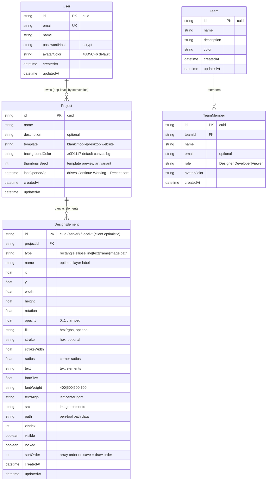

# Digma — Master Project Architecture Document (PAD) v1.3.0

**Classification:** Internal Engineering Reference
**Status:** DEFINITIVE, PRODUCTION-LOCKED BLUEPRINT
**Companion Document:** `README.md` (user-facing), `AGENTS.md` (operator quick-reference), `CLAUDE.md` (agent instructions)
**Last Updated:** 2026-09-27 (v1.3.0 — per-element scale + chip responsive-guard remediation)
**Audience:** Senior Engineers, Tech Leads, DevOps, and Onboarding Engineers
**Rule:** Every architectural decision in this document traces to a specific rationale. Nothing is here "because it's popular."

This PAD documents the Digma clone codebase — a collaborative design workspace replicating the reference app at `https://digma-371dfd0d.base44.app/` on the Next.js 16 / React 19 / Tailwind 4 / Prisma-SQLite stack. It is the single source of truth for system structure; when code and this document disagree, the code wins and this document must be updated in the same commit.

#### Revision Block — v1.3.0 (Tracked Changes)

Every change is tagged with its source: `[RES]` = validated by web research, `[SR]` = self-review, `[CA]` = critical analysis, `[SYN]` = synthesis, `[SAN]` = sanitization pass, `[AUTH]` = auth alignment.

- `[SR]` Per-element Scale (ADR-012): a fresh live DOM audit decoded the reference's Transform section — Rotation pairs its slider with a `w-16` number input, and a second **Scale** slider (0.1–3.0, step 0.1, "1.0x" readout) persists per element and renders in the transform chain `translate(x,y) scale(s) rotate(r)` (verified surviving reload on the reference). Implemented across the whole stack: `DesignElement.scale` (schema column, DTO, defaults), API clamps (0.05–20), canvas/present/thumbnail render chains, scale-aware `boundsOf()` visual bounds (selection outline, marquee, fit-to-view, thumbnails in one seam), and visual-space resize math (pointer deltas divided by scale on write-back).
- `[SR]` Panel chips now render only where their panels can: the chip bar is `hidden md:flex` and the Properties chip `hidden lg:inline-block` (its panel is `lg:flex`). Before, the chips flipped `aria-pressed` below md with no visible effect — dead controls that lie about state.
- `[SR]` AI no-crash regression pin: the reference app itself CRASHES on AI submission (reproduced live 2026-09-27: `TypeError: Cannot read properties of undefined (reading 'charAt')`, React root unmounts, blank page — plus a `cdn.tailwindcss.com` production warning). `tests/e2e/workspace.spec.ts` now pins that a submitted command must answer, mutate the canvas, and leave the clone's page fully interactive.
- `[SR]` Test-count refresh: 62 unit checks (editor +4: scale default, transform chain, scale-aware bounds), 39 Playwright checks (+6: rotation number input, scale slider contract, scale persistence, chips hidden at 390, Properties chip waits for lg, AI no-crash).

#### Revision Block — v1.2.0 (Tracked Changes)

Every change is tagged with its source: `[RES]` = validated by web research, `[SR]` = self-review, `[CA]` = critical analysis, `[SYN]` = synthesis, `[SAN]` = sanitization pass, `[AUTH]` = auth alignment.

- `[SR]` Panel-toggle chips (ADR-010): the bottom-left editor chips are now INDEPENDENT panel visibility toggles (Layers / a second Components w-60 column / the right Properties panel; default ON/OFF/ON), measured and decoded from the reference DOM — the v1.1.0 decorative tab bar was a misread of the reference's behavior. New `components-panel.tsx`; `tests/e2e/editor-panels.spec.ts` (7 checks) pins it.
- `[SR]` Properties panel restructured to the reference layout: fixed header block (h3 `text-sm font-medium text-white`), scrollable `p-4 space-y-6` body, iconed h4 sections — Position & Size, Corner Radius (slider 0–75 + linked per-corner inputs), Fill & Stroke (Solid/Gradient/Image pills + swatch/hex rows), Transform (rotation slider), Opacity (0–100 slider) — and Canvas Properties reduced to the reference's single Background Color row (the preset grid was not on the reference's properties panel; presets live on the Create-Project dialog only). No Delete button in the panel (reference parity).
- `[SR]` Layers header button now toggles Select All / Deselect All with the reference's exact semantics (`selectedIds.length === elements.length`, incl. the 0/0 quirk); new `selectAll()` store action.
- `[SR]` Dependency hygiene: dead legacy `tailwindcss-animate` removed (unused — Tailwind 4 CSS-first imports `tw-animate-css` in CSS); `package-lock.json` deleted (bun.lock is canonical; closes the dual-lockfile known issue).
- `[SR]` Test-count refresh: 33 Playwright checks (editor-panels +7); docs realigned (README route tree casing, NEXT_PUBLIC_SITE_URL row removed).

#### Revision Block — v1.1.0 (Tracked Changes)

Every change is tagged with its source: `[RES]` = validated by web research, `[SR]` = self-review, `[CA]` = critical analysis, `[SYN]` = synthesis, `[SAN]` = sanitization pass, `[AUTH]` = auth alignment.

- `[SR]` Route-casing parity (ADR-008): routes renamed to the reference app's capitalized spellings (/Dashboard, /Recent, /Teams, /Editor?projectId=; root / and /login stay lowercase); legacy lowercase URLs 307 via src/middleware.ts after discovering Next 16 redirect-source matching is case-insensitive (per-rule caseSensitive is not honored — observed self-loop).
- `[SR]` Untitled editor (ADR-009): unknown/missing projectId now opens a working "Untitled" editor whose first save creates the project (POST /api/projects + attachProject + history.replaceState). Audited the live app: its own unknown-id editor silently saves into the most-recent project — a data bug deliberately NOT cloned.
- `[SR]` db-path DIGMA_REPO_ROOT anchor implemented (TDD: 4 new unit tests first) — the v1.0.0 PAD documented the env override before it existed; the doc now matches the code.
- `[AUTH]` Env-var drift fixed across the doc set: the code reads AUTH_SECRET (src/lib/auth.ts); earlier docs said SESSION_SECRET. .env.example now matches the codebase exactly (unused NEXT_PUBLIC_SITE_URL removed).
- `[SR]` Editor visual parity: zoom cluster re-measured from the live DOM ([100%][zoom-in][zoom-out] as separate chips, no Fit button); second top-bar avatar "S" on #10B981; AI status "Working on it...".
- `[SR]` Test-count refresh: 58 unit checks (db-path now 20), 26 Playwright checks (new tests/e2e/untitled-editor.spec.ts, 3 checks).

#### Revision Block — v1.0.0 (Tracked Changes)

Every change is tagged with its source: `[RES]` = validated by web research, `[SR]` = self-review, `[CA]` = critical analysis, `[SYN]` = synthesis, `[SAN]` = sanitization pass, `[AUTH]` = auth alignment.

- `[SYN]` Initial PAD for the Digma clone, replacing the scaffold's ORBITAL-project PAD wholesale (that document described a different application and is retained in git history only).
- `[SR]` Mobile navigation documented as a deliberate deviation from the reference app (fix, not parity) — Tailwind v4 failure class A.
- `[CA]` Three production traps recorded with root causes: standalone-server SQLite chdir trap, Turbopack module-duplication of singletons, and parent-`.env` DATABASE_URL shadowing.
- `[AUTH]` Auth model documented: scrypt + HMAC-SHA256 stateless cookie sessions, rate-limited auth routes.

## Table of Contents

1. [System Overview & Decisions](#1-system-overview--decisions)
2. [High-Level System Topology](#2-high-level-system-topology)
3. [Application Architecture](#3-application-architecture)
4. [Data Architecture](#4-data-architecture)
5. [Design System Reference](#5-design-system-reference)
6. [Security Architecture](#6-security-architecture)
7. [Testing Strategy](#7-testing-strategy)
8. [Build & Deployment](#8-build--deployment)
9. [Developer Handbook](#9-developer-handbook)
10. [Known Issues & Outstanding Tasks](#10-known-issues--outstanding-tasks)
11. [Key Files Reference](#11-key-files-reference)
12. [Glossary](#12-glossary)

---

## 1. System Overview & Decisions

### 1.1 Document Metadata & Purpose

Digma is a Figma-like design-tool workspace: a landing dashboard with gradient hero and project cards, a Recent view with sort/list-grid toggle, a Teams management page, and a full canvas editor (dark GitHub-style chrome, left toolbar, layers panel, properties panel, zoom/pan, DOM-element shapes) with an AI assistant that creates and edits shapes from natural-language commands. Auth is email/password with a demo seed account.

How to use this document:

- **New engineer** — read Sections 1–3, then 9 (Developer Handbook); skim the rest as needed.
- **Debugging** — Section 3.3 (Critical Code Patterns) and Section 10 (Known Issues) contain every hard-won trap.
- **Reviewing tech choices** — Section 1.3 (ADRs) records the full decision trail including rejected alternatives.

### 1.2 Technology Stack Summary

| Layer | Technology | Version | Key Rationale |
|-------|-----------|---------|---------------|
| Web Framework | Next.js (App Router, Turbopack) | ≥16.3.6 | Server components for session-gated pages; route handlers double as the API layer; standalone output mode. |
| UI Runtime | React | ≥19.3.0 | Concurrent features; `useSyncExternalStore` for cross-chunk-safe external stores. |
| Language | TypeScript (strict except `noImplicitAny: false`) | ≥5.9.3 | Type safety with the sandbox's intentional default kept. |
| Styling | Tailwind CSS (CSS-first, no config file) | ≥4.3.3 | v4 `@theme` tokens; the reference app's exact classes were extracted from its live DOM. |
| Animation | tw-animate-css | ≥1.4.0 | v4 replacement for `tailwindcss-animate`; imported in CSS, not a JS plugin. |
| Component Primitives | shadcn/ui on Radix UI | Radix packages ^1.x per `package.json` | Dialog/Sheet/Dropdown with built-in a11y (focus trap, Escape, scroll lock) — the mobile nav fix leans on this. |
| Client State | Zustand | ≥5.0.15 | One store for all editor state (elements, selection, tool, zoom, undo/redo). |
| ORM | Prisma | ≥6.19.3 | Type-safe SQLite access; transactional full-list element replace. |
| Database | SQLite | file-based, zero-ops | Single-user demo workspace scale; no server to provision in the sandbox. |
| AI | z-ai-web-dev-sdk | ≥0.0.18 | Editor AI assistant (server-side only); degrade-not-fail contract. |
| Unit Testing | Vitest | ≥5.0.1 | Bun-compatible, fast, per-file worker isolation. |
| E2E Testing | Playwright | ≥1.63.0 | Multi-viewport; the mobile-navigation suite runs at 390×844. |
| Linting | ESLint (eslint-config-next) | ≥9.39.5 | React 19 hook rules enforced (incl. `set-state-in-effect`). |
| Runtime / Package Manager | Bun | ≥1.4.x | Dev + prod server runtime; `bun` scripts in `package.json`. |

### 1.3 Architecture Decision Records (ADRs)

**ADR-001: Single Next.js App Router application (no monorepo)**

- **Context:** The reference architecture (Scandi Haven) is a pnpm/Turborepo monorepo with separate apps and packages. The digma repo scaffold, however, is a single app, and the deliverable is one deployable unit with five routes.
- **Decision:** One Next.js 16 App Router application at the repo root. Server components for pages; route handlers for the API (`src/app/api/**`); no workspace boundaries.
- **Rationale:** The app is small (5 pages, 15 API route files, ~20 components). Monorepo overhead (workspace protocol, cross-package builds) buys nothing at this scale and slows the local gate.
- **Consequences:** Positive — one install, one build, one gate. Negative — no enforced module boundary between UI and API beyond directory discipline; mitigated by the layer model (Section 3.1) and pure `src/lib` seams.
- **Alternatives Rejected:** Turborepo monorepo (Scandi Haven model) — rejected for overhead; Separate API service — rejected because pages fetch server-side in the same process.

**ADR-002: SQLite via Prisma, with runtime db-path resolution**

- **Context:** The database must work in dev (`next dev`), in production standalone mode (`node .next/standalone/server.js` after `process.chdir(__dirname)`), and under the repo's relative `file:` URL convention — while SQLite resolves relative paths against CWD, and the Prisma CLI resolves them against the schema file.
- **Decision:** SQLite through Prisma 6. `src/lib/db-path.ts` computes the absolute URL at runtime from anchor directories (first candidate containing `prisma/schema.prisma` wins), with side-effect `roots.push(...)` anchor collection. `tests/db-path.test.ts` pins the contract.
- **Rationale:** Zero-ops persistence for a demo-scale app; the anchor strategy survives standalone `chdir` and minification (see ADR-002a below).
- **Consequences:** Positive — no DB server; both dev and standalone modes resolve the same file. Negative — SQLite is single-writer and per-instance; a multi-instance deployment would need a shared file volume or a migration to Postgres.
- **Alternatives Rejected:** Postgres (rootless) — valid but heavier than the deliverable needs; absolute `DATABASE_URL` — breaks portability and was in fact the failure mode observed (see Known Issues #3).

**ADR-002a: Anchor detection via side-effect pushes, not helper return values**

- **Context:** The shipped standalone bundle's minifier inlined the `standaloneRepoRoot()` helper and dropped its return values, silently disabling the `.next/standalone` anchor in production while dev and tests stayed green.
- **Decision:** `candidateRoots()` collects anchors with `roots.push(...)` side effects that cannot be eliminated; the pure resolver functions remain exported for tests.
- **Rationale:** Observed in the running production server; fixed and verified there (db-path debug line printed the correct anchor). Reverting to return-value style reintroduces the minifier bug.
- **Consequences:** Positive — minification-safe. Negative — slightly less idiomatic; documented in code comments and pinned by tests.

**ADR-003: Hand-rolled scrypt + HMAC-SHA256 stateless cookie sessions**

- **Context:** Reference repos use Better-Auth (Scandi Haven) or Base44's platform auth. The clone needs email/password login with a demo account, no OAuth providers, and no external service.
- **Decision:** `src/lib/auth.ts` — scrypt password hashes (N=16384) and HMAC-SHA256-signed `userId.expiry.signature` tokens in an httpOnly `digma_session` cookie (7-day TTL, `AUTH_SECRET` env with dev fallback). `getSessionUser()` verifies signature + expiry + user existence on every request.
- **Rationale:** ~100 lines, zero dependencies, fully testable, and enough for a demo-scale single-role app; matches the scaffold's auth.ts contract that existing tests already pin.
- **Consequences:** Positive — no provider lock-in; sessions survive restarts (stateless). Negative — no revocation list (logout only clears the client cookie); token payload is visible (contains only id + expiry, HMAC-signed).
- **Alternatives Rejected:** NextAuth/Auth.js — provider abstraction overhead for a single email/password flow; Better-Auth — brings a database session table the schema doesn't need.

**ADR-004: Tailwind 4 CSS-first theming with literal-hex `@theme`**

- **Context:** Tailwind v4 replaces `tailwind.config.js` with CSS-first `@theme` blocks. The skills' validation report documents that `var()` chains inside a plain `@theme` are dropped by the current v4 build, and that leftover legacy configs cause the "flat/minimal look" bug.
- **Decision:** No `tailwind.config.js`, ever. Tokens are literal hex values in one plain `@theme` block in `src/app/globals.css` (shadcn semantics + `editor-*` dark palette); `tw-animate-css` is imported in CSS; `@source` handles any manual content directives if ever needed.
- **Rationale:** The reference app's exact Tailwind classes were extracted from its live DOM during exploration; reproducing them requires the same utility surface, which CSS-first v4 provides.
- **Consequences:** Positive — single source of truth in CSS; negative — token values are duplicated rather than derived (kept manually in sync; each is a measured constant from the reference app).
- **Alternatives Rejected:** Legacy config bridge (`@config`) — reintroduces the documented failure class; `var()`-chained theme — dropped by the v4 build.

**ADR-005: One Zustand editor store + full-list element replace persistence**

- **Context:** The editor must support drawing, selecting, moving, resizing, editing properties, undo/redo, zoom/pan, and AI batch mutations — concurrently and without per-element server chatter.
- **Decision:** All editor state lives in `src/components/editor/editor-store.ts` (elements, selection, tool, zoom, pan, saveState, undo/redo snapshots). Autosave debounces 800ms and `PUT`s the FULL element list to `/api/projects/[id]/elements`; the handler transactionally deletes all rows for the project and recreates them in array order; the client remaps returned server ids so selection survives.
- **Rationale:** The replace contract makes undo/redo and AI batch operations safe (no partial-failure per-element state), and elements are client-sovereign (`local-…` optimistic ids) so the UI never waits on the server.
- **Consequences:** Positive — dead-simple consistency model; element order = array order. Negative — full-list writes per save (fine at demo scale); server round-trips scale with element count, not with the delta.
- **Alternatives Rejected:** Per-element PATCH autosave — partial-failure complexity, breaks undo; server-authoritative ids — would block optimistic drawing.

**ADR-006: AI assistant degrades, never fails (LLM + deterministic fallback)**

- **Context:** The editor's AI assistant must work in the sandbox where `z-ai-web-dev-sdk` may be unavailable, slow, or return malformed output — and must never corrupt canvas state.
- **Decision:** `POST /api/ai-assistant` tries the SDK server-side, sanitizes the LLM's JSON through `sanitizeLlmOperations` (type/enum/hex/numeric clamps in `src/lib/ai-assistant.ts`), and falls back to the deterministic `parseFallbackCommand` parser when the SDK is down, output is malformed, or sanitization rejects it. Both paths return the same `{ reply, operations[] }` envelope; the client applies operations (`add`/`update`/`delete`, `update` may carry `scale`).
- **Rationale:** Availability beats capability for a demo-critical feature; sanitization is the security boundary between the LLM and user data.
- **Consequences:** Positive — the assistant always responds; fallback is deterministic and unit-tested. Negative — fallback is keyword-based, so unusual phrasings degrade to a help message rather than a wrong action (chosen deliberately: fail inert).
- **Alternatives Rejected:** LLM-only — fails hard when the SDK is down; client-side parsing — moves trust boundary to the client.

**ADR-007: `globalThis`-backed toast store consumed with `useSyncExternalStore`**

- **Context:** Under Turbopack code-splitting, two client chunks (page bundle vs. root-layout Toaster) can receive two copies of a module-level singleton, so toasts fired from a page never reach the layout's Toaster. Radix Toast with a controlled `open` list also never mounted reliably in this setup.
- **Decision:** `src/hooks/use-toast.ts` stores the state AND the listener set on `globalThis.__digmaToastInfra`; components subscribe via `useSyncExternalStore`; `toaster.tsx` renders plain divs with tw-animate-css transitions.
- **Rationale:** Observed and fixed in the running dev server (subscription test proved state was shared but listeners were split per module instance). `useSyncExternalStore` is the React-19-sanctioned bridge and dodges the `set-state-in-effect` lint rule entirely.
- **Consequences:** Positive — cross-chunk toasts work; no controlled-open Radix list. Negative — a global symbol name to keep unique (`__digmaToastInfra`).
- **Alternatives Rejected:** Module-level singleton — the observed bug; context provider — the Toaster lives in the root layout while fire-sites live in page chunks, and context doesn't cross bundle splits any better.

**ADR-008: Capitalized route spellings with middleware-based legacy redirects**

- **Context:** The reference app's own links point at `/Dashboard`, `/Recent`, `/Teams`, `/Editor?projectId=…` (React Router, capitalized), with the root `/` and a lowercase `/login` also live. The v1.0.0 clone used all-lowercase Next.js-conventional routes — a user-visible URL difference on every navigation.
- **Decision:** Rename the route folders to the reference spellings (`src/app/{Dashboard,Recent,Teams,Editor}`), keep `/` and `/login` as they are, and 307-redirect the four legacy lowercase paths in `src/middleware.ts` (exact-match `Record` lookup; `matcher` restricted to those four paths; query preserved so `/editor?projectId=x` → `/Editor?projectId=x`).
- **Rationale:** URL parity is user-visible parity. The middleware is required because Next 16's `redirects()` source matching is case-INSENSITIVE and the per-rule `caseSensitive` flag is not honored — expressing lowercase→Capital there produces a `/Recent → /Recent` self-loop (`ERR_TOO_MANY_REDIRECTS`, observed and reverted). Page-route matching itself IS case-sensitive (lowercase `/teams` 404s), so the middleware carries the compat burden alone.
- **Consequences:** Positive — address-bar parity with the reference; old bookmarks keep working. Negative — a middleware edge on four paths; two route folders that must not collide on case-insensitive filesystems (only one spelling exists per route, so no conflict).
- **Alternatives Rejected:** `next.config redirects()` — the observed loop; duplicate lowercase route folders calling `redirect()` — folder-name collision risk on macOS/Windows; staying lowercase — leaves a visible parity gap.

**ADR-009: Untitled editor for unknown/missing projectId (create-on-first-save)**

- **Context:** The reference app renders a fully working "Untitled" editor when `/Editor` is opened with a bogus or absent `projectId` (verified live: drawing works, the toolbar/panels/zoom all function). Auditing its persistence revealed a data bug: the unknown-id canvas saves SILENTLY into the most-recently-accessed project (a rectangle drawn at `projectId=test` landed in "Test Project One"). The v1.0.0 clone instead dead-ended at a "Project not found" error page.
- **Decision:** `/Editor?projectId=<unknown>` and `/Editor` (no param) open a working Untitled editor (`UNTITLED_PROJECT` with `id: ""`). The store runs with an empty `projectId`; the FIRST autosave flush `POST`s `/api/projects` (name "Untitled", template blank), binds the returned id via the new `attachProject` store action, adopts it in the address bar with `history.replaceState`, then continues into the normal full-list element `PUT`. `exit()` flushes only when a real `store.projectId` exists. Pinned by `tests/e2e/untitled-editor.spec.ts` (bogus id renders Untitled, no-param renders Untitled, drawing creates the project and survives reload).
- **Rationale:** Visual/functional parity for the 99% case (a working canvas instead of an error page) without cloning the 1% data-corruption bug (saves landing in the wrong project). `history.replaceState` (not `router.replace`) avoids a Next navigation churn/re-render while the save is in flight.
- **Consequences:** Positive — no dead ends; no silent cross-project writes; reload lands on the real project. Negative — an empty-`projectId` store state that every future editor feature must respect (the autosave `ensureProject` seam is the single choke point).
- **Alternatives Rejected:** Cloning the live behavior exactly (save into most-recent project) — silent data corruption; keeping the error page — visible parity gap; creating the project eagerly on mount — empty "Untitled" projects litter the dashboard for every casual visit (the lazy create only materializes what the user actually drew).

**ADR-010: Bottom-left panel chips are independent visibility toggles (Layers / Components / Properties)**

- **Context:** A fresh DOM audit of the reference editor decoded the bottom-left `Layers | Components | Properties` chip bar: each chip flips ITS OWN panel's visibility — clicking Components ADDS a second `w-60` column beside Layers (both visible at once); clicking Properties removes the right `w-72` panel; clicking Layers removes the layers column. The v1.1.0 clone had modeled them as exclusive switch-tabs (decorative, no interactivity) — a misread.
- **Decision:** `editor-view.tsx` keeps a `{ layers, components, properties }` visibility state (default ON/OFF/ON, matching the reference) and conditionally renders the three panel columns; a new `ComponentsPanel` (header + small blue "+" affordance + the reference's empty state: "No components yet / Create reusable design components") fills the Components column. The chips float at `absolute bottom-4 left-4` with `aria-pressed` + `aria-label="Toggle … panel"` (the reference ships unnamed buttons; the labels are this clone's a11y superset). Panels stay hidden below `md`/`lg` — the mobile editor keeps a full-width canvas (the reference squeezes all five columns to unreadable widths at 390px, a bug not cloned).
- **Rationale:** Panel toggling is real, user-visible reference behavior; the independent (non-exclusive) semantics were verified by replaying each click against the live DOM and observing which columns appear/disappear.
- **Consequences:** Positive — parity chrome + a new e2e suite. Negative — panel visibility is view-local state (resets per editor mount — the reference behaves the same); the Components panel is presentational only (component authoring isn't implemented on the reference either — its "+" is a no-op there; documented scope cut).
- **Alternatives Rejected:** Radix Tabs (exclusive selection — wrong semantics); lifting visibility into the Zustand store (it's ephemeral view chrome, not canvas state — the store contract stays canvas-only).

**ADR-011: Properties panel = the reference's five-section layout with linked corners**

- **Context:** The reference's properties panel carries a fixed header block (`p-4 border-b` + h3 `text-sm font-medium text-white`), a scrollable body, and iconed sections: Position & Size (X/Y/W/H), Corner Radius (an "All Corners" slider 0–75 + four per-corner inputs), Fill & Stroke (Solid/Gradient/Image pills + Fill Color swatch/hex + Stroke swatch/hex + Stroke Width), Transform (rotation slider −180…180), Opacity (slider 0–100). With nothing selected it shows "Canvas Properties" with a single Background Color row. The v1.1.0 clone used compact inline-labeled fields, a single Appearance section, and a background preset grid that the reference's properties panel doesn't have.
- **Decision:** Restructure to the reference layout section-for-section. Corner approximation: the element model keeps ONE `radius`, so the four per-corner inputs all read and write the shared value (Figma's "linked corners" behavior); per-corner splits are a documented scope cut. Fill modes: only Solid is functional — Gradient/Image render and toast a scope-cut notice (the reference's own gradient editor was not audited in depth). Sliders are native `<input type="range" class="accent-blue-600">` (the reference uses Radix Slider; the native input is the zero-dependency equivalent).
- **Rationale:** The properties panel is a permanently visible editor surface — section-level fidelity is visible in every screenshot comparison. Linked corners keep the visual spec without a schema migration.
- **Consequences:** Positive — layout parity, e2e-pinned sections. Negative — per-corner values cannot diverge (documented); gradient/image fills unavailable (documented).
- **Alternatives Rejected:** Per-corner radius columns (schema migration + renderer changes for marginal value); vendoring a Radix Slider (new dependency for a visual detail the native range covers).

**ADR-012: Per-element scale rendered in the transform chain (translate → scale → rotate)**

- **Context:** A live DOM audit of the reference's Transform section found a second control the v1.2.0 clone lacked: a **Scale** slider (Radix, `aria-valuemin=0.1 aria-valuemax=3`, step 0.1) with a "1.0x" text readout, persisted per element (verified surviving a reload on the reference: the element renders `translate(212px, 202px) scale(1.2) rotate(2deg)`). The reference's Rotation row also pairs its slider with an editable `w-16` number input, not a plain text readout. Distinct from the AI `update.scale` operation (a one-shot width/height multiplier), the reference's scale is a STORED element property applied at render time.
- **Decision:** Add `scale: Float @default(1)` to `DesignElement` (schema + DTO + defaults; API clamp 0.05–20 with fallback 1). Render it in the element transform chain `translate(x,y) scale(s) rotate(r)` (canvas, present overlay, card thumbnails — all with `transformOrigin: "0px 0px"`). The Transform section gets the Scale slider (0.1–3.0, step 0.1, "N.Nx" readout) and the Rotation number input. `boundsOf()` computes VISUAL bounds (`width*scale`), which fixes the selection outline, marquee containment, fit-to-view, and thumbnails in one seam. Resize drags run in visual space and divide the delta by scale on write-back (resized model w/h stay scale-independent; resizing never rescales).
- **Rationale:** The Transform section is a permanently visible surface — a missing control is visible in every screenshot comparison; and the visual-bounds seam prevents the classic scaled-element bug (selection ring / marquee / thumbnail that doesn't wrap the element).
- **Consequences:** Positive — full transform parity incl. persistence; one bounds seam keeps every consumer consistent. Negative — the model w/h and the visual footprint diverge for scaled elements (all consumers must go through `boundsOf`/`el.scale`); rotation-aware bounds remain out of scope (the reference behaves the same — its ring is the same-transform sibling, not an AABB).
- **Alternatives Rejected:** Folding scale into width/height on save (loses the reference's round-trip semantics — the reference keeps w/h and scale separate); an AABB with rotation (the reference doesn't do it either); Radix Slider (native range is the zero-dependency equivalent already used by every other slider).

---

## 2. High-Level System Topology

```text
┌──────────────────────────────────────────────────────────────────────┐
│ Browser (desktop / mobile ≥360px)                                    │
│  React 19 client: page views + editor (Zustand store, DOM canvas)    │
│  toast store on globalThis · Radix Sheet mobile nav · cookie jar     │
└───────────────▲───────────────────────────────────┬──────────────────┘
                │ HTML (server components)          │ fetch JSON
                │                                   │ (envelope: ok/fail)
┌───────────────┴───────────────────────────────────▼──────────────────┐
│ Next.js 16 App Router — single Node process (Bun runtime)            │
│                                                                      │
│  [Server pages]  /, /Dashboard, /login, /Recent, /Teams, /Editor   │
│    → getSessionUser() gate → redirect /login?from_url=…              │
│    (legacy lowercase /recent… 307 → canonical via src/middleware.ts) │
│                                                                      │
│  [Route handlers]  /api/auth/*  /api/projects/**  /api/teams/**      │
│    /api/stats  /api/health  /api/ai-assistant                        │
│    → requireSession() → hand-rolled validation → ok()/fail()         │
│    → rate-limit (auth routes, 10/IP/15min, in-process)               │
│                                                                      │
│  [AI path]  /api/ai-assistant → z-ai-web-dev-sdk → sanitizeLlmOps   │
│              → fallback: parseFallbackCommand  (degrade-not-fail)    │
└───────────────┬──────────────────────────────────────────────────────┘
                │ Prisma 6
┌───────────────▼──────────────────────────────────────────────────────┐
│ SQLite file  db/custom.db  (dev) / resolved via db-path.ts (prod)    │
│   User · Project · DesignElement · Team · TeamMember                 │
└──────────────────────────────────────────────────────────────────────┘

Deployment modes:
  dev:        bun run dev            (:3000, CWD = repo root)
  production: bun run build → .next/standalone/server.js  (chdir into
              .next/standalone; db-path.ts re-anchors the SQLite URL)
  e2e:        playwright global-setup → standalone server on :3100 with
              its own db/e2e.db (repo root, never the dev DB)
External services: none at runtime except the optional AI SDK call.
```

Scaling characteristics: single process, single SQLite file — correct for demo/eval scale. The AI call is the only external dependency and is wrapped by the fallback. The rate limiter is per-process by design (documented in Section 6).

---

## 3. Application Architecture

### 3.1 The Layer Model

**Golden Rule: dependencies point downward only — UI may know the store and the API client; nothing below a layer may know anything above it.**

```text
Layer 0: Persistence — src/lib/db.ts, prisma/schema.prisma
         Role: Prisma client singleton + schema. Rule: only route handlers
         import the db client; views never touch Prisma.

Layer 1: Pure domain — src/lib/{editor,ai-assistant,team,greeting,validation,
         rate-limit,db-path,api,auth}.ts
         Role: deterministic, side-effect-light logic. Rule: fully covered by
         unit tests (src/lib/*.test.ts); no React, no fetch.

Layer 2: API surface — src/app/api/**/route.ts
         Role: session gate + validation + Prisma + envelope. Rule: first
         statement is requireSession() (except health/auth); responses are
         ok()/fail() only; 429 + Retry-After on rate-limited routes.

Layer 3: Server pages — src/app/**/page.tsx
         Role: session gate + data fetch + redirect. Rule: pages stay server
         components; they render Layer-4 views with plain serializable props.

Layer 4: Client views — src/components/**
         Role: all interactivity. Rule: 'use client' explicit; API access only
         through the call() helper; canvas state only through the Zustand
         store; toasts through the globalThis store.
```

### 3.2 Annotated Directory Structure

```text
digma/
├── prisma/
│   ├── schema.prisma              # User, Project, DesignElement, Team, TeamMember
│   └── seed.ts                    # demo user + 2 projects (6 elements on p1) + 1 team + 3 members
├── src/
│   ├── app/
│   │   ├── globals.css            # Tailwind 4 CSS-first: @theme tokens (single source)
│   │   ├── layout.tsx             # Inter font, Toaster mount, metadata
│   │   ├── page.tsx               # / — session-gated dashboard
│   │   ├── login/page.tsx         # /login (public; honors ?from_url)
│   │   ├── Dashboard/page.tsx     # /Dashboard — the capitalized route the
│   │   │                          # reference app's links point at (root /
│   │   │                          # renders the same view)
│   │   ├── Recent/page.tsx        # /Recent — sorted project history
│   │   ├── Teams/page.tsx         # /Teams — team management
│   │   ├── Editor/page.tsx        # /Editor?projectId= — the canvas editor
│   │   │                          # (unknown/missing id → Untitled mode)
│   │   └── api/
│   │       ├── health/route.ts        # GET liveness (public)
│   │       ├── auth/{login,logout,register,me}/route.ts
│   │       ├── projects/route.ts      # GET list, POST create
│   │       ├── projects/[id]/route.ts # GET, PATCH (rename/desc), DELETE
│   │       ├── projects/[id]/duplicate/route.ts
│   │       ├── projects/[id]/elements/route.ts   # GET, PUT full-list replace
│   │       ├── teams/route.ts         # GET, POST
│   │       ├── teams/[id]/route.ts    # PATCH, DELETE (+member remove)
│   │       ├── teams/[id]/members/route.ts      # POST invite
│   │       ├── stats/route.ts         # GET dashboard Quick Stats
│   │       └── ai-assistant/route.ts  # POST natural-language → operations
│   ├── middleware.ts              # legacy lowercase → canonical 307s (ADR-008)
│   ├── components/
│   │   ├── app-header.tsx         # desktop nav + MobileNav (Sheet drawer) ← the fix
│   │   ├── dashboard-view.tsx     # hero, Quick Stats, Continue Working, grid
│   │   ├── login-screen.tsx       # Welcome to Digma card, social buttons, form
│   │   ├── logo.tsx               # gradient Digma mark
│   │   ├── project-card.tsx       # thumbnail, meta, ellipsis menu (rename/delete)
│   │   ├── recent-view.tsx        # sort dropdown, list/grid toggle
│   │   ├── teams-view.tsx         # team cards, member chips, invite dialog
│   │   ├── editor/
│   │   │   ├── editor-store.ts    # THE Zustand store (elements, selection, undo…)
│   │   │   ├── canvas.tsx         # pointer events: draw/move/resize/select
│   │   │   ├── toolbar.tsx        # tools + shortcuts (title="… (V)" etc.)
│   │   │   ├── layers-panel.tsx   # visibility/lock, reorder, rename,
│   │   │   │                      # Select All/Deselect All toggle
│   │   │   ├── components-panel.tsx # reference's Components column (ADR-010)
│   │   │   ├── properties-panel.tsx # five-section layout + Canvas Properties (ADR-011)
│   │   │   ├── ai-assistant.tsx   # chat UI, applies operations to store
│   │   │   └── editor-view.tsx    # layout + autosave + panel-toggle chips
│   │   └── ui/                    # shadcn primitives: button, input, textarea,
│   │                              # label, dialog, dropdown-menu, sheet, tabs, toaster
│   ├── hooks/use-toast.ts         # globalThis-backed toast store (useSyncExternalStore)
│   └── lib/                       # Layer 1 pure domain + tests (see 3.3)
├── tests/
│   ├── db-path.test.ts            # pins the db-path resolution contract
│   └── e2e/                       # Playwright: auth, workspace, mobile-navigation,
│                                  # untitled-editor, editor-panels
├── scripts/smoke-test.sh          # 28 HTTP checks against the standalone build
├── docs/
│   ├── screenshots/               # 12 captured PNGs (desktop/mobile/tablet/panels)
│   ├── Tailwind-V4-Validation-Report.md
│   ├── ssh_git_wrapper_v3.py      # SSH push wrapper (runbook in docs/)
│   └── how-to-git-push-using-ssh-wrapper_SKILL.md
└── skills/                        # operator's skill catalog (not app code; ESLint-ignored)
```

### 3.3 Critical Code Patterns

**Pattern 1 — Minifier-safe anchor collection (`src/lib/db-path.ts`)**

```typescript
// Purpose: collect candidate repo-root anchors in a way the production
// minifier cannot eliminate. A helper returning an array got inlined and
// its results dropped in the standalone bundle, silently disabling the
// .next/standalone anchor (observed, fixed, pinned by tests).
function candidateRoots(): string[] {
  const roots: string[] = [];
  const push = (p: string) => {
    if (p) roots.push(p); // side effect: survives dead-code elimination
  };
  push(process.cwd());                 // dev: repo root; standalone: .next/standalone
  push(path.join(process.cwd(), ".."));        // standalone: repo root
  push(path.join(__dirname, "..", "..", "..")); // src/lib → repo root
  push(process.env.DIGMA_REPO_ROOT ?? "");      // explicit override
  return roots;
}
// resolveDatabaseUrl() picks the first anchor containing prisma/schema.prisma.
```

Why this pattern: SQLite URLs are relative; Prisma CLI anchors them at the schema file while the engine anchors at CWD; standalone `server.js` runs `process.chdir(__dirname)` before any module executes. The anchor scan reconciles all three worlds, and the push-style collection is the only form that survived the minifier.

**Pattern 2 — Cross-chunk external store (`src/hooks/use-toast.ts`)**

```typescript
// Purpose: one toast store shared across Turbopack-split client chunks.
// Module-level state was duplicated per chunk (observed: state shared via
// globalThis but listeners split per module instance). Both live on the
// global symbol now; consumption uses useSyncExternalStore (React-19-safe).
type ToastInfra = { state: ToastStore; listeners: Set<() => void> };
const infra: ToastInfra =
  ((globalThis as any).__digmaToastInfra ??= createInfra());
export function useToast() {
  const snapshot = useSyncExternalStore(
    infra.subscribe,     // stable listener-set on globalThis
    infra.getSnapshot,   // immutable snapshot
    infra.getSnapshot,
  );
  return { toasts: snapshot.toasts, toast: infra.push };
}
```

Why this pattern: the Toaster mounts in the root layout while fire-sites (login screen, views) live in page chunks; `globalThis` is the only symbol table guaranteed shared, and `useSyncExternalStore` avoids both tearing and the React 19 `set-state-in-effect` lint rule.

**Pattern 3 — Full-list element replace (`src/app/api/projects/[id]/elements/route.ts`)**

```typescript
// Purpose: transactional replace of ALL elements for a project, array order
// = sortOrder = z-index draw order. This is the contract that makes undo,
// redo, and AI batch operations safe: there is no per-element diff state.
export async function PUT(req: NextRequest, { params }: ctx) {
  await requireSession();
  const { projectId } = await params;
  const elements = sanitizeElementList(await req.json());
  return prisma.$transaction(async (tx) => {
    await tx.designElement.deleteMany({ where: { projectId } });
    if (elements.length) {
      await tx.designElement.createMany({
        data: elements.map((e, i) => ({ ...e, projectId, sortOrder: i })),
      });
    }
    return ok({ elements: await tx.designElement.findMany({ ... }) });
  }); // client remaps local-… ids → server ids so selection survives
}
```

Why this pattern: per-element PATCH would need conflict resolution and partial-failure rollback for zero user-visible benefit at this scale; the store already owns the authoritative list.

**Pattern 4 — AI sanitize-then-fallback seam (`src/app/api/ai-assistant/route.ts`)**

```typescript
// Purpose: the LLM is untrusted input. sanitizeLlmOperations() is the
// boundary: element types whitelisted, hex colors verified, numbers clamped,
// scale limited. Any rejection → deterministic fallback parser, so the
// assistant replies even when the SDK is unavailable.
let result: AssistantResult;
try {
  const raw = await callLlmSdk(prompt);            // z-ai-web-dev-sdk
  result = sanitizeLlmOperations(raw);             // throws on invalid
} catch {
  result = parseFallbackCommand(message);          // deterministic keywords
}
return ok(result); // { reply: string, operations: AssistantOperation[] }
```

Why this pattern: availability of a demo-critical feature beats raw capability; and an LLM must never write `type: "img<script>"` or `opacity: 1e9` into the canvas.

**Pattern 5 — MobileNav: Sheet drawer + SheetClose links (`src/components/app-header.tsx`)**

```tsx
{/* The reference app ships NO mobile nav (desktop nav hidden md:flex, no
    fallback — Tailwind v4 failure class A). This is the deliberate fix. */}
<nav className="hidden md:flex …">{/* desktop links */}</nav>
<Sheet>
  <SheetTrigger asChild>
    <button className="md:hidden" aria-label="Navigation menu"
            aria-controls="mobile-nav-sheet"> {/* aria-expanded via Radix */}
      <MenuIcon className="size-6" />
    </button>
  </SheetTrigger>
  <SheetContent id="mobile-nav-sheet" side="right" className="w-72 …">
    {links.map((l) => (
      <SheetClose asChild key={l.href}>  {/* tap navigates AND dismisses */}
        <Link href={l.href} className="flex min-h-11 items-center …">
          {l.label}                       {/* 44px (min-h-11) touch targets */}
        </Link>
      </SheetClose>
    ))}
  </SheetContent>
</Sheet>
```

Why this pattern: Radix Sheet provides focus trap, Escape, scroll lock and `aria-expanded` wiring for free; `SheetClose asChild` makes one tap both navigate and close (no pathname-watching effect needed — and the React 19 lint rule forbids the effect-based reset pattern anyway). Pinned by `tests/e2e/mobile-navigation.spec.ts` at 390×844.

---

## 4. Data Architecture

### 4.1 Database Schema



Table-level notes: `User`–`Project` has no FK (projects are keyed to the app user by query, mirroring the single-workspace demo model); `DesignElement.projectId` and `TeamMember.teamId` are `onDelete: Cascade`. Indexes: `DesignElement @@index([projectId])` and `@@index([sortOrder])`, `TeamMember @@index([teamId])`.

### 4.2 Data Models

The runtime element shape (`src/lib/editor.ts` — `CanvasElement`) is the authoritative TypeScript model for the canvas: all coordinates are canvas-space pixels at 100% zoom; the view layer transforms to viewport space with zoom/pan. Domain invariants enforced in `src/lib/validation.ts` and the editor store: opacity clamped 0–1, fontSize clamped with a 32px ceiling (pinned by unit tests), colors hex-verified, sizes floored at minimums so resize can't invert an element.

### 4.3 Persistence Strategy

- **Connection handling:** `src/lib/db.ts` keeps a single PrismaClient per process (global in dev to survive Turbopack HMR); SQLite is single-writer anyway.
- **Write pattern:** full-list transactional replace (Pattern 3) — no incremental migration state, no per-element locks.
- **Migrations:** schema-first via `bun run db:push` (dev/demo tool; `--accept-data-loss` is deliberate for a demo schema), `prisma migrate` scripts remain available for a future hosted deployment. Seed: `prisma/seed.ts` creates the demo user, 4 projects (with a rich seeded element composition), and 3 teams.
- **Databases in the repo lifecycle:** `db/custom.db` (dev, gitignored), `db/e2e.db` (created by the Playwright global setup on :3100, gitignored). Both are disposable; the seed is the recovery path.

---

## 5. Design System Reference

### 5.1 Typographic System

| Role | Family | Notes |
|------|--------|-------|
| Everything | Inter via `next/font` (`--font-inter`) | `@theme --font-sans: var(--font-inter), ui-sans-serif, system-ui, …` — the one place `var()` is legitimate in v4 |
| Headings/hero | Inter semibold/bold (`font-bold` etc.) | Dashboard hero uses large tracking-tight text |
| Editor text | Inter | `--color-editor-text` on dark chrome |

### 5.2 Color Tokens

All tokens are literal hex in the single `@theme` block (ADR-004). Palette mirrors the reference app: white surfaces, slate text, purple accents.

| Token | Value | Use |
|-------|-------|-----|
| `--color-background` | `#ffffff` | app background |
| `--color-foreground` | `#0f172a` | primary text (slate-900) |
| `--color-primary` | `#8b5cf6` | brand purple (buttons, active nav, links) |
| `--color-primary-foreground` | `#ffffff` | text on primary |
| `--color-secondary` | `#f3e8ff` | purple-tinted chips/badges |
| `--color-secondary-foreground` | `#5b21b6` | text on secondary |
| `--color-muted` | `#f9fafb` | muted surfaces |
| `--color-muted-foreground` | `#6b7280` | secondary text (gray-500) |
| `--color-accent` | `#f3f4f6` | hover surfaces |
| `--color-destructive` | `#ef4444` | destructive actions |
| `--color-border` / `--color-input` | `#e5e7eb` | hairlines, inputs |
| `--color-ring` | `#8b5cf6` | focus rings (2px, offset 2px — `:focus-visible` global) |
| `--color-editor-bg` | `#0d1117` | editor canvas background (GitHub dark) |
| `--color-editor-panel` | `#161b22` | editor side panels / toolbar |
| `--color-editor-border` | `#30363d` | editor hairlines |
| `--color-editor-text` | `#e6edf3` | editor text |

Contrast: body text `#0f172a` on `#ffffff` ≈ 15.9:1 (AAA); `--color-muted-foreground` `#6b7280` on `#ffffff` ≈ 5.9:1 (AA); editor text `#e6edf3` on `#0d1117` ≈ 13.4:1 (AAA).

### 5.3 Component Primitives

shadcn/ui (Radix) primitives in `src/components/ui/`: button (cva variants), input, textarea, label, dialog, dropdown-menu, sheet, tabs, toaster. Custom-built beyond the catalog: `logo.tsx` (gradient mark), `project-card.tsx` (thumbnail art + ellipsis menu), and the entire editor surface. Icons: lucide-react at default stroke; editor panel headers use smaller sizes for a softer look. The Toaster is deliberately NOT Radix Toast (ADR-007).

### 5.4 Motion / Animation

`tw-animate-css` (imported in `globals.css`) supplies Radix enter/exit classes. Dialog/Sheet transitions are the standard shadcn data-state animations. Global `prefers-reduced-motion: reduce` block in `globals.css` collapses all animation/transition durations to 0.01ms. The dashboard hero uses a static CSS gradient (no keyframes) — measured from the reference app, which is likewise static.

---

## 6. Security Architecture

### 6.1 Security Rules

| # | Rule | Enforcement |
|---|------|-------------|
| S1 | Every page and every data route requires a session; only `/api/health` and `/api/auth/*` are public | `getSessionUser()` + `redirect()` in pages; `requireSession()` first line in route handlers (returns 401 envelope); pinned by smoke + e2e suites |
| S2 | Passwords are never stored or logged in plaintext | scrypt hash in `src/lib/auth.ts`; compare is constant-time |
| S3 | Session tokens are unforgeable and time-bounded | HMAC-SHA256 over `userId.expiry` with `AUTH_SECRET`; verified on every request; 7-day TTL |
| S4 | Session cookie is httpOnly, same-site, path-scoped | cookie options in `auth.ts` (`digma_session`) |
| S5 | Auth routes are rate-limited | `rate-limit.ts`: 10 attempts/IP/15 min → `429 RATE_LIMITED` + `Retry-After` (per-process) |
| S6 | All client input is length-capped and shape-checked server-side | `validation.ts` + per-route clamps (trim, max lengths, enum membership, hex color regex, numeric clamps) |
| S7 | LLM output is untrusted and sanitized before touching data | `sanitizeLlmOperations` (ADR-006) — type whitelist, enum checks, hex checks, clamps |
| S8 | No secrets in the repo | `.env` gitignored; `.env.example` carries no secrets; docs reference keys as file paths outside the repo |
| S9 | Errors never leak stack traces to clients | `fail()` envelope with stable error codes (`UNAUTHORIZED`, `RATE_LIMITED`, `VALIDATION`, `NOT_FOUND`) |

### 6.2 Security Utilities

`src/lib/auth.ts` (scrypt hash/verify, token sign/verify, cookie helpers), `src/lib/rate-limit.ts` (fixed-window limiter), `src/lib/validation.ts` (caps, enums, hex, clamps), `src/lib/ai-assistant.ts` (LLM sanitizer), `src/lib/api.ts` (envelope).

### 6.3 Authentication & Authorization

Login: `POST /api/auth/login` (rate-limited) → scrypt verify → sets httpOnly cookie → client `router.push(from_url)` + `router.refresh()` (never `window.location` — the server components must re-resolve the session for the header swap). Logout: `POST /api/auth/logout` clears the cookie. `me`: returns the current user or 401. Register exists for completeness with the same validation rules. Authorization model: single-role (any authenticated user has full workspace access) — matches the reference app's model; RBAC would be a schema + gate change if ever needed.

### 6.4 Threat Model

| Vector | Mitigation |
|--------|-----------|
| Credential stuffing | rate limiter (S5) + scrypt cost + demo-only credentials |
| Session forgery | HMAC-SHA256 stateless tokens (S3); secret via env |
| XSS via canvas text | React text nodes escape by default; element fields are stored as data and rendered as text/attributes, never `dangerouslySetInnerHTML` |
| Malicious AI output | operation sanitizer (S7) rejects unknown types/values; fallback is keyword-based, fail-inert |
| SQL injection | Prisma parameterized queries only; no raw SQL |
| CSRF | same-site cookies + JSON-only APIs (no form-encoded mutations); no cross-origin usage |
| Prototype pollution / DoS via size | input length caps + numeric clamps on every write route |

Residual risks (accepted for a demo-scale app): in-process rate limiter resets on restart; no session revocation list; single SQLite writer.

---

## 7. Testing Strategy

### 7.1 Test Distribution

| Category | Files | Checks | Location | Framework |
|----------|-------|--------|----------|-----------|
| Unit — editor domain | `src/lib/editor.test.ts` | 14 | src/lib | Vitest |
| Unit — AI assistant | `src/lib/ai-assistant.test.ts` | 13 | src/lib | Vitest |
| Unit — rate limiter | `src/lib/rate-limit.test.ts` | 7 | src/lib | Vitest |
| Unit — db-path contract | `tests/db-path.test.ts` | 20 | tests | Vitest |
| Unit — greeting | `src/lib/greeting.test.ts` | 4 | src/lib | Vitest |
| Unit — team stats | `src/lib/team.test.ts` | 5 | src/lib | Vitest |
| E2E — auth journeys | `tests/e2e/auth.spec.ts` | 6 | tests/e2e | Playwright |
| E2E — workspace/editor | `tests/e2e/workspace.spec.ts` | 9 | tests/e2e | Playwright |
| E2E — mobile navigation | `tests/e2e/mobile-navigation.spec.ts` | 9 | tests/e2e | Playwright |
| E2E — untitled editor | `tests/e2e/untitled-editor.spec.ts` | 3 | tests/e2e | Playwright |
| E2E — editor panels | `tests/e2e/editor-panels.spec.ts` | 12 | tests/e2e | Playwright |
| Smoke — HTTP surface | `scripts/smoke-test.sh` | 28 | scripts | bash + curl + jq |

### 7.2 Test Patterns

- **Source-level seams first:** every unit-tested module is pure (`src/lib`) — the editor geometry, AI parsing, rate limiting, and path resolution all test without React or a server.
- **Contract pinning:** `db-path.test.ts` pins the anchor set and resolution order; the e2e mobile suite pins `aria-controls="mobile-nav-sheet"`, 44px targets, navigation-then-close behavior, and the `aria-hidden` quirk of Radix dialogs (role locators can't see the trigger while the sheet is open — the suite asserts via the CSS locator).
- **Isolation:** e2e runs against the standalone build on :3100 with a fresh `db/e2e.db` (global-setup), never the dev DB. Auth setup performs a real login to harvest the session cookie.
- **Gates, not suggestions:** the pre-push order is `lint → typecheck → test → build → smoke → e2e`; nothing is pushed unless all six are green (there is no hosted CI).

### 7.3 Coverage Thresholds

No numeric coverage tooling is configured (deliberate: the check counts are the gate). Standing expectations: every `src/lib` module has a sibling `.test.ts` covering happy path + clamps/rejects; every page route has at least one e2e visit; every mutation route has at least one smoke check (happy + auth-gated).

### 7.4 Pre-PR / Pre-Deploy Checklist

- [ ] `bun run lint` clean (React 19 hook rules are errors, not warnings)
- [ ] `bun run typecheck` clean (build has `ignoreBuildErrors` — this is the type gate)
- [ ] `bun run test` → 62/62
- [ ] `bun run build` succeeds; standalone assets copied
- [ ] `./scripts/smoke-test.sh` → 28/28 (dev server STOPPED — the script's own standalone boot must own :3000)
- [ ] `bun run test:e2e` → 39/39 (fresh e2e DB; :3100)
- [ ] Mobile navigation verified at 390×844 (the mobile suite IS this check)
- [ ] No new `.env`, key files, or `db/*.db` staged

---

## 8. Build & Deployment

### 8.1 Production Build

```bash
bun run build   # next build && cp -r .next/static .next/standalone/.next/ \
                #              && cp -r public .next/standalone/
bun run start   # NODE_ENV=production bun .next/standalone/server.js
```

Output: standalone server (self-contained `server.js` + minimal `node_modules`). The copy steps restore static assets and `public/` that the standalone trace omits. The standalone server performs `process.chdir(__dirname)` — `db-path.ts` re-anchors the SQLite URL (ADR-002). The `[db] DATABASE_URL -> …` startup log line is the first health check for path issues.

### 8.2 Environment Variables

| Name | Required | Description | Default / Example |
|------|----------|-------------|--------------------|
| `DATABASE_URL` | yes (set by `.env`) | SQLite file URL, relative `file:` resolved by `db-path.ts` | `file:../db/custom.db` (from `prisma/`) |
| `AUTH_SECRET` | no (dev fallback) | HMAC key for session tokens (`src/lib/auth.ts` reads AUTH_SECRET; a v1.0.0 doc drift said SESSION_SECRET) | any 32+ char string; set in production |
| `NODE_ENV` | set by scripts | `production` for `bun run start` | — |
| `DIGMA_REPO_ROOT` | no | explicit repo-root override for db-path resolution (escape hatch) | absolute path |

**Trap (documented in AGENTS.md):** a parent workspace `.env` or exported shell `DATABASE_URL` shadows the repo's relative URL and points the engine at a missing absolute path — symptom `Error code 14: Unable to open the database file`. Unset the variable or remove the stale parent `.env` and restart.

### 8.3 Docker Configuration

None — the deliverable runs as a standalone Node/Bun server on bare metal in the sandbox. A Dockerfile would be: `FROM oven/bun`, copy standalone output + `prisma/` + `db/`, `ENV DIGMA_REPO_ROOT=/app`, `CMD ["bun", "server.js"]`. Not included because no container runtime is in the deployment path.

### 8.4 CI/CD Pipeline

No hosted CI (deliberate — single-developer repo, local gate is the contract; see ADR-001 consequences). The pipeline equivalent, executed locally before every push, is the Section 7.4 checklist. Deployment target: GitHub `git@github.com:nordeim/digma` via the SSH wrapper (`docs/ssh_git_wrapper_v3.py`, runbook in `docs/how-to-git-push-using-ssh-wrapper_SKILL.md`).

---

## 9. Developer Handbook

### 9.1 Local Setup

```bash
git clone https://github.com/nordeim/digma.git && cd digma
bun install
cp .env.example .env
bun run db:push        # create db/custom.db from the schema
bun run db:seed        # demo user, 4 projects, 3 teams
bun run dev            # http://localhost:3000
```

Demo login: `demo@digma.app` / `Digma1234!`. Ensure no exported `DATABASE_URL` and no parent `.env` above the repo (Section 8.2 trap).

### 9.2 Common Commands

| Command | Location | Purpose |
|---------|----------|---------|
| `bun run dev` | repo root | dev server :3000, logs tee'd to `dev.log` |
| `bun run build` / `bun run start` | repo root | production standalone |
| `bun run lint` / `bun run typecheck` | repo root | quality gates |
| `bun run test` / `bun run test:watch` | repo root | unit tests (62) |
| `bun run test:e2e` | repo root | Playwright suite (:3100, own DB) |
| `./scripts/smoke-test.sh` | scripts/ | 28 HTTP checks (needs build) |
| `bunx prisma generate` | repo root | regenerate client after schema edits |
| `bun run db:push` / `db:seed` / `db:reset` | repo root | schema sync / seed / reset |
| `python3 docs/ssh_git_wrapper_v3.py --key-file <key> --remote git@github.com:nordeim/digma.git` | repo root | authenticated push |

### 9.3 Code Style Rules

Enforced by ESLint 9 (`eslint-config-next`): React 19 hook rules including `set-state-in-effect` (errors); `use client` explicit on interactive components; ESLint ignores `skills/` (operator catalog, not app code) and build dirs — never remove those ignores. Conventions not lint-enforced but reviewed: early returns, `unknown` over `any`, explicit return types on `src/lib` exports, left-aligned list items (no justify on lists), no artificial end-of-report markers.

### 9.4 Git Workflow

- `main` only; atomic commits; Conventional Commits with emoji prefixes (`:art: feat:`, `:memo: docs:`, `:bug: fix:`).
- Never commit `.env`, `*.key`, `db/*.db`, `node_modules/`, `dev.log`, `server.log` (gitignored).
- Push ONLY through the SSH wrapper: `python3 docs/ssh_git_wrapper_v3.py --key-file /path/to/key --remote git@github.com:nordeim/digma.git` (key file lives outside the repo). Runbook: `docs/how-to-git-push-using-ssh-wrapper_SKILL.md`.

---

## 10. Known Issues & Outstanding Tasks

| Priority | Issue | Impact | Status |
|----------|-------|--------|--------|
| MEDIUM | Next 16 `redirects()` matches sources case-insensitively; the per-rule `caseSensitive` flag is not honored | Lowercase→Capital redirects CANNOT live in `next.config.ts` (self-loop); `src/middleware.ts` carries them instead | Mitigated (ADR-008; middleware is the sanctioned location) |
| MEDIUM | Rate limiter is in-process (fixed window per process) | Counter resets on restart; N-instance deployments would each track separately | Open (accepted for demo scale; documented in S5/6.4) |
| MEDIUM | `next.config.ts` sets `ignoreBuildErrors` | Type errors don't fail the build — `bun run typecheck` is a manual, mandatory gate | Open (intentional scaffold default; compensated by the gate order) |
| MEDIUM | The smoke suite boots its own standalone server on :3000 but only kills `standalone/server.js`/`next start` — a lingering `next dev` steals the port | Smoke checks silently hit the dev server (whose rate-limit buckets never reset) → cascading FAILs | Mitigated (documented in AGENTS/CLAUDE + the §7.4 checklist: stop dev before smoke) |
| LOW | `image` and `path` element types are vocabulary-only (tools select; creation routes through the store but the editors are minimal); Fill's Gradient/Image pills are non-functional (verified: the reference's own pills are ALSO no-ops — exact parity); corner radius is a single linked value (no per-corner splits); rotation-aware bounds are out of scope (the reference's ring is a same-transform sibling, not an AABB) | Feature-completeness vs. the reference's full Figma-like tooling | Open (documented scope cuts, ADR-011/012) |
| LOW | The live app's Share/Present/Explore-Templates buttons are no-ops; this clone implements working versions (clipboard share, presentation overlay, template-gallery toast) | Deviation is a deliberate superset — documented, not a bug | Accepted (kept) |
| LOW | The reference app CRASHES on AI submission (blank page, `TypeError` reading `charAt`, reproduced 2026-09-27); the reference also ships `cdn.tailwindcss.com` in production | The clone's degrade-not-fail assistant is the robust superset (pinned by e2e) | Accepted (kept — the reference's bug is deliberately not cloned) |
| LOW | No session revocation list | Logout only clears the client cookie; a stolen token lives to expiry | Open (accepted; stateless trade-off, ADR-003) |
| LOW | No hosted CI | Quality depends on the local gate discipline | Open (deliberate, ADR-001) |

None of the above are release blockers for the deliverable; all are consciously accepted trade-offs with documented rationale.

---

## 11. Key Files Reference

| File | Lines | Purpose |
|------|-------|---------|
| `src/components/editor/editor-store.ts` | 315 | THE Zustand store: elements, selection, tool, zoom/pan, undo/redo, saveState |
| `src/components/editor/editor-view.tsx` | 575 | Editor layout + 800ms-debounced autosave PUT + id remap + chip responsive guard |
| `src/components/editor/canvas.tsx` | 497 | Pointer events: draw/move/resize/select; zoom/pan; scale-aware transforms + visual-space resize |
| `src/components/editor/properties-panel.tsx` | 439 | Reference five-section layout + Transform scale (ADR-011/012) |
| `src/components/editor/components-panel.tsx` | 42 | Reference Components column + empty state (ADR-010) |
| `src/components/project-card.tsx` | 550 | Card + thumbnail art + ellipsis menu (rename/delete, stopPropagation) |
| `src/components/app-header.tsx` | 215 | Desktop nav + MobileNav Sheet drawer (the Tailwind v4 class-A fix) |
| `src/components/teams-view.tsx` | 473 | Team cards, member chips, invite dialog, inline confirm deletes |
| `src/components/dashboard-view.tsx` | 343 | Gradient hero, Quick Stats, Continue Working, project grid, create dialog |
| `src/components/login-screen.tsx` | 305 | Welcome card, social buttons, email/password form, validation UX |
| `src/components/editor/ai-assistant.tsx` | 203 | Chat UI; applies `{reply, operations[]}` to the store |
| `src/components/editor/layers-panel.tsx` | 209 | Layer list: visibility/lock, reorder, rename |
| `src/lib/editor.ts` | 268 | Pure element domain: types, geometry, clamps, scale-aware bounds |
| `src/lib/ai-assistant.ts` | 271 | LLM sanitizer + deterministic fallback parser |
| `src/lib/auth.ts` | 101 | scrypt + HMAC sessions, cookie helpers |
| `src/lib/db-path.ts` | 99 | Minifier-safe SQLite URL anchoring (ADR-002/002a) |
| `src/app/api/projects/[id]/elements/route.ts` | 151 | Full-list transactional replace (Pattern 3) |
| `src/hooks/use-toast.ts` | 90 | globalThis toast infra + `useSyncExternalStore` (ADR-007) |
| `src/app/globals.css` | 101 | Tailwind 4 `@theme` tokens — the entire design system source |
| `prisma/schema.prisma` | 104 | User/Project/DesignElement (incl. scale)/Team/TeamMember |
| `prisma/seed.ts` | 144 | Demo workspace seed |
| `tests/e2e/mobile-navigation.spec.ts` | 119 | Mobile nav regression suite @390×844 |
| `tests/e2e/editor-panels.spec.ts` | 184 | Panel chips (+ responsive) + Select All + properties + scale contract (ADR-010/011/012) |
| `tests/db-path.test.ts` | 156 | db-path resolution contract (20 checks, incl. DIGMA_REPO_ROOT) |
| `src/middleware.ts` | 41 | Legacy lowercase → canonical 307 redirects (ADR-008) |
| `tests/e2e/untitled-editor.spec.ts` | 58 | Untitled-editor contract: bogus/missing id, create-on-first-save (ADR-009) |
| `scripts/smoke-test.sh` | 172 | 28 HTTP checks against the standalone build |
| `src/lib/rate-limit.ts` | 53 | Fixed-window in-process limiter |
| `src/lib/validation.ts` | 65 | Caps, enums, hex checks, clamps |

---

## 12. Glossary

- **Element** — one shape/text/frame on a canvas (`DesignElement` row); rendered as a DOM node (not SVG/pixels).
- **Project** — a named design file (canvas + background + template); the card unit on the dashboard.
- **Canvas space** — coordinates at 100% zoom; the view transforms them by zoom/pan into viewport space.
- **Local id** — optimistic client id (`local-…`) assigned by the store before the server round-trip; remapped to the server cuid after each save.
- **Untitled mode** — the editor state for an unknown/missing `?projectId` (ADR-009): the canvas works with an empty store `projectId`; the first autosave creates the backing project and adopts its id in the URL.
- **Replace contract** — persistence pattern: PUT the full element list; server deletes + recreates transactionally; order = array order = draw order.
- **Envelope** — the API response shape `{ ok, data } | { ok, error: { code, message } }` from `src/lib/api.ts`.
- **Degrade-not-fail** — the AI assistant's availability contract: SDK failure → deterministic fallback, same response schema.
- **Sheet** — Radix Dialog variant sliding from an edge; the mobile nav drawer.
- **Class A failure** — the Tailwind v4 failure taxonomy term for "desktop nav `hidden md:flex` with no mobile fallback" (the reference app's bug this clone fixes).
- **Anchor** — a candidate repo-root directory used by `db-path.ts` to resolve the relative SQLite URL (first one containing `prisma/schema.prisma` wins).
- **Standalone mode** — production server from `.next/standalone/server.js` (self-contained; `chdir`s into its own directory on boot).
- **Gate** — the local pre-push sequence: lint → typecheck → test → build → smoke → e2e.
