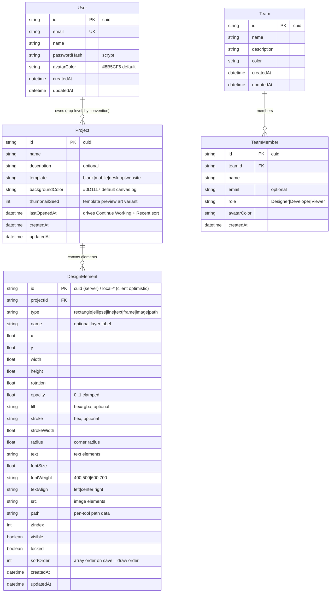

# Digma — Master Project Architecture Document (PAD) v1.14.0

**Classification:** Internal Engineering Reference
**Status:** DEFINITIVE, PRODUCTION-LOCKED BLUEPRINT
**Companion Document:** `README.md` (user-facing), `AGENTS.md` (operator quick-reference), `CLAUDE.md` (agent instructions)
**Last Updated:** 2026-09-29 (v1.14.0 — keyboard-delete locked-contract parity pass: the wall's KEYBOARD seam closed (the Delete/Backspace shortcut filters locked ids out of the selection before `deleteElements` — a row-selected locked element survives the key, and Select All + Delete removes exactly the unlocked members, mirroring the S23-3 `moveElements` guard), while the layer-row TRASH deliberately keeps deleting locked elements (the reference's measured semantics — its locked rectangle's trash removed it while its own keyboard was entirely dead); 74 unit / 79 e2e)
**Audience:** Senior Engineers, Tech Leads, DevOps, and Onboarding Engineers
**Rule:** Every architectural decision in this document traces to a specific rationale. Nothing is here "because it's popular."

This PAD documents the Digma clone codebase — a collaborative design workspace replicating the reference app at `https://digma-371dfd0d.base44.app/` on the Next.js 16 / React 19 / Tailwind 4 / Prisma-SQLite stack. It is the single source of truth for system structure; when code and this document disagree, the code wins and this document must be updated in the same commit.

#### Revision Block — v1.14.0 (Tracked Changes)

Every change is tagged with its source: `[RES]` = validated by web research, `[SR]` = self-review, `[CA]` = critical analysis, `[SYN]` = synthesis, `[SAN]` = sanitization pass, `[AUTH]` = auth alignment.

- `[SR]` **Keyboard-delete locked-contract parity pass (S25-1) — the eleventh audit executed the session-25 next-steps directive: the marquee × wall interaction, the draw-tool paths over locked regions, and the keyboard paths (`Delete` on a locked selection), plus the zoom-cluster step boundaries.**
  1. **The keyboard Delete/Backspace path had no locked guard (S25-1, Medium):** `editor-view.tsx`'s shortcut handler called `store.deleteElements(store.selectedIds)` unconditionally — a row-selected locked element was DELETED by the key (live-verified pre-fix: the locked Glow vanished, 6 → 5 layers), and Select All + Delete removed the locked members too (live-verified: 6 → 0 layers — the `moveElements` S23-3 incoherence repeated in the keyboard seam: the wall blocked canvas drag, resize, and click-through for locked elements, but the keyboard delete seam deleted exactly what the wall protects). Fixed: the shortcut handler filters `store.elements` to the selected-and-unlocked ids and deletes only those (a locked-only selection is a full no-op; a mixed selection deletes exactly its unlocked members; an unlocked selection deletes as before — the surviving locked ids stay selected). **The guard lives in the keyboard seam, NOT in `deleteElements`** — the row trash shares that store action and must keep deleting locked elements at reference parity (R1). Pinned by two new e2e tests (the locked-Delete no-op, the Select-All-Delete-keeps-locked) plus the two boundary pins (the unlocked-Delete control, the trash-on-locked reference-parity pin).
- `[SR]` **Reference-side measurements (live, this session — new parity data):** **(R1)** the reference's row-trash DELETED a locked layer (a real-mouse click on its locked rectangle's trash removed it immediately, 3 → 2 layers — the lock blocks canvas interaction, NOT the explicit row-level management action); **(R2)** the reference's keyboard layer is entirely DEAD (Delete on a row-selected element never removed it — locked OR unlocked, verified with the row highlighted and the "1 selected" badge present; arrow-key nudge equally dead — an unlocked selected element's transform was unchanged after ArrowRight/ArrowDown) — no keyboard parity data exists, so the clone's working keyboard is superset territory that must stay internally coherent; **(R3)** the reference's draw-tool over a locked region WORKS (a Rectangle-tool drag starting on the locked element's footprint created the element on top, 3 → 4 layers — the wall does not block drawing; two earlier "no-op" readings were test artifacts: the drags started in the AI-assistant strip below the canvas wrapper, outside the pointer surface in both apps); the marquee re-confirmed a NO-OP (fourth consecutive session); the mobile nav re-confirmed failure class A; the zoom cluster re-confirmed erratic (five synchronous clicks left the pill unchanged, then an async settle landed a ×1.2-divided step).
- `[SR]` **Verified-correct sweep (no change — parity or the working superset, live-verified):** the draw-tool over locked regions works in the clone (parity with R3 — the draw branch in `canvas.tsx` runs before any hit-test); the marquee excludes locked elements from containment selection (a marquee containing only the locked Glow selected nothing; a marquee containing the Glow + three unlocked elements selected exactly the three); the row-trash on a locked element deletes it in the clone (parity with R1 — the boundary the fix deliberately preserves); the mobile-nav fix holds end-to-end at 390×844 (44×44 trigger, drawer, scroll lock, tap-navigate-and-dismiss, hidden at 768 with the desktop nav flex); the clone's clean synchronous ×1.2 zoom steps remain the working superset over the reference's erratic cluster; the undo/history machinery worked throughout the audit (including a two-step undo restoring an accidental frame drag). None of the reference's dead paths (its keyboard, its marquee) impose keyboard/marquee parity obligations — the clone's working implementations are the documented supersets, now coherent with the wall.
- `[SR]` **Lesson (F22, recorded in digma_SKILL v1.13.0): a reference control being DEAD is not the same as there being no contract.** When the reference cannot exercise a path (its keyboard layer is a no-op on every key), the clone's working superset still needs an internally coherent design — and the coherence criterion comes from the wall metaphor the reference DID measure on the paths it can exercise. Port the blocked-interaction semantics from the measurable paths (the lock-as-wall on drag/click) onto the unmeasurable ones (the keyboard delete), and pin the boundary where the reference measured an EXPLICIT action that ignores the block (the row trash deletes locked elements — the keyboard filter must never leak into that shared seam).
- `[SR]` Eleventh consecutive full parity re-audit — the mobile-nav fix re-verified end-to-end at 390×844 while the reference STILL ships failure class A; the zoom-cluster chrome, the "N selected" badge, and the layer-row action chrome re-verified matching.
- `[SR]` Test counts: 74 unit (unchanged) / 28 smoke (unchanged) / 79 e2e (+4 net-new: the locked-Delete no-op test, the Select-All-Delete-keeps-locked test, the unlocked-Delete control test, the trash-on-locked boundary pin) / 20 build routes. The fast gates re-run green BEFORE the change (baseline: 74 unit) and the full gate AFTER (delivery: 74/28/79). En-route test engineering: the session-25 suite uses CAPTURE-RESTORE-ASSERT (capture the outcome immediately after the key press, restore the canvas with Ctrl+Z + the autosave wait BEFORE asserting, then assert on the captured values) — a RED failure must never leave the shared e2e DB mutated: the first RED run's hard `expect` failed with the deletion already flushed by the autosave during the 10s assertion-retry window, cascading into the next tests' missing prerequisites (the Glow row gone). The capture-restore pattern keeps every test's exit state clean regardless of pass/fail.

#### Revision Block — v1.13.0 (Tracked Changes)

Every change is tagged with its source: `[RES]` = validated by web research, `[SR]` = self-review, `[CA]` = critical analysis, `[SYN]` = synthesis, `[SAN]` = sanitization pass, `[AUTH]` = auth alignment.

- `[SR]` **Locked-element pointer-contract parity pass (S23-1…S23-3) — the tenth audit executed the session-24 next-steps directive: the F19/F20 functional sweep of the drag-move semantics on locked/hidden elements (plus the resize-handle paths at non-default zoom and the marquee's edge behavior).**
  1. **The locked element was a pointer WINDOW, not a wall (S23-1, High):** the canvas click hit-test skipped locked elements (`.find((el) => el.visible && !el.locked && …)`) AND the rendered element carried `pointerEvents: none` — both made the locked element TRANSPARENT to the pointer, so a click/drag fell through to whatever was underneath. Live-verified: with Glow locked, a real drag on Glow's center DISPLACED the Hero Section frame beneath it (+80, +40 — the element the lock was supposed to protect sat still while its neighbor teleported); a click on a locked element OVER another element selected the element beneath and STOLE the current selection. The reference's measured semantics (tenth audit, live on its stacked rectangles — Rectangle 2 locked directly over Rectangle 1): a drag on the pair moved NOTHING (no fall-through), a click on a locked element selected NOTHING, and a click on a locked element that was ROW-SELECTED PRESERVED the selection ("1 selected" — the interaction fully consumed). Fixed: the hit-test now finds the TOPMOST VISIBLE element (locked included) and returns early when it is locked — the wall: no selection change, no deselect, no drag, nothing beneath affected; `pointer-events: none` is DELETED and the locked element renders the reference's measured `cursor-not-allowed` (class + computed cursor). Pinned by three new e2e tests (the drag-wall test, the selection-preserving click test, the cursor test).
  2. **A locked single-selection rendered the 8 resize handles (S23-2, Medium):** the handles block had no lock check, so a row-selected locked element was canvas-RESIZABLE — internally inconsistent with the wall (a locked element that cannot be canvas-dragged cannot be canvas-resized). Fixed: the single-selection outline still renders (the selection stays visible) but the handles render ONLY for an unlocked selection. The reference ships no handles at all (measured twice), so this pins the superset's coherence, not chrome parity. Pinned by a new e2e test (outline present, 0 handles).
  3. **`moveElements` had no locked guard (S23-3, Medium):** the Layers header "Select All" selects every VISIBLE element (locked included), and a subsequent canvas drag of any unlocked selected element moved ALL the ids — locked ones riding along. Fixed: the store's move seam skips locked ids and flips `saveState` only when something actually moved. Pinned by a new e2e test (Select All + drag: the Headline moves, the locked Glow stays).
- `[SR]` **Reference-side wall semantics (measured live, no clone change):** the reference's locked element is a pointer WALL — it intercepts and consumes the interaction (its locked canvas element carries the `cursor-not-allowed` class; a drag on a locked-over-unlocked pair moved nothing; a click on a locked element selected nothing and preserved the current selection). Its marquee re-confirmed a NO-OP; its mobile nav re-confirmed failure class A; its zoom cluster re-confirmed erratic (the persisted stuck state loaded at 10% and recovered step-by-step after a reload).
- `[SR]` **Verified-correct sweep (no change — the working superset, live-verified):** the resize math at non-default zoom is EXACT (at 120% zoom, a 60 screen-px east-handle drag grew the model width by exactly +50px — `toCanvas()`'s zoom division and the model-space arithmetic are correct); the marquee's containment semantics are correct (partial overlap → no selection; full containment → exactly the contained); canvas shift-click add/remove works; hidden elements are gone from the pointer world (a click where a hidden element was selects the element beneath — correct: hidden = gone, unlike locked = wall); row-click selects locked elements in BOTH apps (parity).
- `[SR]` **Lesson (F21, recorded in digma_SKILL v1.12.0): a control that "does nothing on X" can do it two ways — WALL or WINDOW — and the difference is data integrity.** The reference's lock intercepts the interaction (a wall — nothing beneath is affected); the clone's `pointer-events: none` + hit-test skip made the lock transparent (a window — the interaction fell through and displaced the element beneath). When porting a "blocked" interaction, pin what happens to what's UNDER the blocked control, not just the control itself.
- `[SR]` Tenth consecutive full parity re-audit — the mobile-nav fix re-verified end-to-end at 390×844 (44×44 trigger, drawer with all three links, scroll lock, tap-navigate-and-dismiss) while the reference STILL ships failure class A; the zoom-cluster chrome, the "N selected" badge, and the layer-row action chrome re-verified matching.
- `[SR]` Test counts: 74 unit (unchanged) / 28 smoke (unchanged) / 75 e2e (+5 net-new: the locked-wall drag test, the selection-preserving click test, the not-allowed-cursor test, the no-handles-on-locked test, the Select-All-drag-skips-locked test) / 20 build routes. The fast gates re-run green BEFORE the change (baseline: 74 unit) and the full gate AFTER (delivery: 74/28/75). En-route test engineering: the locked-drag tests use real `page.mouse` drags (the canvas listens to pointer events, which Playwright's mouse produces); the `lockGlow` helper is IDEMPOTENT (the lock persists across tests via the autosave replace contract — only click when not already locked); the Select-All test waits for the green "Saved" badge before leaving the page (the session-21 autosave-debounce discipline).

#### Revision Block — v1.12.0 (Tracked Changes)

Every change is tagged with its source: `[RES]` = validated by web research, `[SR]` = self-review, `[CA]` = critical analysis, `[SYN]` = synthesis, `[SAN]` = sanitization pass, `[AUTH]` = auth alignment.

- `[SR]` **Interactive-control functional-quality parity pass (S21-1…S21-3) — the ninth audit executed the session-20 next-steps directive: the F19 functional sweep of the marquee/drag-reorder paths and the properties number inputs' commit semantics (plus the zoom cluster at live zoom levels).**
  1. **The layers drag-reorder was broken three ways (S21-1, High):** (a) the per-row wrapper's `onDragOver` fired AFTER the row's own handler (DOM bubbling: row → wrapper) and OVERWROTE the row's computed insertion index with a crude `after ? elements.length : 0` — every drop therefore resolved to top-or-bottom-of-list (live-verified: dragging Glow onto Accent Bar's row CENTER sent Glow to the TOP of the list instead of one position down); (b) even unclobbered, the row's index math was INVERTED (it stored the target's ELEMENT index in `dragOver` but consumed it with `elements.length - dragOver` as if it were a DISPLAY position — wrong for every non-middle row); (c) the `dragOver` state was never rendered (no drop indicator existed) and the wrapper's `onDrop` called a local no-op that only cleared the dead state — while the row's own `onDrop` read `dragOver` from its render closure, so a fast drag (dragover + drop in the same tick) read stale/null state and silently no-oped (the RED e2e run's exact failure). Fixed: the drop handler now computes the insertion index FROM THE EVENT at drop time — stateless, precise, and immune to both the clobber and the staleness: `remaining = elements minus dragged; targetIndex = remaining.indexOf(target); after ? targetIndex : targetIndex + 1` into `reorderElements` (rows render in REVERSE element order, so "below row X on screen" = X's index in the remaining array). The wrapper's handlers, the local no-op, and the dead state are DELETED. The reference's own drag-reorder is DEAD (rows `draggable="true"` but no reorder ever happens; the SELECTED row renders `draggable="false"` — its dead-drag mechanism), so the clone's now-precise implementation remains the working superset. Pinned by two new e2e tests (lower-half → directly below; upper-half → directly above — dispatched as real HTML5 drags with a real `DataTransfer`).
  2. **The properties NumberField committed an empty draft as 0 (S21-2, High):** `onChange` ran `Number("") → 0 → isFinite → commit` — clearing the X input to type a fresh number instantly teleported the element to x=0 (live-verified: `translate(120px, 80px)` → `translate(0px, 80px)`), and every intermediate keystroke ("1", "15", "150") pushed its own undo snapshot + autosave flip. The reference's own inputs are display-only NO-OPS (verified on every path: typing, blur, Enter, ArrowUp spinner — its element never moved), so the clone's input is the working superset — but the empty/intermediate states were the F19 "half-working" pattern corrupting the edit. Fixed: an empty draft never commits (mid-edit, not a request for 0); a non-empty finite draft still commits live (the responsive superset); blurring an empty/unparseable draft RESTORES the element's current value (the input never dead-ends empty). Pinned by a new e2e test (clear → transform unchanged; type → commits; clear + blur → restored).
  3. **The Canvas Properties hex input rendered `aria-label="undefined hex"` (S21-3, Low):** the template literal `` `${label} hex` `` lacked the `?? "Color"` fallback its sibling swatch input has. Fixed to the same fallback; pinned by a new e2e test (the accessible name is "Color hex", never "undefined hex").
- `[SR]` **Reference-side functional-sweep results (no clone change — its own bug class, documented):** the reference's marquee selection is a NO-OP (a full-canvas drag covering all three stacked shapes produced no rect, no counter, no selection — verified with real mouse events); its properties number inputs are no-ops (above); its zoom cluster is erratic (measured click-by-click: zoom-in 100→120% then dead; one zoom-out click jumped to 500% `matrix(5,…)`; an async settle to a fit-to-view 32%; zoom-in then INVERTED (32→16%); both buttons dead after; the 16% state persists across reloads); its selection ring carries NO paint (the `ring-2 ring-blue-500 ring-offset-1` classes are overridden by the element's serialized inline `box-shadow: none`) and it renders NO resize handles — selection is visible only via the row bg + the "N selected" badge. The clone's marquee (verified live: exactly the contained elements selected, dashed rect rendered), clean multiplicative zoom, visible ring + 8 handles are the working supersets — all unchanged.
- `[SR]` **Lesson (F20, recorded in digma_SKILL v1.11.0): state-dependent drop handlers are a two-front bug.** The drag-reorder's `dragOver` state could be clobbered by a later-bubbling handler AND read stale from the render closure (a same-tick dragover+drop reads the OLD value or null — the RED run's silent no-op). Compute insertion indices from the EVENT at drop time. Corollary: `Number("") === 0` is a commit trap in every controlled number input — an empty field is MID-EDIT, never a request for 0.
- `[SR]` Ninth consecutive full parity re-audit — the mobile-nav fix re-verified end-to-end at 390×844 (44×44 trigger, drawer with all three links, scroll lock, tap-navigate-and-dismiss, hidden at 768 with the desktop nav `flex`) while the reference STILL ships failure class A (nav `display:none`, no hamburger, the 36×36 bell only); zoom-cluster chrome re-pinned (identical pill/button class strings in both DOMs); the "N selected" badge, the selected row `bg-blue-600 text-white`, the five properties sections, the swatch/hex chrome — all re-verified matching; the clone's marquee verified working.
- `[SR]` Test counts: 74 unit (unchanged) / 28 smoke (unchanged) / 70 e2e (+4 net-new: the two drag-reorder precision tests, the empty-draft test, the hex accessible-name test) / 20 build routes. The fast gates re-run green BEFORE the change (baseline: 74 unit) and the full gate AFTER (delivery: 74/28/70). En-route test engineering: the drag tests dispatch real HTML5 drag events with a real `DataTransfer` via `page.evaluate` (the drop-time computation needs NO prior state, so a same-tick dispatch is faithful), and each drag test WAITS FOR THE AUTOSAVE's green "Saved" badge before leaving the page (the autosave is 800ms-debounced and its cleanup DISCARDS a pending flush — without the wait, the next test's re-open would load the un-mutated order).

#### Revision Block — v1.11.0 (Tracked Changes)

Every change is tagged with its source: `[RES]` = validated by web research, `[SR]` = self-review, `[CA]` = critical analysis, `[SYN]` = synthesis, `[SAN]` = sanitization pass, `[AUTH]` = auth alignment.

- `[SR]` **Layer-row functional-semantics parity pass (S19-1…S19-4) — the eighth audit swept the reference's eye/lock FUNCTIONALLY (the session-18 next-steps directive), and the clone's own eye was the headline find.**
  1. **The canvas rendered hidden elements (S19-3, High):** the clone's eye toggle LOOKED complete (the row icon swaps eye ↔ eye-off; the hit-test, marquee, presentation, and thumbnail layers all honor `element.visible`) — but `canvas.tsx` mapped ALL elements, so after "Hide layer" the row said hidden while the canvas still painted the element (verified live: `display: block; visibility: visible`). Fixed: the map filters `el.visible` — every consumer of the flag now agrees. The reference's own eye is a NO-OP (verified live TWICE: its icon never flips and its canvas never changes — its no-op class, like Create Team/ellipsis); the clone keeps the WORKING SUPERSET (the documented convention for reference bugs), now coherent end-to-end. Pinned by a new e2e test (hide → the named element leaves the canvas DOM, count N→N−1, row stays; show → it returns).
  2. **Rename-input chrome re-measured (S19-1, Medium):** double-clicking a layer row name in the reference swaps in an input carrying the shadcn-Input base plus editor overrides — `flex w-full rounded-md border py-1 shadow-sm transition-colors … md:text-sm text-sm bg-[#0d1117] border-[#30363d] text-white h-6 px-2` (rounded-md, a VISIBLE border, h-6 px-2 py-1, shadow-sm, focus ring only on focus-visible). The clone shipped `rounded px-1 ring-1 ring-blue-500` — an always-on blue ring, no border, wrong rounding/padding/height. Fixed to the measured set; pinned by a new e2e test (class pins + the rename round-trip + Escape-cancel).
  3. **Lock semantics are OPACITY-based (S19-2, Medium):** measured live on three reference rows (one locked via a real click): the reference renders the SAME `lucide lucide-lock w-3 h-3` icon in both states, the svg's class flipping `opacity-50` (unlocked) ↔ `opacity-100` (locked) — a class flip, not an icon swap. The reference's lock is FUNCTIONAL (its locked canvas element gains `cursor-not-allowed` + inline `cursor: default`); the clone's `pointer-events: none` canvas approach is the observably equivalent working implementation (no canvas change). Fixed: the two hand-inlined padlock SVGs replaced by a single lucide-react `Lock` with the measured opacity classes; pinned by a new e2e test (same icon, the flip, both directions).
  4. **Icons are lucide-react components (S19-4, Low):** the reference's row buttons carry `lucide lucide-eye w-3 h-3` (component-generated); the clone hand-inlined the eye/eye-off/lock SVGs. Refactored to lucide-react (the trash already was) — DOM parity + simpler rows.
- `[SR]` **Lesson (F19, recorded in digma_SKILL v1.10.0): audit FUNCTIONAL semantics, not just chrome.** A control can look complete and do half its job — the eye toggle's icon swap was convincing enough that seven chrome-level audits never traced the data path to its canvas consequence. For every interactive control, click it and verify the OBSERVABLE outcome on BOTH apps; that sweep is also what distinguishes "the reference can't do X" (superset territory — its no-op eye) from "the clone half-does X" (bug territory — the unfiltered canvas).
- `[SR]` Eighth consecutive full parity re-audit — the mobile-nav fix re-verified end-to-end at 390×844 (44×44 trigger, drawer, scroll lock, tap-navigate-and-dismiss, Escape close, hidden at 768) while the reference STILL ships failure class A (nav `display:none`, no hamburger, the 36×36 bell only); the reference's AI crash re-confirmed (the `charAt` TypeError from its assets in the console); page-level chrome spot-checked (nav pill exact-match, Teams flat + blue Create Team, Recent sort/toggles/count badge); Tailwind v4 health on the clone (no legacy config, zero @apply, Inter on body, console clean).
- `[SR]` Test counts: 74 unit (unchanged) / 28 smoke (unchanged) / 66 e2e (+3 net-new: the eye-hide canvas test, the rename-chrome test, the lock-opacity test) / 20 build routes. The fast gates re-run green BEFORE the change (baseline: 74 unit) and the full gate AFTER (delivery: 74/28/66). En-route test engineering: the eye test identifies its target by NAME (rows render in reverse order — DOM position ≠ row position), and the rename test's negative class checks anchor at class-list boundaries so `focus-visible:ring-1` (legitimate) never trips the "no always-on ring" assertion.

#### Revision Block — v1.10.0 (Tracked Changes)

Every change is tagged with its source: `[RES]` = validated by web research, `[SR]` = self-review, `[CA]` = critical analysis, `[SYN]` = synthesis, `[SAN]` = sanitization pass, `[AUTH]` = auth alignment.

- `[SR]` **Layer-row-interior parity pass (S17-1…S17-3) — the seventh audit went INSIDE the layers-panel rows (the session-16 next-steps directive), and the reference's third row action was the headline find.**
  1. **Layer-row trash button (S17-1, High):** the reference renders THREE hover actions per layer row — eye, lock, and a red delete button (`p-1 hover:bg-red-500/20 rounded transition-colors opacity-0 group-hover:opacity-100 text-red-400` carrying `lucide-trash2 w-3 h-3`). The trash is FUNCTIONAL in the reference: a live click deleted its layer immediately (counter "1 layer• 1 selected" → "0 layers"; no confirm dialog). The clone shipped only eye + lock — a missing interactive control, not a styling gap. Fixed: the third action added to `layers-panel.tsx`, wired to the EXISTING store action `deleteElements([el.id])` (which pushes the undo snapshot, clears selection, flips saveState — the autosave replace contract persists the removal). Immediate delete (reference parity) + undo recovery (clone superset, Ctrl+Z 60-deep history). Pinned by a new e2e test (three actions per row, the red classes, the icon, the count decrease, the counter update).
  2. **Corner-radius slider max REVERTED to 75 (S17-2):** session 16's S15-4 recorded `aria-valuemax="50"` from a single reading and shipped 75→50 as a "fix" — a misread that moved the clone AWAY from parity (sessions 1–5 had measured 75; the reading was the outlier). Session 17 re-measured TWICE on fresh page loads with freshly drawn elements: `aria-valuemin="0" aria-valuemax="75"` both times. The slider + clamp reverted to 75; the e2e pin rewritten (with the reversal recorded in its comment); the four docs corrected (this PAD, AGENTS, CLAUDE, README — all had recorded "0–50, the reference's measured aria-valuemax, v1.9.0").
  3. **Docs re-aligned (S17-3):** the layers-panel facts gain the trash row action; the radius facts go back to 0–75 with the reversal note; counts 62→63 e2e.
- `[SR]` **Lesson (F18, recorded in digma_SKILL v1.9.0): a measurement that REVERSES a previously-verified fact needs DOUBLE-measurement on fresh state before it ships.** Session 16's radius "50" flipped a correct value (75, verified by five earlier sessions) and shipped a regression dressed as a fix; the e2e pin — written from the same misread — then actively defended the wrong value. The reversal-of-a-reversal was only caught because the session-16 next-steps directive pointed the next audit back at the panel interior. Positive parity claims inherit the F16 rigor: measure twice on fresh state, and when your new reading contradicts N prior sessions, the burden of proof is on the new reading.
- `[SR]` Seventh consecutive full parity re-audit — the previously-unaudited interiors went under the DOM: the Recent sort control (calendar icon + native select + the same four options + identical classes — match), the view toggles (40×40 near-black/white — match), the count badge + search wrapper (match), the layers panel end-to-end (header, counter incl. the `text-blue-400 ml-2` selected suffix, reverse ordering, empty state — all match; the trash row action was the one gap), the per-corner number inputs (`grid grid-cols-2 gap-3`, labels, `mt-1 h-8` input classes — match), the Teams empty state (match), the nav pill exact-match scope on /Dashboard (match), the mobile-nav fix end-to-end at 390×844 while the reference STILL ships failure class A (nav `display:none`, no hamburger, the 36×36 bell only), and the reference's AI crash re-confirmed (blank screen after submission). VLM cross-checks confirmed the post-fix layer rows match the reference visually (both show eye/lock/red-trash in hover).
- `[SR]` Test counts: 74 unit (unchanged) / 28 smoke (unchanged) / 63 e2e (+1 net-new: the layer-row trash test; the radius pin is a REWRITE, not net-new) / 20 build routes. The full gate re-run green BEFORE the change (baseline: 74/28/62) and AFTER (delivery: 74/28/63). En-route test engineering: the new `aria-label="Delete layer …"` buttons collide with the old substring `getByRole` locators ("Layer Headline" matched the row AND its trash) — the row-click locators now use `exact: true`; the untitled-editor spec's `/Rectangle 1/` regex similarly scoped to the exact row label.

#### Revision Block — v1.9.0 (Tracked Changes)

Every change is tagged with its source: `[RES]` = validated by web research, `[SR]` = self-review, `[CA]` = critical analysis, `[SYN]` = synthesis, `[SAN]` = sanitization pass, `[AUTH]` = auth alignment.

- `[SR]` **Dialog-and-panel-interior parity pass (S15-1…S15-7) — the sixth audit went INSIDE the dialogs and panel interiors, and that is where all the code findings lived.** Measured in both DOMs (with SVG-path evidence for the icon set):
  1. **Create-dialog template icons (S15-1, High):** the reference renders a distinct lucide icon per card — `file-text` (Blank Canvas), `smartphone` (Mobile App), `monitor` (Desktop App), `globe` (Website) — `w-3 h-3 sm:w-4 sm:h-4 text-purple-600 flex-shrink-0`, NO selected/unselected opacity variation; the clone shipped `Plus` on all four (dimmed to opacity-40 when unselected). Fixed with a `TEMPLATE_ICONS` map; pinned by e2e (per-card icon class + opacity 1 + no `lucide-plus`).
  2. **Color-swatch check glyph (S15-2):** the reference's selected preset renders a lucide `Check` SVG (`w-4 h-4 sm:w-5 sm:h-5`, white); the clone shipped a `✓` text glyph at text-xs. Fixed; pinned by e2e.
  3. **Submit-button icon (S15-7):** the reference's Create Project button is text-only; the clone prepended a `Plus`. Fixed; pinned by e2e.
  4. **Properties-panel sliders (S15-3):** the reference's five slider rows are Radix sliders measured at DOM level — a 6px `rounded-full` track of `rgba(23,23,23,0.2)` with a solid `#171717` fill, and a 16px white thumb with a `1px solid rgba(23,23,23,0.5)` border. The clone shipped native `accent-blue-600` range inputs (blue platform thumbs — VLM-confirmed visible difference on zoom crops). Fixed via the `.editor-range` class in `globals.css` (webkit + moz pseudo-elements, the fill length driven by a `--range-fill` custom property each input sets): the reference's LOOK on native input semantics (zero dependencies, keyboard/screen-reader free). Pinned by a new unit CSS contract (`tests/theme.test.ts`) + e2e class pins.
  5. **Corner-radius slider max (S15-4):** the reference caps at 50 (`aria-valuemax="50"`); the clone shipped 75. Fixed (slider + clamp 0–50); pinned by e2e. The docs' "slider 0–75" claims corrected everywhere.
  6. **Fill & Stroke mode pills (S15-5):** the reference renders a SEGMENTED CONTROL — an `h-9 items-center justify-center rounded-lg p-1 grid w-full grid-cols-3 bg-[#30363d]` tablist track with the active segment painted white (`bg-background`/`text-foreground` + shadow in its class list). The clone shipped three separate `rounded-md` buttons with a `bg-blue-600` active. Fixed to the segmented track (active `bg-white text-gray-900 shadow`); behavior unchanged — Gradient/Image taps keep the scope-cut toast (the reference's own tabs are verified no-ops: `data-state` stays inactive on click). Pinned by e2e (track classes + pixel-read white active).
  7. **Stroke-width control (S15-6) + row structures:** the reference's Stroke Width is a slider row (label + slider 0–20 + `w-8` numeric readout); the clone shipped a plain number input. Fixed to `SliderRow`. The Rotation row gains the reference's `°` suffix after its `w-16` number input; the Opacity row restructured to the reference's shape — NO label (the h4 IS the label), `flex items-center gap-3`, slider + `w-16` editable number input + `%` suffix (the old row carried a label + a `w-8` "100%" readout). All pinned by e2e.
- `[SR]` **Lesson (F17, recorded in digma_SKILL v1.8.0): dialogs and panel interiors deserve the same DOM-level audit depth as pages.** Five consecutive page-level audits graded the create-dialog and the properties panel by their shells; this session's dialog-interior audit found seven measurable gaps in one pass. Zoom-crop forensics + SVG-path extraction beat full-page VLM reads for small controls (the VLM read the 16px per-card icons as "plus signs" on both apps — the DOM was the ground truth).
- `[SR]` Sixth consecutive full parity re-audit — page-level chrome all green (nav-pill exact-match on four routes; the mobile-nav fix end-to-end at 390×844 while the reference STILL ships failure class A; the AI suggestions line + no-crash contract re-verified live; auth 3 states; F16 re-verification of the login negative pins — nothing below the card, no demo hint, chip unchanged; dashboard/recent/teams chrome; editor chrome incl. panel chips ON/OFF/ON). The reference's no-ops re-confirmed (Create Team, card ellipsis, Explore Templates, Gradient/Image tabs) — the clone's working equivalents remain deliberate documented supersets. VLM false alarms dismissed via DOM (data-content deltas, the lucide-image "frame" misread, the dev-only Next.js overlay).
- `[SR]` Test counts: 74 unit (+2: the slider CSS contract) / 28 smoke (unchanged) / 62 e2e (+8: 3 create-dialog parity pins + 5 properties-panel chrome pins) / 20 build routes. The full gate re-run green BEFORE the change (baseline: 72/28/54) and AFTER (delivery: 74/28/62).

#### Revision Block — v1.8.0 (Tracked Changes)

Every change is tagged with its source: `[RES]` = validated by web research, `[SR]` = self-review, `[CA]` = critical analysis, `[SYN]` = synthesis, `[SAN]` = sanitization pass, `[AUTH]` = auth alignment.

- `[SR]` **Session-8's "no suggestions line" reading REVERSED — the reference's AI Assistant panel DOES render a `Try:` hint line under its input.** Measured settled this session (DOM, two editor states): the input area is a `p-3 border-t border-[#30363d]` WRAPPER div holding the `flex gap-2` form AND a `mt-1 text-xs text-gray-500` div reading `Try: "Add 3 colored circles", "Make selected elements red", "Create a login form"`. Session 8's R8 fix restructured the clone's input correctly (separate blue send button) but dropped the clone's own suggestions line, recording "no suggestions line" as the reference fact — a misread: the reference's session-10/12 audit screenshots show the line, and `digma_SKILL.md` §6 had continued to document it (the code drifted from the project's own reference doc). This mirrors the session-10 R2 reversal. Fixed: the component restructured to the measured wrapper/form/sibling DOM with the restored `SUGGESTIONS` constant; the wrong e2e pin (`toHaveCount(0)`) was rewritten to assert presence, classes, text, and position (a rewrite — the 54-test count is unchanged). The line renders in the INITIAL state only (no user message yet): the reference's post-send DOM is unmeasurable (its assistant crashes on submission), so the clone's post-send behavior is its own design and stays unpinned. **Lesson recorded: a negative parity claim ("the reference has no X") needs the same re-measurement rigor as a positive one — this one survived six sessions un-checked.**
- `[SR]` Fifth consecutive live parity re-audit (all green, no change): nav-pill exact-match scope re-confirmed on four routes; the mobile-navigation fix verified end-to-end at 390×844 (44×44 trigger, drawer, scroll lock, tap-navigate-and-dismiss) while the reference STILL ships Tailwind v4 failure class A; editor chrome (9-tool rail, zoom cluster, top bar, layers, canvas grid), auth 3 states, dashboard/recent/teams chrome, login chip + glow, header avatar, search inputs — all match; the reference's brand-asset URL is unchanged from session 12 (pixel-verified then); Tailwind v4 health clean (no legacy config, no `@apply`, literal tokens); clone pages console-clean (the `cdn.tailwindcss.com` warning seen in the shared browser log comes from the REFERENCE pages — the reference still ships the Tailwind CDN in production). VLM false alarms disproven via DOM ("7 icons" tool-rail flag — all 9 present).
- `[SR]` Test counts unchanged: 72 unit / 28 smoke / 54 e2e / 20 build routes — the full gate re-run green BEFORE the change (baseline) and AFTER (delivery).

#### Revision Block — v1.7.0 (Tracked Changes)

Every change is tagged with its source: `[RES]` = validated by web research, `[SR]` = self-review, `[CA]` = critical analysis, `[SYN]` = synthesis, `[SAN]` = sanitization pass, `[AUTH]` = auth alignment.

- `[SR]` **Session-10 pill pin SCOPE-CORRECTED — the reference's nav active-state is an EXACT pathname match.** Session 10 restored the pill (correct) but over-scoped it to the root `/` (wrong): the reference's Dashboard link href is `/Dashboard`, and at `/` NO link is highlighted. Re-measured settled (5–10 s) on FOUR reference routes: at `/` all three links render `text-gray-600 hover:…` with no `aria-current`; at `/Dashboard`, `/Recent`, `/Teams` the current route's link carries `bg-purple-50 text-purple-700`. The clone's `isNavActive()` root special case (`|| pathname === "/"`) was removed — exact match now; pinned by `tests/e2e/parity.spec.ts` as a THREE-state pin (no pill at `/`, pill on `/Dashboard`, pill on `/Teams`). **Lesson recorded: when pinning a parity fact, pin its ROUTE SCOPE too — the session-10 pill was correct but over-scoped to `/`.**
- `[SR]` **middleware → proxy migration (Next 16.3 convention):** `src/middleware.ts` → `src/proxy.ts`, export `middleware` → `proxy` (same API, same `config.matcher` contract); the dev server no longer prints the deprecation notice. The ADR-008 redirects (legacy lowercase → canonical 307s, query preserved) are unchanged. Method: a NEW characterization pin (`tests/e2e/workspace.spec.ts` "legacy lowercase routes 307-redirect to the canonical capitalized routes" — all four paths + query survival) was written and passed against the OLD middleware FIRST, closing the pinning gap that had deferred this migration in §10, then the rename landed and the pin stayed green.
- `[SR]` Test-count refresh: 72 unit checks (unchanged), 54 Playwright checks (+1: the legacy-redirect characterization pin), 28 smoke, 20 build routes. The full gate (`lint → typecheck → 72 unit → build → 28 smoke → 54 e2e`) is green at v1.7.0.
- `[SR]` Docs numeric realignment (all verified against the tree): §7.1 parity row 7 → 9 and the missing brand-mark row (6 checks) added; workspace row 8 → 9; §9.2 "unit tests (62)" → 72; §4.3/§9.1 seed counts corrected to the actual `prisma/seed.ts` (2 projects, 1 team with 3 members — §3.2 was already right); §11 line counts refreshed; `next.config.ts`'s "ADR-007 (inherited)" mis-attribution for `outputFileTracingRoot` corrected (ADR-007 is the toast-store ADR).
- `[SR]` **Reference brand asset re-host verified:** the reference moved its logo to a new Supabase URL (the old one 404s; new `…082348336_782025-1820.jpeg`, same 651×470 art). Downloaded and pixel-verified: all six shape hexes + the `#0d1017` field + the purple–cyan gap match the session-10 decode exactly — the clone's recreated inline-SVG mark remains pixel-correct; no change.

#### Revision Block — v1.6.0 (Tracked Changes)

Every change is tagged with its source: `[RES]` = validated by web research, `[SR]` = self-review, `[CA]` = critical analysis, `[SYN]` = synthesis, `[SAN]` = sanitization pass, `[AUTH]` = auth alignment.

- `[SR]` **Session-8 R2 REVERSED — the desktop nav active pill is reference parity.** Session 8 recorded "the reference ships NO per-route active pill" from what was actually a PRE-HYDRATION DOM read: the reference is a Base44 SPA whose SSR shell ships bare `<a>` tags with no classes, and client hydration applies the full class set only after first paint. Re-measured post-hydration on /Dashboard, /Recent and /Teams (session 10): the current route's link carries `bg-purple-50 text-purple-700` (no hover classes on the active variant; the others stay `text-gray-600 hover:bg-gray-50 hover:text-gray-900`). Pixel forensics on a settled screenshot confirmed (181 purple-700 text + 3,910 lavender pill pixels; the immediate post-load capture has zero). The clone's pill was restored in `src/components/app-header.tsx` (mirroring the MobileNav pattern in the same file) and is pinned on TWO routes by `tests/e2e/parity.spec.ts`. **Measurement lesson recorded: parity assertions on SPAs must be taken post-hydration — screenshots captured immediately after navigation can silently record a pre-hydration UI.**
- `[SR]` **Brand-mark recreation (logo.tsx + public/logo.svg):** the reference's logo — header img (32×32, `object-fit: fill`, no rounding) and login chip (96×96, `object-fit: cover` in the `rounded-full ring-4 shadow-lg` container) — is an abstract mark on a near-black field, pixel-decoded and redrawn as inline SVG: field `#0d1017`; three rows of split-pill D-shapes — red `#f33559` + orange `#f4a24c` (top), purple `#b03af2` + cyan CIRCLE `#4cb6f2` offset right with the black gap as part of the mark (middle), green `#20bc72` + blue `#325ddd` (bottom). `LogoMark` renders both reference modes: the square center-crop (default — the chip) and `stretch` (the full 651×470 frame squeezed via `preserveAspectRatio="none"` — the header). The login chip's blue→purple gradient backing was removed (the mark's own black field is the surface); the v1 substitute mark (slate square + 2×2 grid) is gone. `tests/brand-mark.test.ts` (6 checks) pins the source contract.
- `[SR]` **Login footer parity:** the clone's "Digma — design workspace" link below the auth card had no counterpart on the reference (measured: zero text nodes below the card rect). Removed.
- `[SR]` Test-count refresh: 72 unit checks (+6: the brand-mark contract), 53 Playwright checks (+2 net: the nav pill pinned ON (replacing the reversed no-pill pin) + the nothing-below-card and chip-mark checks), 28 smoke, 20 build routes. The full gate (`lint → typecheck → 72 unit → build → 28 smoke → 53 e2e`) is green at v1.6.0.
- `[SR]` Known-issues: Next 16.3.6 deprecation warning recorded (the `middleware` file convention → `proxy`); still fully functional, migration deferred (see §10).

#### Revision Block — v1.5.0 (Tracked Changes)

Every change is tagged with its source: `[RES]` = validated by web research, `[SR]` = self-review, `[CA]` = critical analysis, `[SYN]` = synthesis, `[SAN]` = sanitization pass, `[AUTH]` = auth alignment.

- `[SR]` **The font bug (ADR-004a)**: `--font-sans: var(--font-inter), …` inside the plain `@theme` SURVIVED the Tailwind v4 build (it landed in `:root`) but broke at runtime — next/font scopes `--font-inter` to a class on `<body>`, and CSS custom properties resolve `var()` references at computed-value time PER ELEMENT, so at `:root` the chain computed to *guaranteed-invalid*; `html { font-family: var(--font-sans) }` fell back to the UA serif default and every descendant inherited the broken value. The ENTIRE app (dev AND the shipped production build) rendered "Times New Roman" and Inter never loaded — since session 1, unnoticed across six sessions of screenshot reviews. Fixed with literal font names (`"Inter", "Inter Fallback", ui-sans-serif, …` — @font-face families are document-global); `tests/theme.test.ts` pins the rule (literal `Inter`, no `var(` anywhere in `--font-sans`, no var() in color tokens, no legacy config).
- `[SR]` **Reference-palette pins (ADR-004a)**: the reference app ships the Tailwind v3 palette via CDN; Tailwind v4's default palette is oklch-tuned and renders visibly different (v4 blue-600 = `#155DFC` vs the reference's `#2563EB`; v4 purple-600 = `#8200DB` vs `#9333EA`; grays shift cooler). Every palette scale the app consumes (blue/green/purple/pink/red/amber/yellow/orange/gray/slate) is now pinned to the v3 hex in the `@theme` "reference-palette pins" block. Consequence for tests: computed styles return `lab()`/`oklch()` function strings in v4 — color assertions must read PAINTED PIXELS (canvas `getImageData`), which the parity suite does.
- `[SR]` Session-8 parity pass (measured live on the reference, all fixed + pinned by `tests/e2e/parity.spec.ts`): the desktop nav has NO active-state pill (the clone's purple `bg-purple-50 text-purple-700` was removed; `aria-current` stays for a11y); the active Dashboard view toggle is the reference's near-black `#171717` (not purple) — and /Recent's toggle group is a BARE `flex gap-2` row of `w-10 h-10` default/outline buttons (no gray container); the Teams page main carries NO gradient wash and its Create Team buttons are solid `bg-blue-600` (measured `#2563EB`); the Teams/Recent subtitles are `text-gray-500 mt-1` at the default size; the Teams empty state is a plain `text-gray-300` Users glyph (no gradient circle) on `py-16`; the editor zoom controls are lucide `ZoomIn`/`ZoomOut` magnifier icons (in-first order); the AI assistant panel follows the reference chrome (h-80 column with border-t on the wrapper, blue `Bot` header glyph + purple `WandSparkles` trailer on a border-b p-3 row, per-message gradient bot-avatar chips, `max-w-[80%]` `p-2 rounded-lg` bubbles with the timestamp BELOW as a sibling, an h-8 input + separate blue send button in a `flex gap-2` form, no suggestions line); the login card no longer carries the demo-account hint (creds stay in README/AGENTS).
- `[SR]` Mobile-nav re-verification: the reference STILL ships no mobile nav (nav `display:none` at 390×844, no hamburger — failure class A); the clone's hamburger + Sheet drawer verified end-to-end (44×44 trigger, drawer opens, link taps navigate AND dismiss).
- `[SR]` Test-count refresh: 66 unit checks (+4: the `@theme` contract), 51 Playwright checks (+7: the parity suite), 28 smoke, 20 build routes. The full gate (`lint → typecheck → 66 unit → build → 28 smoke → 51 e2e`) is green at v1.5.0.

#### Revision Block — v1.4.0 (Tracked Changes)

Every change is tagged with its source: `[RES]` = validated by web research, `[SR]` = self-review, `[CA]` = critical analysis, `[SYN]` = synthesis, `[SAN]` = sanitization pass, `[AUTH]` = auth alignment.

- `[SR]` Auth-card state parity (ADR-013): a live DOM audit of the reference's `/login` in sign-up and forgot states found the card RESTRUCTURES per mode — sign-up swaps the branded card (logo chip + social buttons + "or" divider + h1) for a minimal one: "Back to sign in" link (arrow-left icon), h2 "Create your account", Email, Password (`placeholder="Min. 8 characters"`), **Confirm Password** (`placeholder="Re-enter password"`) with inline "Passwords do not match" validation (`text-red-700 text-sm` alert), and NO name field; forgot renders "Reset your password" + "Enter your email and we'll send you a link to reset your password" + email-only. The bottom "Forgot password?/Need an account?" toggles render only in sign-in mode. The clone previously kept the full branded card and its own Name field in every mode.
- `[SR]` Recent/Dashboard search-input alignment: the reference's file search inputs are `h-9` `rounded-md` with the icon at `left-3`/`pl-9` and wrapper `md:w-80` (Recent) / `lg:w-64` (dashboard) — the clone's `h-10`/`rounded-lg`/`lg:w-64` (Recent) variants aligned to the measured classes.
- `[SR]` Audit also re-confirmed the mobile-navigation state: the reference STILL ships no mobile nav (nav `hidden md:flex` → `display:none` at 390×844, no hamburger — the Tailwind v4 class-A failure), and its Teams "Create Team" buttons are no-ops (no dialog, no error) while the clone's create flow works — the documented superset. Synthetic CDP mouse events don't trigger React pointer handlers on either app (draw flows stay pinned by Playwright's native mouse API).
- `[SR]` Test-count refresh: 44 Playwright checks (auth-card state structure +5: minimal signup card, Confirm Password/placeholders/no-Name, inline mismatch validation, back-link round-trip, forgot state).

#### Revision Block — v1.3.0 (Tracked Changes)

Every change is tagged with its source: `[RES]` = validated by web research, `[SR]` = self-review, `[CA]` = critical analysis, `[SYN]` = synthesis, `[SAN]` = sanitization pass, `[AUTH]` = auth alignment.

- `[SR]` Per-element Scale (ADR-012): a fresh live DOM audit decoded the reference's Transform section — Rotation pairs its slider with a `w-16` number input, and a second **Scale** slider (0.1–3.0, step 0.1, "1.0x" readout) persists per element and renders in the transform chain `translate(x,y) scale(s) rotate(r)` (verified surviving reload on the reference). Implemented across the whole stack: `DesignElement.scale` (schema column, DTO, defaults), API clamps (0.05–20), canvas/present/thumbnail render chains, scale-aware `boundsOf()` visual bounds (selection outline, marquee, fit-to-view, thumbnails in one seam), and visual-space resize math (pointer deltas divided by scale on write-back).
- `[SR]` Panel chips now render only where their panels can: the chip bar is `hidden md:flex` and the Properties chip `hidden lg:inline-block` (its panel is `lg:flex`). Before, the chips flipped `aria-pressed` below md with no visible effect — dead controls that lie about state.
- `[SR]` AI no-crash regression pin: the reference app itself CRASHES on AI submission (reproduced live 2026-09-27: `TypeError: Cannot read properties of undefined (reading 'charAt')`, React root unmounts, blank page — plus a `cdn.tailwindcss.com` production warning). `tests/e2e/workspace.spec.ts` now pins that a submitted command must answer, mutate the canvas, and leave the clone's page fully interactive.
- `[SR]` Test-count refresh: 62 unit checks (editor +4: scale default, transform chain, scale-aware bounds), 39 Playwright checks (+6: rotation number input, scale slider contract, scale persistence, chips hidden at 390, Properties chip waits for lg, AI no-crash).

#### Revision Block — v1.2.0 (Tracked Changes)

Every change is tagged with its source: `[RES]` = validated by web research, `[SR]` = self-review, `[CA]` = critical analysis, `[SYN]` = synthesis, `[SAN]` = sanitization pass, `[AUTH]` = auth alignment.

- `[SR]` Panel-toggle chips (ADR-010): the bottom-left editor chips are now INDEPENDENT panel visibility toggles (Layers / a second Components w-60 column / the right Properties panel; default ON/OFF/ON), measured and decoded from the reference DOM — the v1.1.0 decorative tab bar was a misread of the reference's behavior. New `components-panel.tsx`; `tests/e2e/editor-panels.spec.ts` (7 checks) pins it.
- `[SR]` Properties panel restructured to the reference layout: fixed header block (h3 `text-sm font-medium text-white`), scrollable `p-4 space-y-6` body, iconed h4 sections — Position & Size, Corner Radius (slider 0–75 + linked per-corner inputs; the reference's `aria-valuemax` is 75 — session 16's single "50" reading was a misread, reversed by the session-17 double-measure), Fill & Stroke (segmented Solid/Gradient/Image pills on a `bg-[#30363d]` track, the active segment white + swatch/hex rows + a Stroke Width slider 0–20), Transform (rotation slider −180…180 + `w-16` number input + `°` suffix), Opacity (slider + `w-16` number input + `%` suffix, no row label) — and Canvas Properties reduced to the reference's single Background Color row (the preset grid was not on the reference's properties panel; presets live on the Create-Project dialog only). The five sliders render the reference's Radix look on native inputs via the `.editor-range` class (6px rounded track + 16px white thumb; `tests/theme.test.ts` pins the CSS contract). No Delete button in the panel (reference parity).
- `[SR]` Layers header button now toggles Select All / Deselect All with the reference's exact semantics (`selectedIds.length === elements.length`, incl. the 0/0 quirk); new `selectAll()` store action.
- `[SR]` Dependency hygiene: dead legacy `tailwindcss-animate` removed (unused — Tailwind 4 CSS-first imports `tw-animate-css` in CSS); `package-lock.json` deleted (bun.lock is canonical; closes the dual-lockfile known issue).
- `[SR]` Test-count refresh: 33 Playwright checks (editor-panels +7); docs realigned (README route tree casing, NEXT_PUBLIC_SITE_URL row removed).

#### Revision Block — v1.1.0 (Tracked Changes)

Every change is tagged with its source: `[RES]` = validated by web research, `[SR]` = self-review, `[CA]` = critical analysis, `[SYN]` = synthesis, `[SAN]` = sanitization pass, `[AUTH]` = auth alignment.

- `[SR]` Route-casing parity (ADR-008): routes renamed to the reference app's capitalized spellings (/Dashboard, /Recent, /Teams, /Editor?projectId=; root / and /login stay lowercase); legacy lowercase URLs 307 via src/middleware.ts after discovering Next 16 redirect-source matching is case-insensitive (per-rule caseSensitive is not honored — observed self-loop).
- `[SR]` Untitled editor (ADR-009): unknown/missing projectId now opens a working "Untitled" editor whose first save creates the project (POST /api/projects + attachProject + history.replaceState). Audited the live app: its own unknown-id editor silently saves into the most-recent project — a data bug deliberately NOT cloned.
- `[SR]` db-path DIGMA_REPO_ROOT anchor implemented (TDD: 4 new unit tests first) — the v1.0.0 PAD documented the env override before it existed; the doc now matches the code.
- `[AUTH]` Env-var drift fixed across the doc set: the code reads AUTH_SECRET (src/lib/auth.ts); earlier docs said SESSION_SECRET. .env.example now matches the codebase exactly (unused NEXT_PUBLIC_SITE_URL removed).
- `[SR]` Editor visual parity: zoom cluster re-measured from the live DOM ([100%][zoom-in][zoom-out] as separate chips, no Fit button); second top-bar avatar "S" on #10B981; AI status "Working on it...".
- `[SR]` Test-count refresh: 58 unit checks (db-path now 20), 26 Playwright checks (new tests/e2e/untitled-editor.spec.ts, 3 checks).

#### Revision Block — v1.0.0 (Tracked Changes)

Every change is tagged with its source: `[RES]` = validated by web research, `[SR]` = self-review, `[CA]` = critical analysis, `[SYN]` = synthesis, `[SAN]` = sanitization pass, `[AUTH]` = auth alignment.

- `[SYN]` Initial PAD for the Digma clone, replacing the scaffold's ORBITAL-project PAD wholesale (that document described a different application and is retained in git history only).
- `[SR]` Mobile navigation documented as a deliberate deviation from the reference app (fix, not parity) — Tailwind v4 failure class A.
- `[CA]` Three production traps recorded with root causes: standalone-server SQLite chdir trap, Turbopack module-duplication of singletons, and parent-`.env` DATABASE_URL shadowing.
- `[AUTH]` Auth model documented: scrypt + HMAC-SHA256 stateless cookie sessions, rate-limited auth routes.

## Table of Contents

1. [System Overview & Decisions](#1-system-overview--decisions)
2. [High-Level System Topology](#2-high-level-system-topology)
3. [Application Architecture](#3-application-architecture)
4. [Data Architecture](#4-data-architecture)
5. [Design System Reference](#5-design-system-reference)
6. [Security Architecture](#6-security-architecture)
7. [Testing Strategy](#7-testing-strategy)
8. [Build & Deployment](#8-build--deployment)
9. [Developer Handbook](#9-developer-handbook)
10. [Known Issues & Outstanding Tasks](#10-known-issues--outstanding-tasks)
11. [Key Files Reference](#11-key-files-reference)
12. [Glossary](#12-glossary)

---

## 1. System Overview & Decisions

### 1.1 Document Metadata & Purpose

Digma is a Figma-like design-tool workspace: a landing dashboard with gradient hero and project cards, a Recent view with sort/list-grid toggle, a Teams management page, and a full canvas editor (dark GitHub-style chrome, left toolbar, layers panel, properties panel, zoom/pan, DOM-element shapes) with an AI assistant that creates and edits shapes from natural-language commands. Auth is email/password with a demo seed account.

How to use this document:

- **New engineer** — read Sections 1–3, then 9 (Developer Handbook); skim the rest as needed.
- **Debugging** — Section 3.3 (Critical Code Patterns) and Section 10 (Known Issues) contain every hard-won trap.
- **Reviewing tech choices** — Section 1.3 (ADRs) records the full decision trail including rejected alternatives.

### 1.2 Technology Stack Summary

| Layer | Technology | Version | Key Rationale |
|-------|-----------|---------|---------------|
| Web Framework | Next.js (App Router, Turbopack) | ≥16.3.6 | Server components for session-gated pages; route handlers double as the API layer; standalone output mode. |
| UI Runtime | React | ≥19.3.0 | Concurrent features; `useSyncExternalStore` for cross-chunk-safe external stores. |
| Language | TypeScript (strict except `noImplicitAny: false`) | ≥5.9.3 | Type safety with the sandbox's intentional default kept. |
| Styling | Tailwind CSS (CSS-first, no config file) | ≥4.3.3 | v4 `@theme` tokens; the reference app's exact classes were extracted from its live DOM. |
| Animation | tw-animate-css | ≥1.4.0 | v4 replacement for `tailwindcss-animate`; imported in CSS, not a JS plugin. |
| Component Primitives | shadcn/ui on Radix UI | Radix packages ^1.x per `package.json` | Dialog/Sheet/Dropdown with built-in a11y (focus trap, Escape, scroll lock) — the mobile nav fix leans on this. |
| Client State | Zustand | ≥5.0.15 | One store for all editor state (elements, selection, tool, zoom, undo/redo). |
| ORM | Prisma | ≥6.19.3 | Type-safe SQLite access; transactional full-list element replace. |
| Database | SQLite | file-based, zero-ops | Single-user demo workspace scale; no server to provision in the sandbox. |
| AI | z-ai-web-dev-sdk | ≥0.0.18 | Editor AI assistant (server-side only); degrade-not-fail contract. |
| Unit Testing | Vitest | ≥5.0.1 | Bun-compatible, fast, per-file worker isolation. |
| E2E Testing | Playwright | ≥1.63.0 | Multi-viewport; the mobile-navigation suite runs at 390×844. |
| Linting | ESLint (eslint-config-next) | ≥9.39.5 | React 19 hook rules enforced (incl. `set-state-in-effect`). |
| Runtime / Package Manager | Bun | ≥1.4.x | Dev + prod server runtime; `bun` scripts in `package.json`. |

### 1.3 Architecture Decision Records (ADRs)

**ADR-001: Single Next.js App Router application (no monorepo)**

- **Context:** The reference architecture (Scandi Haven) is a pnpm/Turborepo monorepo with separate apps and packages. The digma repo scaffold, however, is a single app, and the deliverable is one deployable unit with five routes.
- **Decision:** One Next.js 16 App Router application at the repo root. Server components for pages; route handlers for the API (`src/app/api/**`); no workspace boundaries.
- **Rationale:** The app is small (5 pages, 15 API route files, ~20 components). Monorepo overhead (workspace protocol, cross-package builds) buys nothing at this scale and slows the local gate.
- **Consequences:** Positive — one install, one build, one gate. Negative — no enforced module boundary between UI and API beyond directory discipline; mitigated by the layer model (Section 3.1) and pure `src/lib` seams.
- **Alternatives Rejected:** Turborepo monorepo (Scandi Haven model) — rejected for overhead; Separate API service — rejected because pages fetch server-side in the same process.

**ADR-002: SQLite via Prisma, with runtime db-path resolution**

- **Context:** The database must work in dev (`next dev`), in production standalone mode (`node .next/standalone/server.js` after `process.chdir(__dirname)`), and under the repo's relative `file:` URL convention — while SQLite resolves relative paths against CWD, and the Prisma CLI resolves them against the schema file.
- **Decision:** SQLite through Prisma 6. `src/lib/db-path.ts` computes the absolute URL at runtime from anchor directories (first candidate containing `prisma/schema.prisma` wins), with side-effect `roots.push(...)` anchor collection. `tests/db-path.test.ts` pins the contract.
- **Rationale:** Zero-ops persistence for a demo-scale app; the anchor strategy survives standalone `chdir` and minification (see ADR-002a below).
- **Consequences:** Positive — no DB server; both dev and standalone modes resolve the same file. Negative — SQLite is single-writer and per-instance; a multi-instance deployment would need a shared file volume or a migration to Postgres.
- **Alternatives Rejected:** Postgres (rootless) — valid but heavier than the deliverable needs; absolute `DATABASE_URL` — breaks portability and was in fact the failure mode observed (see Known Issues #3).

**ADR-002a: Anchor detection via side-effect pushes, not helper return values**

- **Context:** The shipped standalone bundle's minifier inlined the `standaloneRepoRoot()` helper and dropped its return values, silently disabling the `.next/standalone` anchor in production while dev and tests stayed green.
- **Decision:** `candidateRoots()` collects anchors with `roots.push(...)` side effects that cannot be eliminated; the pure resolver functions remain exported for tests.
- **Rationale:** Observed in the running production server; fixed and verified there (db-path debug line printed the correct anchor). Reverting to return-value style reintroduces the minifier bug.
- **Consequences:** Positive — minification-safe. Negative — slightly less idiomatic; documented in code comments and pinned by tests.

**ADR-003: Hand-rolled scrypt + HMAC-SHA256 stateless cookie sessions**

- **Context:** Reference repos use Better-Auth (Scandi Haven) or Base44's platform auth. The clone needs email/password login with a demo account, no OAuth providers, and no external service.
- **Decision:** `src/lib/auth.ts` — scrypt password hashes (N=16384) and HMAC-SHA256-signed `userId.expiry.signature` tokens in an httpOnly `digma_session` cookie (7-day TTL, `AUTH_SECRET` env with dev fallback). `getSessionUser()` verifies signature + expiry + user existence on every request.
- **Rationale:** ~100 lines, zero dependencies, fully testable, and enough for a demo-scale single-role app; matches the scaffold's auth.ts contract that existing tests already pin.
- **Consequences:** Positive — no provider lock-in; sessions survive restarts (stateless). Negative — no revocation list (logout only clears the client cookie); token payload is visible (contains only id + expiry, HMAC-signed).
- **Alternatives Rejected:** NextAuth/Auth.js — provider abstraction overhead for a single email/password flow; Better-Auth — brings a database session table the schema doesn't need.

**ADR-004: Tailwind 4 CSS-first theming with literal-hex `@theme`**

- **Context:** Tailwind v4 replaces `tailwind.config.js` with CSS-first `@theme` blocks. The skills' validation report documents that `var()` chains inside a plain `@theme` are dropped by the current v4 build, and that leftover legacy configs cause the "flat/minimal look" bug.
- **Decision:** No `tailwind.config.js`, ever. Tokens are literal hex values in one plain `@theme` block in `src/app/globals.css` (shadcn semantics + `editor-*` dark palette); `tw-animate-css` is imported in CSS; `@source` handles any manual content directives if ever needed.
- **Rationale:** The reference app's exact Tailwind classes were extracted from its live DOM during exploration; reproducing them requires the same utility surface, which CSS-first v4 provides.
- **Consequences:** Positive — single source of truth in CSS; negative — token values are duplicated rather than derived (kept manually in sync; each is a measured constant from the reference app).
- **Alternatives Rejected:** Legacy config bridge (`@config`) — reintroduces the documented failure class; `var()`-chained theme — dropped by the v4 build.

**ADR-004a: Literal font tokens + reference-palette pins (the v1.5.0 amendment)**

- **Context:** ADR-004 originally allowed `var()` for `--font-*` ("only `--font-*` may use var()"). That exception shipped a silent bug for six sessions: `--font-sans: var(--font-inter), …` compiles into `:root`, but next/font defines `--font-inter` on `<body>`, and CSS custom-property computed-value semantics resolve the reference per element — at `:root` it is undefined, so `--font-sans` computed to *guaranteed-invalid* and the entire tree inherited the UA serif default ("Times New Roman", in dev and in the shipped standalone build). Separately, the reference app ships Tailwind v3 via CDN; v4's oklch-tuned default palette renders visibly different colors (blue-600 `#155DFC` vs `#2563EB`).
- **Decision:** `@theme` tokens are LITERAL values, full stop — hex for colors, font-family names for fonts (`"Inter", "Inter Fallback", ui-sans-serif, system-ui, …`). Every default-palette scale the app consumes is pinned to its v3 hex in the `@theme` "reference-palette pins" block. Color assertions in tests read painted pixels (canvas `getImageData`), never `getComputedStyle` strings (v4 emits `lab()`/`oklch()`).
- **Rationale:** The runtime CSS semantics (not the build) broke the var() chain — a rule that survives compilation can still be broken at computed-value time; only literals are safe at `:root`. The palette pins exist because the clone must look like the reference, and the reference is v3.
- **Consequences:** Positive — Inter actually loads (verified: `document.fonts.check('16px Inter')`); every audited color matches the reference to the pixel. Negative — the pin block must be extended when a new palette hue is introduced (mechanical, documented in AGENTS.md).
- **Alternatives Rejected:** `@theme inline` for fonts — fixes the utilities but not the `html { font-family: var(--font-sans) }` base rule; accepting the v4 palette — visibly off-parity.

**ADR-005: One Zustand editor store + full-list element replace persistence**

- **Context:** The editor must support drawing, selecting, moving, resizing, editing properties, undo/redo, zoom/pan, and AI batch mutations — concurrently and without per-element server chatter.
- **Decision:** All editor state lives in `src/components/editor/editor-store.ts` (elements, selection, tool, zoom, pan, saveState, undo/redo snapshots). Autosave debounces 800ms and `PUT`s the FULL element list to `/api/projects/[id]/elements`; the handler transactionally deletes all rows for the project and recreates them in array order; the client remaps returned server ids so selection survives.
- **Rationale:** The replace contract makes undo/redo and AI batch operations safe (no partial-failure per-element state), and elements are client-sovereign (`local-…` optimistic ids) so the UI never waits on the server.
- **Consequences:** Positive — dead-simple consistency model; element order = array order. Negative — full-list writes per save (fine at demo scale); server round-trips scale with element count, not with the delta.
- **Alternatives Rejected:** Per-element PATCH autosave — partial-failure complexity, breaks undo; server-authoritative ids — would block optimistic drawing.

**ADR-006: AI assistant degrades, never fails (LLM + deterministic fallback)**

- **Context:** The editor's AI assistant must work in the sandbox where `z-ai-web-dev-sdk` may be unavailable, slow, or return malformed output — and must never corrupt canvas state.
- **Decision:** `POST /api/ai-assistant` tries the SDK server-side, sanitizes the LLM's JSON through `sanitizeLlmOperations` (type/enum/hex/numeric clamps in `src/lib/ai-assistant.ts`), and falls back to the deterministic `parseFallbackCommand` parser when the SDK is down, output is malformed, or sanitization rejects it. Both paths return the same `{ reply, operations[] }` envelope; the client applies operations (`add`/`update`/`delete`, `update` may carry `scale`).
- **Rationale:** Availability beats capability for a demo-critical feature; sanitization is the security boundary between the LLM and user data.
- **Consequences:** Positive — the assistant always responds; fallback is deterministic and unit-tested. Negative — fallback is keyword-based, so unusual phrasings degrade to a help message rather than a wrong action (chosen deliberately: fail inert).
- **Alternatives Rejected:** LLM-only — fails hard when the SDK is down; client-side parsing — moves trust boundary to the client.

**ADR-007: `globalThis`-backed toast store consumed with `useSyncExternalStore`**

- **Context:** Under Turbopack code-splitting, two client chunks (page bundle vs. root-layout Toaster) can receive two copies of a module-level singleton, so toasts fired from a page never reach the layout's Toaster. Radix Toast with a controlled `open` list also never mounted reliably in this setup.
- **Decision:** `src/hooks/use-toast.ts` stores the state AND the listener set on `globalThis.__digmaToastInfra`; components subscribe via `useSyncExternalStore`; `toaster.tsx` renders plain divs with tw-animate-css transitions.
- **Rationale:** Observed and fixed in the running dev server (subscription test proved state was shared but listeners were split per module instance). `useSyncExternalStore` is the React-19-sanctioned bridge and dodges the `set-state-in-effect` lint rule entirely.
- **Consequences:** Positive — cross-chunk toasts work; no controlled-open Radix list. Negative — a global symbol name to keep unique (`__digmaToastInfra`).
- **Alternatives Rejected:** Module-level singleton — the observed bug; context provider — the Toaster lives in the root layout while fire-sites live in page chunks, and context doesn't cross bundle splits any better.

**ADR-008: Capitalized route spellings with proxy-based legacy redirects**

- **Context:** The reference app's own links point at `/Dashboard`, `/Recent`, `/Teams`, `/Editor?projectId=…` (React Router, capitalized), with the root `/` and a lowercase `/login` also live. The v1.0.0 clone used all-lowercase Next.js-conventional routes — a user-visible URL difference on every navigation.
- **Decision:** Rename the route folders to the reference spellings (`src/app/{Dashboard,Recent,Teams,Editor}`), keep `/` and `/login` as they are, and 307-redirect the four legacy lowercase paths in `src/proxy.ts` (exact-match `Record` lookup; `matcher` restricted to those four paths; query preserved so `/editor?projectId=x` → `/Editor?projectId=x`). The file is the Next 16.3 `proxy` convention (renamed from `middleware.ts` in session 12 — same API, only the file and export names changed).
- **Rationale:** URL parity is user-visible parity. The proxy is required because Next 16's `redirects()` source matching is case-INSENSITIVE and the per-rule `caseSensitive` flag is not honored — expressing lowercase→Capital there produces a `/Recent → /Recent` self-loop (`ERR_TOO_MANY_REDIRECTS`, observed and reverted). Page-route matching itself IS case-sensitive (lowercase `/teams` 404s), so the proxy carries the compat burden alone.
- **Consequences:** Positive — address-bar parity with the reference; old bookmarks keep working. Negative — a proxy edge on four paths; two route folders that must not collide on case-insensitive filesystems (only one spelling exists per route, so no conflict).
- **Alternatives Rejected:** `next.config redirects()` — the observed loop; duplicate lowercase route folders calling `redirect()` — folder-name collision risk on macOS/Windows; staying lowercase — leaves a visible parity gap.

**ADR-009: Untitled editor for unknown/missing projectId (create-on-first-save)**

- **Context:** The reference app renders a fully working "Untitled" editor when `/Editor` is opened with a bogus or absent `projectId` (verified live: drawing works, the toolbar/panels/zoom all function). Auditing its persistence revealed a data bug: the unknown-id canvas saves SILENTLY into the most-recently-accessed project (a rectangle drawn at `projectId=test` landed in "Test Project One"). The v1.0.0 clone instead dead-ended at a "Project not found" error page.
- **Decision:** `/Editor?projectId=<unknown>` and `/Editor` (no param) open a working Untitled editor (`UNTITLED_PROJECT` with `id: ""`). The store runs with an empty `projectId`; the FIRST autosave flush `POST`s `/api/projects` (name "Untitled", template blank), binds the returned id via the new `attachProject` store action, adopts it in the address bar with `history.replaceState`, then continues into the normal full-list element `PUT`. `exit()` flushes only when a real `store.projectId` exists. Pinned by `tests/e2e/untitled-editor.spec.ts` (bogus id renders Untitled, no-param renders Untitled, drawing creates the project and survives reload).
- **Rationale:** Visual/functional parity for the 99% case (a working canvas instead of an error page) without cloning the 1% data-corruption bug (saves landing in the wrong project). `history.replaceState` (not `router.replace`) avoids a Next navigation churn/re-render while the save is in flight.
- **Consequences:** Positive — no dead ends; no silent cross-project writes; reload lands on the real project. Negative — an empty-`projectId` store state that every future editor feature must respect (the autosave `ensureProject` seam is the single choke point).
- **Alternatives Rejected:** Cloning the live behavior exactly (save into most-recent project) — silent data corruption; keeping the error page — visible parity gap; creating the project eagerly on mount — empty "Untitled" projects litter the dashboard for every casual visit (the lazy create only materializes what the user actually drew).

**ADR-010: Bottom-left panel chips are independent visibility toggles (Layers / Components / Properties)**

- **Context:** A fresh DOM audit of the reference editor decoded the bottom-left `Layers | Components | Properties` chip bar: each chip flips ITS OWN panel's visibility — clicking Components ADDS a second `w-60` column beside Layers (both visible at once); clicking Properties removes the right `w-72` panel; clicking Layers removes the layers column. The v1.1.0 clone had modeled them as exclusive switch-tabs (decorative, no interactivity) — a misread.
- **Decision:** `editor-view.tsx` keeps a `{ layers, components, properties }` visibility state (default ON/OFF/ON, matching the reference) and conditionally renders the three panel columns; a new `ComponentsPanel` (header + small blue "+" affordance + the reference's empty state: "No components yet / Create reusable design components") fills the Components column. The chips float at `absolute bottom-4 left-4` with `aria-pressed` + `aria-label="Toggle … panel"` (the reference ships unnamed buttons; the labels are this clone's a11y superset). Panels stay hidden below `md`/`lg` — the mobile editor keeps a full-width canvas (the reference squeezes all five columns to unreadable widths at 390px, a bug not cloned).
- **Rationale:** Panel toggling is real, user-visible reference behavior; the independent (non-exclusive) semantics were verified by replaying each click against the live DOM and observing which columns appear/disappear.
- **Consequences:** Positive — parity chrome + a new e2e suite. Negative — panel visibility is view-local state (resets per editor mount — the reference behaves the same); the Components panel is presentational only (component authoring isn't implemented on the reference either — its "+" is a no-op there; documented scope cut).
- **Alternatives Rejected:** Radix Tabs (exclusive selection — wrong semantics); lifting visibility into the Zustand store (it's ephemeral view chrome, not canvas state — the store contract stays canvas-only).

**ADR-011: Properties panel = the reference's five-section layout with linked corners**

- **Context:** The reference's properties panel carries a fixed header block (`p-4 border-b` + h3 `text-sm font-medium text-white`), a scrollable body, and iconed sections: Position & Size (X/Y/W/H), Corner Radius (an "All Corners" slider 0–75 + four per-corner inputs), Fill & Stroke (a segmented-control Solid/Gradient/Image track + Fill Color swatch/hex + Stroke swatch/hex + a Stroke Width slider 0–20), Transform (rotation slider −180…180 + `w-16` number input + `°` suffix), Opacity (slider + `w-16` number input + `%` suffix, no row label). With nothing selected it shows "Canvas Properties" with a single Background Color row. The v1.1.0 clone used compact inline-labeled fields, a single Appearance section, and a background preset grid that the reference's properties panel doesn't have.
- **Decision:** Restructure to the reference layout section-for-section. Corner approximation: the element model keeps ONE `radius`, so the four per-corner inputs all read and write the shared value (Figma's "linked corners" behavior); per-corner splits are a documented scope cut. Fill modes: only Solid is functional — Gradient/Image render and toast a scope-cut notice (the reference's own gradient editor was not audited in depth). Sliders are native `<input type="range" class="editor-range">` — the reference's Radix-slider LOOK (6px rounded track + 16px white thumb, measured in its DOM) applied via CSS pseudo-elements in `globals.css`, with the fill length driven by a `--range-fill` custom property (v1.9.0 amendment: the original bare `accent-blue-600` styling rendered blue platform thumbs — a VLM-confirmed visible difference; the native input semantics are kept for keyboard/screen-reader support, zero dependencies).
- **Rationale:** The properties panel is a permanently visible editor surface — section-level fidelity is visible in every screenshot comparison. Linked corners keep the visual spec without a schema migration.
- **Consequences:** Positive — layout parity, e2e-pinned sections. Negative — per-corner values cannot diverge (documented); gradient/image fills unavailable (documented).
- **Alternatives Rejected:** Per-corner radius columns (schema migration + renderer changes for marginal value); vendoring a Radix Slider (new dependency for a visual detail the native range covers).

**ADR-012: Per-element scale rendered in the transform chain (translate → scale → rotate)**

- **Context:** A live DOM audit of the reference's Transform section found a second control the v1.2.0 clone lacked: a **Scale** slider (Radix, `aria-valuemin=0.1 aria-valuemax=3`, step 0.1) with a "1.0x" text readout, persisted per element (verified surviving a reload on the reference: the element renders `translate(212px, 202px) scale(1.2) rotate(2deg)`). The reference's Rotation row also pairs its slider with an editable `w-16` number input, not a plain text readout. Distinct from the AI `update.scale` operation (a one-shot width/height multiplier), the reference's scale is a STORED element property applied at render time.
- **Decision:** Add `scale: Float @default(1)` to `DesignElement` (schema + DTO + defaults; API clamp 0.05–20 with fallback 1). Render it in the element transform chain `translate(x,y) scale(s) rotate(r)` (canvas, present overlay, card thumbnails — all with `transformOrigin: "0px 0px"`). The Transform section gets the Scale slider (0.1–3.0, step 0.1, "N.Nx" readout) and the Rotation number input. `boundsOf()` computes VISUAL bounds (`width*scale`), which fixes the selection outline, marquee containment, fit-to-view, and thumbnails in one seam. Resize drags run in visual space and divide the delta by scale on write-back (resized model w/h stay scale-independent; resizing never rescales).
- **Rationale:** The Transform section is a permanently visible surface — a missing control is visible in every screenshot comparison; and the visual-bounds seam prevents the classic scaled-element bug (selection ring / marquee / thumbnail that doesn't wrap the element).
- **Consequences:** Positive — full transform parity incl. persistence; one bounds seam keeps every consumer consistent. Negative — the model w/h and the visual footprint diverge for scaled elements (all consumers must go through `boundsOf`/`el.scale`); rotation-aware bounds remain out of scope (the reference behaves the same — its ring is the same-transform sibling, not an AABB).
- **Alternatives Rejected:** Folding scale into width/height on save (loses the reference's round-trip semantics — the reference keeps w/h and scale separate); an AABB with rotation (the reference doesn't do it either); Radix Slider (native range is the zero-dependency equivalent already used by every other slider).

**ADR-013: The auth card restructures per mode (branded sign-in vs. minimal sign-up/forgot)**

- **Context:** A live DOM audit (2026-09-27) of the reference's `/login` in all three states found the card is NOT one fixed layout with a mode-swapped form: the reference renders the full branded card (logo chip + three social buttons + "or" divider + h1 "Welcome to Digma" + bottom toggles) ONLY in sign-in mode. Sign-up swaps to a minimal card — "Back to sign in" back-link (`flex items-center gap-2 text-sm text-slate-500 … -mb-2` + arrow-left icon), h2 "Create your account" (`text-xl sm:text-2xl font-bold`, no subtitle), Email, Password (`placeholder="Min. 8 characters"`), **Confirm Password** (`placeholder="Re-enter password"`, required) with inline "Passwords do not match" validation on mismatch (`text-red-700 text-sm` alert-style), "Create account" submit — and NO logo, NO social buttons, NO name field. Forgot renders the same minimal shell with h2 "Reset your password" + "Enter your email and we'll send you a link to reset your password" and email-only. The v1.3.0 clone kept the branded card in every mode and added a Name field the reference doesn't have.
- **Decision:** `login-screen.tsx` derives a `minimal = mode !== "signin"` layout: the branded block (logo chip, social buttons, divider, h1) renders only in sign-in; sign-up/forgot render the back-link + h2 shell. Sign-up adds the Confirm Password input with a client-side equality guard (mismatch → inline `role="alert"` red error, submission blocked). The Name field is gone — the register payload derives `name` from the email local-part (the API already had that fallback). The bottom "Forgot password?/Need an account? Sign up" toggles render only in sign-in mode; sign-up/forgot navigate back via the back-link. Pinned by 5 e2e checks in `tests/e2e/auth.spec.ts`.
- **Rationale:** The auth card is the FIRST surface every user sees; a sign-up form that doesn't match the reference's structure (extra Name field, persistent social buttons, no confirmation field) is immediately visible in any side-by-side. The confirm-password guard also protects the register API from self-inflicted typos — the reference's own behavior.
- **Consequences:** Positive — full three-state parity, inline validation, one navigation idiom (back-link) instead of two competing toggles. Negative — the demo-account hint and "Digma — design workspace" footer render under all modes (self-hosted additions, invisible in the reference). The forgot flow still toasts instead of sending mail (no mail transport in a self-hosted clone — unchanged documented deviation).
- **Alternatives Rejected:** Keeping the Name field (visible divergence; the name is derivable); routing sign-up/forgot to separate routes (the reference keeps one route with state); server-side confirm validation only (the reference blocks client-side with the inline error).

---

## 2. High-Level System Topology

```text
┌──────────────────────────────────────────────────────────────────────┐
│ Browser (desktop / mobile ≥360px)                                    │
│  React 19 client: page views + editor (Zustand store, DOM canvas)    │
│  toast store on globalThis · Radix Sheet mobile nav · cookie jar     │
└───────────────▲───────────────────────────────────┬──────────────────┘
                │ HTML (server components)          │ fetch JSON
                │                                   │ (envelope: ok/fail)
┌───────────────┴───────────────────────────────────▼──────────────────┐
│ Next.js 16 App Router — single Node process (Bun runtime)            │
│                                                                      │
│  [Server pages]  /, /Dashboard, /login, /Recent, /Teams, /Editor   │
│    → getSessionUser() gate → redirect /login?from_url=…              │
│    (legacy lowercase /recent… 307 → canonical via src/proxy.ts) │
│                                                                      │
│  [Route handlers]  /api/auth/*  /api/projects/**  /api/teams/**      │
│    /api/stats  /api/health  /api/ai-assistant                        │
│    → requireSession() → hand-rolled validation → ok()/fail()         │
│    → rate-limit (auth routes, 10/IP/15min, in-process)               │
│                                                                      │
│  [AI path]  /api/ai-assistant → z-ai-web-dev-sdk → sanitizeLlmOps   │
│              → fallback: parseFallbackCommand  (degrade-not-fail)    │
└───────────────┬──────────────────────────────────────────────────────┘
                │ Prisma 6
┌───────────────▼──────────────────────────────────────────────────────┐
│ SQLite file  db/custom.db  (dev) / resolved via db-path.ts (prod)    │
│   User · Project · DesignElement · Team · TeamMember                 │
└──────────────────────────────────────────────────────────────────────┘

Deployment modes:
  dev:        bun run dev            (:3000, CWD = repo root)
  production: bun run build → .next/standalone/server.js  (chdir into
              .next/standalone; db-path.ts re-anchors the SQLite URL)
  e2e:        playwright global-setup → standalone server on :3100 with
              its own db/e2e.db (repo root, never the dev DB)
External services: none at runtime except the optional AI SDK call.
```

Scaling characteristics: single process, single SQLite file — correct for demo/eval scale. The AI call is the only external dependency and is wrapped by the fallback. The rate limiter is per-process by design (documented in Section 6).

---

## 3. Application Architecture

### 3.1 The Layer Model

**Golden Rule: dependencies point downward only — UI may know the store and the API client; nothing below a layer may know anything above it.**

```text
Layer 0: Persistence — src/lib/db.ts, prisma/schema.prisma
         Role: Prisma client singleton + schema. Rule: only route handlers
         import the db client; views never touch Prisma.

Layer 1: Pure domain — src/lib/{editor,ai-assistant,team,greeting,validation,
         rate-limit,db-path,api,auth}.ts
         Role: deterministic, side-effect-light logic. Rule: fully covered by
         unit tests (src/lib/*.test.ts); no React, no fetch.

Layer 2: API surface — src/app/api/**/route.ts
         Role: session gate + validation + Prisma + envelope. Rule: first
         statement is requireSession() (except health/auth); responses are
         ok()/fail() only; 429 + Retry-After on rate-limited routes.

Layer 3: Server pages — src/app/**/page.tsx
         Role: session gate + data fetch + redirect. Rule: pages stay server
         components; they render Layer-4 views with plain serializable props.

Layer 4: Client views — src/components/**
         Role: all interactivity. Rule: 'use client' explicit; API access only
         through the call() helper; canvas state only through the Zustand
         store; toasts through the globalThis store.
```

### 3.2 Annotated Directory Structure

```text
digma/
├── prisma/
│   ├── schema.prisma              # User, Project, DesignElement, Team, TeamMember
│   └── seed.ts                    # demo user + 2 projects (6 elements on p1) + 1 team + 3 members
├── src/
│   ├── app/
│   │   ├── globals.css            # Tailwind 4 CSS-first: @theme tokens (single source)
│   │   ├── layout.tsx             # Inter font, Toaster mount, metadata
│   │   ├── page.tsx               # / — session-gated dashboard
│   │   ├── login/page.tsx         # /login (public; honors ?from_url)
│   │   ├── Dashboard/page.tsx     # /Dashboard — the capitalized route the
│   │   │                          # reference app's links point at (root /
│   │   │                          # renders the same view)
│   │   ├── Recent/page.tsx        # /Recent — sorted project history
│   │   ├── Teams/page.tsx         # /Teams — team management
│   │   ├── Editor/page.tsx        # /Editor?projectId= — the canvas editor
│   │   │                          # (unknown/missing id → Untitled mode)
│   │   └── api/
│   │       ├── health/route.ts        # GET liveness (public)
│   │       ├── auth/{login,logout,register,me}/route.ts
│   │       ├── projects/route.ts      # GET list, POST create
│   │       ├── projects/[id]/route.ts # GET, PATCH (rename/desc), DELETE
│   │       ├── projects/[id]/duplicate/route.ts
│   │       ├── projects/[id]/elements/route.ts   # GET, PUT full-list replace
│   │       ├── teams/route.ts         # GET, POST
│   │       ├── teams/[id]/route.ts    # PATCH, DELETE (+member remove)
│   │       ├── teams/[id]/members/route.ts      # POST invite
│   │       ├── stats/route.ts         # GET dashboard Quick Stats
│   │       └── ai-assistant/route.ts  # POST natural-language → operations
│   ├── proxy.ts                   # legacy lowercase → canonical 307s (ADR-008; Next 16 `proxy` convention)
│   ├── components/
│   │   ├── app-header.tsx         # desktop nav + MobileNav (Sheet drawer) ← the fix
│   │   ├── dashboard-view.tsx     # hero, Quick Stats, Continue Working, grid
│   │   ├── login-screen.tsx       # 3-state auth card (ADR-013): branded sign-in, minimal sign-up/forgot
│   │   ├── logo.tsx               # gradient Digma mark
│   │   ├── project-card.tsx       # thumbnail, meta, ellipsis menu (rename/delete)
│   │   ├── recent-view.tsx        # sort dropdown, list/grid toggle
│   │   ├── teams-view.tsx         # team cards, member chips, invite dialog
│   │   ├── editor/
│   │   │   ├── editor-store.ts    # THE Zustand store (elements, selection, undo…)
│   │   │   ├── canvas.tsx         # pointer events: draw/move/resize/select
│   │   │   ├── toolbar.tsx        # tools + shortcuts (title="… (V)" etc.)
│   │   │   ├── layers-panel.tsx   # visibility/lock/trash, reorder, rename,
│   │   │   │                      # Select All/Deselect All toggle
│   │   │   ├── components-panel.tsx # reference's Components column (ADR-010)
│   │   │   ├── properties-panel.tsx # five-section layout + Canvas Properties (ADR-011)
│   │   │   ├── ai-assistant.tsx   # chat UI, applies operations to store
│   │   │   └── editor-view.tsx    # layout + autosave + panel-toggle chips
│   │   └── ui/                    # shadcn primitives: button, input, textarea,
│   │                              # label, dialog, dropdown-menu, sheet, tabs, toaster
│   ├── hooks/use-toast.ts         # globalThis-backed toast store (useSyncExternalStore)
│   └── lib/                       # Layer 1 pure domain + tests (see 3.3)
├── tests/
│   ├── db-path.test.ts            # pins the db-path resolution contract
│   └── e2e/                       # Playwright: auth, workspace, mobile-navigation,
│                                  # untitled-editor, editor-panels, parity
├── scripts/smoke-test.sh          # 28 HTTP checks against the standalone build
├── docs/
│   ├── screenshots/               # 16 captured PNGs (desktop/mobile/tablet/panels/auth states)
│   ├── Tailwind-V4-Validation-Report.md
│   ├── ssh_git_wrapper_v3.py      # SSH push wrapper (runbook in docs/)
│   └── how-to-git-push-using-ssh-wrapper_SKILL.md
└── skills/                        # operator's skill catalog (not app code; ESLint-ignored)
```

### 3.3 Critical Code Patterns

**Pattern 1 — Minifier-safe anchor collection (`src/lib/db-path.ts`)**

```typescript
// Purpose: collect candidate repo-root anchors in a way the production
// minifier cannot eliminate. A helper returning an array got inlined and
// its results dropped in the standalone bundle, silently disabling the
// .next/standalone anchor (observed, fixed, pinned by tests).
function candidateRoots(): string[] {
  const roots: string[] = [];
  const push = (p: string) => {
    if (p) roots.push(p); // side effect: survives dead-code elimination
  };
  push(process.cwd());                 // dev: repo root; standalone: .next/standalone
  push(path.join(process.cwd(), ".."));        // standalone: repo root
  push(path.join(__dirname, "..", "..", "..")); // src/lib → repo root
  push(process.env.DIGMA_REPO_ROOT ?? "");      // explicit override
  return roots;
}
// resolveDatabaseUrl() picks the first anchor containing prisma/schema.prisma.
```

Why this pattern: SQLite URLs are relative; Prisma CLI anchors them at the schema file while the engine anchors at CWD; standalone `server.js` runs `process.chdir(__dirname)` before any module executes. The anchor scan reconciles all three worlds, and the push-style collection is the only form that survived the minifier.

**Pattern 2 — Cross-chunk external store (`src/hooks/use-toast.ts`)**

```typescript
// Purpose: one toast store shared across Turbopack-split client chunks.
// Module-level state was duplicated per chunk (observed: state shared via
// globalThis but listeners split per module instance). Both live on the
// global symbol now; consumption uses useSyncExternalStore (React-19-safe).
type ToastInfra = { state: ToastStore; listeners: Set<() => void> };
const infra: ToastInfra =
  ((globalThis as any).__digmaToastInfra ??= createInfra());
export function useToast() {
  const snapshot = useSyncExternalStore(
    infra.subscribe,     // stable listener-set on globalThis
    infra.getSnapshot,   // immutable snapshot
    infra.getSnapshot,
  );
  return { toasts: snapshot.toasts, toast: infra.push };
}
```

Why this pattern: the Toaster mounts in the root layout while fire-sites (login screen, views) live in page chunks; `globalThis` is the only symbol table guaranteed shared, and `useSyncExternalStore` avoids both tearing and the React 19 `set-state-in-effect` lint rule.

**Pattern 3 — Full-list element replace (`src/app/api/projects/[id]/elements/route.ts`)**

```typescript
// Purpose: transactional replace of ALL elements for a project, array order
// = sortOrder = z-index draw order. This is the contract that makes undo,
// redo, and AI batch operations safe: there is no per-element diff state.
export async function PUT(req: NextRequest, { params }: ctx) {
  await requireSession();
  const { projectId } = await params;
  const elements = sanitizeElementList(await req.json());
  return prisma.$transaction(async (tx) => {
    await tx.designElement.deleteMany({ where: { projectId } });
    if (elements.length) {
      await tx.designElement.createMany({
        data: elements.map((e, i) => ({ ...e, projectId, sortOrder: i })),
      });
    }
    return ok({ elements: await tx.designElement.findMany({ ... }) });
  }); // client remaps local-… ids → server ids so selection survives
}
```

Why this pattern: per-element PATCH would need conflict resolution and partial-failure rollback for zero user-visible benefit at this scale; the store already owns the authoritative list.

**Pattern 4 — AI sanitize-then-fallback seam (`src/app/api/ai-assistant/route.ts`)**

```typescript
// Purpose: the LLM is untrusted input. sanitizeLlmOperations() is the
// boundary: element types whitelisted, hex colors verified, numbers clamped,
// scale limited. Any rejection → deterministic fallback parser, so the
// assistant replies even when the SDK is unavailable.
let result: AssistantResult;
try {
  const raw = await callLlmSdk(prompt);            // z-ai-web-dev-sdk
  result = sanitizeLlmOperations(raw);             // throws on invalid
} catch {
  result = parseFallbackCommand(message);          // deterministic keywords
}
return ok(result); // { reply: string, operations: AssistantOperation[] }
```

Why this pattern: availability of a demo-critical feature beats raw capability; and an LLM must never write `type: "img<script>"` or `opacity: 1e9` into the canvas.

**Pattern 5 — MobileNav: Sheet drawer + SheetClose links (`src/components/app-header.tsx`)**

```tsx
{/* The reference app ships NO mobile nav (desktop nav hidden md:flex, no
    fallback — Tailwind v4 failure class A). This is the deliberate fix. */}
<nav className="hidden md:flex …">{/* desktop links */}</nav>
<Sheet>
  <SheetTrigger asChild>
    <button className="md:hidden" aria-label="Navigation menu"
            aria-controls="mobile-nav-sheet"> {/* aria-expanded via Radix */}
      <MenuIcon className="size-6" />
    </button>
  </SheetTrigger>
  <SheetContent id="mobile-nav-sheet" side="right" className="w-72 …">
    {links.map((l) => (
      <SheetClose asChild key={l.href}>  {/* tap navigates AND dismisses */}
        <Link href={l.href} className="flex min-h-11 items-center …">
          {l.label}                       {/* 44px (min-h-11) touch targets */}
        </Link>
      </SheetClose>
    ))}
  </SheetContent>
</Sheet>
```

Why this pattern: Radix Sheet provides focus trap, Escape, scroll lock and `aria-expanded` wiring for free; `SheetClose asChild` makes one tap both navigate and close (no pathname-watching effect needed — and the React 19 lint rule forbids the effect-based reset pattern anyway). Pinned by `tests/e2e/mobile-navigation.spec.ts` at 390×844.

---

## 4. Data Architecture

### 4.1 Database Schema



Table-level notes: `User`–`Project` has no FK (projects are keyed to the app user by query, mirroring the single-workspace demo model); `DesignElement.projectId` and `TeamMember.teamId` are `onDelete: Cascade`. Indexes: `DesignElement @@index([projectId])` and `@@index([sortOrder])`, `TeamMember @@index([teamId])`.

### 4.2 Data Models

The runtime element shape (`src/lib/editor.ts` — `CanvasElement`) is the authoritative TypeScript model for the canvas: all coordinates are canvas-space pixels at 100% zoom; the view layer transforms to viewport space with zoom/pan. Domain invariants enforced in `src/lib/validation.ts` and the editor store: opacity clamped 0–1, fontSize clamped with a 32px ceiling (pinned by unit tests), colors hex-verified, sizes floored at minimums so resize can't invert an element.

### 4.3 Persistence Strategy

- **Connection handling:** `src/lib/db.ts` keeps a single PrismaClient per process (global in dev to survive Turbopack HMR); SQLite is single-writer anyway.
- **Write pattern:** full-list transactional replace (Pattern 3) — no incremental migration state, no per-element locks.
- **Migrations:** schema-first via `bun run db:push` (dev/demo tool; `--accept-data-loss` is deliberate for a demo schema), `prisma migrate` scripts remain available for a future hosted deployment. Seed: `prisma/seed.ts` creates the demo user, 2 projects (with a rich seeded element composition), and 1 team with 3 members.
- **Databases in the repo lifecycle:** `db/custom.db` (dev, gitignored), `db/e2e.db` (created by the Playwright global setup on :3100, gitignored). Both are disposable; the seed is the recovery path.

---

## 5. Design System Reference

### 5.1 Typographic System

| Role | Family | Notes |
|------|--------|-------|
| Everything | Inter via `next/font` (`--font-inter`) | `@theme --font-sans: var(--font-inter), ui-sans-serif, system-ui, …` — the one place `var()` is legitimate in v4 |
| Headings/hero | Inter semibold/bold (`font-bold` etc.) | Dashboard hero uses large tracking-tight text |
| Editor text | Inter | `--color-editor-text` on dark chrome |

### 5.2 Color Tokens

All tokens are literal hex in the single `@theme` block (ADR-004). Palette mirrors the reference app: white surfaces, slate text, purple accents.

| Token | Value | Use |
|-------|-------|-----|
| `--color-background` | `#ffffff` | app background |
| `--color-foreground` | `#0f172a` | primary text (slate-900) |
| `--color-primary` | `#8b5cf6` | brand purple (buttons, active nav, links) |
| `--color-primary-foreground` | `#ffffff` | text on primary |
| `--color-secondary` | `#f3e8ff` | purple-tinted chips/badges |
| `--color-secondary-foreground` | `#5b21b6` | text on secondary |
| `--color-muted` | `#f9fafb` | muted surfaces |
| `--color-muted-foreground` | `#6b7280` | secondary text (gray-500) |
| `--color-accent` | `#f3f4f6` | hover surfaces |
| `--color-destructive` | `#ef4444` | destructive actions |
| `--color-border` / `--color-input` | `#e5e7eb` | hairlines, inputs |
| `--color-ring` | `#8b5cf6` | focus rings (2px, offset 2px — `:focus-visible` global) |
| `--color-editor-bg` | `#0d1117` | editor canvas background (GitHub dark) |
| `--color-editor-panel` | `#161b22` | editor side panels / toolbar |
| `--color-editor-border` | `#30363d` | editor hairlines |
| `--color-editor-text` | `#e6edf3` | editor text |

Contrast: body text `#0f172a` on `#ffffff` ≈ 15.9:1 (AAA); `--color-muted-foreground` `#6b7280` on `#ffffff` ≈ 5.9:1 (AA); editor text `#e6edf3` on `#0d1117` ≈ 13.4:1 (AAA).

### 5.3 Component Primitives

shadcn/ui (Radix) primitives in `src/components/ui/`: button (cva variants), input, textarea, label, dialog, dropdown-menu, sheet, tabs, toaster. Custom-built beyond the catalog: `logo.tsx` (gradient mark), `project-card.tsx` (thumbnail art + ellipsis menu), and the entire editor surface. Icons: lucide-react at default stroke; editor panel headers use smaller sizes for a softer look. The Toaster is deliberately NOT Radix Toast (ADR-007).

### 5.4 Motion / Animation

`tw-animate-css` (imported in `globals.css`) supplies Radix enter/exit classes. Dialog/Sheet transitions are the standard shadcn data-state animations. Global `prefers-reduced-motion: reduce` block in `globals.css` collapses all animation/transition durations to 0.01ms. The dashboard hero uses a static CSS gradient (no keyframes) — measured from the reference app, which is likewise static.

---

## 6. Security Architecture

### 6.1 Security Rules

| # | Rule | Enforcement |
|---|------|-------------|
| S1 | Every page and every data route requires a session; only `/api/health` and `/api/auth/*` are public | `getSessionUser()` + `redirect()` in pages; `requireSession()` first line in route handlers (returns 401 envelope); pinned by smoke + e2e suites |
| S2 | Passwords are never stored or logged in plaintext | scrypt hash in `src/lib/auth.ts`; compare is constant-time |
| S3 | Session tokens are unforgeable and time-bounded | HMAC-SHA256 over `userId.expiry` with `AUTH_SECRET`; verified on every request; 7-day TTL |
| S4 | Session cookie is httpOnly, same-site, path-scoped | cookie options in `auth.ts` (`digma_session`) |
| S5 | Auth routes are rate-limited | `rate-limit.ts`: 10 attempts/IP/15 min → `429 RATE_LIMITED` + `Retry-After` (per-process) |
| S6 | All client input is length-capped and shape-checked server-side | `validation.ts` + per-route clamps (trim, max lengths, enum membership, hex color regex, numeric clamps) |
| S7 | LLM output is untrusted and sanitized before touching data | `sanitizeLlmOperations` (ADR-006) — type whitelist, enum checks, hex checks, clamps |
| S8 | No secrets in the repo | `.env` gitignored; `.env.example` carries no secrets; docs reference keys as file paths outside the repo |
| S9 | Errors never leak stack traces to clients | `fail()` envelope with stable error codes (`UNAUTHORIZED`, `RATE_LIMITED`, `VALIDATION`, `NOT_FOUND`) |

### 6.2 Security Utilities

`src/lib/auth.ts` (scrypt hash/verify, token sign/verify, cookie helpers), `src/lib/rate-limit.ts` (fixed-window limiter), `src/lib/validation.ts` (caps, enums, hex, clamps), `src/lib/ai-assistant.ts` (LLM sanitizer), `src/lib/api.ts` (envelope).

### 6.3 Authentication & Authorization

Login: `POST /api/auth/login` (rate-limited) → scrypt verify → sets httpOnly cookie → client `router.push(from_url)` + `router.refresh()` (never `window.location` — the server components must re-resolve the session for the header swap). Logout: `POST /api/auth/logout` clears the cookie. `me`: returns the current user or 401. Register exists for completeness with the same validation rules. Authorization model: single-role (any authenticated user has full workspace access) — matches the reference app's model; RBAC would be a schema + gate change if ever needed.

### 6.4 Threat Model

| Vector | Mitigation |
|--------|-----------|
| Credential stuffing | rate limiter (S5) + scrypt cost + demo-only credentials |
| Session forgery | HMAC-SHA256 stateless tokens (S3); secret via env |
| XSS via canvas text | React text nodes escape by default; element fields are stored as data and rendered as text/attributes, never `dangerouslySetInnerHTML` |
| Malicious AI output | operation sanitizer (S7) rejects unknown types/values; fallback is keyword-based, fail-inert |
| SQL injection | Prisma parameterized queries only; no raw SQL |
| CSRF | same-site cookies + JSON-only APIs (no form-encoded mutations); no cross-origin usage |
| Prototype pollution / DoS via size | input length caps + numeric clamps on every write route |

Residual risks (accepted for a demo-scale app): in-process rate limiter resets on restart; no session revocation list; single SQLite writer.

---

## 7. Testing Strategy

### 7.1 Test Distribution

| Category | Files | Checks | Location | Framework |
|----------|-------|--------|----------|-----------|
| Unit — editor domain | `src/lib/editor.test.ts` | 14 | src/lib | Vitest |
| Unit — AI assistant | `src/lib/ai-assistant.test.ts` | 13 | src/lib | Vitest |
| Unit — rate limiter | `src/lib/rate-limit.test.ts` | 7 | src/lib | Vitest |
| Unit — db-path contract | `tests/db-path.test.ts` | 19 | tests | Vitest |
| Unit — @theme + slider contract | `tests/theme.test.ts` | 6 | tests | Vitest |
| Unit — greeting | `src/lib/greeting.test.ts` | 4 | src/lib | Vitest |
| Unit — team stats | `src/lib/team.test.ts` | 5 | src/lib | Vitest |
| Unit — brand-mark contract | `tests/brand-mark.test.ts` | 6 | tests | Vitest |
| E2E — auth journeys + card states | `tests/e2e/auth.spec.ts` | 11 | tests/e2e | Playwright |
| E2E — session setup | `tests/e2e/auth.setup.ts` | 1 | tests/e2e | Playwright |
| E2E — workspace/editor | `tests/e2e/workspace.spec.ts` | 9 | tests/e2e | Playwright |
| E2E — mobile navigation | `tests/e2e/mobile-navigation.spec.ts` | 9 | tests/e2e | Playwright |
| E2E — untitled editor | `tests/e2e/untitled-editor.spec.ts` | 3 | tests/e2e | Playwright |
| E2E — editor panels | `tests/e2e/editor-panels.spec.ts` | 26 | tests/e2e | Playwright |
| E2E — visual parity pins | `tests/e2e/parity.spec.ts` | 12 | tests/e2e | Playwright |
| Smoke — HTTP surface | `scripts/smoke-test.sh` | 28 | scripts | bash + curl + jq |

### 7.2 Test Patterns

- **Source-level seams first:** every unit-tested module is pure (`src/lib`) — the editor geometry, AI parsing, rate limiting, and path resolution all test without React or a server.
- **Contract pinning:** `db-path.test.ts` pins the anchor set and resolution order; the e2e mobile suite pins `aria-controls="mobile-nav-sheet"`, 44px targets, navigation-then-close behavior, and the `aria-hidden` quirk of Radix dialogs (role locators can't see the trigger while the sheet is open — the suite asserts via the CSS locator).
- **Isolation:** e2e runs against the standalone build on :3100 with a fresh `db/e2e.db` (global-setup), never the dev DB. Auth setup performs a real login to harvest the session cookie.
- **Gates, not suggestions:** the pre-push order is `lint → typecheck → test → build → smoke → e2e`; nothing is pushed unless all six are green (there is no hosted CI).

### 7.3 Coverage Thresholds

No numeric coverage tooling is configured (deliberate: the check counts are the gate). Standing expectations: every `src/lib` module has a sibling `.test.ts` covering happy path + clamps/rejects; every page route has at least one e2e visit; every mutation route has at least one smoke check (happy + auth-gated).

### 7.4 Pre-PR / Pre-Deploy Checklist

- [ ] `bun run lint` clean (React 19 hook rules are errors, not warnings)
- [ ] `bun run typecheck` clean (build has `ignoreBuildErrors` — this is the type gate)
- [ ] `bun run test` → 74/74
- [ ] `bun run build` succeeds; standalone assets copied
- [ ] `./scripts/smoke-test.sh` → 28/28 (dev server STOPPED — the script's own standalone boot must own :3000)
- [ ] `bun run test:e2e` → 79/79 (fresh e2e DB; :3100)
- [ ] Mobile navigation verified at 390×844 (the mobile suite IS this check)
- [ ] No new `.env`, key files, or `db/*.db` staged

---

## 8. Build & Deployment

### 8.1 Production Build

```bash
bun run build   # next build && cp -r .next/static .next/standalone/.next/ \
                #              && cp -r public .next/standalone/
bun run start   # NODE_ENV=production bun .next/standalone/server.js
```

Output: standalone server (self-contained `server.js` + minimal `node_modules`). The copy steps restore static assets and `public/` that the standalone trace omits. The standalone server performs `process.chdir(__dirname)` — `db-path.ts` re-anchors the SQLite URL (ADR-002). The `[db] DATABASE_URL -> …` startup log line is the first health check for path issues.

### 8.2 Environment Variables

| Name | Required | Description | Default / Example |
|------|----------|-------------|--------------------|
| `DATABASE_URL` | yes (set by `.env`) | SQLite file URL, relative `file:` resolved by `db-path.ts` | `file:../db/custom.db` (from `prisma/`) |
| `AUTH_SECRET` | no (dev fallback) | HMAC key for session tokens (`src/lib/auth.ts` reads AUTH_SECRET; a v1.0.0 doc drift said SESSION_SECRET) | any 32+ char string; set in production |
| `NODE_ENV` | set by scripts | `production` for `bun run start` | — |
| `DIGMA_REPO_ROOT` | no | explicit repo-root override for db-path resolution (escape hatch) | absolute path |

**Trap (documented in AGENTS.md):** a parent workspace `.env` or exported shell `DATABASE_URL` shadows the repo's relative URL and points the engine at a missing absolute path — symptom `Error code 14: Unable to open the database file`. Unset the variable or remove the stale parent `.env` and restart.

### 8.3 Docker Configuration

None — the deliverable runs as a standalone Node/Bun server on bare metal in the sandbox. A Dockerfile would be: `FROM oven/bun`, copy standalone output + `prisma/` + `db/`, `ENV DIGMA_REPO_ROOT=/app`, `CMD ["bun", "server.js"]`. Not included because no container runtime is in the deployment path.

### 8.4 CI/CD Pipeline

No hosted CI (deliberate — single-developer repo, local gate is the contract; see ADR-001 consequences). The pipeline equivalent, executed locally before every push, is the Section 7.4 checklist. Deployment target: GitHub `git@github.com:nordeim/digma` via the SSH wrapper (`docs/ssh_git_wrapper_v3.py`, runbook in `docs/how-to-git-push-using-ssh-wrapper_SKILL.md`).

---

## 9. Developer Handbook

### 9.1 Local Setup

```bash
git clone https://github.com/nordeim/digma.git && cd digma
bun install
cp .env.example .env
bun run db:push        # create db/custom.db from the schema
bun run db:seed        # demo user, 2 projects, 1 team (3 members)
bun run dev            # http://localhost:3000
```

Demo login: `demo@digma.app` / `Digma1234!`. Ensure no exported `DATABASE_URL` and no parent `.env` above the repo (Section 8.2 trap).

### 9.2 Common Commands

| Command | Location | Purpose |
|---------|----------|---------|
| `bun run dev` | repo root | dev server :3000, logs tee'd to `dev.log` |
| `bun run build` / `bun run start` | repo root | production standalone |
| `bun run lint` / `bun run typecheck` | repo root | quality gates |
| `bun run test` / `bun run test:watch` | repo root | unit tests (72) |
| `bun run test:e2e` | repo root | Playwright suite (:3100, own DB) |
| `./scripts/smoke-test.sh` | scripts/ | 28 HTTP checks (needs build) |
| `bunx prisma generate` | repo root | regenerate client after schema edits |
| `bun run db:push` / `db:seed` / `db:reset` | repo root | schema sync / seed / reset |
| `python3 docs/ssh_git_wrapper_v3.py --key-file <key> --remote git@github.com:nordeim/digma.git` | repo root | authenticated push |

### 9.3 Code Style Rules

Enforced by ESLint 9 (`eslint-config-next`): React 19 hook rules including `set-state-in-effect` (errors); `use client` explicit on interactive components; ESLint ignores `skills/` (operator catalog, not app code) and build dirs — never remove those ignores. Conventions not lint-enforced but reviewed: early returns, `unknown` over `any`, explicit return types on `src/lib` exports, left-aligned list items (no justify on lists), no artificial end-of-report markers.

### 9.4 Git Workflow

- `main` only; atomic commits; Conventional Commits with emoji prefixes (`:art: feat:`, `:memo: docs:`, `:bug: fix:`).
- Never commit `.env`, `*.key`, `db/*.db`, `node_modules/`, `dev.log`, `server.log` (gitignored).
- Push ONLY through the SSH wrapper: `python3 docs/ssh_git_wrapper_v3.py --key-file /path/to/key --remote git@github.com:nordeim/digma.git` (key file lives outside the repo). Runbook: `docs/how-to-git-push-using-ssh-wrapper_SKILL.md`.

---

## 10. Known Issues & Outstanding Tasks

| Priority | Issue | Impact | Status |
|----------|-------|--------|--------|
| MEDIUM | Next 16 `redirects()` matches sources case-insensitively; the per-rule `caseSensitive` flag is not honored | Lowercase→Capital redirects CANNOT live in `next.config.ts` (self-loop); `src/proxy.ts` carries them instead | Mitigated (ADR-008; the proxy is the sanctioned location) |
| MEDIUM | Next 16.3.6 deprecation: the `middleware` file convention is deprecated in favor of `proxy` | Migrated in session 12: `src/middleware.ts` → `src/proxy.ts` (export `middleware` → `proxy`), deprecation notice gone; a characterization pin (legacy-redirect e2e) was written and passed against the OLD middleware BEFORE the rename, so the redirect contract stayed proven through the migration | Fixed (v1.7.0) |
| LOW | Session-8's R2 "no nav active pill" finding was a pre-hydration measurement error (reversed in v1.6.0) | Process lesson: parity measurements on SPAs must wait for hydration | Fixed (pill restored + two-route pin; lesson recorded in the v1.6.0 revision block) |
| MEDIUM | Rate limiter is in-process (fixed window per process) | Counter resets on restart; N-instance deployments would each track separately | Open (accepted for demo scale; documented in S5/6.4) |
| MEDIUM | `next.config.ts` sets `ignoreBuildErrors` | Type errors don't fail the build — `bun run typecheck` is a manual, mandatory gate | Open (intentional scaffold default; compensated by the gate order) |
| MEDIUM | The smoke suite boots its own standalone server on :3000 but only kills `standalone/server.js`/`next start` — a lingering `next dev` steals the port | Smoke checks silently hit the dev server (whose rate-limit buckets never reset) → cascading FAILs | Mitigated (documented in AGENTS/CLAUDE + the §7.4 checklist: stop dev before smoke) |
| LOW | `image` and `path` element types are vocabulary-only (tools select; creation routes through the store but the editors are minimal); Fill's Gradient/Image pills are non-functional (verified: the reference's own pills are ALSO no-ops — exact parity); corner radius is a single linked value (no per-corner splits); rotation-aware bounds are out of scope (the reference's ring is a same-transform sibling, not an AABB) | Feature-completeness vs. the reference's full Figma-like tooling | Open (documented scope cuts, ADR-011/012) |
| LOW | The live app's Share/Present/Explore-Templates buttons are no-ops; this clone implements working versions (clipboard share, presentation overlay, template-gallery toast) | Deviation is a deliberate superset — documented, not a bug | Accepted (kept) |
| LOW | The reference app CRASHES on AI submission (blank page, `TypeError` reading `charAt`, reproduced 2026-09-27); the reference also ships `cdn.tailwindcss.com` in production | The clone's degrade-not-fail assistant is the robust superset (pinned by e2e) | Accepted (kept — the reference's bug is deliberately not cloned) |
| LOW | No session revocation list | Logout only clears the client cookie; a stolen token lives to expiry | Open (accepted; stateless trade-off, ADR-003) |
| LOW | No hosted CI | Quality depends on the local gate discipline | Open (deliberate, ADR-001) |

None of the above are release blockers for the deliverable; all are consciously accepted trade-offs with documented rationale.

---

## 11. Key Files Reference

| File | Lines | Purpose |
|------|-------|---------|
| `src/components/editor/editor-store.ts` | 324 | THE Zustand store: elements, selection, tool, zoom/pan, undo/redo, saveState; moveElements skips locked ids (S23) |
| `src/components/editor/editor-view.tsx` | 577 | Editor layout + 800ms-debounced autosave PUT + id remap + chip responsive guard |
| `src/components/editor/canvas.tsx` | 528 | Pointer events: draw/move/resize/select; zoom/pan; scale-aware transforms + visual-space resize; renders only VISIBLE elements (S19); the LOCKED pointer wall (S23: the hit-test is terminal on the topmost locked element — no fall-through — and locked selections render no resize handles) |
| `src/components/editor/properties-panel.tsx` | 504 | Reference five-section layout + Transform scale (ADR-011/012); NumberField empty-draft semantics (S21: an empty draft never commits; blur restores) |
| `src/components/editor/components-panel.tsx` | 42 | Reference Components column + empty state (ADR-010) |
| `src/components/project-card.tsx` | 550 | Card + thumbnail art + ellipsis menu (rename/delete, stopPropagation) |
| `src/components/app-header.tsx` | 238 | Desktop nav (exact-match active pill) + MobileNav Sheet drawer (the Tailwind v4 class-A fix) |
| `src/components/teams-view.tsx` | 476 | Team cards, member chips, invite dialog, inline confirm deletes |
| `src/components/dashboard-view.tsx` | 352 | Gradient hero, Quick Stats, Continue Working, project grid, create dialog |
| `src/components/login-screen.tsx` | 359 | Three-state auth card (ADR-013): branded sign-in; minimal sign-up with Confirm Password + inline mismatch validation; minimal forgot |
| `src/components/editor/ai-assistant.tsx` | 213 | Chat UI (reference chrome: bot avatars, timestamp-below bubbles, blue send); applies `{reply, operations[]}` to the store |
| `src/components/editor/layers-panel.tsx` | 243 | Layer list: visibility/lock/trash, PRECISE stateless drag-reorder (drop-time index computation, S21), rename; lucide-react eye/lock icons, opacity-based lock, reference-chrome rename input (S19) |
| `src/lib/editor.ts` | 268 | Pure element domain: types, geometry, clamps, scale-aware bounds |
| `src/lib/ai-assistant.ts` | 271 | LLM sanitizer + deterministic fallback parser |
| `src/lib/auth.ts` | 101 | scrypt + HMAC sessions, cookie helpers |
| `src/lib/db-path.ts` | 108 | Minifier-safe SQLite URL anchoring (ADR-002/002a) |
| `src/app/api/projects/[id]/elements/route.ts` | 150 | Full-list transactional replace (Pattern 3) |
| `src/hooks/use-toast.ts` | 90 | globalThis toast infra + `useSyncExternalStore` (ADR-007) |
| `src/components/logo.tsx` | 71 | The recreated brand mark: split-pill rows + cyan circle on #0d1017, square-crop + stretch modes (session 10) |
| `src/app/globals.css` | 162 | Tailwind 4 `@theme` tokens — the entire design system source (ADR-004/004a: literal fonts + reference-palette pins) |
| `prisma/schema.prisma` | 104 | User/Project/DesignElement (incl. scale)/Team/TeamMember |
| `prisma/seed.ts` | 144 | Demo workspace seed |
| `tests/e2e/mobile-navigation.spec.ts` | 119 | Mobile nav regression suite @390×844 |
| `tests/e2e/parity.spec.ts` | 272 | Visual-parity pins: font, nav active pill (exact pathname match — no pill at "/", pill on canonical routes — the session-12 scope fix), toggles, Teams, zoom icons, AI chrome, login hint, nothing-below-card, chip brand mark (pixel-read colors) |
| `tests/theme.test.ts` | 90 | The `@theme` contract: literal fonts, no var() chains, no legacy config (ADR-004a) |
| `tests/brand-mark.test.ts` | 86 | The brand-mark source contract: six measured hexes, cyan circle, dual render modes, no gradient chip (session 10) |
| `tests/e2e/auth.spec.ts` | 150 | Auth journeys + the three-state card structure suite (ADR-013) |
| `tests/e2e/editor-panels.spec.ts` | 182 | Panel chips (+ responsive) + Select All + properties + scale contract (ADR-010/011/012) |
| `tests/db-path.test.ts` | 228 | db-path resolution contract (19 checks, incl. DIGMA_REPO_ROOT) |
| `src/proxy.ts` | 43 | Legacy lowercase → canonical 307 redirects (ADR-008; Next 16 `proxy` convention) |
| `tests/e2e/untitled-editor.spec.ts` | 55 | Untitled-editor contract: bogus/missing id, create-on-first-save (ADR-009) |
| `scripts/smoke-test.sh` | 172 | 28 HTTP checks against the standalone build |
| `src/lib/rate-limit.ts` | 53 | Fixed-window in-process limiter |
| `src/lib/validation.ts` | 65 | Caps, enums, hex checks, clamps |

---

## 12. Glossary

- **Element** — one shape/text/frame on a canvas (`DesignElement` row); rendered as a DOM node (not SVG/pixels).
- **Project** — a named design file (canvas + background + template); the card unit on the dashboard.
- **Canvas space** — coordinates at 100% zoom; the view transforms them by zoom/pan into viewport space.
- **Local id** — optimistic client id (`local-…`) assigned by the store before the server round-trip; remapped to the server cuid after each save.
- **Untitled mode** — the editor state for an unknown/missing `?projectId` (ADR-009): the canvas works with an empty store `projectId`; the first autosave creates the backing project and adopts its id in the URL.
- **Replace contract** — persistence pattern: PUT the full element list; server deletes + recreates transactionally; order = array order = draw order.
- **Envelope** — the API response shape `{ ok, data } | { ok, error: { code, message } }` from `src/lib/api.ts`.
- **Degrade-not-fail** — the AI assistant's availability contract: SDK failure → deterministic fallback, same response schema.
- **Sheet** — Radix Dialog variant sliding from an edge; the mobile nav drawer.
- **Class A failure** — the Tailwind v4 failure taxonomy term for "desktop nav `hidden md:flex` with no mobile fallback" (the reference app's bug this clone fixes).
- **Anchor** — a candidate repo-root directory used by `db-path.ts` to resolve the relative SQLite URL (first one containing `prisma/schema.prisma` wins).
- **Standalone mode** — production server from `.next/standalone/server.js` (self-contained; `chdir`s into its own directory on boot).
- **Gate** — the local pre-push sequence: lint → typecheck → test → build → smoke → e2e.
