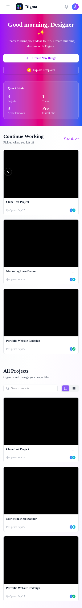
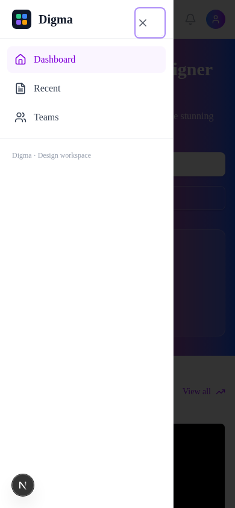
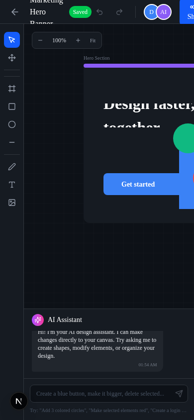
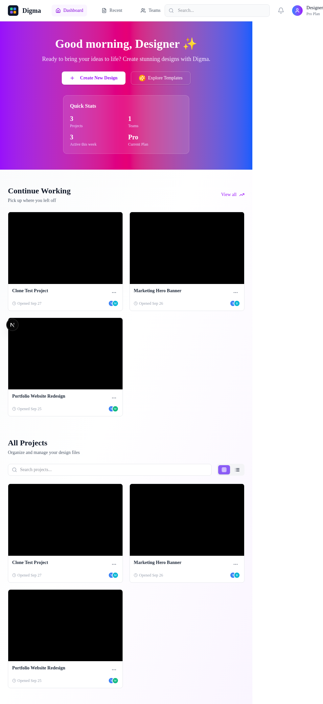
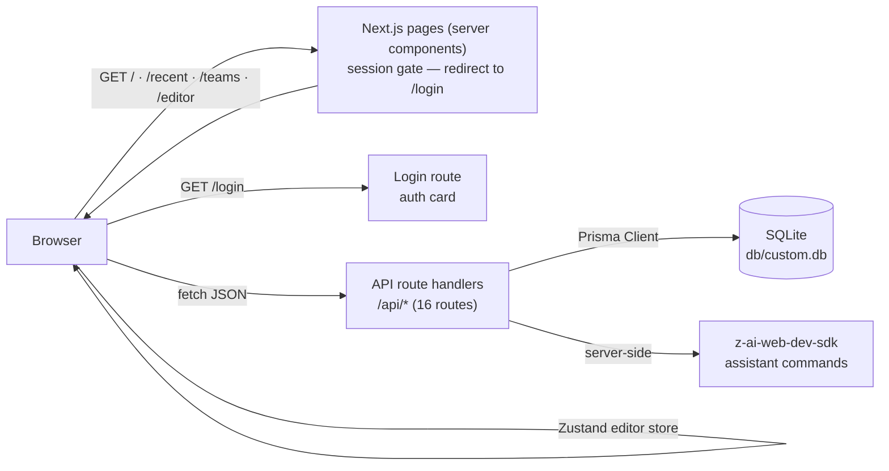

# Digma — Collaborative Design Workspace


A production-grade, self-hosted clone of the reference Digma design workspace — a Figma-like app where teams create design files, sketch on a canvas with shape/text tools, steer an AI assistant that edits the canvas conversationally, and organize files into teams. Built as one deployable Next.js unit with cookie-session auth, a typed JSON API, and a Prisma/SQLite store.

## Overview

Digma gives every signed-in user a personal design workspace: a gradient-greeting dashboard with live Quick Stats, a Recently-opened file browser with sort/view controls, a Teams page with member invitations, and a full dark-themed canvas **Editor** (tools, layers, properties, zoom, autosave, undo/redo, AI assistant, presentation mode). The reference app shipped with a broken mobile navigation — its desktop nav was `hidden md:flex` with no fallback, leaving phones with no navigation at all (the Tailwind v4 "failure class A" documented in the repo's skills). This clone reproduces the desktop design faithfully and **fixes the mobile menu** with a hamburger + Sheet drawer that is focus-trapped, Escape-closable, scroll-locked, and pinned by an E2E regression suite.

## Key Features

| Feature | Description |
|---------|-------------|
| 🎨 **Canvas design editor** | DOM-element canvas over a 20px grid: draw rectangles/ellipses/lines/text/frames, marquee + click + shift-click selection, drag-move, 8-handle resize, rotate, opacity, fill/stroke/radius — all inline-styled like the reference |
| 🧰 **Tool rail + shortcuts** | Select/Hand/Frame/Rectangle/Ellipse/Line/Pen/Text/Image with `V H F R O L T` shortcuts, Space-to-pan, Ctrl+wheel zoom, `Delete`, `Ctrl+Z`/`Ctrl+Shift+Z`, `Ctrl+0` reset |
| 🗂 **Layers panel** | Reverse-ordered layer list with drag-reorder, per-layer visibility (eye) and lock, double-click rename, live "N layers • N selected" counter |
| ⚙️ **Properties panel** | X/Y/W/H, radius, rotation, opacity, fill/stroke color pickers, text content/size/weight/align; Canvas Properties (background presets + custom) when nothing is selected |
| 🤖 **AI design assistant** | Chat panel below the canvas — LLM (`z-ai-web-dev-sdk`, server-side) parses instructions into element operations with a deterministic fallback parser ("Add 3 red circles", "Create a login form") — degrade-not-fail, never hard-fails |
| 🕐 **Autosave + history** | 800ms-debounced full-list `PUT` with id remapping, "Saved / Saving… / Unsaved" badge, undo/redo history (60 snapshots) |
| 🖥 **Present mode** | Fullscreen, fit-to-viewport presentation of the canvas (Escape to exit); Share copies a deep link |
| 🏠 **Dashboard** | Time-aware greeting hero (purple→pink→blue gradient, glass Quick Stats card fed by `/api/stats`), Continue Working (4 most recent), All Projects with search + grid/list toggle |
| 🃏 **Project cards** | Live canvas thumbnails (content-bbox fit), opened-date, avatar stack, ellipsis menu with inline Rename/Delete dialogs |
| 📅 **Recent** | Sort by Last Opened / Last Modified / Date Created / Name, search, grid/list views, "N files found" |
| 👥 **Teams** | Create-team dialog (name/description/color + first member invite), member cards with avatar colors, invite-by-email + role, inline delete confirm |
| 🔐 **Cookie-session auth** | scrypt password hashing + HMAC-signed sessions, per-IP rate limiting (10/15 min → 429 + `Retry-After`), zero external auth dependencies |
| 🚪 **Reference auth flow** | `/login` renders the auth card (sign-in/sign-up/forgot states, `?from_url=` return handling); Google/Microsoft/Facebook buttons render for parity and degrade to an explanatory toast (no OAuth credentials in a self-hosted clone) |
| 📱 **The mobile-navigation fix** | Hamburger (`md:hidden`, 44px target, stable aria-label + `aria-expanded`) opens a Radix Sheet drawer: focus-trapped, Escape + scrim close, scroll lock, links are SheetClose-wrapped so a tap navigates AND dismisses — pinned by 7 E2E checks at 390×844 |
| 🌗 **Editor chrome** | GitHub-dark palette (`#0d1117`/`#161b22`/`#30363d`) measured from the reference: top bar (back, project name, Saved badge, undo/redo, avatars, Share/Present), zoom pill, "N selected" badge |

## Screenshots

| Login | Dashboard | Editor |
|:---:|:---:|:---:|
|  |  |  |

| Recent | Teams |
|:---:|:---:|
|  |  |

<details>
<summary>Mobile — including the navigation fix</summary>

| Dashboard | Navigation menu (the fix) | Editor |
|:---:|:---:|:---:|
|  |  |  |

</details>

<details>
<summary>Tablet (768)</summary>



</details>

## Tech Stack

| Layer | Technology | Version | Purpose |
|-------|-----------|---------|---------|
| Web framework | Next.js (App Router) | 16.3 | 5 page routes + 16 API route handlers, standalone output |
| UI runtime | React | 19 | Component model |
| Language | TypeScript | 5 (strict) | Type safety end-to-end |
| Styling | Tailwind CSS | 4 | CSS-first `@theme` tokens in `globals.css` — **no `tailwind.config.js`** |
| Components | shadcn/ui on Radix | vendored | dialog, dropdown-menu, sheet, tabs, toast, button, input, label, textarea |
| Client state | Zustand | 5 | The editor store (elements, selection, tool, zoom, history) |
| Unit tests | Vitest | 5 | 54 checks on the pure domain seams |
| E2E tests | Playwright | 1.63 | 23 browser checks incl. the mobile-navigation regression suite |
| ORM | Prisma | 6 | Schema, client, `db push`, seed |
| Database | SQLite | — | Zero-config local persistence (`db/custom.db`) |
| Auth | Node `crypto` (scrypt + HMAC) | — | Cookie sessions, no external auth service |
| AI | z-ai-web-dev-sdk | 0.0.x | Server-side assistant; deterministic fallback |
| Icons | lucide-react | 0.5.x | Icon set |
| Runtime | Bun (or Node ≥ 20) | — | Dev server, scripts, TS execution |

## Architecture



Every page resolves the session server-side and redirects unauthenticated visitors to `/login?from_url=…`. Client views fetch their data through the `call()` envelope unwrapper (failures become destructive toasts, never render crashes). The editor owns its state in one Zustand store — mutations push history snapshots and flip the store to `unsaved`, which a debounced effect flushes as a full-list `PUT` (server replaces the element set transactionally and returns fresh ids, which the store remaps so selection survives).

## File Hierarchy

```
📂 prisma/
  📄 schema.prisma          # 6 models: User, Project, DesignElement, Team, TeamMember (+relations)
  📄 seed.ts                # Idempotent demo workspace (user, 2 projects w/ canvas, team + 3 members)
📂 public/
  📄 logo.svg               # Brand mark (dark rounded square, 4 colored squares)
📂 scripts/
  📄 smoke-test.sh          # 28-check E2E suite vs the production standalone server
📂 src/
  📂 app/
    📄 page.tsx             # Dashboard (session gate → DashboardView)
    📄 login/page.tsx       # Auth card route (3 states, from_url handling)
    📄 recent/page.tsx      # Recent files view
    📄 teams/page.tsx       # Teams view
    📄 editor/page.tsx      # The canvas editor (projectId query param)
    📄 layout.tsx           # Inter via next/font, Toaster, globals
    📄 globals.css          # Tailwind 4 @theme tokens (shadcn + editor palettes)
    📂 api/                 # 16 route handlers (auth, projects, elements, teams, stats, ai-assistant, health)
  📂 components/
    📂 editor/              # editor-view (shell/shortcuts/autosave/present), canvas, toolbar,
    │                       # layers-panel, properties-panel, ai-assistant, editor-store
    📄 app-header.tsx       # Shared chrome + THE MobileNav fix (hamburger + Sheet)
    📄 login-screen.tsx     # LoginCard (3 states, social degrade)
    📄 dashboard-view.tsx   # Hero, Quick Stats, Continue Working, All Projects
    📄 recent-view.tsx      # Sort/search/views
    📄 teams-view.tsx       # Team cards, create + invite dialogs
    📄 project-card.tsx     # Card + thumbnail + Create Project dialog
    📄 logo.tsx             # Inline SVG brand mark
    📂 ui/                  # shadcn primitives (button, dialog, dropdown-menu, sheet, tabs, toaster…)
  📂 hooks/
    📄 use-toast.ts         # globalThis-backed toast store (useSyncExternalStore-safe)
  📂 lib/
    📄 editor.ts            # Element types, defaults, bounds/fit math — unit tested
    📄 editor-store? → components/editor/editor-store.ts
    📄 auth.ts              # scrypt + HMAC sessions, cookie lifecycle
    📄 api.ts               # ok()/fail() envelope + requireSession()
    📄 db-path.ts           # SQLite URL resolution (standalone chdir trap) — unit tested
    📄 db.ts                # Prisma singleton
    📄 rate-limit.ts        # Fixed-window per-IP auth throttling — unit tested
    📄 ai-assistant.ts      # Assistant fallback parser + LLM sanitizer — unit tested
    📄 team.ts              # Invite normalization — unit tested
    📄 greeting.ts          # Time-aware greeting — unit tested
    📄 validation.ts        # Manual guards (enums, clamps, length caps)
    📄 utils.ts             # cn() class merge
📂 tests/
  📂 e2e/                   # Playwright: auth, mobile-navigation (the fix), workspace
  📄 db-path.test.ts        # The SQLite URL contract
📄 docs/
  📂 screenshots/           # App screenshots used by this README
```

## Quick Start

Requires **Bun** (recommended) or **Node.js ≥ 20** with npm.

```bash
# 1. Install dependencies
bun install                # or: npm install

# 2. Configure environment
cp .env.example .env       # defaults are correct for local use

# 3. Create + seed the database
bun run db:push            # or: npx prisma db push
bun run db:seed            # or: npx tsx prisma/seed.ts

# 4. Start the dev server
bun run dev                # or: npm run dev
```

Open <http://localhost:3000> and sign in with the seeded demo account:

| Email | Password |
|-------|----------|
| `demo@digma.app` | `Digma1234!` |

### Verify Setup

```bash
curl http://localhost:3000/api/health
# {"status":"ok","app":"digma","ts":"…"}

# Full end-to-end verification (28 checks: auth, CRUD, validation, rate limit, pages)
./scripts/smoke-test.sh    # builds must exist: run `bun run build` first
```

### Production

```bash
bun run build              # next build + standalone assembly
bun run start              # serves .next/standalone/server.js on :3000
```

## Environment Variables

| Variable | Required | Description | Default |
|----------|----------|-------------|---------|
| `DATABASE_URL` | Yes | SQLite connection string. Relative `file:` paths resolve against `prisma/schema.prisma` (the CLI rule) — `src/lib/db-path.ts` implements the same rule at runtime and handles the standalone server's `chdir` into `.next/standalone`. | `file:../db/custom.db` |
| `AUTH_SECRET` | Production | HMAC secret for session cookies. Generate with `openssl rand -hex 32`. Falls back to an insecure dev constant when unset. | — |
| `NEXT_PUBLIC_SITE_URL` | Recommended | Canonical public origin for metadata URLs. | `http://localhost:3000` |

## API Reference

All endpoints return `{ "ok": true, "data": … }` or `{ "ok": false, "error": { "code", "message" } }`. 🔒 = requires session cookie.

| Endpoint | Method | Description |
|----------|--------|-------------|
| `/api/health` | GET | Liveness probe |
| `/api/auth/register` | POST | Create account (name, email, password) — rate-limited |
| `/api/auth/login` | POST | Sign in, sets session cookie — rate-limited (10/IP/15 min, then `429 RATE_LIMITED`) |
| `/api/auth/logout` | POST | Clear session |
| `/api/auth/me` | GET | Current user |
| `/api/stats` 🔒 | GET | Dashboard Quick Stats (projects, teams, active this week, plan) |
| `/api/projects` 🔒 | GET / POST | List (search, template filters) / create |
| `/api/projects/[id]` 🔒 | GET / PATCH / DELETE | Detail (with elements) / rename·re-color·touch / delete |
| `/api/projects/[id]/duplicate` 🔒 | POST | Copy project + elements |
| `/api/projects/[id]/elements` 🔒 | GET / POST / PUT | List / add one / full-list replace (autosave, transactional) |
| `/api/teams` 🔒 | GET / POST | List with members / create (+ optional first member) |
| `/api/teams/[id]` 🔒 | PATCH / DELETE | Rename / delete |
| `/api/teams/[id]/members` 🔒 | POST | Invite by email + role |
| `/api/ai-assistant` 🔒 | POST | Assistant chat → `{ reply, operations[] }` (LLM first, deterministic fallback) |

## Design System

Measured from the reference app. Light workspace: white surfaces on a `gray-50 → white → purple-50` wash, `purple-600 → pink-600 → blue-600` gradient hero, glass `bg-white/10 backdrop-blur-lg` stats card, `text-2xl font-bold` section heads, purple-600 accents, Inter type. Editor: GitHub-dark chrome.

| Token | Hex | Usage |
|-------|-----|-------|
| `--color-background` | `#ffffff` | Page background |
| `--color-foreground` | `#0f172a` | Primary text (slate-900) |
| `--color-primary` | `#8b5cf6` | Purple-500 accents, active states |
| `--color-muted-foreground` | `#6b7280` | Secondary text (gray-500) |
| `--color-border` | `#e5e7eb` | Borders, inputs (gray-200) |
| `--color-editor-bg` | `#0d1117` | Editor canvas background |
| `--color-editor-panel` | `#161b22` | Editor panels, top bar, toolbar |
| `--color-editor-border` | `#30363d` | Editor borders/dividers |
| `--color-editor-text` | `#e6edf3` | Editor text |

Tokens are declared as **literal hex values in a plain `@theme` block** in `src/app/globals.css` — `var()` chains inside `@theme` are dropped by the current Tailwind v4 build (the Scandi Haven hard-won lesson; only `--font-*` legitimately uses `var()` for the `next/font` chain). There is **no `tailwind.config.js` by design**: a leftover legacy config is the #1 cause of the "flat/minimal look" bug documented in the Tailwind v4 skills.

Status colors: blue `#3B82F6` (default fill/active tool), green `#10B981` (Saved badge, Present), amber (Saving…), red `#EF4444` (destructive).

## Testing

```bash
bun run test              # unit tests — 54 checks on the pure domain seams
bun run test:e2e          # Playwright — 23 browser checks (needs `bun run build` first)
./scripts/smoke-test.sh   # curl E2E — 28 checks against the production build
```

The unit layer (Vitest) pins the pure seams: the SQLite URL resolution incl. the standalone `chdir` trap (`src/lib/db-path.ts`, pinned by `tests/db-path.test.ts`), the assistant's deterministic parser + LLM-output sanitizer (`ai-assistant.test.ts`), the editor's geometry/default seams (`editor.test.ts`), the fixed-window rate limiter (`rate-limit.test.ts`), invite normalization (`team.test.ts`), and the greeting boundaries (`greeting.test.ts`).

The Playwright layer boots the production standalone server on :3100 with its own scratch database (`db/e2e.db`, schema-pushed + seeded by the global setup); a setup project signs the demo user in ONCE and shares the cookie via storageState (the auth rate limiter makes per-test logins a trap). The suites pin: the login round-trip (wrong password, valid credentials, authed redirect), the workspace surface (dashboard stats/cards, path routes, 404 guard, create-project dialog, editor load with layers), and — the highest-regression-risk chrome — **the mobile navigation fix**: trigger visibility below `md` with 44px targets, drawer opens with all links, link taps navigate AND close, Escape closes with focus return, focus stays trapped, scroll locks (`data-scroll-locked`), and the hamburger never appears at ≥768.

The smoke suite boots the production standalone server and runs 28 checks: health, auth (valid/invalid/unauthenticated), all read endpoints (envelope asserted), project CRUD incl. rename + full-list element PUT + invalid-type rejection, team + member validation, the AI assistant (fallback adds exactly 3 circles; blank message 400), page renders, the 404 guard, logout invalidation, and the login rate limit (429).

## Troubleshooting

| Symptom | Cause | Fix |
|---------|-------|-----|
| `Error code 14: Unable to open the database file` | A parent workspace `.env` or exported shell var injects an absolute `DATABASE_URL` pointing elsewhere; or the server started outside the repo root | Start via `bun run start`/`bun run dev`; check the `[db] DATABASE_URL ->` startup log line; prefer relative `file:../db/custom.db` |
| Login suddenly returns 429 | Per-IP rate limit engaged (10 attempts / 15 min) | Wait for the window to reset (see `Retry-After`) or restart the server to clear in-memory buckets |
| Toasts never appear | (Fixed) the toast store is `globalThis`-backed so split client chunks share it — if you fork the code, keep that pattern | See `src/hooks/use-toast.ts` |
| "Continue with Google" shows a toast instead of signing in | Expected — the self-hosted clone carries no OAuth credentials (documented deviation) | Wire a real provider in `login-screen.tsx` if needed |
| AI assistant answers but adds generic shapes | SDK unavailable → deterministic fallback engaged (by design) | Configure the SDK environment for LLM-shaped plans |
| Prisma `P1003` / missing tables | Database not initialized | `bun run db:push && bun run db:seed` |

## License

No license file is present in this repository; all rights are reserved by default. Add an explicit license before redistributing.
